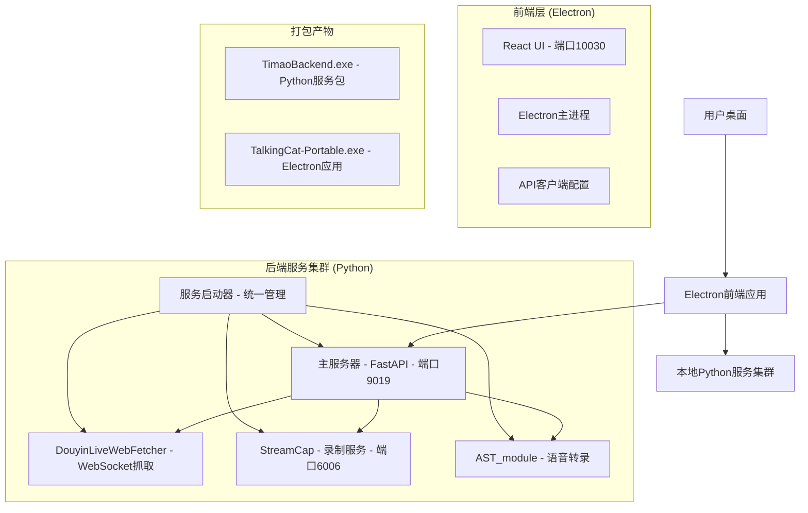
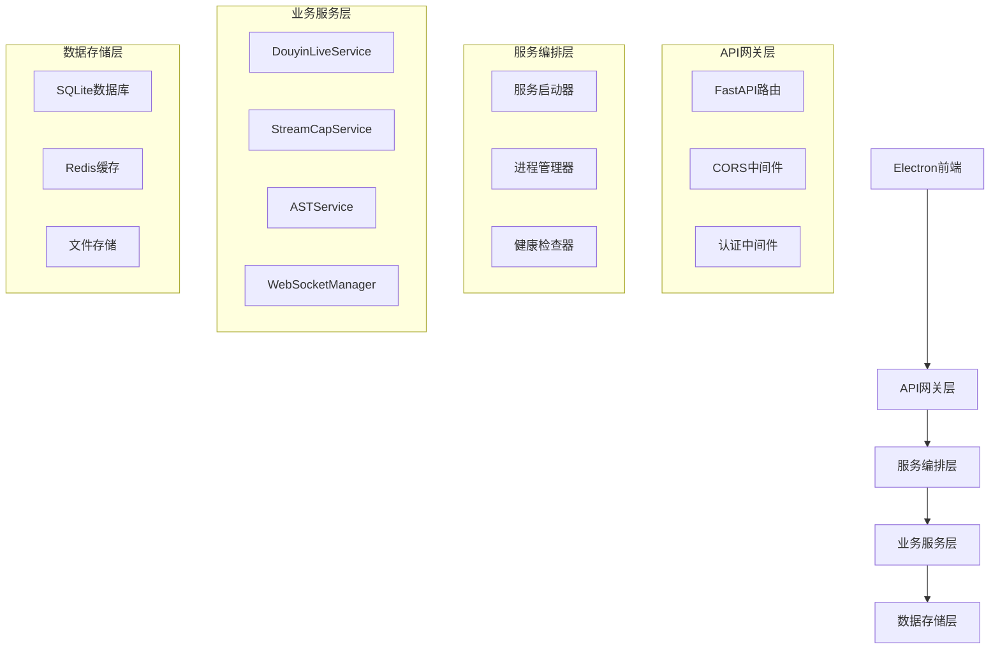
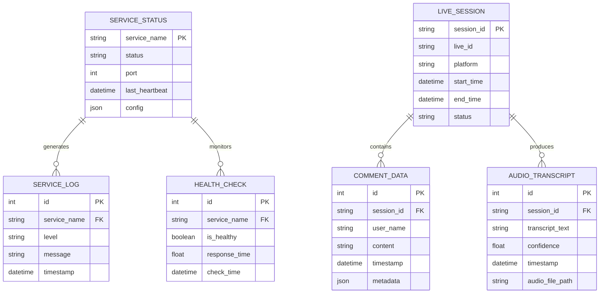

# 提猫直播助手 - 前后端分离打包架构设计

## 1. 架构设计



## 2. 技术描述

### 前端技术栈
- **框架**: React@18 + TypeScript + Vite
- **桌面壳**: Electron@38.1.2
- **UI库**: TailwindCSS@3.4.3
- **状态管理**: Zustand@4.5.2
- **图表**: Chart.js@4.5.1 + react-chartjs-2@5.3.1

### 后端技术栈
- **主服务**: FastAPI + Uvicorn (端口9019)
- **抖音抓取**: DouyinLiveWebFetcher + WebSocket
- **录制服务**: StreamCap + Flet (端口6006)
- **语音转录**: AST_module + FunASR + SenseVoice
- **打包工具**: PyInstaller

## 3. 路由定义

| 路由 | 用途 |
|------|------|
| / | 主页面，显示直播监控面板 |
| /login | 用户登录页面 |
| /dashboard | 数据分析仪表板 |
| /settings | 系统设置页面 |
| /voice-transcription | 语音转录管理页面 |
| /recording | 录制管理页面 |

## 4. API定义

### 4.1 核心API

**服务健康检查**
```
GET /health
```

Response:
| 参数名 | 参数类型 | 描述 |
|--------|----------|------|
| status | string | 服务状态 |
| services | object | 各服务状态详情 |

**抖音直播监控**
```
POST /api/douyin/start
```

Request:
| 参数名 | 参数类型 | 是否必需 | 描述 |
|--------|----------|----------|------|
| live_id | string | true | 抖音直播间ID |
| config | object | false | 监控配置参数 |

Response:
| 参数名 | 参数类型 | 描述 |
|--------|----------|------|
| success | boolean | 启动是否成功 |
| session_id | string | 会话ID |

**语音转录服务**
```
POST /api/ast/start
```

Request:
| 参数名 | 参数类型 | 是否必需 | 描述 |
|--------|----------|----------|------|
| audio_config | object | true | 音频配置 |
| model_config | object | false | 模型配置 |

**录制服务管理**
```
POST /api/streamcap/start
```

Request:
| 参数名 | 参数类型 | 是否必需 | 描述 |
|--------|----------|----------|------|
| platform | string | true | 直播平台 |
| stream_url | string | true | 直播流地址 |

## 5. 服务器架构图



## 6. 数据模型

### 6.1 数据模型定义



### 6.2 数据定义语言

**服务状态表 (service_status)**
```sql
-- 创建服务状态表
CREATE TABLE service_status (
    service_name VARCHAR(50) PRIMARY KEY,
    status VARCHAR(20) NOT NULL DEFAULT 'stopped',
    port INTEGER,
    last_heartbeat TIMESTAMP DEFAULT CURRENT_TIMESTAMP,
    config JSON,
    created_at TIMESTAMP DEFAULT CURRENT_TIMESTAMP,
    updated_at TIMESTAMP DEFAULT CURRENT_TIMESTAMP
);

-- 创建索引
CREATE INDEX idx_service_status_updated ON service_status(updated_at DESC);
CREATE INDEX idx_service_status_status ON service_status(status);

-- 初始化数据
INSERT INTO service_status (service_name, status, port) VALUES
('fastapi_main', 'stopped', 9019),
('douyin_fetcher', 'stopped', NULL),
('streamcap', 'stopped', 6006),
('ast_module', 'stopped', NULL);
```

**直播会话表 (live_sessions)**
```sql
-- 创建直播会话表
CREATE TABLE live_sessions (
    session_id VARCHAR(36) PRIMARY KEY,
    live_id VARCHAR(50) NOT NULL,
    platform VARCHAR(20) NOT NULL DEFAULT 'douyin',
    start_time TIMESTAMP DEFAULT CURRENT_TIMESTAMP,
    end_time TIMESTAMP,
    status VARCHAR(20) DEFAULT 'active',
    config JSON,
    created_at TIMESTAMP DEFAULT CURRENT_TIMESTAMP
);

-- 创建索引
CREATE INDEX idx_live_sessions_live_id ON live_sessions(live_id);
CREATE INDEX idx_live_sessions_start_time ON live_sessions(start_time DESC);
CREATE INDEX idx_live_sessions_status ON live_sessions(status);

-- 初始化数据
INSERT INTO live_sessions (session_id, live_id, platform, status) VALUES
('demo-session-001', '123456789', 'douyin', 'stopped');
```

**评论数据表 (comment_data)**
```sql
-- 创建评论数据表
CREATE TABLE comment_data (
    id INTEGER PRIMARY KEY AUTOINCREMENT,
    session_id VARCHAR(36) NOT NULL,
    user_name VARCHAR(100),
    content TEXT NOT NULL,
    timestamp TIMESTAMP DEFAULT CURRENT_TIMESTAMP,
    metadata JSON,
    FOREIGN KEY (session_id) REFERENCES live_sessions(session_id)
);

-- 创建索引
CREATE INDEX idx_comment_data_session_id ON comment_data(session_id);
CREATE INDEX idx_comment_data_timestamp ON comment_data(timestamp DESC);
```

## 7. 打包配置方案

### 7.1 Python服务打包配置

**服务启动器 (service_launcher.py)**
```python
#!/usr/bin/env python3
# -*- coding: utf-8 -*-
"""
提猫直播助手 - 统一服务启动器
"""

import os
import sys
import time
import signal
import logging
import subprocess
import threading
from pathlib import Path
from typing import Dict, List, Optional

class ServiceManager:
    """服务管理器"""
    
    def __init__(self):
        self.services: Dict[str, subprocess.Popen] = {}
        self.running = False
        self.base_dir = Path(__file__).parent
        
    def start_service(self, name: str, cmd: List[str], cwd: Optional[str] = None):
        """启动单个服务"""
        try:
            process = subprocess.Popen(
                cmd,
                cwd=cwd or self.base_dir,
                stdout=subprocess.PIPE,
                stderr=subprocess.PIPE,
                text=True
            )
            self.services[name] = process
            logging.info(f"✅ 服务 {name} 已启动 (PID: {process.pid})")
            return True
        except Exception as e:
            logging.error(f"❌ 启动服务 {name} 失败: {e}")
            return False
    
    def start_all_services(self):
        """启动所有服务"""
        self.running = True
        
        # 1. 启动主FastAPI服务
        self.start_service(
            "fastapi_main",
            [sys.executable, "-m", "uvicorn", "server.app.main:app", 
             "--host", "127.0.0.1", "--port", "9019"],
            cwd=self.base_dir
        )
        
        # 2. 启动StreamCap服务
        self.start_service(
            "streamcap",
            [sys.executable, "StreamCap/main.py", "--port", "6006"],
            cwd=self.base_dir
        )
        
        # 等待服务启动
        time.sleep(3)
        
        # 3. 健康检查
        self.health_check()
        
    def health_check(self):
        """健康检查"""
        import requests
        
        services_to_check = [
            ("FastAPI主服务", "http://127.0.0.1:9019/health"),
            ("StreamCap服务", "http://127.0.0.1:6006/health"),
        ]
        
        for name, url in services_to_check:
            try:
                response = requests.get(url, timeout=5)
                if response.status_code == 200:
                    logging.info(f"✅ {name} 健康检查通过")
                else:
                    logging.warning(f"⚠️ {name} 健康检查异常: {response.status_code}")
            except Exception as e:
                logging.error(f"❌ {name} 健康检查失败: {e}")
    
    def stop_all_services(self):
        """停止所有服务"""
        self.running = False
        
        for name, process in self.services.items():
            try:
                process.terminate()
                process.wait(timeout=10)
                logging.info(f"✅ 服务 {name} 已停止")
            except subprocess.TimeoutExpired:
                process.kill()
                logging.warning(f"⚠️ 强制终止服务 {name}")
            except Exception as e:
                logging.error(f"❌ 停止服务 {name} 失败: {e}")
        
        self.services.clear()

def signal_handler(signum, frame):
    """信号处理器"""
    logging.info("收到停止信号，正在关闭服务...")
    service_manager.stop_all_services()
    sys.exit(0)

if __name__ == "__main__":
    # 配置日志
    logging.basicConfig(
        level=logging.INFO,
        format='%(asctime)s - %(levelname)s - %(message)s'
    )
    
    # 注册信号处理器
    signal.signal(signal.SIGINT, signal_handler)
    signal.signal(signal.SIGTERM, signal_handler)
    
    # 启动服务管理器
    service_manager = ServiceManager()
    
    try:
        logging.info("🚀 启动提猫直播助手后端服务...")
        service_manager.start_all_services()
        
        # 保持运行
        while service_manager.running:
            time.sleep(1)
            
    except KeyboardInterrupt:
        logging.info("用户中断，正在关闭服务...")
    finally:
        service_manager.stop_all_services()
```

**PyInstaller打包脚本 (build_backend.py)**
```python
#!/usr/bin/env python3
# -*- coding: utf-8 -*-
"""
后端服务打包脚本
"""

import os
import sys
import shutil
import subprocess
from pathlib import Path

def build_backend():
    """构建后端服务"""
    
    project_root = Path(__file__).parent
    dist_dir = project_root / "dist"
    
    # 清理旧的构建文件
    if dist_dir.exists():
        shutil.rmtree(dist_dir)
    
    # PyInstaller命令
    cmd = [
        "pyinstaller",
        "--onefile",
        "--name", "TimaoBackend",
        "--distpath", str(dist_dir),
        "--workpath", str(project_root / "build"),
        "--specpath", str(project_root),
        
        # 添加数据文件
        "--add-data", f"server{os.pathsep}server",
        "--add-data", f"DouyinLiveWebFetcher{os.pathsep}DouyinLiveWebFetcher",
        "--add-data", f"StreamCap{os.pathsep}StreamCap",
        "--add-data", f"AST_module{os.pathsep}AST_module",
        
        # 隐藏导入
        "--hidden-import", "uvicorn",
        "--hidden-import", "fastapi",
        "--hidden-import", "websockets",
        "--hidden-import", "aiofiles",
        "--hidden-import", "sqlalchemy",
        "--hidden-import", "funasr",
        "--hidden-import", "flet",
        
        # 排除不需要的模块
        "--exclude-module", "tkinter",
        "--exclude-module", "matplotlib",
        
        # 启动脚本
        "service_launcher.py"
    ]
    
    print("🔨 开始构建后端服务...")
    result = subprocess.run(cmd, cwd=project_root)
    
    if result.returncode == 0:
        print("✅ 后端服务构建成功!")
        print(f"📦 输出文件: {dist_dir / 'TimaoBackend.exe'}")
    else:
        print("❌ 后端服务构建失败!")
        sys.exit(1)

if __name__ == "__main__":
    build_backend()
```

### 7.2 前端Electron打包配置

**修改后的package.json构建配置**
```json
{
  "build": {
    "appId": "com.xingjuai.talkingcat",
    "productName": "提猫直播助手",
    "artifactName": "TalkingCat-${version}-${os}-${arch}.${ext}",
    "directories": {
      "output": "dist"
    },
    "files": [
      "electron/**/*",
      "!electron/renderer/node_modules",
      "package.json"
    ],
    "extraFiles": [
      {
        "from": "dist/TimaoBackend.exe",
        "to": "resources/backend/TimaoBackend.exe"
      }
    ],
    "win": {
      "target": "portable",
      "icon": "assets/icon.ico",
      "artifactName": "TalkingCat-Portable-${version}-${arch}.exe"
    }
  }
}
```

**前端API配置 (src/config/api.ts)**
```typescript
// API配置
export const API_CONFIG = {
  // 后端服务地址
  BASE_URL: 'http://127.0.0.1:9019',
  
  // 服务端点
  ENDPOINTS: {
    HEALTH: '/health',
    DOUYIN: '/api/douyin',
    STREAMCAP: '/api/streamcap',
    AST: '/api/ast',
    WEBSOCKET: 'ws://127.0.0.1:9019/ws'
  },
  
  // 超时配置
  TIMEOUT: 30000,
  
  // 重试配置
  RETRY: {
    attempts: 3,
    delay: 1000
  }
};

// 服务状态检查
export async function checkBackendHealth(): Promise<boolean> {
  try {
    const response = await fetch(`${API_CONFIG.BASE_URL}${API_CONFIG.ENDPOINTS.HEALTH}`, {
      method: 'GET',
      timeout: 5000
    });
    return response.ok;
  } catch (error) {
    console.error('后端服务健康检查失败:', error);
    return false;
  }
}
```

## 8. 部署和分发策略

### 8.1 构建流程

```bash
# 1. 构建后端服务
python build_backend.py

# 2. 构建前端应用
npm run build:win64

# 3. 验证构建产物
ls -la dist/
```

### 8.2 用户安装流程

1. **下载安装包**
   - `TalkingCat-Portable-1.0.0-x64.exe` (前端应用)
   - `TimaoBackend.exe` (后端服务，已内嵌到前端应用中)

2. **启动应用**
   - 用户双击 `TalkingCat-Portable-1.0.0-x64.exe`
   - Electron应用自动启动内嵌的后端服务
   - 前端界面连接到本地后端服务

3. **服务监控**
   - 应用内置服务健康检查
   - 自动重启异常服务
   - 用户友好的错误提示

### 8.3 错误处理和监控

**服务监控组件 (src/components/ServiceMonitor.tsx)**
```typescript
import React, { useEffect, useState } from 'react';
import { checkBackendHealth } from '../config/api';

export const ServiceMonitor: React.FC = () => {
  const [serviceStatus, setServiceStatus] = useState({
    backend: false,
    douyin: false,
    streamcap: false,
    ast: false
  });

  useEffect(() => {
    const checkServices = async () => {
      const backendHealthy = await checkBackendHealth();
      setServiceStatus(prev => ({
        ...prev,
        backend: backendHealthy
      }));
    };

    // 每30秒检查一次服务状态
    const interval = setInterval(checkServices, 30000);
    checkServices(); // 立即执行一次

    return () => clearInterval(interval);
  }, []);

  return (
    <div className="service-monitor">
      <h3>服务状态</h3>
      <div className="status-grid">
        <div className={`status-item ${serviceStatus.backend ? 'healthy' : 'unhealthy'}`}>
          <span>后端服务</span>
          <span>{serviceStatus.backend ? '✅ 正常' : '❌ 异常'}</span>
        </div>
        {/* 其他服务状态... */}
      </div>
    </div>
  );
};
```

### 8.4 跨平台兼容性

**平台特定配置**
```javascript
// electron/main.js
const { app, BrowserWindow, shell } = require('electron');
const path = require('path');
const { spawn } = require('child_process');

class BackendManager {
  constructor() {
    this.backendProcess = null;
    this.backendPath = this.getBackendPath();
  }

  getBackendPath() {
    const isDev = process.env.NODE_ENV === 'development';
    if (isDev) {
      return path.join(__dirname, '..', 'dist', 'TimaoBackend.exe');
    }
    
    // 生产环境路径
    return path.join(process.resourcesPath, 'backend', 'TimaoBackend.exe');
  }

  async startBackend() {
    try {
      this.backendProcess = spawn(this.backendPath, [], {
        detached: false,
        stdio: 'pipe'
      });

      this.backendProcess.on('error', (error) => {
        console.error('后端服务启动失败:', error);
      });

      console.log('✅ 后端服务已启动');
      return true;
    } catch (error) {
      console.error('启动后端服务时出错:', error);
      return false;
    }
  }

  stopBackend() {
    if (this.backendProcess) {
      this.backendProcess.kill();
      this.backendProcess = null;
      console.log('✅ 后端服务已停止');
    }
  }
}

// 应用生命周期管理
const backendManager = new BackendManager();

app.whenReady().then(async () => {
  await backendManager.startBackend();
  createWindow();
});

app.on('before-quit', () => {
  backendManager.stopBackend();
});
```

## 9. 性能优化建议

### 9.1 启动优化
- 后端服务并行启动
- 前端懒加载非关键组件
- 预热关键API连接

### 9.2 资源优化
- 压缩Python依赖包
- 优化Electron应用体积
- 使用增量更新机制

### 9.3 用户体验优化
- 启动画面和进度提示
- 服务异常自动恢复
- 离线模式支持

---

*文档版本: v1.0*  
*最后更新: 2024年12月*  
*维护团队: 提猫直播助手开发团队*