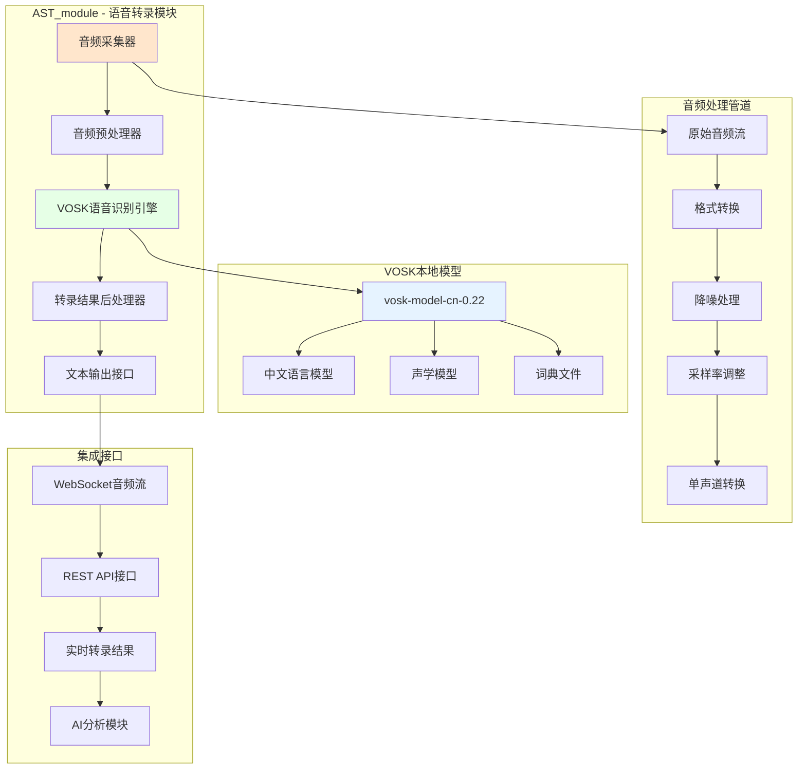

# AST_module 系统架构设计文档

## 概述

AST_module (Audio Speech Transcription Module) 是提猫直播助手的核心语音识别模块，负责将主播的实时音频转录为文本，并与弹幕数据一起进行AI分析处理。

## 架构设计

### 整体架构图



## 核心组件设计

### 1. 音频采集器 (AudioCapture)

#### 功能职责
- 实时采集麦克风音频流
- 支持多种音频输入设备
- 音频流的缓冲管理

#### 接口设计
```python
class AudioCapture:
    """音频采集器"""
    
    def __init__(self, sample_rate: int = 16000, channels: int = 1):
        self.sample_rate = sample_rate
        self.channels = channels
        self.is_recording = False
        self.audio_buffer = []
    
    async def start_recording(self) -> bool:
        """开始录音"""
        pass
    
    async def stop_recording(self) -> bool:
        """停止录音"""
        pass
    
    def get_audio_stream(self) -> AsyncGenerator[bytes, None]:
        """获取音频流"""
        pass
```

### 2. 音频预处理器 (AudioProcessor)

#### 功能职责
- 音频格式标准化 (16kHz, 16bit, 单声道)
- 音频降噪和增强
- 音频分段处理

#### 接口设计
```python
class AudioProcessor:
    """音频预处理器"""
    
    def __init__(self, target_sample_rate: int = 16000):
        self.target_sample_rate = target_sample_rate
    
    def process_audio_chunk(self, audio_data: bytes) -> bytes:
        """处理音频块"""
        pass
    
    def validate_audio_format(self, audio_data: bytes) -> bool:
        """验证音频格式"""
        pass
    
    def convert_to_16khz_mono(self, audio_data: bytes) -> bytes:
        """转换为16kHz单声道"""
        pass
```

### 3. VOSK语音识别引擎 (VoskEngine)

#### 功能职责
- 加载VOSK中文模型
- 实时语音转文字
- 提供部分识别结果和最终结果

#### 集成方案

由于VOSK Python包的复杂性，我们采用以下集成策略：

1. **本地VOSK服务**: 使用独立的VOSK服务进程
2. **HTTP API接口**: 通过REST API调用VOSK服务
3. **容错机制**: 提供备用的语音识别方案

#### 接口设计
```python
class VoskEngine:
    """VOSK语音识别引擎"""
    
    def __init__(self, model_path: str = None):
        self.model_path = model_path or self._get_default_model_path()
        self.is_initialized = False
    
    async def initialize(self) -> bool:
        """初始化VOSK引擎"""
        pass
    
    async def transcribe_stream(self, audio_stream: AsyncGenerator) -> AsyncGenerator[dict, None]:
        """流式转录"""
        pass
    
    async def transcribe_chunk(self, audio_chunk: bytes) -> dict:
        """单次转录"""
        pass
```

### 4. 转录结果后处理器 (TranscriptProcessor)

#### 功能职责
- 文本清理和格式化
- 添加时间戳信息
- 置信度评估

#### 接口设计
```python
class TranscriptProcessor:
    """转录结果后处理器"""
    
    def __init__(self):
        self.confidence_threshold = 0.7
    
    def process_transcript(self, raw_result: dict) -> dict:
        """处理转录结果"""
        pass
    
    def clean_text(self, text: str) -> str:
        """文本清理"""
        pass
    
    def add_metadata(self, result: dict) -> dict:
        """添加元数据"""
        pass
```

## VOSK模型集成方案

### 1. 模型文件结构

```
vosk-model-cn-0.22/
├── conf/
│   ├── mfcc.conf           # MFCC特征配置
│   └── model.conf          # 模型配置
├── ivector/
│   └── splice.conf         # ivector配置
├── rnnlm/
│   ├── features.txt        # 特征文件
│   ├── special_symbol_opts.conf
│   └── special_symbol_opts.txt
└── README                  # 模型说明
```

### 2. 模型性能指标

根据README文件，该模型的性能表现：
- SpeechIO_02: 13.98% CER (字符错误率)
- SpeechIO_06: 27.30% CER
- THCHS: 7.43% CER

### 3. 集成策略

#### 方案A: 直接Python集成 (推荐)
```python
# 安装VOSK Python包
pip install vosk

# 使用本地模型
model = vosk.Model("./vosk-model-cn-0.22")
recognizer = vosk.KaldiRecognizer(model, 16000)
```

#### 方案B: Docker容器化
```dockerfile
FROM alphacep/kaldi-vosk-server:latest
COPY vosk-model-cn-0.22 /opt/vosk-model/model
EXPOSE 2700
CMD ["python3", "/opt/vosk-server/websocket/asr_server.py", "/opt/vosk-model/model"]
```

#### 方案C: 独立服务进程
```python
# 启动独立的VOSK服务
import subprocess
vosk_process = subprocess.Popen([
    "python", "-m", "vosk.transcriber.cli",
    "--model", "./vosk-model-cn-0.22",
    "--port", "8001"
])
```

## 接口规范

### 1. WebSocket接口

#### 音频流输入
```
ws://localhost:8000/ws/audio/transcribe

# 消息格式
{
    "type": "audio_chunk",
    "data": "<base64_encoded_audio>",
    "timestamp": "2025-01-20T10:30:00Z"
}
```

#### 转录结果输出
```
{
    "type": "transcript_result",
    "data": {
        "text": "主播说的内容",
        "confidence": 0.85,
        "is_final": true,
        "start_time": 1642675800.0,
        "end_time": 1642675803.0
    },
    "timestamp": "2025-01-20T10:30:03Z"
}
```

### 2. REST API接口

#### 启动转录服务
```
POST /api/transcription/start
{
    "room_id": "123456789",
    "audio_config": {
        "sample_rate": 16000,
        "channels": 1,
        "format": "wav"
    }
}
```

#### 停止转录服务
```
POST /api/transcription/stop
{
    "room_id": "123456789"
}
```

#### 获取转录历史
```
GET /api/transcription/history?room_id=123456789&limit=100
```

## 部署配置

### 1. 环境要求
- Python 3.8+
- 内存: 至少4GB (VOSK模型约1.3GB)
- CPU: 支持多线程处理
- 音频设备: 麦克风输入

### 2. 依赖安装
```bash
# 安装VOSK
pip install vosk

# 安装音频处理库
pip install pyaudio numpy scipy

# 安装异步支持
pip install asyncio aiofiles
```

### 3. 配置文件
```yaml
# ast_config.yaml
vosk:
  model_path: "./vosk-model-cn-0.22"
  sample_rate: 16000
  confidence_threshold: 0.7

audio:
  input_device: null  # 自动选择
  buffer_size: 4096
  chunk_duration: 1.0  # 秒

api:
  host: "localhost"
  port: 8001
  max_connections: 10
```

## 性能优化

### 1. 内存优化
- 模型缓存管理
- 音频缓冲区大小调优
- 垃圾回收策略

### 2. 延迟优化
- 流式处理pipeline
- 异步音频处理
- 预加载模型

### 3. 准确性优化
- 音频质量检测
- 动态置信度阈值
- 上下文语言模型

## 错误处理

### 1. 模型加载失败
```python
try:
    model = vosk.Model(model_path)
except Exception as e:
    logger.error(f"VOSK模型加载失败: {e}")
    # 降级到在线API或提示用户
```

### 2. 音频设备异常
```python
try:
    audio_stream = audio_capture.get_stream()
except AudioDeviceError:
    # 尝试其他音频设备或提示用户检查设备
```

### 3. 网络连接异常
```python
# WebSocket重连机制
async def reconnect_websocket():
    for attempt in range(max_retries):
        try:
            await websocket.connect()
            break
        except ConnectionError:
            await asyncio.sleep(retry_delay)
```

## 测试策略

### 1. 单元测试
- 音频处理组件测试
- VOSK引擎集成测试
- 接口功能测试

### 2. 集成测试
- 端到端音频流测试
- 多用户并发测试
- 异常场景测试

### 3. 性能测试
- 转录延迟测试
- 内存使用测试
- CPU使用率测试

## 监控与日志

### 1. 性能监控
- 转录延迟监控
- 准确率统计
- 资源使用监控

### 2. 日志记录
- 音频处理日志
- 转录结果日志
- 错误异常日志

---

**文档版本**: v1.0  
**最后更新**: 2025-01-20  
**维护团队**: 提猫科技AST团队