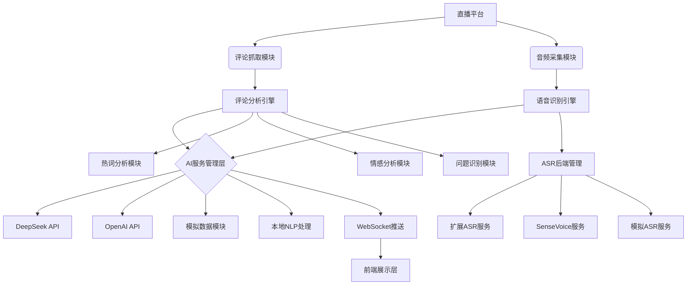

# AI服务集成方案 - 架构设计文档

## 整体架构图



## 模块详细设计

### 1. 评论分析引擎

#### 接口契约
- 输入：评论数据流（包含用户、内容、时间戳等）
- 输出：分析结果（热词、情感、问题等）
- 协议：内部Python接口/WebSocket

#### 数据流图
1. 评论数据采集
2. 数据清洗和预处理
3. 分词和关键词提取
4. 情感分析
5. 问题识别和分类
6. 结果聚合和缓存
7. 实时推送至前端

#### 异常处理策略
- 数据格式错误：记录日志并跳过该条评论
- 分词失败：使用默认分词策略
- AI服务不可用：降级到本地NLP处理
- 网络异常：重试机制，最多重试3次

### 2. 语音识别引擎

#### 接口契约
- 输入：实时音频流数据
- 输出：转录文本结果（包含置信度、时间戳等）
- 协议：内部Python接口/WebSocket

#### 数据流图
1. 音频数据采集
2. 音频预处理（降噪、增益等）
3. ASR后端选择和调用
4. 转录结果后处理
5. 置信度过滤
6. 结果缓存和推送

#### 异常处理策略
- 音频数据异常：丢弃异常数据块
- ASR服务失败：切换到备用ASR后端
- 转录质量低：启用音频增强模块
- 资源不足：降低处理频率

### 3. AI服务管理层

#### 接口契约
- 输入：分析任务请求
- 输出：AI处理结果
- 协议：HTTP API/内部Python接口

#### 数据流图
1. 任务队列管理
2. AI服务选择和配置
3. API调用和结果处理
4. 结果缓存和重用
5. 调用统计和监控

#### 异常处理策略
- API调用失败：重试机制，最多重试3次
- 配额超限：切换到备用服务或模拟数据
- 响应超时：记录超时并继续处理其他任务
- 服务不可用：降级到本地处理

## 核心组件设计

### 热词分析模块
- 基于jieba分词库实现
- 集成TF-IDF和TextRank算法
- 支持直播领域停用词过滤
- 实现热词趋势分析功能

### 情感分析模块
- 集成SnowNLP进行基础情感分析
- 建立直播领域情感词典
- 支持细粒度情感分类（正面、负面、中性、兴奋、好奇、支持等）
- 实现情感趋势分析

### 问题识别模块
- 基于正则表达式识别疑问句
- 使用NLP技术进行问题分类
- 实现问题优先级排序算法
- 支持问题模板匹配

### ASR后端管理模块
- 支持多种ASR后端（SenseVoice、离线备用模型等）
- 实现后端动态切换机制
- 提供降级处理能力
- 支持模型配置管理

## 接口规范

### 评论分析接口
```
POST /api/analyze/comments
Content-Type: application/json

{
  "comments": [
    {
      "user": "用户名",
      "content": "评论内容",
      "timestamp": "时间戳"
    }
  ]
}

Response:
{
  "success": true,
  "data": {
    "hot_words": [...],
    "sentiment_analysis": {...},
    "question_identification": {...}
  }
}
```

### 语音识别接口
```
POST /api/transcribe/audio
Content-Type: audio/wav

[音频数据]

Response:
{
  "success": true,
  "data": {
    "transcription": "转录文本",
    "confidence": 0.95,
    "timestamp": "时间戳"
  }
}
```

### AI服务管理接口
```
POST /api/ai/process
Content-Type: application/json

{
  "task_type": "分析任务类型",
  "input_data": "输入数据"
}

Response:
{
  "success": true,
  "data": {
    "result": "处理结果",
    "source": "AI服务来源"
  }
}
```
