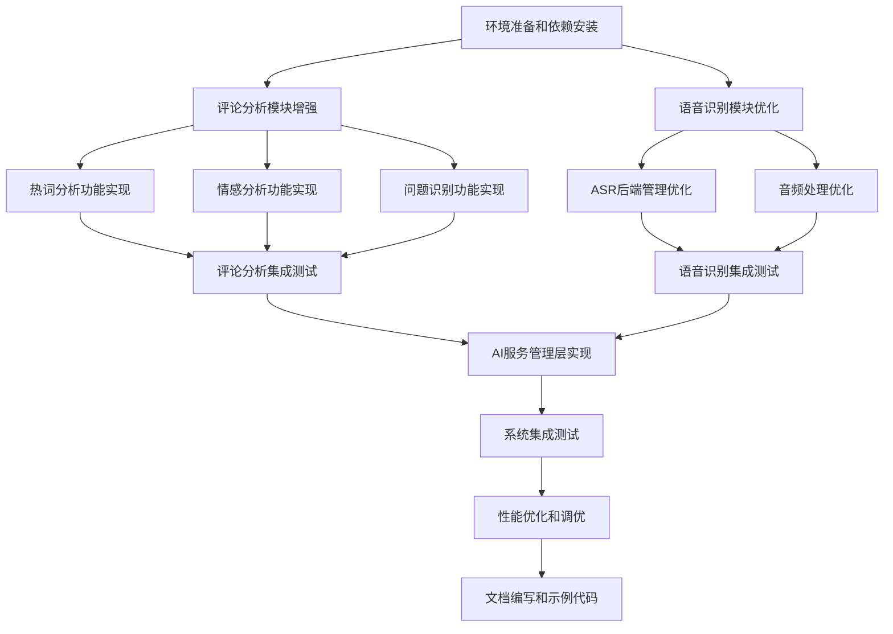

# AI服务集成方案 - 任务分解文档

## 任务依赖图

## 子任务详细说明

### 任务1: 环境准备和依赖安装

#### 输入约束
- Python 3.8+环境
- 项目代码库
- 网络访问权限

#### 输出约束
- 完成所有依赖库安装
- 环境配置文件更新
- 依赖检查脚本

#### 实现约束
- 使用pip安装所需依赖
- 更新requirements.txt文件
- 编写环境检查脚本

#### 验收标准
- 所有依赖库能正常导入
- 环境检查脚本运行通过
- 无依赖冲突

### 任务2: 评论分析模块增强

#### 输入约束
- 现有的评论处理器模块
- 直播评论数据样本
- NLP处理库

#### 输出约束
- 增强的评论分析模块
- 单元测试代码
- 性能测试报告

#### 实现约束
- 保持与现有接口兼容
- 支持实时数据处理
- 提供配置选项

#### 验收标准
- 能够正确处理直播评论数据
- 分析准确率达到设计要求
- 处理延迟小于1秒

### 任务3: 语音识别模块优化

#### 输入约束
- 现有的AST服务模块
- 音频数据样本
- ASR后端库

#### 输出约束
- 优化的语音识别模块
- 支持多种ASR后端
- 音频处理工具集

#### 实现约束
- 保持与现有接口兼容
- 支持实时音频处理
- 提供降级处理机制

#### 验收标准
- 语音识别准确率达到设计要求
- 支持多种音频格式
- 具备降级处理能力

### 任务4: 热词分析功能实现

#### 输入约束
- 增强的评论分析模块
- jieba分词库
- 直播领域停用词表

#### 输出约束
- 热词分析功能模块
- TF-IDF和TextRank算法实现
- 热词趋势分析功能

#### 实现约束
- 支持实时热词提取
- 提供热词权重计算
- 支持热词分类

#### 验收标准
- 热词提取准确率≥90%
- 支持热词趋势分析
- 响应时间≤1秒

### 任务5: 情感分析功能实现

#### 输入约束
- 增强的评论分析模块
- SnowNLP库
- 直播领域情感词典

#### 输出约束
- 情感分析功能模块
- 细粒度情感分类
- 情感趋势分析功能

#### 实现约束
- 支持实时情感分析
- 提供情感强度评分
- 支持情感可视化

#### 验收标准
- 情感分析准确率≥85%
- 支持细粒度情感分类
- 响应时间≤1秒

### 任务6: 问题识别功能实现

#### 输入约束
- 增强的评论分析模块
- 正则表达式库
- 问题分类规则

#### 输出约束
- 问题识别功能模块
- 问题分类器
- 问题优先级排序

#### 实现约束
- 支持实时问题识别
- 提供问题分类标签
- 支持优先级排序

#### 验收标准
- 问题识别准确率≥90%
- 支持问题分类
- 响应时间≤1秒

### 任务7: ASR后端管理优化

#### 输入约束
- 优化的语音识别模块
- SenseVoice 库及其他可选 ASR 组件
- ASR 模型文件

#### 输出约束
- ASR后端管理模块
- 后端动态切换机制
- 降级处理功能

#### 实现约束
- 支持多种ASR后端
- 提供统一接口
- 实现自动降级

#### 验收标准
- 支持多种ASR后端
- 具备降级处理能力
- 切换延迟≤1秒

### 任务8: 音频处理优化

#### 输入约束
- 优化的语音识别模块
- 音频处理库
- 音频数据样本

#### 输出约束
- 音频预处理模块
- 降噪和增益控制
- 音频增强功能

#### 实现约束
- 支持实时音频处理
- 提供参数配置
- 保持音频质量

#### 验收标准
- 能够有效降噪
- 支持增益控制
- 处理延迟≤100ms

### 任务9: 评论分析集成测试

#### 输入约束
- 增强的评论分析模块
- 测试数据集
- 测试环境

#### 输出约束
- 集成测试报告
- 性能测试结果
- 问题修复记录

#### 实现约束
- 覆盖所有功能点
- 模拟真实使用场景
- 记录测试过程

#### 验收标准
- 所有功能正常工作
- 性能指标达标
- 无严重缺陷

### 任务10: 语音识别集成测试

#### 输入约束
- 优化的语音识别模块
- 测试音频数据
- 测试环境

#### 输出约束
- 集成测试报告
- 准确率测试结果
- 问题修复记录

#### 实现约束
- 覆盖所有ASR后端
- 模拟真实使用场景
- 记录测试过程

#### 验收标准
- 所有ASR后端正常工作
- 识别准确率达标
- 无严重缺陷

### 任务11: AI服务管理层实现

#### 输入约束
- 评论分析和语音识别模块
- AI服务API密钥
- 配置管理模块

#### 输出约束
- AI服务管理层
- API调用接口
- 调用统计和监控

#### 实现约束
- 支持多种AI服务
- 提供统一调用接口
- 实现调用频率控制

#### 验收标准
- 支持多种AI服务
- 调用成功率≥99%
- 具备监控功能

### 任务12: 系统集成测试

#### 输入约束
- 所有功能模块
- 完整的测试环境
- 测试用例

#### 输出约束
- 系统集成测试报告
- 性能基准测试结果
- 兼容性测试结果

#### 实现约束
- 覆盖所有业务场景
- 模拟高并发环境
- 记录测试过程

#### 验收标准
- 所有模块协同工作正常
- 系统性能达标
- 无严重缺陷

### 任务13: 性能优化和调优

#### 输入约束
- 集成测试报告
- 性能监控数据
- 系统瓶颈分析

#### 输出约束
- 性能优化方案
- 调优后的代码
- 性能测试报告

#### 实现约束
- 识别系统瓶颈
- 实施针对性优化
- 验证优化效果

#### 验收标准
- 系统性能显著提升
- 资源利用率优化
- 满足设计指标

### 任务14: 文档编写和示例代码

#### 输入约束
- 完整的功能模块
- API接口说明
- 使用示例需求

#### 输出约束
- 用户使用手册
- API文档
- 示例代码和教程

#### 实现约束
- 文档内容准确完整
- 示例代码可运行
- 提供配置说明

#### 验收标准
- 文档内容准确无误
- 示例代码运行正常
- 用户可快速上手
