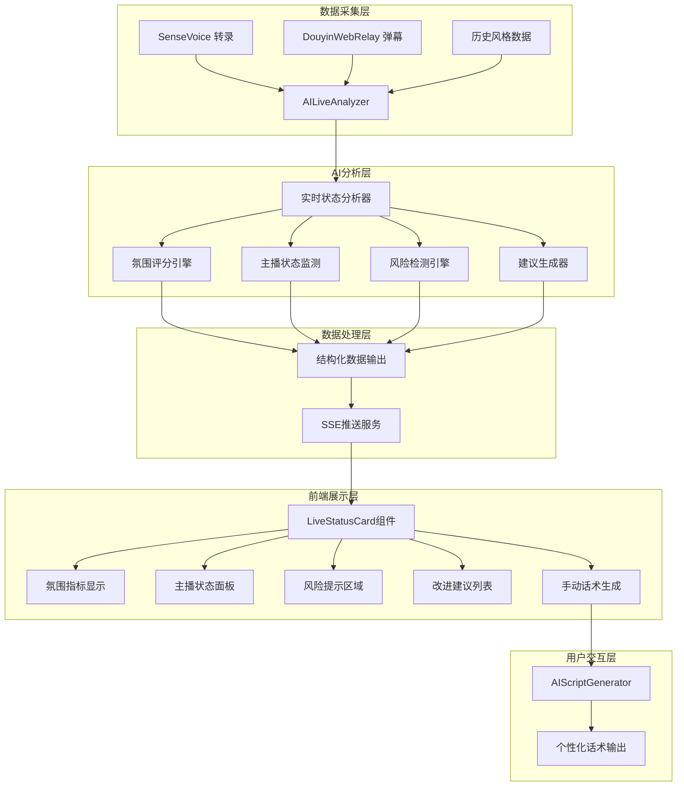

# AI实时分析卡片 · 架构设计文档

## 整体架构图



## 系统分层设计

### 1. 数据采集层

#### 现有数据源复用
- **音频转录**: 复用现有 `SenseVoice + VAD` 管线
- **弹幕事件**: 复用现有 `DouyinLiveWebFetcher` 
- **历史数据**: 扩展现有 `style_profile` 和 `vibe` 存储

#### 数据标准化
```python
@dataclass
class LiveDataWindow:
    """实时分析数据窗口"""
    window_id: str
    start_time: float
    end_time: float
    sentences: List[str]           # 转录句子
    comments: List[CommentEvent]   # 弹幕事件
    interactions: List[InteractionEvent]  # 互动事件
    metadata: Dict[str, Any]       # 元数据
```

### 2. AI分析层增强

#### 2.1 实时状态分析器 (LiveStatusAnalyzer)
```python
class LiveStatusAnalyzer:
    """实时状态分析核心引擎"""
    
    async def analyze_window(self, data: LiveDataWindow) -> LiveStatusResult:
        """分析单个时间窗口的直播状态"""
        # 1. 氛围分析
        atmosphere = await self._analyze_atmosphere(data)
        
        # 2. 主播状态分析  
        host_status = await self._analyze_host_status(data)
        
        # 3. 风险检测
        risks = await self._detect_risks(data)
        
        # 4. 改进建议生成
        suggestions = await self._generate_suggestions(data, atmosphere, host_status, risks)
        
        return LiveStatusResult(
            atmosphere=atmosphere,
            host_status=host_status,
            risks=risks,
            suggestions=suggestions,
            timestamp=time.time()
        )
```

#### 2.2 氛围评分引擎 (AtmosphereEngine)
```python
@dataclass
class AtmosphereMetrics:
    """直播间氛围指标"""
    score: int                    # 氛围评分 0-100
    energy_level: str            # 能量等级: 冷清/一般/热烈/火爆
    comment_density: float       # 弹幕密度 (条/分钟)
    comment_trend: str           # 弹幕趋势: 上升/下降/稳定
    interaction_rate: float      # 互动率 (%)
    audience_retention: str      # 观众留存: 流失/稳定/增长
    
class AtmosphereEngine:
    def calculate_score(self, data: LiveDataWindow) -> AtmosphereMetrics:
        """计算氛围评分"""
        # 弹幕密度权重: 40%
        density_score = self._calculate_density_score(data.comments)
        
        # 互动质量权重: 35% 
        interaction_score = self._calculate_interaction_score(data.interactions)
        
        # 情感倾向权重: 25%
        sentiment_score = self._calculate_sentiment_score(data.comments)
        
        final_score = int(density_score * 0.4 + interaction_score * 0.35 + sentiment_score * 0.25)
        
        return AtmosphereMetrics(
            score=final_score,
            energy_level=self._get_energy_level(final_score),
            comment_density=len(data.comments) / (data.end_time - data.start_time) * 60,
            comment_trend=self._calculate_trend(data.comments),
            interaction_rate=self._calculate_interaction_rate(data),
            audience_retention=self._analyze_retention(data)
        )
```

#### 2.3 主播状态监测 (HostStatusMonitor)
```python
@dataclass  
class HostStatusMetrics:
    """主播状态指标"""
    speech_rate: float           # 语速 (字/分钟)
    pause_duration: float        # 平均停顿时长 (秒)
    topic_coherence: str         # 话题连贯性: 优秀/良好/一般/较差
    energy_consistency: str      # 能量一致性: 稳定/波动/下降
    
class HostStatusMonitor:
    def analyze_host_performance(self, sentences: List[str], window_duration: float) -> HostStatusMetrics:
        """分析主播表现"""
        # 计算语速
        total_chars = sum(len(s) for s in sentences)
        speech_rate = total_chars / (window_duration / 60)
        
        # 分析停顿 (基于句子间隔和长度)
        pause_duration = self._estimate_pause_duration(sentences, window_duration)
        
        # 话题连贯性分析 (使用语义相似度)
        coherence = self._analyze_topic_coherence(sentences)
        
        # 能量一致性 (基于语速变化和停顿模式)
        consistency = self._analyze_energy_consistency(sentences)
        
        return HostStatusMetrics(
            speech_rate=speech_rate,
            pause_duration=pause_duration,
            topic_coherence=coherence,
            energy_consistency=consistency
        )
```

#### 2.4 风险检测引擎 (RiskDetectionEngine)
```python
@dataclass
class RiskAlert:
    """风险提示"""
    type: str                    # 风险类型
    severity: str                # 严重程度: 低/中/高
    message: str                 # 提示消息
    suggestion: str              # 建议操作
    
class RiskDetectionEngine:
    def detect_risks(self, current: LiveStatusResult, history: List[LiveStatusResult]) -> List[RiskAlert]:
        """检测直播风险"""
        risks = []
        
        # 互动下降风险
        if self._is_interaction_declining(current, history):
            risks.append(RiskAlert(
                type="interaction_decline",
                severity="中",
                message="最近2分钟互动下降15%",
                suggestion="尝试提问或互动话题"
            ))
        
        # 冷场风险
        if self._is_cold_scene(current):
            risks.append(RiskAlert(
                type="cold_scene", 
                severity="高",
                message="直播间氛围较冷清",
                suggestion="可以分享有趣话题或回应弹幕"
            ))
        
        # 高频问题未回应
        unanswered = self._detect_unanswered_questions(current, history)
        if unanswered:
            risks.append(RiskAlert(
                type="unanswered_questions",
                severity="中", 
                message=f"{len(unanswered)}个高频问题未回应",
                suggestion=f"关注用户\"{unanswered[0]['user']}\"的提问"
            ))
            
        return risks
```

### 3. 数据处理层

#### 3.1 结构化数据输出
```python
@dataclass
class LiveStatusResult:
    """直播状态分析结果"""
    # 氛围指标
    atmosphere: AtmosphereMetrics
    
    # 主播状态
    host_status: HostStatusMetrics
    
    # 风险提示
    risks: List[RiskAlert]
    
    # 改进建议
    suggestions: List[str]
    
    # 高频问题
    top_questions: List[Dict[str, Any]]
    
    # 元数据
    timestamp: float
    window_id: str
    
    def to_card_format(self) -> Dict[str, Any]:
        """转换为卡片显示格式"""
        return {
            "atmosphere": {
                "score": self.atmosphere.score,
                "level": self.atmosphere.energy_level,
                "comment_density": self.atmosphere.comment_density,
                "comment_trend": self.atmosphere.comment_trend,
                "interaction_rate": self.atmosphere.interaction_rate,
                "retention": self.atmosphere.audience_retention
            },
            "host_analysis": {
                "speech_rate": self.host_status.speech_rate,
                "pause_duration": self.host_status.pause_duration,
                "topic_coherence": self.host_status.topic_coherence,
                "energy_consistency": self.host_status.energy_consistency
            },
            "risk_alerts": [
                {
                    "type": risk.type,
                    "severity": risk.severity, 
                    "message": risk.message,
                    "suggestion": risk.suggestion
                } for risk in self.risks
            ],
            "improvement_suggestions": self.suggestions,
            "top_questions": self.top_questions,
            "updated_at": self.timestamp
        }
```

#### 3.2 SSE推送服务增强
```python
class LiveStatusSSEService:
    """实时状态推送服务"""
    
    async def broadcast_status_update(self, result: LiveStatusResult):
        """广播状态更新"""
        card_data = result.to_card_format()
        
        event = {
            "type": "live_status_update",
            "payload": card_data,
            "timestamp": time.time()
        }
        
        # 推送到所有订阅客户端
        await self._broadcast_to_clients(event)
```

### 4. 前端展示层

#### 4.1 LiveStatusCard 组件设计
```typescript
interface LiveStatusCardProps {
  data: LiveStatusData;
  onGenerateScript: (type: string) => void;
  onViewDetails: () => void;
  refreshInterval?: number;
}

interface LiveStatusData {
  atmosphere: {
    score: number;
    level: string;
    comment_density: number;
    comment_trend: string;
    interaction_rate: number;
    retention: string;
  };
  host_analysis: {
    speech_rate: number;
    pause_duration: number;
    topic_coherence: string;
    energy_consistency: string;
  };
  risk_alerts: RiskAlert[];
  improvement_suggestions: string[];
  top_questions: Question[];
  updated_at: number;
}

const LiveStatusCard: React.FC<LiveStatusCardProps> = ({ data, onGenerateScript, onViewDetails }) => {
  return (
    <div className="live-status-card">
      {/* 氛围指标区域 */}
      <AtmosphereSection data={data.atmosphere} />
      
      {/* 主播状态区域 */}
      <HostStatusSection data={data.host_analysis} />
      
      {/* 风险提示区域 */}
      <RiskAlertsSection alerts={data.risk_alerts} />
      
      {/* 改进建议区域 */}
      <SuggestionsSection 
        suggestions={data.improvement_suggestions}
        onGenerateScript={onGenerateScript}
      />
      
      {/* 操作按钮区域 */}
      <ActionButtonsSection 
        onGenerateScript={onGenerateScript}
        onViewDetails={onViewDetails}
      />
    </div>
  );
};
```

#### 4.2 组件集成到现有页面
```typescript
// 在 LiveConsolePage.tsx 中集成新组件
const LiveConsolePage = () => {
  const [liveStatusData, setLiveStatusData] = useState<LiveStatusData | null>(null);
  
  // 替换现有的 AI 分析卡片
  const renderAIAnalysisSection = () => {
    if (!liveStatusData) {
      return <div className="timao-outline-card">等待AI分析数据...</div>;
    }
    
    return (
      <LiveStatusCard 
        data={liveStatusData}
        onGenerateScript={handleGenerateScript}
        onViewDetails={handleViewDetails}
        refreshInterval={60000} // 每分钟刷新
      />
    );
  };
  
  // SSE 数据订阅
  useEffect(() => {
    const eventSource = new EventSource('/api/ai/live/stream');
    
    eventSource.onmessage = (event) => {
      const data = JSON.parse(event.data);
      if (data.type === 'live_status_update') {
        setLiveStatusData(data.payload);
      }
    };
    
    return () => eventSource.close();
  }, []);
  
  return (
    <div className="live-console-page">
      {/* 现有内容 */}
      
      {/* 新的AI状态监测卡片 */}
      <section className="ai-status-section">
        {renderAIAnalysisSection()}
      </section>
      
      {/* 其他现有内容 */}
    </div>
  );
};
```

## 接口规范

### 1. 后端API接口

#### 现有接口扩展
```python
# 扩展现有 /api/ai/live/stream 接口
@router.get("/stream")
async def ai_stream() -> StreamingResponse:
    """SSE流，新增live_status_update事件类型"""
    # 现有实现基础上，增加新的事件类型推送
```

#### 新增接口
```python
@router.get("/status/detailed")
async def get_detailed_status():
    """获取详细的直播状态分析"""
    analyzer = get_ai_live_analyzer()
    return analyzer.get_detailed_status()

@router.post("/manual-analysis")
async def trigger_manual_analysis():
    """手动触发一次分析"""
    analyzer = get_ai_live_analyzer()
    return await analyzer.analyze_current_window()
```

### 2. 数据流接口

#### SSE事件格式
```json
{
  "type": "live_status_update",
  "payload": {
    "atmosphere": {
      "score": 78,
      "level": "热烈",
      "comment_density": 45.2,
      "comment_trend": "上升",
      "interaction_rate": 68.5,
      "retention": "稳定"
    },
    "host_analysis": {
      "speech_rate": 180,
      "pause_duration": 2.3,
      "topic_coherence": "优秀",
      "energy_consistency": "稳定"
    },
    "risk_alerts": [
      {
        "type": "interaction_decline",
        "severity": "中",
        "message": "最近2分钟互动下降15%",
        "suggestion": "尝试提问或互动话题"
      }
    ],
    "improvement_suggestions": [
      "关注用户\"小猫咪\"的提问",
      "可适当加快语速保持节奏"
    ],
    "top_questions": [
      {
        "user": "小猫咪",
        "question": "这个产品怎么用？",
        "frequency": 3,
        "timestamp": 1640995200
      }
    ],
    "updated_at": 1640995260
  },
  "timestamp": 1640995260.123
}
```

## 兼容性设计

### 1. 向后兼容
- 保持现有 `/api/ai/live/*` 接口不变
- 新功能通过扩展现有数据结构实现
- 现有前端组件可以继续工作

### 2. 渐进式升级
- 第一阶段: 后端数据结构扩展
- 第二阶段: 前端组件替换
- 第三阶段: 功能优化和性能调优

### 3. 降级机制
- AI服务不可用时显示基础信息
- 网络异常时使用缓存数据
- 组件加载失败时回退到原有界面

## 性能优化

### 1. 数据处理优化
- 使用滑动窗口减少重复计算
- 缓存中间计算结果
- 异步处理避免阻塞

### 2. 前端渲染优化
- 使用 React.memo 避免不必要的重渲染
- 虚拟化长列表显示
- 防抖处理用户交互

### 3. 网络传输优化
- 压缩SSE数据传输
- 增量更新减少数据量
- 连接池管理WebSocket连接

## 错误处理策略

### 1. 数据异常处理
- AI分析失败时显示错误提示
- 数据格式异常时使用默认值
- 网络超时时自动重试

### 2. 用户体验保障
- 加载状态明确提示
- 错误信息用户友好
- 功能降级透明处理

### 3. 系统稳定性
- 异常隔离避免级联失败
- 资源限制防止内存泄漏
- 监控告警及时发现问题