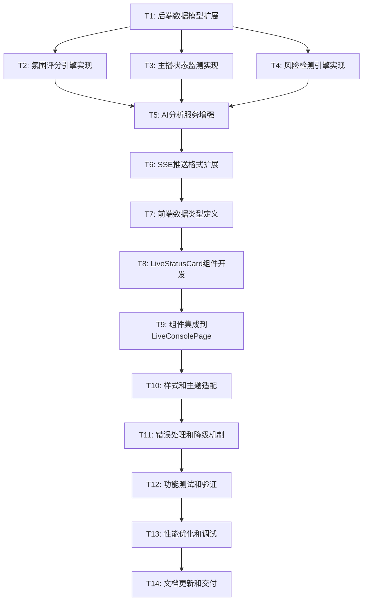

# AI实时分析卡片 · 任务拆分文档

## 任务依赖关系图

## 原子任务详细定义

### T1: 后端数据模型扩展

#### 输入约束
- 现有 `AIState` 和 `ai_live_analyzer.py` 代码
- 现有数据结构和接口定义
- 架构设计文档中的数据模型规范

#### 输出约束
- 新增数据模型类: `AtmosphereMetrics`, `HostStatusMetrics`, `RiskAlert`, `LiveStatusResult`
- 扩展现有 `AIState` 类支持新字段
- 数据模型单元测试覆盖率 > 90%

#### 实现约束
- 使用 Python dataclass 定义数据结构
- 保持与现有代码的兼容性
- 遵循现有的代码规范和类型注解

#### 验收标准
- [ ] 所有数据模型类定义完成
- [ ] 类型注解完整且正确
- [ ] 单元测试通过
- [ ] 与现有代码无冲突

#### 依赖关系
- **前置依赖**: 无
- **后置任务**: T2, T3, T4

---

### T2: 氛围评分引擎实现

#### 输入约束
- T1 完成的数据模型定义
- 现有弹幕和互动数据结构
- 评分算法设计规范

#### 输出约束
- `AtmosphereEngine` 类实现
- 氛围评分算法 (弹幕密度40% + 互动质量35% + 情感倾向25%)
- 趋势分析和等级判定逻辑
- 算法准确性测试用例

#### 实现约束
- 评分范围: 0-100
- 计算延迟 < 100ms
- 支持实时和批量计算模式

#### 验收标准
- [ ] 氛围评分算法实现完成
- [ ] 评分结果在合理范围内 (0-100)
- [ ] 趋势分析逻辑正确
- [ ] 性能测试通过 (< 100ms)

#### 依赖关系
- **前置依赖**: T1
- **后置任务**: T5

---

### T3: 主播状态监测实现

#### 输入约束
- T1 完成的数据模型定义
- 现有转录句子数据
- 语速和停顿分析算法规范

#### 输出约束
- `HostStatusMonitor` 类实现
- 语速计算逻辑 (字/分钟)
- 停顿时长估算算法
- 话题连贯性分析逻辑

#### 实现约束
- 语速计算精度: ±5%
- 支持中文字符计数
- 连贯性分析基于语义相似度

#### 验收标准
- [ ] 语速计算准确 (误差 < 5%)
- [ ] 停顿时长估算合理
- [ ] 话题连贯性分析有效
- [ ] 边界条件处理完善

#### 依赖关系
- **前置依赖**: T1
- **后置任务**: T5

---

### T4: 风险检测引擎实现

#### 输入约束
- T1 完成的数据模型定义
- 历史分析结果数据
- 风险检测规则定义

#### 输出约束
- `RiskDetectionEngine` 类实现
- 互动下降检测逻辑
- 冷场风险识别算法
- 高频问题未回应检测

#### 实现约束
- 检测延迟 < 50ms
- 支持可配置的风险阈值
- 风险等级分类: 低/中/高

#### 验收标准
- [ ] 互动下降检测准确
- [ ] 冷场风险识别有效
- [ ] 问题未回应检测正确
- [ ] 风险等级分类合理

#### 依赖关系
- **前置依赖**: T1
- **后置任务**: T5

---

### T5: AI分析服务增强

#### 输入约束
- T2, T3, T4 完成的分析引擎
- 现有 `AILiveAnalyzer` 类
- OpenAI兼容接口调用逻辑

#### 输出约束
- 扩展 `AILiveAnalyzer` 类支持新分析功能
- 集成氛围、主播状态、风险检测引擎
- 新的分析结果格式化方法
- 向后兼容的接口保持

#### 实现约束
- 保持现有API接口不变
- 新功能通过配置开关控制
- 分析窗口时间可配置 (30-600秒)

#### 验收标准
- [ ] 新分析引擎集成完成
- [ ] 现有功能不受影响
- [ ] 分析结果格式正确
- [ ] 配置开关工作正常

#### 依赖关系
- **前置依赖**: T2, T3, T4
- **后置任务**: T6

---

### T6: SSE推送格式扩展

#### 输入约束
- T5 完成的增强分析服务
- 现有 SSE 推送机制
- 新的数据格式规范

#### 输出约束
- 扩展 SSE 事件类型: `live_status_update`
- 新的事件数据格式实现
- 向后兼容的推送机制
- 推送频率控制 (每分钟)

#### 实现约束
- 事件数据大小 < 10KB
- 推送延迟 < 500ms
- 支持多客户端订阅

#### 验收标准
- [ ] 新事件类型推送正常
- [ ] 数据格式符合规范
- [ ] 推送频率控制有效
- [ ] 多客户端支持正常

#### 依赖关系
- **前置依赖**: T5
- **后置任务**: T7

---

### T7: 前端数据类型定义

#### 输入约束
- T6 完成的SSE数据格式
- 现有 TypeScript 类型定义
- 前端架构设计规范

#### 输出约束
- TypeScript 接口定义文件
- 数据类型验证逻辑
- 类型安全的数据处理函数
- 类型定义文档

#### 实现约束
- 使用 TypeScript 严格模式
- 所有接口必须有完整类型注解
- 支持运行时类型检查

#### 验收标准
- [ ] TypeScript 类型定义完整
- [ ] 类型检查无错误
- [ ] 运行时验证正常
- [ ] 类型文档清晰

#### 依赖关系
- **前置依赖**: T6
- **后置任务**: T8

---

### T8: LiveStatusCard组件开发

#### 输入约束
- T7 完成的类型定义
- 现有 React 组件库和样式系统
- UI设计规范和交互逻辑

#### 输出约束
- `LiveStatusCard` 主组件
- 子组件: `AtmosphereSection`, `HostStatusSection`, `RiskAlertsSection`, `SuggestionsSection`
- 组件样式文件 (CSS/SCSS)
- 组件单元测试

#### 实现约束
- 使用 React Hooks 和函数组件
- 遵循现有 UI 设计规范
- 支持响应式布局
- 组件可复用和可配置

#### 验收标准
- [ ] 所有组件开发完成
- [ ] UI 显示正确美观
- [ ] 交互功能正常
- [ ] 单元测试覆盖率 > 80%

#### 依赖关系
- **前置依赖**: T7
- **后置任务**: T9

---

### T9: 组件集成到LiveConsolePage

#### 输入约束
- T8 完成的 LiveStatusCard 组件
- 现有 `LiveConsolePage.tsx` 代码
- SSE 数据订阅逻辑

#### 输出约束
- 修改 `LiveConsolePage.tsx` 集成新组件
- 替换现有 AI 分析卡片区域
- SSE 数据订阅和状态管理
- 用户交互事件处理

#### 实现约束
- 保持现有页面布局结构
- 不影响其他功能模块
- 支持组件的显示/隐藏切换

#### 验收标准
- [ ] 新组件成功集成到页面
- [ ] 现有功能不受影响
- [ ] SSE 数据订阅正常
- [ ] 用户交互响应正确

#### 依赖关系
- **前置依赖**: T8
- **后置任务**: T10

---

### T10: 样式和主题适配

#### 输入约束
- T9 完成的页面集成
- 现有主题系统和样式规范
- 设计稿和视觉要求

#### 输出约束
- 适配现有主题系统 (浅色/深色模式)
- 响应式布局优化
- 动画和过渡效果
- 样式一致性检查

#### 实现约束
- 使用现有 CSS 变量和类名
- 支持主题切换无闪烁
- 移动端适配良好

#### 验收标准
- [ ] 主题切换正常
- [ ] 响应式布局正确
- [ ] 动画效果流畅
- [ ] 样式一致性良好

#### 依赖关系
- **前置依赖**: T9
- **后置任务**: T11

---

### T11: 错误处理和降级机制

#### 输入约束
- T10 完成的样式适配
- 错误处理设计规范
- 用户体验要求

#### 输出约束
- AI 服务异常处理逻辑
- 网络连接异常处理
- 数据格式异常处理
- 用户友好的错误提示

#### 实现约束
- 错误不影响其他功能
- 提供有意义的错误信息
- 支持自动重试机制

#### 验收标准
- [ ] 各种异常场景处理正确
- [ ] 错误提示用户友好
- [ ] 自动重试机制有效
- [ ] 系统稳定性良好

#### 依赖关系
- **前置依赖**: T10
- **后置任务**: T12

---

### T12: 功能测试和验证

#### 输入约束
- T11 完成的完整功能实现
- 测试用例设计
- 验收标准清单

#### 输出约束
- 端到端功能测试
- 性能测试报告
- 兼容性测试结果
- 缺陷修复记录

#### 实现约束
- 覆盖所有主要功能场景
- 包含边界条件测试
- 性能指标符合要求

#### 验收标准
- [ ] 所有功能测试通过
- [ ] 性能指标达标
- [ ] 兼容性测试通过
- [ ] 关键缺陷已修复

#### 依赖关系
- **前置依赖**: T11
- **后置任务**: T13

---

### T13: 性能优化和调试

#### 输入约束
- T12 完成的测试结果
- 性能瓶颈分析报告
- 优化目标和指标

#### 输出约束
- 性能优化实施
- 内存使用优化
- 网络传输优化
- 渲染性能优化

#### 实现约束
- 卡片刷新延迟 < 2秒
- 内存增量 < 50MB
- UI 响应时间 < 500ms

#### 验收标准
- [ ] 性能指标达到要求
- [ ] 内存使用合理
- [ ] 网络传输优化
- [ ] 用户体验流畅

#### 依赖关系
- **前置依赖**: T12
- **后置任务**: T14

---

### T14: 文档更新和交付

#### 输入约束
- T13 完成的优化实现
- 现有用户手册和开发文档
- 功能变更记录

#### 输出约束
- 更新用户使用手册
- 更新开发者文档
- 创建功能演示视频
- 交付总结报告

#### 实现约束
- 文档内容准确完整
- 示例代码可运行
- 演示视频清晰易懂

#### 验收标准
- [ ] 用户手册更新完成
- [ ] 开发文档更新完成
- [ ] 演示材料制作完成
- [ ] 交付报告编写完成

#### 依赖关系
- **前置依赖**: T13
- **后置任务**: 无

## 任务执行计划

### 第一阶段: 后端核心功能 (T1-T6)
**预计时间**: 2-3个工作日
**关键里程碑**: 
- 数据模型和分析引擎完成
- SSE推送格式扩展完成
- 后端功能可独立测试

### 第二阶段: 前端组件开发 (T7-T9)  
**预计时间**: 1-2个工作日
**关键里程碑**:
- React组件开发完成
- 页面集成完成
- 前后端数据流通

### 第三阶段: 完善和优化 (T10-T14)
**预计时间**: 1个工作日
**关键里程碑**:
- 样式和交互完善
- 测试和优化完成
- 文档和交付完成

## 风险控制

### 高风险任务
- **T5 (AI分析服务增强)**: 涉及核心逻辑修改，需要充分测试
- **T9 (组件集成)**: 可能影响现有功能，需要谨慎处理

### 缓解措施
- 增量开发和测试
- 保持向后兼容性
- 及时代码审查和反馈

### 质量保证
- 每个任务完成后进行代码审查
- 关键任务需要单元测试覆盖
- 集成测试验证端到端功能