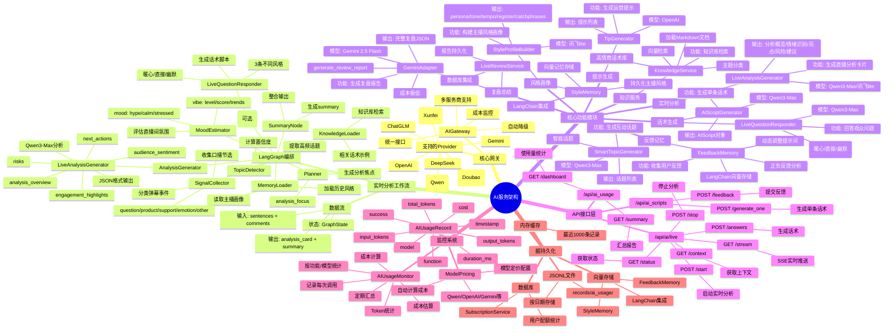
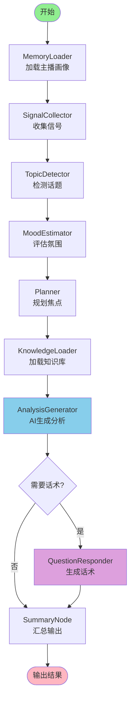
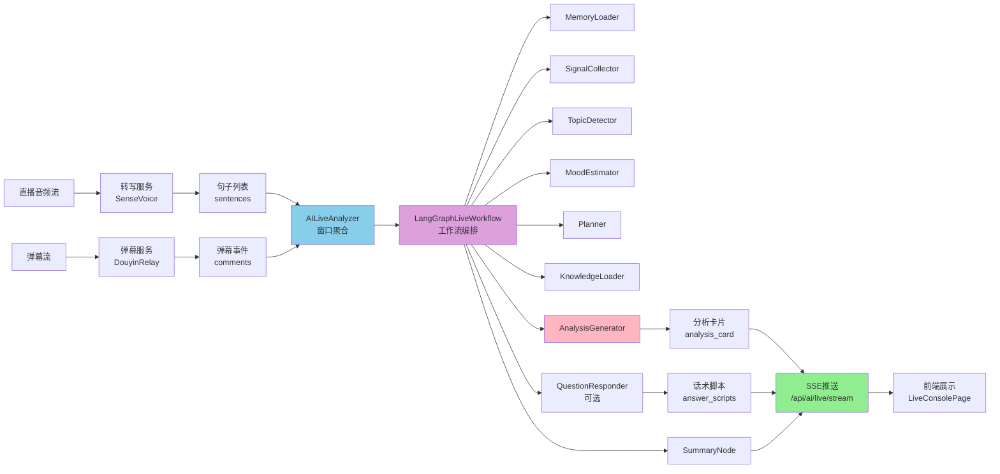

# 🧠 AI服务功能与工作流思维导图

> 提猫直播管理平台 - AI能力全景图

## 📊 思维导图（Mermaid格式）



## 🔄 工作流详细流程



## 📦 功能模块清单

### 1. 实时分析功能
- **模块**: `LiveAnalysisGenerator`
- **输入**: 转写文本 + 弹幕事件 + 统计信息
- **输出**: 分析卡片（JSON格式）
- **模型**: Qwen3-Max / 讯飞lite
- **频率**: 每30-60秒一次

### 2. 风格画像与氛围分析
- **模块**: `StyleProfileBuilder` + `MoodEstimator`
- **输入**: 转写文本
- **输出**: 
  - 风格画像: persona/tone/tempo/register
  - 氛围指数: vibe.level/vibe.score/mood
- **模型**: 讯飞lite
- **频率**: 实时更新

### 3. 话术生成
- **模块**: `LiveQuestionResponder` / `AIScriptGenerator`
- **输入**: 观众问题 + 上下文
- **输出**: 3条话术（暖心/直接/幽默）
- **模型**: Qwen3-Max
- **触发**: 手动选择问题

### 4. 复盘总结
- **模块**: `GeminiAdapter.generate_review_report`
- **输入**: 完整转写 + 弹幕 + 数据指标
- **输出**: 完整复盘报告（JSON）
- **模型**: Gemini 2.5 Flash
- **触发**: 直播结束后

### 5. 知识服务
- **模块**: `KnowledgeService`
- **功能**: 
  - 加载Markdown知识库
  - 主题分类检索
  - 高情商话术库
  - 向量检索
- **数据源**: `knowledge/直播运营和主播话术/`

### 6. 记忆系统
- **StyleMemory**: 主播风格向量记忆
- **FeedbackMemory**: 用户反馈记忆
- **技术**: LangChain VectorStore

## 🔌 API接口清单

### 实时分析API (`/api/ai/live`)
- `POST /start` - 启动分析
- `POST /stop` - 停止分析
- `GET /status` - 获取状态
- `GET /stream` - SSE实时流
- `POST /answers` - 生成话术
- `GET /context` - 获取上下文

### 话术生成API (`/api/ai_scripts`)
- `POST /generate_one` - 生成单条话术
- `POST /feedback` - 提交反馈

### 使用监控API (`/api/ai_usage`)
- `GET /dashboard` - 使用量仪表板
- `GET /summary` - 汇总报告

## 💰 成本管理

### 模型定价（按功能）
- **实时分析**: 讯飞lite（免费）或 Qwen3-Max（¥0.006/1K输入）
- **风格画像**: 讯飞lite（免费）
- **话术生成**: Qwen3-Max（¥0.006/1K输入, ¥0.06/1K输出）
- **复盘总结**: Gemini 2.5 Flash（$0.075/1M输入, $0.30/1M输出）

### 监控功能
- 实时记录每次调用
- 自动计算成本
- 定期汇总统计
- 成本估算（每小时/每天/每月）

## 🎯 工作流节点说明

| 节点 | 功能 | 输入 | 输出 |
|------|------|------|------|
| MemoryLoader | 加载主播画像 | anchor_id | persona |
| SignalCollector | 收集信号 | sentences + comments | chat_signals + chat_stats |
| TopicDetector | 检测话题 | 文本内容 | topic_candidates |
| MoodEstimator | 评估氛围 | chat_signals | vibe + mood |
| Planner | 规划焦点 | topics + vibe | analysis_focus |
| KnowledgeLoader | 加载知识 | queries | knowledge_snippets |
| AnalysisGenerator | AI生成分析 | 完整上下文 | analysis_card |
| QuestionResponder | 生成话术 | questions + context | answer_scripts |
| SummaryNode | 汇总输出 | 所有节点结果 | summary + highlights |

## 📈 完整数据流向



## 🏗️ 服务架构层级

```mermaid
graph TB
    subgraph 前端层
        A[LiveConsolePage<br/>React组件]
        B[SSE客户端<br/>EventSource]
    end
    
    subgraph API层
        C[/api/ai/live/stream<br/>SSE推送]
        D[/api/ai/live/answers<br/>话术生成]
        E[/api/ai_scripts/generate_one<br/>单条话术]
        F[/api/ai_usage/dashboard<br/>使用监控]
    end
    
    subgraph 服务层
        G[AILiveAnalyzer<br/>实时分析服务]
        H[LiveReviewService<br/>复盘服务]
        I[SubscriptionService<br/>配额管理]
    end
    
    subgraph 工作流层
        J[LangGraphLiveWorkflow<br/>状态机编排]
        K[MemoryLoader]
        L[AnalysisGenerator]
        M[QuestionResponder]
    end
    
    subgraph AI层
        N[AIGateway<br/>统一网关]
        O[LiveAnalysisGenerator]
        P[LiveQuestionResponder]
        Q[GeminiAdapter]
        R[StyleProfileBuilder]
    end
    
    subgraph 记忆层
        S[StyleMemory<br/>向量存储]
        T[FeedbackMemory<br/>反馈记忆]
        U[KnowledgeService<br/>知识库]
    end
    
    subgraph 监控层
        V[AIUsageMonitor<br/>使用监控]
        W[ModelPricing<br/>成本计算]
    end
    
    A --> B
    B --> C
    A --> D
    A --> E
    A --> F
    
    C --> G
    D --> G
    E --> G
    
    G --> J
    J --> K
    J --> L
    J --> M
    
    L --> O
    M --> P
    O --> N
    P --> N
    
    J --> S
    J --> T
    J --> U
    
    N --> V
    V --> W
    
    H --> Q
    
    style N fill:#FFD700
    style J fill:#DDA0DD
    style V fill:#90EE90
```

## 🔧 技术栈

- **工作流引擎**: LangGraph
- **向量存储**: LangChain VectorStore
- **AI网关**: AIGateway (统一接口)
- **监控系统**: AIUsageMonitor
- **持久化**: JSONL文件 + 数据库
- **实时推送**: SSE (Server-Sent Events)

## 📋 核心服务说明

### AILiveAnalyzer (实时分析服务)
- **职责**: 窗口聚合、状态管理、事件分发
- **窗口机制**: 每30-60秒聚合一次
- **输入**: 转写句子 + 弹幕事件
- **输出**: 通过SSE推送到前端
- **状态管理**: AIState (sentences/comments/style_profile/vibe)

### LangGraphLiveWorkflow (工作流编排)
- **架构**: 状态机模式
- **节点数**: 9个核心节点
- **执行模式**: 顺序执行 + 条件分支
- **降级机制**: LangGraph不可用时顺序执行

### AIGateway (统一网关)
- **功能**: 多服务商统一管理
- **支持**: 7个AI服务商
- **特性**: 自动降级、成本监控、功能级别模型配置
- **监控**: 自动记录每次调用

## 🎯 功能映射表

| 功能名称 | 后端模块 | 前端展示位置 | 模型 | 触发方式 |
|---------|---------|------------|------|---------|
| 实时分析 | LiveAnalysisGenerator | 直播间分析卡片 | Qwen3-Max/讯飞lite | 自动(每30-60秒) |
| 风格画像 | StyleProfileBuilder | 主播画像与氛围分析卡片 | 讯飞lite | 自动(实时更新) |
| 氛围识别 | MoodEstimator | 主播画像与氛围分析卡片 | 本地计算 | 自动(实时更新) |
| 话术生成 | LiveQuestionResponder | 话术生成面板 | Qwen3-Max | 手动(选择问题) |
| 复盘总结 | GeminiAdapter | 复盘报告页面 | Gemini 2.5 Flash | 手动(直播结束) |

## 💡 关键设计原则

1. **统一网关**: 所有AI调用通过AIGateway，便于管理和监控
2. **功能级别配置**: 不同功能使用不同模型，优化成本
3. **自动监控**: 每次调用自动记录，无需手动添加
4. **降级机制**: 支持LangGraph不可用时的顺序执行
5. **实时推送**: SSE确保前端实时接收分析结果

---

**最后更新**: 2025-01-04  
**版本**: v2.0  
**维护者**: 提猫开发团队

