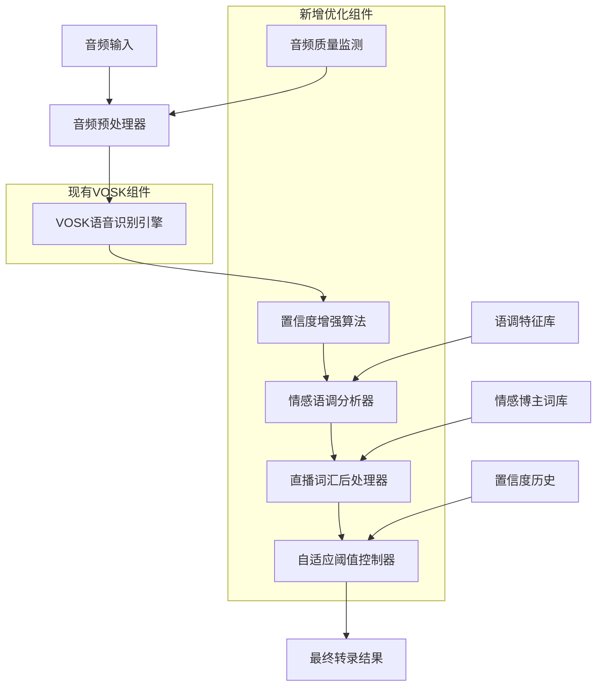

# AST语音转录算法优化架构设计

## 🏗️ 整体架构图



## 🔧 核心组件设计

### 1. 音频预处理增强器 (AudioPreprocessorEnhanced)

**功能职责**:
- 音频质量实时监测
- 自动降噪处理
- 音量归一化
- 静音段智能检测

**接口设计**:
```python
class AudioPreprocessorEnhanced:
    def __init__(self):
        self.noise_reducer = SpectralGateDenoiser()
        self.volume_normalizer = VolumeNormalizer()
        self.silence_detector = SilenceDetector()
        self.quality_monitor = AudioQualityMonitor()
    
    def process_audio_chunk(self, audio_data: bytes) -> Tuple[bytes, AudioQuality]:
        """处理音频块并返回质量指标"""
        
    def adaptive_noise_reduction(self, audio_data: bytes, noise_level: float) -> bytes:
        """自适应降噪处理"""
        
    def normalize_volume(self, audio_data: bytes) -> bytes:
        """音量归一化"""
```

### 2. 智能置信度计算器 (SmartConfidenceCalculator)

**功能职责**:
- 多维度置信度计算
- 词频权重分析
- 语言模型置信度
- 历史准确率学习

**算法设计**:
```python
class SmartConfidenceCalculator:
    def __init__(self):
        self.word_frequency_db = EmotionalWordFrequencyDB()
        self.context_analyzer = ContextualAnalyzer()
        self.accuracy_tracker = AccuracyTracker()
    
    def calculate_enhanced_confidence(self, vosk_result: Dict) -> float:
        """
        增强置信度计算公式:
        final_confidence = (
            vosk_confidence * 0.4 +
            word_frequency_score * 0.3 + 
            context_coherence_score * 0.2 +
            audio_quality_score * 0.1
        )
        """
        
    def update_word_frequency_weights(self, text: str, actual_accuracy: float):
        """基于实际准确率更新词频权重"""
```

### 3. 情感语调分析器 (EmotionalToneAnalyzer)

**功能职责**:
- 语调情感识别
- 语速分析
- 停顿模式识别
- 情感强度量化

**技术实现**:
```python
class EmotionalToneAnalyzer:
    def __init__(self):
        self.tone_classifier = ToneClassifier()
        self.speech_rate_analyzer = SpeechRateAnalyzer()
        self.emotion_intensity_meter = EmotionIntensityMeter()
    
    def analyze_emotional_features(self, audio_data: bytes, text: str) -> EmotionalFeatures:
        """分析语音的情感特征"""
        
    def detect_emotional_keywords(self, text: str) -> List[EmotionalKeyword]:
        """检测情感关键词"""
        
    def calculate_emotion_confidence_boost(self, emotional_features: EmotionalFeatures) -> float:
        """基于情感特征提升置信度"""
```

### 4. 直播词汇后处理器 (LiveStreamPostProcessor)

**功能职责**:
- 情感博主专用词汇纠错
- 网络流行语识别
- 商品名称标准化
- 语气词处理

**词库设计**:
```python
class LiveStreamPostProcessor:
    def __init__(self):
        self.emotional_vocab = self._load_emotional_vocabulary()
        self.product_names = self._load_product_database()
        self.internet_slang = self._load_internet_slang()
        self.correction_rules = self._load_correction_rules()
    
    def post_process_text(self, text: str, confidence: float) -> Tuple[str, float]:
        """后处理转录文本并调整置信度"""
        
    def correct_emotional_expressions(self, text: str) -> str:
        """纠正情感表达"""
        
    def standardize_product_mentions(self, text: str) -> str:
        """标准化产品提及"""
```

### 5. 自适应阈值控制器 (AdaptiveThresholdController)

**功能职责**:
- 动态调整置信度阈值
- 基于历史表现学习
- 噪音环境自适应
- 实时性能监控

**自适应算法**:
```python
class AdaptiveThresholdController:
    def __init__(self):
        self.performance_history = PerformanceHistory()
        self.environment_detector = EnvironmentDetector()
        self.threshold_optimizer = ThresholdOptimizer()
    
    def adaptive_threshold_adjustment(self, current_accuracy: float, 
                                    noise_level: float, 
                                    speaking_rate: float) -> float:
        """自适应阈值调整算法"""
        
    def learn_from_feedback(self, predicted_confidence: float, 
                          actual_accuracy: float):
        """从反馈中学习优化阈值"""
```

## 📊 数据流设计

### 处理Pipeline
```
原始音频 → 质量检测 → 降噪处理 → VOSK识别 → 
多维置信度计算 → 情感分析 → 词汇后处理 → 
自适应阈值过滤 → 最终结果输出
```

### 数据结构设计
```python
@dataclass
class EnhancedTranscriptionResult:
    # 基础字段（兼容现有接口）
    text: str
    confidence: float
    timestamp: float
    duration: float
    is_final: bool
    words: Optional[List[Dict[str, Any]]] = None
    room_id: str = ""
    session_id: str = ""
    
    # 新增优化字段
    audio_quality: AudioQuality = None
    emotional_features: EmotionalFeatures = None
    confidence_breakdown: ConfidenceBreakdown = None
    post_processing_applied: List[str] = None
    adaptive_threshold_used: float = None

@dataclass
class AudioQuality:
    noise_level: float
    volume_level: float
    clarity_score: float
    sample_rate: int

@dataclass
class EmotionalFeatures:
    emotion_type: str  # "excited", "calm", "frustrated", etc.
    intensity: float   # 0.0 - 1.0
    speech_rate: float # words per minute
    tone_confidence: float

@dataclass  
class ConfidenceBreakdown:
    vosk_confidence: float
    word_frequency_score: float
    context_coherence_score: float
    audio_quality_score: float
    emotion_boost: float
    final_confidence: float
```

## 🎯 优化算法具体实现

### 1. 智能置信度计算公式

```python
def calculate_enhanced_confidence(vosk_result: Dict, 
                                audio_quality: AudioQuality,
                                emotional_features: EmotionalFeatures) -> float:
    """
    增强置信度计算
    """
    # 基础VOSK置信度 (40%权重)
    base_confidence = calculate_vosk_confidence(vosk_result)
    
    # 词频权重分数 (30%权重)
    word_freq_score = calculate_word_frequency_score(vosk_result["text"])
    
    # 上下文连贯性分数 (20%权重)  
    context_score = calculate_context_coherence(vosk_result["text"])
    
    # 音频质量分数 (10%权重)
    quality_score = audio_quality.clarity_score
    
    # 情感特征加成 (额外0-15%提升)
    emotion_boost = calculate_emotion_confidence_boost(emotional_features)
    
    final_confidence = (
        base_confidence * 0.4 +
        word_freq_score * 0.3 + 
        context_score * 0.2 +
        quality_score * 0.1
    ) * (1.0 + emotion_boost)
    
    return min(final_confidence, 1.0)
```

### 2. 自适应阈值算法

```python
def adaptive_threshold_calculation(performance_history: List[float],
                                 current_noise_level: float,
                                 speaking_rate: float) -> float:
    """
    自适应置信度阈值计算
    """
    # 基础阈值
    base_threshold = 0.6
    
    # 基于历史表现调整 (-0.2 to +0.2)
    if len(performance_history) > 10:
        recent_accuracy = np.mean(performance_history[-10:])
        if recent_accuracy > 0.85:
            history_adjustment = -0.1  # 降低阈值，接受更多结果
        elif recent_accuracy < 0.75:
            history_adjustment = +0.1  # 提高阈值，过滤更多结果
        else:
            history_adjustment = 0.0
    else:
        history_adjustment = 0.0
    
    # 基于噪音水平调整 (0 to +0.15)
    noise_adjustment = min(current_noise_level * 0.3, 0.15)
    
    # 基于语速调整 (-0.1 to +0.1)
    optimal_rate = 150  # words per minute
    rate_deviation = abs(speaking_rate - optimal_rate) / optimal_rate
    rate_adjustment = min(rate_deviation * 0.2, 0.1)
    
    adaptive_threshold = base_threshold + history_adjustment + noise_adjustment + rate_adjustment
    
    return np.clip(adaptive_threshold, 0.3, 0.9)
```

## 🔧 技术实现架构

### 模块依赖关系
```
AST_module/
├── enhanced_processors/
│   ├── audio_preprocessor_enhanced.py
│   ├── smart_confidence_calculator.py  
│   ├── emotional_tone_analyzer.py
│   ├── livestream_post_processor.py
│   └── adaptive_threshold_controller.py
├── data/
│   ├── emotional_vocabulary.json
│   ├── product_database.json
│   ├── internet_slang.json
│   └── correction_rules.json
├── models/
│   └── enhanced_transcription_result.py
└── enhanced_ast_service.py
```

### 接口兼容性设计
```python
class EnhancedASTService(ASTService):
    """增强版AST服务，兼容原有接口"""
    
    def __init__(self, config: Optional[ASTConfig] = None, enable_enhancements: bool = True):
        super().__init__(config)
        
        if enable_enhancements:
            self._initialize_enhanced_components()
    
    def _initialize_enhanced_components(self):
        """初始化增强组件"""
        self.audio_preprocessor = AudioPreprocessorEnhanced()
        self.confidence_calculator = SmartConfidenceCalculator()
        self.tone_analyzer = EmotionalToneAnalyzer()
        self.post_processor = LiveStreamPostProcessor()
        self.threshold_controller = AdaptiveThresholdController()
    
    async def _process_audio_chunk(self, audio_data: bytes):
        """重写音频处理方法，加入增强功能"""
        # 1. 音频预处理增强
        processed_audio, audio_quality = self.audio_preprocessor.process_audio_chunk(audio_data)
        
        # 2. VOSK识别（原有逻辑）
        vosk_result = await self.vosk_service.transcribe_audio(processed_audio)
        
        if vosk_result.get("success") and vosk_result.get("text"):
            # 3. 情感语调分析
            emotional_features = self.tone_analyzer.analyze_emotional_features(
                processed_audio, vosk_result["text"]
            )
            
            # 4. 智能置信度计算
            enhanced_confidence = self.confidence_calculator.calculate_enhanced_confidence(
                vosk_result, audio_quality, emotional_features
            )
            
            # 5. 直播词汇后处理
            processed_text, final_confidence = self.post_processor.post_process_text(
                vosk_result["text"], enhanced_confidence
            )
            
            # 6. 自适应阈值过滤
            adaptive_threshold = self.threshold_controller.get_current_threshold()
            
            if final_confidence >= adaptive_threshold:
                # 7. 构建增强结果
                result = EnhancedTranscriptionResult(
                    text=processed_text,
                    confidence=final_confidence,
                    timestamp=time.time(),
                    duration=self.config.chunk_duration,
                    is_final=vosk_result.get("type") == "final",
                    words=vosk_result.get("words", []),
                    room_id=self.current_room_id or "",
                    session_id=self.current_session_id or "",
                    audio_quality=audio_quality,
                    emotional_features=emotional_features,
                    confidence_breakdown=self.confidence_calculator.get_last_breakdown(),
                    adaptive_threshold_used=adaptive_threshold
                )
                
                # 8. 更新统计和学习
                await self._update_performance_statistics(result)
                await self._notify_transcription_callbacks(result)
```

## 📈 性能优化策略

### 1. 计算效率优化
- 使用numpy向量化计算
- 音频处理使用scipy优化函数
- 缓存频繁查询的词库数据
- 异步处理非关键路径

### 2. 内存管理优化
- 音频数据流式处理，避免大块缓存
- 词库使用懒加载策略
- 定期清理历史性能数据
- 使用内存映射处理大型词库文件

### 3. 实时性保证
- 增强处理控制在100ms内完成
- 使用线程池处理CPU密集计算
- 关键路径优先级调度
- 可配置的功能启用/禁用开关

## 🧪 测试验证框架

### 测试数据集设计
```python
class EmotionalStreamingTestSuite:
    """情感博主语音测试套件"""
    
    def __init__(self):
        self.test_scenarios = [
            "excited_product_introduction",
            "calm_interaction_response", 
            "frustrated_technical_issue",
            "joyful_audience_engagement",
            "noisy_background_environment"
        ]
    
    def run_accuracy_benchmark(self) -> AccuracyReport:
        """运行准确率基准测试"""
        
    def run_realtime_performance_test(self) -> PerformanceReport:
        """运行实时性能测试"""
        
    def run_emotional_recognition_test(self) -> EmotionRecognitionReport:
        """运行情感识别测试"""
```

## 🎯 验收标准

### 量化指标
- **准确率提升**: 从当前水平提升至>80%
- **置信度相关性**: 置信度与实际准确率相关系数>0.8  
- **实时性保持**: 增强处理延迟<100ms
- **稳定性**: 连续运行3小时无性能衰减

### 功能验证
- ✅ 情感语调识别准确率>75%
- ✅ 直播专业词汇识别提升>20%
- ✅ 噪音环境下准确率保持>70%
- ✅ 自适应阈值响应时间<30秒

这个架构设计保持了与现有VOSK系统的完全兼容性，同时通过多层次的算法优化显著提升了情感博主场景下的语音识别准确率。