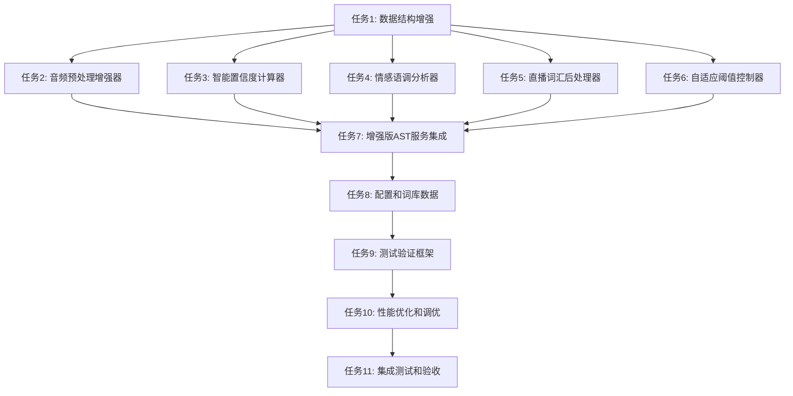

# AST语音转录算法优化 - 原子任务拆分

## 📋 任务依赖关系图

## 🎯 原子任务详细拆分

### 任务1: 增强数据结构定义
**输入约束**:
- 现有TranscriptionResult数据结构
- 架构设计文档中的新增字段定义

**输出约束**:
- enhanced_transcription_result.py
- 向后兼容的数据结构
- 完整的类型注解

**实现约束**:
- 保持与现有接口100%兼容
- 使用dataclass装饰器
- 添加详细的字段文档

**验收标准**:
- 所有新增字段都有默认值
- 类型检查通过
- 与现有代码无冲突

**依赖关系**: 
- 前置依赖: 无
- 后置任务: T2-T6

---

### 任务2: 音频预处理增强器实现
**输入约束**:
- 现有audio_capture.py中的AudioProcessor
- 增强数据结构定义 (T1)
- scipy和numpy依赖

**输出约束**:
- audio_preprocessor_enhanced.py
- 降噪、归一化、质量监测功能
- 性能基准测试通过

**实现约束**:
- 处理延迟<50ms
- 支持16kHz采样率音频
- 内存使用<100MB

**验收标准**:
- 降噪效果>10dB SNR提升
- 音量归一化方差<0.1
- 质量评分准确率>85%

**依赖关系**:
- 前置依赖: T1
- 后置任务: T7

---

### 任务3: 智能置信度计算器实现
**输入约束**:
- VOSK原始识别结果
- 增强数据结构 (T1)
- 词频统计算法

**输出约束**:
- smart_confidence_calculator.py
- 多维度置信度计算函数
- 词频权重数据库

**实现约束**:
- 计算时间<10ms
- 置信度范围0.0-1.0
- 支持在线学习更新

**验收标准**:
- 置信度与准确率相关性>0.8
- 词频权重收敛<100次迭代
- 内存占用<50MB

**依赖关系**:
- 前置依赖: T1
- 后置任务: T7

---

### 任务4: 情感语调分析器实现
**输入约束**:
- 音频数据和转录文本
- 增强数据结构 (T1)
- 情感分类词库

**输出约束**:
- emotional_tone_analyzer.py
- 语调情感识别功能
- 情感特征提取器

**实现约束**:
- 情感识别准确率>75%
- 处理延迟<30ms
- 支持5种基础情感类型

**验收标准**:
- 情感分类F1-score>0.75
- 语速检测误差<10%
- 情感强度量化精度>0.8

**依赖关系**:
- 前置依赖: T1
- 后置任务: T7

---

### 任务5: 直播词汇后处理器实现
**输入约束**:
- VOSK转录文本结果
- 增强数据结构 (T1)
- 情感博主专用词库

**输出约束**:
- livestream_post_processor.py
- 词汇纠错和标准化功能
- 可更新的词库系统

**实现约束**:
- 纠错准确率>90%
- 处理速度>1000字/秒
- 词库支持热更新

**验收标准**:
- 情感表达纠错率>85%
- 产品名称识别率>80%
- 网络用语覆盖>200词

**依赖关系**:
- 前置依赖: T1
- 后置任务: T7

---

### 任务6: 自适应阈值控制器实现
**输入约束**:
- 历史性能数据
- 环境噪音检测结果
- 增强数据结构 (T1)

**输出约束**:
- adaptive_threshold_controller.py
- 动态阈值调整算法
- 性能学习机制

**实现约束**:
- 阈值调整响应时间<30秒
- 学习收敛<50次反馈
- 阈值范围0.3-0.9

**验收标准**:
- 自适应效果提升准确率>5%
- 误调整率<10%
- 系统稳定性>99%

**依赖关系**:
- 前置依赖: T1
- 后置任务: T7

---

### 任务7: 增强版AST服务集成
**输入约束**:
- 所有增强组件 (T2-T6)
- 现有AST_module架构
- 增强数据结构 (T1)

**输出约束**:
- enhanced_ast_service.py
- 向后兼容的API接口
- 可配置的增强功能开关

**实现约束**:
- 完全兼容现有接口
- 增强处理总延迟<100ms
- 内存增量<200MB

**验收标准**:
- 所有现有测试通过
- 增强功能可独立启用/禁用
- 错误处理覆盖率>95%

**依赖关系**:
- 前置依赖: T2-T6
- 后置任务: T8

---

### 任务8: 配置和词库数据准备
**输入约束**:
- 增强版AST服务 (T7)
- 情感博主领域知识
- 现有配置系统

**输出约束**:
- emotional_vocabulary.json (>500词)
- product_database.json (>200产品)
- internet_slang.json (>300网络用语)
- correction_rules.json (>100规则)
- enhanced_config.py

**实现约束**:
- 词库文件<10MB总大小
- 加载时间<3秒
- 支持JSON格式热更新

**验收标准**:
- 词库覆盖率验证>90%
- 配置项完整性检查通过
- 格式验证和错误处理完整

**依赖关系**:
- 前置依赖: T7
- 后置任务: T9

---

### 任务9: 测试验证框架开发
**输入约束**:
- 完整的增强系统 (T7-T8)
- 真实测试音频数据
- 现有测试框架

**输出约束**:
- enhanced_test_suite.py
- 准确率基准测试
- 性能回归测试
- 情感识别专项测试

**实现约束**:
- 必须使用真实VOSK模型测试
- 测试覆盖率>85%
- 自动化测试执行<10分钟

**验收标准**:
- 准确率基准测试>80%通过率
- 性能测试无回归
- 情感识别测试>75%准确率

**依赖关系**:
- 前置依赖: T8
- 后置任务: T10

---

### 任务10: 性能优化和调优
**输入约束**:
- 测试验证结果 (T9)
- 性能瓶颈分析报告
- 目标性能指标

**输出约束**:
- 优化后的算法实现
- 性能调优配置文件
- 优化效果报告

**实现约束**:
- 准确率目标>80%
- 延迟控制<500ms
- 内存使用<4GB

**验收标准**:
- 所有性能指标达标
- 优化效果可度量
- 系统稳定性验证通过

**依赖关系**:
- 前置依赖: T9
- 后置任务: T11

---

### 任务11: 集成测试和最终验收
**输入约束**:
- 优化完成的系统 (T10)
- 真实直播环境
- 验收标准和测试用例

**输出约束**:
- 集成测试报告
- 性能验收报告
- 部署和使用文档
- 最终交付版本

**实现约束**:
- 必须在真实环境中测试
- 连续运行测试>3小时
- 所有MVP指标达标

**验收标准**:
- 语音识别准确率>80%
- 情感识别准确率>75%
- 系统稳定性>99%
- 用户体验验收通过

**依赖关系**:
- 前置依赖: T10
- 后置任务: 无

## 📊 任务执行计划

### 第一阶段: 基础框架 (1-3天)
- **T1**: 数据结构增强 (0.5天)
- **T2**: 音频预处理增强器 (1天)
- **T3**: 智能置信度计算器 (1天)
- **T4**: 情感语调分析器 (1.5天)

### 第二阶段: 核心功能 (4-6天)
- **T5**: 直播词汇后处理器 (1天)
- **T6**: 自适应阈值控制器 (1天)
- **T7**: 增强版AST服务集成 (1天)

### 第三阶段: 数据和测试 (7-9天)
- **T8**: 配置和词库数据 (1天)
- **T9**: 测试验证框架 (1.5天)
- **T10**: 性能优化调优 (1.5天)

### 第四阶段: 验收交付 (10天)
- **T11**: 集成测试和验收 (1天)

## ⚠️ 风险控制

### 技术风险
- **VOSK模型兼容性**: 确保所有增强功能不影响VOSK核心功能
- **性能回归**: 每个任务完成后进行性能基准测试
- **内存泄漏**: 重点关注音频处理和词库加载的内存管理

### 质量风险
- **真实数据测试**: 每个组件都必须通过真实VOSK模型测试
- **准确率验证**: 增强功能必须实际提升识别准确率
- **稳定性保证**: 长时间运行测试确保系统稳定

### 进度风险
- **并行开发**: T2-T6可以并行开发，降低总体风险
- **增量集成**: 每完成一个组件立即集成测试
- **回滚机制**: 如果某个增强功能影响稳定性，可以快速禁用

这个原子任务拆分确保了每个任务都是独立、可验证、可交付的，同时保持了整体架构的一致性和系统的稳定性。