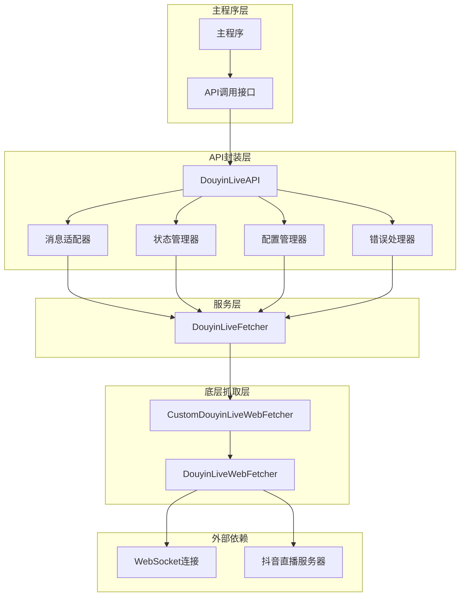
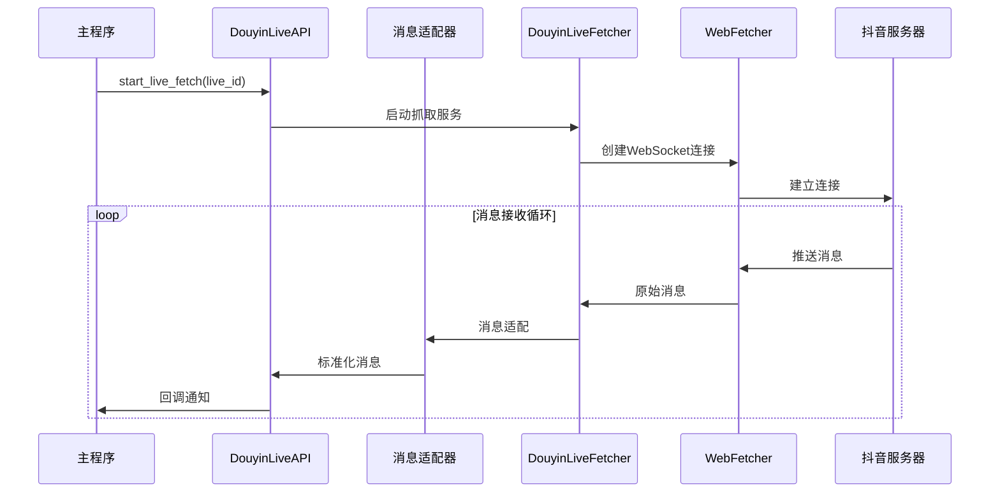
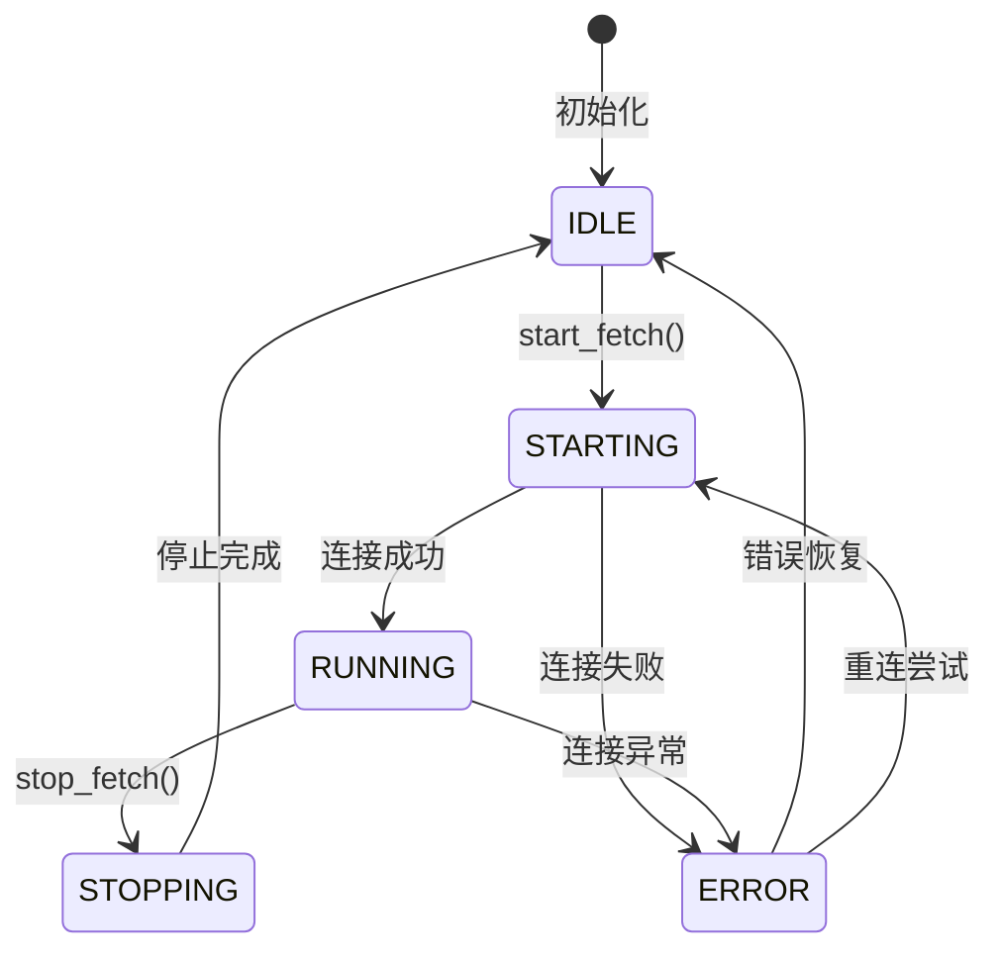

# DouyinLiveWebFetcher API封装架构设计文档

## 🏗️ 系统架构概览

### 整体架构图


### 分层架构设计

#### 1. API接口层 (API Interface Layer)
- **职责**: 提供统一的API接口，隐藏底层实现复杂性
- **组件**: `DouyinLiveAPI`
- **特性**: RESTful风格、标准化响应格式、异步支持

#### 2. 业务逻辑层 (Business Logic Layer)  
- **职责**: 处理业务逻辑、消息转换、状态管理
- **组件**: 消息适配器、状态管理器、配置管理器
- **特性**: 解耦业务逻辑、可扩展设计

#### 3. 服务层 (Service Layer)
- **职责**: 封装底层抓取服务，提供高级抽象
- **组件**: `DouyinLiveFetcher`
- **特性**: 线程安全、资源管理、生命周期控制

#### 4. 抓取层 (Fetcher Layer)
- **职责**: 实际的WebSocket连接和消息抓取
- **组件**: `CustomDouyinLiveWebFetcher`、`DouyinLiveWebFetcher`
- **特性**: 协议解析、连接管理、消息解码

## 📋 核心组件设计

### 1. DouyinLiveAPI (主API接口)

```python
class DouyinLiveAPI:
    """
    抖音直播API主接口类
    提供统一的API调用入口
    """
    
    def __init__(self, config: Optional[FetcherConfig] = None):
        """初始化API实例"""
        
    async def start_live_fetch(self, live_id: str, **kwargs) -> APIResponse:
        """启动直播抓取"""
        
    async def stop_live_fetch(self, live_id: str) -> APIResponse:
        """停止直播抓取"""
        
    async def get_live_status(self, live_id: str) -> APIResponse:
        """获取直播状态"""
        
    async def get_live_info(self, live_id: str) -> APIResponse:
        """获取直播信息"""
        
    def set_message_handler(self, handler: Callable) -> None:
        """设置消息处理器"""
        
    def set_status_handler(self, handler: Callable) -> None:
        """设置状态变化处理器"""
```

### 2. 标准化数据模型

#### 消息数据模型
```python
@dataclass
class LiveMessage:
    """直播消息标准格式"""
    message_id: str          # 消息唯一ID
    message_type: str        # 消息类型: chat/gift/like/member/follow
    live_id: str            # 直播间ID
    user_id: str            # 用户ID
    user_name: str          # 用户昵称
    content: Any            # 消息内容
    timestamp: float        # 时间戳
    extra_data: Dict[str, Any] = field(default_factory=dict)  # 扩展数据

@dataclass
class ChatMessage(LiveMessage):
    """聊天消息"""
    content: str            # 聊天内容
    
@dataclass  
class GiftMessage(LiveMessage):
    """礼物消息"""
    gift_name: str          # 礼物名称
    gift_count: int         # 礼物数量
    gift_value: Optional[int] = None  # 礼物价值

@dataclass
class LikeMessage(LiveMessage):
    """点赞消息"""
    like_count: int         # 点赞数量

@dataclass
class MemberMessage(LiveMessage):
    """进场消息"""
    action: str             # 动作: enter/leave
    gender: str             # 性别: 男/女/未知
```

#### API响应模型
```python
@dataclass
class APIResponse:
    """API标准响应格式"""
    success: bool           # 是否成功
    code: int              # 响应代码
    message: str           # 响应消息
    data: Any = None       # 响应数据
    timestamp: float = field(default_factory=time.time)  # 响应时间
    
    @classmethod
    def success_response(cls, data: Any = None, message: str = "操作成功") -> 'APIResponse':
        return cls(success=True, code=200, message=message, data=data)
    
    @classmethod
    def error_response(cls, code: int, message: str, data: Any = None) -> 'APIResponse':
        return cls(success=False, code=code, message=message, data=data)
```

### 3. 配置管理系统

```python
@dataclass
class FetcherConfig:
    """抓取器配置"""
    # 连接配置
    connect_timeout: int = 30           # 连接超时(秒)
    read_timeout: int = 60             # 读取超时(秒)
    reconnect_interval: int = 5         # 重连间隔(秒)
    max_reconnect_times: int = 3        # 最大重连次数
    
    # 消息配置
    message_buffer_size: int = 1000     # 消息缓冲区大小
    message_batch_size: int = 10        # 批量处理消息数量
    message_process_interval: float = 0.1  # 消息处理间隔(秒)
    
    # 日志配置
    log_level: str = "INFO"            # 日志级别
    log_file: Optional[str] = None     # 日志文件路径
    log_max_size: int = 10 * 1024 * 1024  # 日志文件最大大小(字节)
    
    # 性能配置
    enable_message_cache: bool = True   # 是否启用消息缓存
    cache_expire_time: int = 300       # 缓存过期时间(秒)
    max_memory_usage: int = 100 * 1024 * 1024  # 最大内存使用(字节)
```

### 4. 错误处理系统

```python
class FetcherError(Exception):
    """抓取器基础异常"""
    def __init__(self, code: str, message: str, details: Dict = None):
        self.code = code
        self.message = message
        self.details = details or {}
        super().__init__(f"[{code}] {message}")

class ConnectionError(FetcherError):
    """连接异常"""
    pass

class AuthenticationError(FetcherError):
    """认证异常"""
    pass

class ParseError(FetcherError):
    """解析异常"""
    pass

class ConfigError(FetcherError):
    """配置异常"""
    pass

# 错误代码定义
class ErrorCodes:
    # 连接相关
    CONNECTION_FAILED = "E001"
    CONNECTION_TIMEOUT = "E002"
    CONNECTION_LOST = "E003"
    
    # 认证相关
    AUTH_FAILED = "E101"
    INVALID_LIVE_ID = "E102"
    
    # 解析相关
    PARSE_MESSAGE_FAILED = "E201"
    INVALID_MESSAGE_FORMAT = "E202"
    
    # 配置相关
    INVALID_CONFIG = "E301"
    MISSING_REQUIRED_PARAM = "E302"
```

## 🔄 数据流设计

### 消息处理流程


### 状态管理流程


## 🔧 接口契约定义

### 1. 核心API接口

#### 启动抓取接口
```python
POST /api/live/start
Content-Type: application/json

Request:
{
    "live_id": "163823390463",
    "config": {
        "reconnect_interval": 5,
        "max_reconnect_times": 3
    }
}

Response:
{
    "success": true,
    "code": 200,
    "message": "抓取启动成功",
    "data": {
        "live_id": "163823390463",
        "status": "starting",
        "start_time": 1642781234.567
    },
    "timestamp": 1642781234.567
}
```

#### 状态查询接口
```python
GET /api/live/status/{live_id}

Response:
{
    "success": true,
    "code": 200,
    "message": "状态查询成功",
    "data": {
        "live_id": "163823390463",
        "status": "running",
        "room_id": "7234567890123456789",
        "start_time": 1642781234.567,
        "message_count": 1250,
        "last_message_time": 1642781834.567,
        "connection_info": {
            "connected": true,
            "reconnect_count": 0
        }
    },
    "timestamp": 1642781834.567
}
```

### 2. 消息回调接口

```python
# 消息回调函数签名
def message_callback(message: LiveMessage) -> None:
    """
    消息回调处理函数
    
    Args:
        message: 标准化的直播消息对象
    """
    pass

# 状态变化回调函数签名  
def status_callback(live_id: str, old_status: str, new_status: str, extra_info: Dict) -> None:
    """
    状态变化回调处理函数
    
    Args:
        live_id: 直播间ID
        old_status: 旧状态
        new_status: 新状态
        extra_info: 额外信息
    """
    pass
```

## 🚀 性能优化设计

### 1. 异步处理架构
- **异步API**: 使用asyncio实现非阻塞API调用
- **消息队列**: 使用队列缓冲高频消息
- **批量处理**: 批量处理消息提高效率

### 2. 内存管理策略
- **对象池**: 复用消息对象减少GC压力
- **缓存策略**: LRU缓存常用数据
- **内存监控**: 实时监控内存使用情况

### 3. 连接优化
- **连接复用**: 复用WebSocket连接
- **心跳机制**: 定期心跳保持连接活跃
- **智能重连**: 指数退避重连策略

## 🔒 安全性设计

### 1. 输入验证
- **参数校验**: 严格校验所有输入参数
- **SQL注入防护**: 参数化查询
- **XSS防护**: 输出内容转义

### 2. 错误处理
- **敏感信息保护**: 错误信息不泄露敏感数据
- **异常捕获**: 全局异常处理机制
- **日志脱敏**: 日志中敏感信息脱敏

### 3. 资源保护
- **速率限制**: API调用频率限制
- **资源隔离**: 不同直播间资源隔离
- **超时控制**: 所有操作设置合理超时

## 📊 监控和日志设计

### 1. 性能监控指标
- **API响应时间**: 平均响应时间、P99响应时间
- **消息处理速率**: 每秒处理消息数量
- **内存使用率**: 实时内存使用情况
- **CPU使用率**: 实时CPU使用情况
- **连接状态**: WebSocket连接健康状态

### 2. 业务监控指标
- **活跃直播间数量**: 当前正在抓取的直播间数量
- **消息类型分布**: 各类型消息的数量分布
- **错误率统计**: 各类错误的发生频率
- **重连成功率**: 断线重连的成功率

### 3. 日志设计
```python
# 日志格式示例
{
    "timestamp": "2025-01-21T10:30:45.123Z",
    "level": "INFO",
    "logger": "douyin_live_api",
    "message": "直播抓取启动成功",
    "context": {
        "live_id": "163823390463",
        "room_id": "7234567890123456789",
        "operation": "start_fetch",
        "duration_ms": 156
    },
    "trace_id": "abc123def456"
}
```

## 🧪 测试策略

### 1. 单元测试
- **API接口测试**: 测试所有API接口的正确性
- **消息处理测试**: 测试各类消息的解析和转换
- **状态管理测试**: 测试状态机的正确转换
- **错误处理测试**: 测试异常情况的处理

### 2. 集成测试
- **端到端测试**: 完整的抓取流程测试
- **并发测试**: 多直播间同时抓取测试
- **压力测试**: 高频消息处理能力测试
- **稳定性测试**: 长时间运行稳定性测试

### 3. 性能测试
- **响应时间测试**: API响应时间基准测试
- **吞吐量测试**: 消息处理吞吐量测试
- **内存泄漏测试**: 长时间运行内存使用测试
- **资源使用测试**: CPU、内存使用率测试

---

**文档状态**: 架构设计完成
**创建时间**: 2025-01-21
**版本**: v1.0
**审核状态**: 待审核