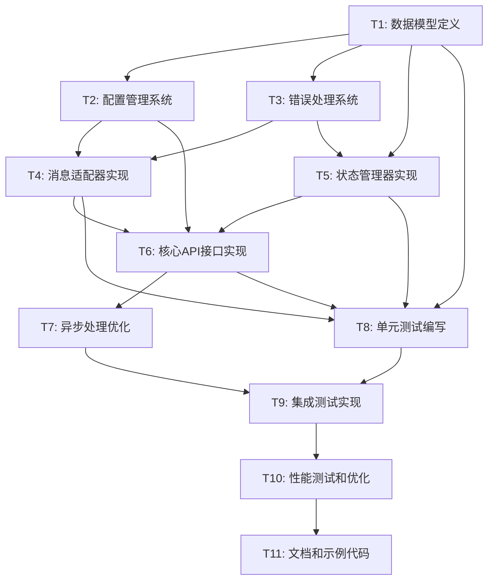

# DouyinLiveWebFetcher API封装原子任务拆分文档

## 📋 任务概览

基于架构设计文档，将API封装工作拆分为以下原子任务，确保每个任务都是独立、可测试、可验证的。

## 🎯 任务依赖关系图

## 📝 原子任务详细定义

### T1: 数据模型定义
**任务ID**: T1  
**优先级**: 高  
**预估工时**: 2小时  

#### 输入约束
- 架构设计文档中的数据模型规范
- 现有DouyinLiveWebFetcher的消息格式

#### 输出约束
- `models.py` 文件，包含所有数据模型类
- 数据模型单元测试
- 模型验证和序列化方法

#### 实现约束
- 使用Python dataclass装饰器
- 支持JSON序列化/反序列化
- 包含数据验证逻辑
- 遵循类型提示规范

#### 验收标准
- [ ] 所有消息类型模型定义完整
- [ ] API响应模型定义完整
- [ ] 配置模型定义完整
- [ ] 错误模型定义完整
- [ ] 所有模型支持JSON序列化
- [ ] 单元测试覆盖率 > 90%

#### 依赖关系
- **前置依赖**: 无
- **后置任务**: T2, T3, T4, T5, T8

---

### T2: 配置管理系统
**任务ID**: T2  
**优先级**: 高  
**预估工时**: 3小时  

#### 输入约束
- T1的数据模型定义
- 架构设计中的配置需求

#### 输出约束
- `config.py` 文件，包含配置管理类
- 配置文件加载和验证逻辑
- 默认配置定义

#### 实现约束
- 支持JSON/YAML配置文件
- 支持环境变量覆盖
- 配置参数类型验证
- 配置热重载支持

#### 验收标准
- [ ] 配置类定义完整
- [ ] 支持多种配置源
- [ ] 配置验证逻辑正确
- [ ] 默认配置合理
- [ ] 配置变更通知机制
- [ ] 单元测试覆盖率 > 85%

#### 依赖关系
- **前置依赖**: T1
- **后置任务**: T4, T6

---

### T3: 错误处理系统
**任务ID**: T3  
**优先级**: 高  
**预估工时**: 2.5小时  

#### 输入约束
- T1的错误模型定义
- 架构设计中的错误处理规范

#### 输出约束
- `exceptions.py` 文件，包含异常类定义
- 错误处理装饰器和工具函数
- 错误码定义和映射

#### 实现约束
- 继承Python标准异常类
- 支持错误链追踪
- 错误信息国际化支持
- 敏感信息脱敏处理

#### 验收标准
- [ ] 异常类层次结构清晰
- [ ] 错误码定义完整
- [ ] 错误处理装饰器功能正确
- [ ] 错误信息格式统一
- [ ] 敏感信息保护到位
- [ ] 单元测试覆盖率 > 90%

#### 依赖关系
- **前置依赖**: T1
- **后置任务**: T4, T5, T6

---

### T4: 消息适配器实现
**任务ID**: T4  
**优先级**: 高  
**预估工时**: 4小时  

#### 输入约束
- T1的消息模型定义
- T2的配置管理系统
- T3的错误处理系统
- 现有DouyinLiveWebFetcher的消息格式

#### 输出约束
- `adapters.py` 文件，包含消息适配器类
- 消息转换和标准化逻辑
- 消息过滤和验证机制

#### 实现约束
- 支持所有消息类型转换
- 消息去重和排序
- 批量消息处理
- 异步消息处理支持

#### 验收标准
- [ ] 所有消息类型适配器实现
- [ ] 消息转换准确性 > 99%
- [ ] 消息处理性能满足要求
- [ ] 异常消息处理正确
- [ ] 消息过滤逻辑正确
- [ ] 单元测试覆盖率 > 95%

#### 依赖关系
- **前置依赖**: T1, T2, T3
- **后置任务**: T6, T8

---

### T5: 状态管理器实现
**任务ID**: T5  
**优先级**: 高  
**预估工时**: 3小时  

#### 输入约束
- T1的状态模型定义
- T3的错误处理系统
- 架构设计中的状态机规范

#### 输出约束
- `state_manager.py` 文件，包含状态管理类
- 状态转换逻辑和验证
- 状态持久化机制

#### 实现约束
- 线程安全的状态管理
- 状态转换事件通知
- 状态历史记录
- 状态恢复机制

#### 验收标准
- [ ] 状态机实现正确
- [ ] 状态转换逻辑无误
- [ ] 线程安全性验证通过
- [ ] 状态事件通知正常
- [ ] 状态持久化功能正常
- [ ] 单元测试覆盖率 > 90%

#### 依赖关系
- **前置依赖**: T1, T3
- **后置任务**: T6, T8

---

### T6: 核心API接口实现
**任务ID**: T6  
**优先级**: 高  
**预估工时**: 5小时  

#### 输入约束
- T2的配置管理系统
- T4的消息适配器
- T5的状态管理器
- 架构设计中的API接口规范

#### 输出约束
- `api.py` 文件，包含主API类
- 所有核心API方法实现
- API文档和使用示例

#### 实现约束
- RESTful API设计风格
- 统一的响应格式
- 参数验证和错误处理
- API版本管理支持

#### 验收标准
- [ ] 所有API接口实现完整
- [ ] API响应格式统一
- [ ] 参数验证逻辑正确
- [ ] 错误处理机制完善
- [ ] API性能满足要求
- [ ] 单元测试覆盖率 > 95%

#### 依赖关系
- **前置依赖**: T2, T4, T5
- **后置任务**: T7, T8

---

### T7: 异步处理优化
**任务ID**: T7  
**优先级**: 中  
**预估工时**: 3小时  

#### 输入约束
- T6的核心API实现
- 架构设计中的性能优化要求

#### 输出约束
- 异步API方法实现
- 消息队列和批处理逻辑
- 性能监控和指标收集

#### 实现约束
- 使用asyncio异步框架
- 消息队列缓冲机制
- 连接池管理
- 内存使用优化

#### 验收标准
- [ ] 异步API功能正确
- [ ] 消息处理性能提升 > 50%
- [ ] 内存使用稳定
- [ ] 并发处理能力验证
- [ ] 性能监控指标正常
- [ ] 单元测试覆盖率 > 85%

#### 依赖关系
- **前置依赖**: T6
- **后置任务**: T9, T10

---

### T8: 单元测试编写
**任务ID**: T8  
**优先级**: 高  
**预估工时**: 4小时  

#### 输入约束
- T1-T6的所有实现代码
- 测试框架和工具选择

#### 输出约束
- 完整的单元测试套件
- 测试覆盖率报告
- 测试数据和Mock对象

#### 实现约束
- 使用pytest测试框架
- Mock外部依赖
- 参数化测试用例
- 测试数据管理

#### 验收标准
- [ ] 所有模块单元测试完整
- [ ] 测试覆盖率 > 90%
- [ ] 测试用例通过率 100%
- [ ] 边界条件测试覆盖
- [ ] 异常情况测试覆盖
- [ ] 测试执行时间 < 30秒

#### 依赖关系
- **前置依赖**: T1, T4, T5, T6
- **后置任务**: T9

---

### T9: 集成测试实现
**任务ID**: T9  
**优先级**: 中  
**预估工时**: 3小时  

#### 输入约束
- T7的异步处理优化
- T8的单元测试套件
- 真实的抖音直播环境

#### 输出约束
- 端到端集成测试
- 性能基准测试
- 稳定性测试套件

#### 实现约束
- 真实环境测试
- 多场景测试覆盖
- 自动化测试执行
- 测试结果分析

#### 验收标准
- [ ] 端到端测试通过
- [ ] 多直播间并发测试通过
- [ ] 长时间稳定性测试通过
- [ ] 异常恢复测试通过
- [ ] 性能基准达标
- [ ] 测试自动化程度 > 80%

#### 依赖关系
- **前置依赖**: T7, T8
- **后置任务**: T10

---

### T10: 性能测试和优化
**任务ID**: T10  
**优先级**: 中  
**预估工时**: 2小时  

#### 输入约束
- T9的集成测试结果
- 性能要求和基准

#### 输出约束
- 性能测试报告
- 性能优化建议
- 优化后的代码实现

#### 实现约束
- 压力测试和负载测试
- 内存和CPU使用分析
- 瓶颈识别和优化
- 性能监控集成

#### 验收标准
- [ ] API响应时间 < 100ms
- [ ] 消息处理延迟 < 50ms
- [ ] 内存使用 < 50MB
- [ ] CPU使用率 < 10%
- [ ] 并发处理能力达标
- [ ] 性能优化效果明显

#### 依赖关系
- **前置依赖**: T9
- **后置任务**: T11

---

### T11: 文档和示例代码
**任务ID**: T11  
**优先级**: 低  
**预估工时**: 2小时  

#### 输入约束
- 所有实现完成的代码
- API接口规范
- 测试用例和结果

#### 输出约束
- API使用文档
- 代码示例和教程
- 部署和配置指南

#### 实现约束
- Markdown格式文档
- 可执行的示例代码
- 详细的配置说明
- 常见问题解答

#### 验收标准
- [ ] API文档完整准确
- [ ] 示例代码可运行
- [ ] 配置指南清晰
- [ ] 文档格式规范
- [ ] 用户反馈良好
- [ ] 文档维护机制建立

#### 依赖关系
- **前置依赖**: T10
- **后置任务**: 无

## 📊 工时估算和关键路径

### 总工时估算
- **总工时**: 33.5小时
- **关键路径**: T1 → T3 → T4 → T6 → T7 → T9 → T10 → T11
- **关键路径工时**: 21.5小时
- **并行任务**: T2可与T3并行，T8可与T7并行

### 里程碑计划
- **第1天**: 完成T1, T2, T3 (基础组件)
- **第2天**: 完成T4, T5 (核心逻辑)
- **第3天**: 完成T6, T7 (API接口)
- **第4天**: 完成T8, T9 (测试验证)
- **第5天**: 完成T10, T11 (优化文档)

## 🚨 风险评估

### 高风险任务
- **T4 (消息适配器)**: 消息格式复杂，解析容易出错
- **T6 (核心API)**: 接口设计复杂，集成难度高
- **T9 (集成测试)**: 依赖外部环境，测试不稳定

### 风险缓解措施
1. **T4风险**: 提前准备测试数据，逐步验证消息解析
2. **T6风险**: 分阶段实现，先实现基础功能再扩展
3. **T9风险**: 准备Mock环境，减少外部依赖

## 📋 质量保证措施

### 代码质量
- 代码审查机制
- 静态代码分析
- 编码规范检查
- 文档字符串完整性

### 测试质量
- 测试覆盖率要求
- 测试用例评审
- 自动化测试执行
- 性能基准验证

### 交付质量
- 功能完整性检查
- 性能指标验证
- 文档准确性审核
- 用户体验测试

---

**文档状态**: 任务拆分完成
**创建时间**: 2025-01-21
**预计完成时间**: 2025-01-26
**负责人**: AI Assistant