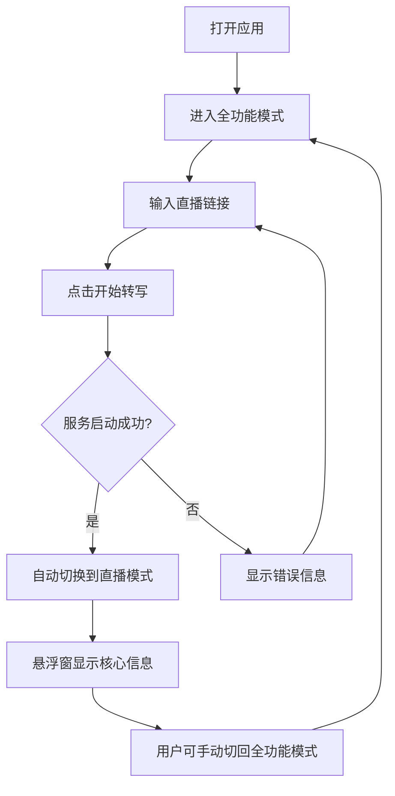
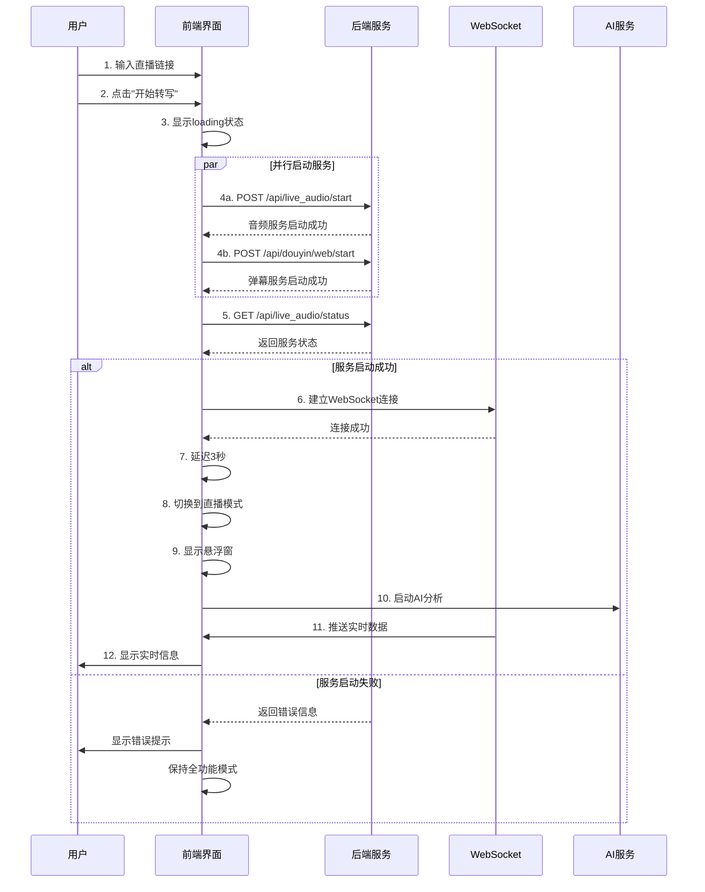
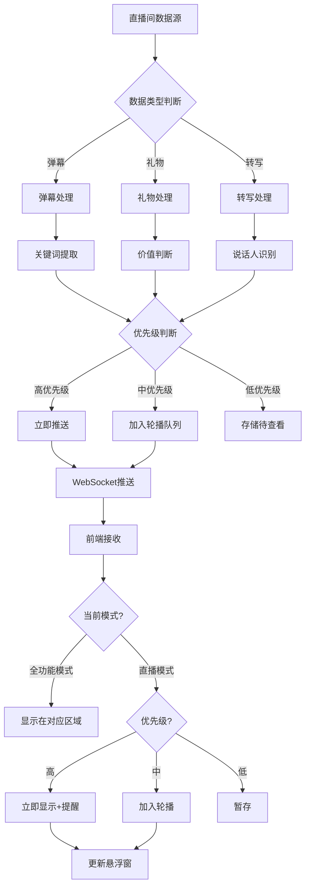

# 直播控制台双模式设计文档

> **文档版本**: v1.0  
> **创建日期**: 2025-11-15  
> **审查人**: 叶维哲  
> **适用产品**: 提猫直播助手（TalkingCat）

---

## 📋 文档概述

本文档详细描述提猫直播助手的直播控制台双模式设计，包括全功能模式与直播模式的界面布局、交互逻辑、API接口规范以及信息优先级管理系统。

---

## 1. 功能概述

### 1.1 双模式介绍

提猫直播助手提供两种操作模式，满足主播在不同场景下的使用需求：

#### 🖥️ 全功能模式（Full Mode）
- **定义**: 完整的桌面应用界面，提供所有功能和详细信息展示
- **使用场景**: 
  - 直播准备阶段：配置参数、预览效果
  - 直播结束后：查看数据分析、生成报告
  - 调试和设置：管理热词、模型设置等
- **界面特点**: 四宫格布局，包含实时转写、AI分析、话术建议、氛围监测等多个功能区

#### 📱 直播模式（Live Mode）
- **定义**: 极简悬浮窗模式，只显示核心信息，最小化遮挡
- **使用场景**:
  - 正式直播中：主播需要全屏直播软件（OBS/抖音直播伴侣）
  - 多屏幕操作：悬浮窗可拖拽到副屏幕
  - 移动设备：通过远程访问查看关键信息
- **界面特点**: 
  - 小窗口可拖拽到任意位置
  - 半透明不遮挡关键区域
  - 智能信息轮播展示

### 1.2 使用场景说明

| 场景 | 推荐模式 | 说明 |
|------|---------|------|
| **直播前准备** | 全功能模式 | 设置直播参数、预览界面 |
| **正式直播中** | 直播模式 | 自动切换，最小化干扰 |
| **多任务操作** | 直播模式 | 悬浮窗方便随时查看关键信息 |
| **数据分析** | 全功能模式 | 查看完整的实时数据和历史记录 |
| **复盘总结** | 全功能模式 | 查看报告、导出数据 |

### 1.3 核心价值

✅ **最小化干扰**: 直播模式下悬浮窗体积小、半透明，不影响直播画面  
✅ **智能提醒**: 根据优先级自动推送重要信息（大额礼物、冷场提醒等）  
✅ **快速响应**: 一键复制话术，快速应对直播间突发情况  
✅ **灵活切换**: 随时在两种模式间切换，适应不同工作流程  
✅ **信息聚焦**: 轮播显示关键信息，避免信息过载  

---

## 2. 模式设计

### 2.1 全功能模式

#### 2.1.1 界面布局说明

全功能模式采用经典的四宫格布局，参考现有`LiveConsolePage.tsx`实现：

```
┌────────────────────────────────────────────────────────────────┐
│  顶部控制栏                                                      │
│  [直播地址输入框] [开始转写] [停止] [模式切换按钮]              │
├──────────────────────────┬─────────────────────────────────────┤
│ 1️⃣ 实时语音转写          │ 2️⃣ 智能话术建议                     │
│ - 实时字幕滚动显示        │ - AI生成话术（3种风格）             │
│ - 说话人标注【主播/嘉宾】│ - 针对性回应建议                    │
│                         │ - 一键复制功能                      │
│                           │ - 历史话术记录                      │
├──────────────────────────┼─────────────────────────────────────┤
│ 3️⃣ 直播间互动分析        │ 4️⃣ 主播画像与氛围                   │
│ - 实时弹幕流              │ - 风格画像（StyleProfile）          │
│ - 礼物统计                │ - 直播间氛围（Vibe）                │
│ - 关键问题提取            │ - 情绪分析                          │
│ - AI实时分析              │ - 互动建议                          │
└──────────────────────────┴─────────────────────────────────────┘
│  底部状态栏                                                      │
│  [在线人数] [礼物价值] [互动率] [录制状态] [持久化开关]         │
└────────────────────────────────────────────────────────────────┘
```

#### 2.1.2 功能区域划分

**区域1: 实时语音转写**
- **数据源**: `/api/live_audio/ws` (WebSocket)
- **显示内容**:
  - 实时字幕文本（带时间戳）
  - 说话人标注（【主播】/【嘉宾】） (1.2.0版本实现)
- **交互功能**:

**区域2: 智能话术建议**
- **数据源**: `/api/ai/live/answers` (POST)
- **显示内容**:
  - 根据主播直播风格的结合3种风格的话术（暖心/直接/幽默）
  - 针对选中问题的回应
  - 生成时间和上下文说明
- **交互功能**:
  - 选择弹幕问题自动生成回应
  - 一键复制话术
  - 历史话术查看

**区域3: 直播间互动分析**
- **数据源**: 
  - `/api/douyin/web/stream` (SSE) - 弹幕礼物流
  - `/api/ai/live/stream` (SSE) - AI分析结果
- **显示内容**:
  - 实时弹幕滚动
  - 礼物提醒（高亮大额礼物）
  - 关键问题自动提取
  - AI分析卡片（风险/建议/亮点）
- **交互功能**:
  - 过滤弹幕（关键词/用户）
  - 标记重点用户
  - 导出互动记录

**区域4: 主播画像与氛围**
- **数据源**: `/api/ai/live/stream` 中的 `style_profile` 和 `vibe`
- **显示内容**:
  - 主播风格画像（Persona、Tone、Tempo）中文显示
  - 直播间氛围评分
  - 观众情绪分析
  - 互动热度趋势图
- **交互功能**:
  - 查看风格建议
  - 氛围历史对比
  - 导出分析报告

#### 2.1.3 操作流程



### 2.2 直播模式

#### 2.2.1 悬浮窗设计原则

直播模式的核心是**极简悬浮窗**，设计遵循以下原则：

✅ **最小视觉干扰**: 半透明、圆角、柔和阴影  
✅ **关键信息优先**: 只显示最重要的实时信息  
✅ **快速交互**: 一键复制、快速切换  
✅ **灵活定位**: 可拖拽到任意位置，自动吸附边缘  
✅ **状态明确**: 清晰的视觉指示器显示当前信息类型  

#### 2.2.2 悬浮窗布局

```
┌──────────────────────────────────┐
│  [标题] 📊 AI分析        [×] [⇄] │  ← 标题栏（拖拽区域）
├──────────────────────────────────┤
│                                  │
│    [核心信息显示区域]             │  ← 主内容区
│    当前直播间氛围评分: 85/100     │
│    观众情绪: 积极 😊              │
│    建议: 继续保持互动频率          │
│                                  │
├──────────────────────────────────┤
│  [📋] ① ② ③               [更多]  │  ← 操作栏
└──────────────────────────────────┘

[📋] 复制按钮
① ② ③ 信息类型指示器（可点击切换）
  ① AI分析
  ② 话术生成
  ③ 直播间氛围
[更多] 展开完整信息
[×] 关闭悬浮窗
[⇄] 切换回全功能模式
```

#### 2.2.3 收起与展开状态

**收起状态（80px × 80px）**:
```
┌─────────┐
│         │
│   📊    │  ← 只显示图标
│   85    │  ← 关键数值
│         │
└─────────┘
```

**展开状态（320px × 240px）**:
- 显示完整信息
- 显示操作按钮
- 显示指示器

#### 2.2.4 交互方式

| 操作 | 触发方式 | 效果 |
|------|---------|------|
| **拖拽移动** | 按住标题栏拖动 | 悬浮窗跟随鼠标移动 |
| **展开/收起** | 点击悬浮窗主体 | 切换展开/收起状态 |
| **切换信息** | 点击底部指示器① ② ③ | 切换显示不同类型信息 |
| **复制内容** | 点击📋按钮 | 复制当前显示的文本到剪贴板 |
| **关闭悬浮窗** | 点击×按钮 | 隐藏悬浮窗（不停止服务） |
| **切换模式** | 点击⇄按钮 | 切换回全功能模式 |

### 2.3 模式切换逻辑

#### 2.3.1 自动切换（全功能→直播模式）

**触发条件**:
1. 用户点击"开始转写"按钮
2. 后端服务启动成功（音频拉流 + 弹幕抓取均正常）
3. WebSocket连接建立成功

**切换流程**:
```typescript
// 伪代码示例
async function handleStart() {
  setLoading(true);
  
  // 1. 启动后端服务
  const audioResult = await startLiveAudio(liveUrl);
  const douyinResult = await startDouyinWeb(liveUrl);
  
  // 2. 检查服务状态
  if (audioResult.success && douyinResult.success) {
    // 3. 建立WebSocket连接
    connectWebSocket();
    
    // 4. 延迟3秒后自动切换到直播模式
    setTimeout(() => {
      switchToLiveMode();
      showFloatingWindow();
    }, 3000);
  }
  
  setLoading(false);
}
```

**切换动画**:
- 全功能界面淡出（fade-out, 300ms）
- 悬浮窗淡入（fade-in, 300ms）
- 悬浮窗从屏幕中心缩放到默认位置

#### 2.3.2 手动切换（直播模式→全功能）

**触发方式**:
- 点击悬浮窗右上角⇄按钮
- 使用快捷键（Ctrl+Shift+F）

**切换效果**:
- 悬浮窗保留（作为辅助显示）
- 全功能界面显示在悬浮窗后面
- 用户可关闭悬浮窗或继续使用

#### 2.3.3 状态管理

使用Zustand管理模式状态：

```typescript
interface LiveModeStore {
  // 当前模式
  currentMode: 'full' | 'live';
  // 悬浮窗状态
  floatingWindow: {
    visible: boolean;
    expanded: boolean;
    position: { x: number; y: number };
    currentInfo: 'ai_analysis' | 'script' | 'vibe';
  };
  // 切换函数
  switchMode: (mode: 'full' | 'live') => void;
  toggleFloatingWindow: () => void;
  updateFloatingPosition: (x: number, y: number) => void;
}
```

---

## 3. 悬浮窗UI设计规范

### 3.1 悬浮窗尺寸规范

#### 3.1.1 标准尺寸

| 状态 | 宽度 | 高度 | 说明 |
|------|------|------|------|
| **收起** | 80px | 80px | 只显示图标和关键数值 |
| **展开（小）** | 280px | 200px | 移动端或小屏幕 |
| **展开（标准）** | 320px | 240px | 桌面端默认尺寸 |
| **展开（大）** | 400px | 320px | 信息量大时自动扩展 |

#### 3.1.2 最小尺寸限制

- 最小宽度: 280px（确保内容可读）
- 最小高度: 180px（确保按钮可点击）
- 最大宽度: 480px（避免遮挡过多内容）
- 最大高度: 600px（避免占据过多屏幕空间）

#### 3.1.3 响应式适配

根据屏幕尺寸自动调整：

```css
/* 小屏幕（<768px） */
@media (max-width: 768px) {
  .floating-window.expanded {
    width: 280px;
    height: 200px;
  }
}

/* 中等屏幕（768px-1024px） */
@media (min-width: 768px) and (max-width: 1024px) {
  .floating-window.expanded {
    width: 320px;
    height: 240px;
  }
}

/* 大屏幕（>1024px） */
@media (min-width: 1024px) {
  .floating-window.expanded {
    width: 360px;
    height: 280px;
  }
}
```

### 3.2 悬浮窗位置与拖拽

#### 3.2.1 默认初始位置

```typescript
const DEFAULT_POSITION = {
  // 优先显示在右下角
  x: window.innerWidth - 360,  // 距离右边缘20px
  y: window.innerHeight - 300, // 距离底部边缘20px
  
  // 备选位置（如果右下角被遮挡）
  fallback: {
    x: 20,  // 左上角
    y: 100
  }
};
```

#### 3.2.2 拖拽功能实现

使用原生JavaScript实现拖拽（参考mobile-prototype/monitor.html）：

```typescript
function initDrag(windowElement: HTMLElement) {
  let isDragging = false;
  let startX: number, startY: number;
  let initialX: number, initialY: number;
  
  // 鼠标按下
  windowElement.addEventListener('mousedown', (e) => {
    // 只允许在标题栏拖拽
    if (!(e.target as HTMLElement).closest('.title-bar')) return;
    
    isDragging = true;
    startX = e.clientX;
    startY = e.clientY;
    
    const rect = windowElement.getBoundingClientRect();
    initialX = rect.left;
    initialY = rect.top;
  });
  
  // 鼠标移动
  document.addEventListener('mousemove', (e) => {
    if (!isDragging) return;
    
    const deltaX = e.clientX - startX;
    const deltaY = e.clientY - startY;
    
    let newX = initialX + deltaX;
    let newY = initialY + deltaY;
    
    // 限制在屏幕内
    const maxX = window.innerWidth - windowElement.offsetWidth;
    const maxY = window.innerHeight - windowElement.offsetHeight;
    newX = Math.max(0, Math.min(newX, maxX));
    newY = Math.max(0, Math.min(newY, maxY));
    
    windowElement.style.left = newX + 'px';
    windowElement.style.top = newY + 'px';
  });
  
  // 鼠标释放
  document.addEventListener('mouseup', () => {
    if (isDragging) {
      isDragging = false;
      // 保存位置
      savePosition(windowElement);
    }
  });
}
```

#### 3.2.3 屏幕边缘吸附

释放鼠标时，如果悬浮窗距离屏幕边缘<30px，自动吸附：

```typescript
function snapToEdge(element: HTMLElement) {
  const rect = element.getBoundingClientRect();
  const SNAP_THRESHOLD = 30;
  
  let newX = rect.left;
  let newY = rect.top;
  
  // 左边缘吸附
  if (rect.left < SNAP_THRESHOLD) {
    newX = 0;
  }
  
  // 右边缘吸附
  if (window.innerWidth - rect.right < SNAP_THRESHOLD) {
    newX = window.innerWidth - rect.width;
  }
  
  // 上边缘吸附
  if (rect.top < SNAP_THRESHOLD) {
    newY = 0;
  }
  
  // 下边缘吸附
  if (window.innerHeight - rect.bottom < SNAP_THRESHOLD) {
    newY = window.innerHeight - rect.height;
  }
  
  // 平滑过渡到吸附位置
  element.style.transition = 'all 0.2s ease';
  element.style.left = newX + 'px';
  element.style.top = newY + 'px';
  
  setTimeout(() => {
    element.style.transition = '';
  }, 200);
}
```

#### 3.2.4 位置记忆功能

使用LocalStorage保存用户偏好位置：

```typescript
// 保存位置
function savePosition(element: HTMLElement) {
  const position = {
    x: element.offsetLeft,
    y: element.offsetTop
  };
  localStorage.setItem('floatingWindow_position', JSON.stringify(position));
}

// 加载位置
function loadPosition(): { x: number; y: number } | null {
  const saved = localStorage.getItem('floatingWindow_position');
  if (saved) {
    try {
      return JSON.parse(saved);
    } catch {
      return null;
    }
  }
  return null;
}

// 初始化时使用保存的位置
function initPosition(element: HTMLElement) {
  const saved = loadPosition();
  if (saved) {
    // 确保位置仍在屏幕内（屏幕尺寸可能变化）
    const maxX = window.innerWidth - element.offsetWidth;
    const maxY = window.innerHeight - element.offsetHeight;
    const x = Math.max(0, Math.min(saved.x, maxX));
    const y = Math.max(0, Math.min(saved.y, maxY));
    
    element.style.left = x + 'px';
    element.style.top = y + 'px';
  } else {
    // 使用默认位置
    element.style.left = DEFAULT_POSITION.x + 'px';
    element.style.top = DEFAULT_POSITION.y + 'px';
  }
}
```

### 3.3 悬浮窗样式参数

#### 3.3.1 半透明效果

```css
.floating-window {
  /* 半透明背景 */
  background: rgba(255, 255, 255, 0.95);
  backdrop-filter: blur(10px); /* 毛玻璃效果 */
  -webkit-backdrop-filter: blur(10px);
  
  /* 暗色模式 */
  &.dark-mode {
    background: rgba(26, 32, 44, 0.95);
  }
}
```

#### 3.3.2 圆角设计

```css
.floating-window {
  border-radius: 16px;
  overflow: hidden; /* 确保内容不超出圆角 */
  
  /* 收起状态圆角更大 */
  &.collapsed {
    border-radius: 50%; /* 圆形 */
  }
}
```

#### 3.3.3 阴影效果

```css
.floating-window {
  /* 柔和阴影 */
  box-shadow: 
    0 4px 6px rgba(0, 0, 0, 0.1),
    0 2px 4px rgba(0, 0, 0, 0.06),
    0 12px 24px rgba(0, 0, 0, 0.15);
  
  /* 悬停时阴影增强 */
  &:hover {
    box-shadow: 
      0 8px 12px rgba(0, 0, 0, 0.15),
      0 4px 8px rgba(0, 0, 0, 0.1),
      0 16px 32px rgba(0, 0, 0, 0.2);
  }
}
```

#### 3.3.4 动画过渡效果

```css
.floating-window {
  /* 位置和尺寸变化平滑过渡 */
  transition: 
    width 0.3s cubic-bezier(0.4, 0, 0.2, 1),
    height 0.3s cubic-bezier(0.4, 0, 0.2, 1),
    opacity 0.3s ease,
    transform 0.3s cubic-bezier(0.4, 0, 0.2, 1);
  
  /* 展开动画 */
  &.expanding {
    animation: expand 0.3s cubic-bezier(0.4, 0, 0.2, 1);
  }
  
  /* 收起动画 */
  &.collapsing {
    animation: collapse 0.3s cubic-bezier(0.4, 0, 0.2, 1);
  }
}

@keyframes expand {
  from {
    transform: scale(0.8);
    opacity: 0;
  }
  to {
    transform: scale(1);
    opacity: 1;
  }
}

@keyframes collapse {
  from {
    transform: scale(1);
    opacity: 1;
  }
  to {
    transform: scale(0.8);
    opacity: 0;
  }
}
```

### 3.4 信息显示区域

#### 3.4.1 核心信息区布局

```html
<div class="floating-window-content">
  <!-- 标题栏 -->
  <div class="title-bar">
    <span class="title-icon">📊</span>
    <span class="title-text">AI分析</span>
    <div class="title-actions">
      <button class="btn-switch" title="切换模式">⇄</button>
      <button class="btn-close" title="关闭">×</button>
    </div>
  </div>
  
  <!-- 主内容区 -->
  <div class="content-area">
    <div class="content-main">
      <!-- 动态内容 -->
    </div>
  </div>
  
  <!-- 操作按钮区 -->
  <div class="action-bar">
    <button class="btn-copy" title="复制">📋</button>
    <div class="indicators">
      <span class="indicator active" data-type="ai_analysis">①</span>
      <span class="indicator" data-type="script">②</span>
      <span class="indicator" data-type="vibe">③</span>
    </div>
    <button class="btn-more" title="更多">⋯</button>
  </div>
</div>
```

#### 3.4.2 信息类型对应内容

**① AI分析**:
```html
<div class="content-ai-analysis">
  <div class="metric">
    <span class="metric-label">氛围评分</span>
    <span class="metric-value">85/100</span>
  </div>
  <div class="metric">
    <span class="metric-label">观众情绪</span>
    <span class="metric-value">积极 😊</span>
  </div>
  <div class="suggestion">
    <p>💡 继续保持互动频率</p>
  </div>
</div>
```

**② 话术生成**:
```html
<div class="content-script">
  <div class="script-item">
    <span class="script-type">感谢</span>
    <p class="script-text">"感谢老板送的嘉年华，财运滚滚来！"</p>
  </div>
  <div class="script-meta">
    <span class="target-user">@用户A</span>
    <span class="priority high">高优先级</span>
  </div>
</div>
```

**③ 直播间氛围**:
```html
<div class="content-vibe">
  <div class="vibe-metric">
    <span class="label">在线人数</span>
    <span class="value">1,234 <span class="trend up">↑15%</span></span>
  </div>
  <div class="vibe-metric">
    <span class="label">互动率</span>
    <span class="value">8.5%</span>
  </div>
  <div class="vibe-metric">
    <span class="label">礼物价值</span>
    <span class="value">¥8,888</span>
  </div>
</div>
```

---

## 4. 信息优先级系统设计

### 4.1 优先级定义

信息优先级系统确保主播在直播时能第一时间看到最重要的信息，避免信息过载。

#### 4.1.1 高优先级（主动提醒）

**触发条件**:

| 事件类型 | 触发阈值 | 提醒方式 | 示例 |
|---------|---------|---------|------|
| **大额礼物** | ≥100元 | 立即显示+提示音 | "用户A送了嘉年华(¥3000)" |
| **关键问题** | 包含预设关键词 | 立即显示+高亮 | "主播这个多少钱？" |
| **冷场检测** | >30秒无互动 | 立即显示+建议 | "冷场35秒，建议：聊聊新品" |
| **异常情况** | 在线人数骤降>30% | 立即显示+警告 | "人数下降，请检查直播状态" |

**显示效果**:
- 悬浮窗自动展开（如果处于收起状态）
- 内容区背景高亮（红色/黄色）
- 播放提示音（可选）
- 震动提醒（移动设备）

**代码示例**:
```typescript
interface HighPriorityAlert {
  type: 'big_gift' | 'key_question' | 'silence' | 'anomaly';
  priority: 'high';
  content: string;
  timestamp: number;
  actions?: {
    label: string;
    callback: () => void;
  }[];
}

function handleHighPriorityAlert(alert: HighPriorityAlert) {
  // 1. 展开悬浮窗
  if (floatingWindow.collapsed) {
    floatingWindow.expand();
  }
  
  // 2. 显示alert内容
  floatingWindow.showAlert(alert);
  
  // 3. 播放提示音
  if (settings.soundEnabled) {
    playAlertSound(alert.type);
  }
  
  // 4. 震动提醒（移动端）
  if (isMobile && settings.vibrationEnabled) {
    navigator.vibrate([200, 100, 200]);
  }
  
  // 5. 自动消失或需要确认
  if (alert.type === 'key_question') {
    // 关键问题需要确认才消失
    floatingWindow.waitForUserAction();
  } else {
    // 其他类型10秒后自动消失
    setTimeout(() => {
      floatingWindow.clearAlert();
    }, 10000);
  }
}
```

#### 4.1.2 中优先级（悬浮显示）

**触发条件**:

| 事件类型 | 触发阈值 | 显示方式 | 示例 |
|---------|---------|---------|------|
| **高频关键词** | 5分钟内出现≥3次 | 加入轮播队列 | "价格"被提及5次 |
| **人数变化** | 变化幅度>10% | 加入轮播队列 | "在线人数增加15%" |
| **互动高峰** | 弹幕频率>平均2倍 | 加入轮播队列 | "当前互动非常活跃" |
| **话术建议** | AI生成新话术 | 加入轮播队列 | "针对XXX问题的回应" |

**显示效果**:
- 加入信息轮播队列
- 按时间顺序循环显示
- 用户可手动切换查看

#### 4.1.3 低优先级（可隐藏）

**触发条件**:

| 信息类型 | 更新频率 | 显示方式 | 示例 |
|---------|---------|---------|------|
| **详细数据** | 每分钟更新 | 仅在用户点击"更多"时显示 | 完整的数据分析表格 |
| **历史记录** | 实时更新 | 需要切换到全功能模式查看 | 历史弹幕记录 |
| **系统日志** | 实时更新 | 开发者模式可见 | 后端服务日志 |

### 4.2 优先级处理逻辑

#### 4.2.1 优先级队列管理

使用优先级队列数据结构：

```typescript
class PriorityQueue<T> {
  private items: Array<{ priority: number; data: T }> = [];
  
  enqueue(item: T, priority: number) {
    const queueItem = { priority, data: item };
    
    // 按优先级插入
    let added = false;
    for (let i = 0; i < this.items.length; i++) {
      if (queueItem.priority > this.items[i].priority) {
        this.items.splice(i, 0, queueItem);
        added = true;
        break;
      }
    }
    
    if (!added) {
      this.items.push(queueItem);
    }
  }
  
  dequeue(): T | undefined {
    return this.items.shift()?.data;
  }
  
  peek(): T | undefined {
    return this.items[0]?.data;
  }
  
  isEmpty(): boolean {
    return this.items.length === 0;
  }
}

// 使用示例
interface InfoItem {
  type: 'ai_analysis' | 'script' | 'vibe';
  priority: 'high' | 'medium' | 'low';
  content: any;
  timestamp: number;
}

const infoQueue = new PriorityQueue<InfoItem>();

// 添加高优先级信息
infoQueue.enqueue({
  type: 'script',
  priority: 'high',
  content: { line: '感谢老板送的礼物！' },
  timestamp: Date.now()
}, 3); // 优先级数值：高=3, 中=2, 低=1

// 添加中优先级信息
infoQueue.enqueue({
  type: 'vibe',
  priority: 'medium',
  content: { viewerCount: 1234, trend: 'up' },
  timestamp: Date.now()
}, 2);
```

#### 4.2.2 信息调度算法

```typescript
class InfoScheduler {
  private queue: PriorityQueue<InfoItem>;
  private currentInfo: InfoItem | null = null;
  private rotationTimer: number | null = null;
  
  constructor() {
    this.queue = new PriorityQueue<InfoItem>();
  }
  
  // 添加新信息
  addInfo(info: InfoItem) {
    const priorityValue = {
      'high': 3,
      'medium': 2,
      'low': 1
    }[info.priority];
    
    this.queue.enqueue(info, priorityValue);
    
    // 如果是高优先级，立即显示
    if (info.priority === 'high') {
      this.showImmediately(info);
    } else if (!this.currentInfo) {
      // 如果当前没有显示内容，开始轮播
      this.startRotation();
    }
  }
  
  // 立即显示（高优先级）
  private showImmediately(info: InfoItem) {
    // 停止当前轮播
    if (this.rotationTimer) {
      clearTimeout(this.rotationTimer);
    }
    
    // 显示高优先级信息
    this.currentInfo = info;
    this.displayInfo(info);
    
    // 10秒后恢复轮播
    this.rotationTimer = window.setTimeout(() => {
      this.startRotation();
    }, 10000);
  }
  
  // 开始轮播
  private startRotation() {
    if (this.queue.isEmpty()) {
      this.currentInfo = null;
      return;
    }
    
    // 显示队列中下一个信息
    const nextInfo = this.queue.dequeue();
    if (nextInfo) {
      this.currentInfo = nextInfo;
      this.displayInfo(nextInfo);
      
      // 5秒后显示下一个
      this.rotationTimer = window.setTimeout(() => {
        // 将当前信息重新加入队列（循环显示）
        if (this.currentInfo && this.currentInfo.priority !== 'high') {
          this.addInfo(this.currentInfo);
        }
        this.startRotation();
      }, 5000);
    }
  }
  
  // 显示信息
  private displayInfo(info: InfoItem) {
    // 更新UI
    floatingWindow.setContent(info.type, info.content);
    floatingWindow.setActiveIndicator(info.type);
  }
  
  // 停止轮播
  stopRotation() {
    if (this.rotationTimer) {
      clearTimeout(this.rotationTimer);
      this.rotationTimer = null;
    }
  }
}
```

---

## 5. 信息轮播显示机制

### 5.1 轮播规则

#### 5.1.1 轮播间隔

- **默认间隔**: 5秒
- **可调整范围**: 3-10秒
- **自适应**: 根据信息内容长度自动调整

```typescript
interface RotationConfig {
  defaultInterval: number;  // 5000ms
  minInterval: number;      // 3000ms
  maxInterval: number;      // 10000ms
  adaptiveEnabled: boolean; // 自适应开关
}

function calculateInterval(content: string, config: RotationConfig): number {
  if (!config.adaptiveEnabled) {
    return config.defaultInterval;
  }
  
  // 根据内容长度计算阅读时间
  const wordsCount = content.length;
  const readingTime = Math.ceil(wordsCount / 10) * 1000; // 假设每秒读10个字
  
  // 限制在min和max之间
  return Math.max(
    config.minInterval,
    Math.min(readingTime, config.maxInterval)
  );
}
```

#### 5.1.2 信息类型顺序

固定轮播顺序：① AI分析 → ② 话术生成 → ③ 直播间氛围

```typescript
const ROTATION_ORDER: InfoType[] = [
  'ai_analysis',
  'script',
  'vibe'
];

class RotationController {
  private currentIndex: number = 0;
  private paused: boolean = false;
  
  getNextType(): InfoType {
    if (this.paused) {
      return ROTATION_ORDER[this.currentIndex];
    }
    
    this.currentIndex = (this.currentIndex + 1) % ROTATION_ORDER.length;
    return ROTATION_ORDER[this.currentIndex];
  }
  
  pause() {
    this.paused = true;
  }
  
  resume() {
    this.paused = false;
  }
  
  jumpTo(type: InfoType) {
    const index = ROTATION_ORDER.indexOf(type);
    if (index !== -1) {
      this.currentIndex = index;
      this.paused = true; // 手动切换时暂停自动轮播
    }
  }
}
```

#### 5.1.3 循环播放机制

```typescript
class CarouselManager {
  private items: Map<InfoType, any> = new Map();
  private controller: RotationController;
  private timer: number | null = null;
  
  constructor() {
    this.controller = new RotationController();
  }
  
  start() {
    this.rotate();
  }
  
  private rotate() {
    // 获取下一个类型
    const nextType = this.controller.getNextType();
    
    // 获取该类型的最新数据
    const data = this.items.get(nextType);
    
    if (data) {
      // 显示数据
      this.display(nextType, data);
      
      // 计算下一次轮播的间隔
      const interval = calculateInterval(
        JSON.stringify(data),
        rotationConfig
      );
      
      // 设置定时器
      this.timer = window.setTimeout(() => {
        this.rotate();
      }, interval);
    }
  }
  
  updateData(type: InfoType, data: any) {
    this.items.set(type, data);
  }
  
  stop() {
    if (this.timer) {
      clearTimeout(this.timer);
      this.timer = null;
    }
  }
  
  private display(type: InfoType, data: any) {
    floatingWindow.setContent(type, data);
    floatingWindow.setActiveIndicator(type);
  }
}
```

### 5.2 手动切换

#### 5.2.1 指示器交互

```html
<div class="indicators">
  <button 
    class="indicator" 
    data-type="ai_analysis"
    data-label="AI分析"
    @click="switchTo('ai_analysis')"
  >
    <span class="indicator-dot"></span>
    <span class="indicator-label">①</span>
  </button>
  
  <button 
    class="indicator" 
    data-type="script"
    data-label="话术"
    @click="switchTo('script')"
  >
    <span class="indicator-dot"></span>
    <span class="indicator-label">②</span>
  </button>
  
  <button 
    class="indicator" 
    data-type="vibe"
    data-label="氛围"
    @click="switchTo('vibe')"
  >
    <span class="indicator-dot"></span>
    <span class="indicator-label">③</span>
  </button>
</div>
```

```css
.indicator {
  position: relative;
  padding: 8px;
  border: none;
  background: transparent;
  cursor: pointer;
  transition: all 0.3s ease;
}

.indicator-dot {
  display: inline-block;
  width: 8px;
  height: 8px;
  border-radius: 50%;
  background: rgba(148, 163, 184, 0.5);
  transition: all 0.3s ease;
}

.indicator.active .indicator-dot {
  background: #a855f7;
  box-shadow: 0 0 8px rgba(168, 85, 247, 0.6);
}

.indicator:hover .indicator-dot {
  transform: scale(1.2);
}

.indicator-label {
  position: absolute;
  bottom: -20px;
  left: 50%;
  transform: translateX(-50%);
  font-size: 10px;
  color: rgba(148, 163, 184, 0.7);
  opacity: 0;
  transition: opacity 0.3s ease;
}

.indicator:hover .indicator-label {
  opacity: 1;
}
```

#### 5.2.2 切换逻辑

```typescript
function switchTo(type: InfoType) {
  // 1. 暂停自动轮播
  carousel.stop();
  controller.jumpTo(type);
  
  // 2. 更新UI
  floatingWindow.setContent(type, carousel.getData(type));
  floatingWindow.setActiveIndicator(type);
  
  // 3. 10秒后恢复自动轮播
  setTimeout(() => {
    controller.resume();
    carousel.start();
  }, 10000);
}
```

#### 5.2.3 键盘快捷键

```typescript
document.addEventListener('keydown', (e) => {
  // Ctrl + 1/2/3 切换信息类型
  if (e.ctrlKey && !e.shiftKey && !e.altKey) {
    switch(e.key) {
      case '1':
        switchTo('ai_analysis');
        break;
      case '2':
        switchTo('script');
        break;
      case '3':
        switchTo('vibe');
        break;
    }
  }
  
  // 空格键暂停/恢复轮播
  if (e.key === ' ' && floatingWindow.isFocused()) {
    e.preventDefault();
    if (carousel.isPaused()) {
      carousel.start();
    } else {
      carousel.stop();
    }
  }
});
```

### 5.3 信息内容结构

#### 5.3.1 AI分析内容

```typescript
interface AIAnalysisContent {
  // 氛围评分 (0-100)
  vibeScore: number;
  
  // 观众情绪
  audienceEmotion: {
    primary: '积极' | '中性' | '消极';
    emoji: string;
    confidence: number;
  };
  
  // 互动建议
  suggestions: Array<{
    type: '继续' | '调整' | '警告';
    text: string;
    icon: string;
  }>;
  
  // 时间戳
  timestamp: number;
}

// 渲染示例
function renderAIAnalysis(content: AIAnalysisContent): string {
  return `
    <div class="ai-analysis-content">
      <div class="score-display">
        <div class="score-circle" style="--score: ${content.vibeScore}">
          <span class="score-value">${content.vibeScore}</span>
        </div>
        <span class="score-label">氛围评分</span>
      </div>
      
      <div class="emotion-display">
        <span class="emotion-emoji">${content.audienceEmotion.emoji}</span>
        <span class="emotion-text">${content.audienceEmotion.primary}</span>
        <span class="emotion-confidence">${Math.round(content.audienceEmotion.confidence * 100)}%</span>
      </div>
      
      <div class="suggestions-list">
        ${content.suggestions.map(s => `
          <div class="suggestion-item ${s.type}">
            <span class="suggestion-icon">${s.icon}</span>
            <span class="suggestion-text">${s.text}</span>
          </div>
        `).join('')}
      </div>
    </div>
  `;
}
```

#### 5.3.2 话术生成内容

```typescript
interface ScriptContent {
  // 话术类型
  type: 'thank' | 'retain' | 'interact';
  
  // 优先级
  priority: 'high' | 'medium' | 'low';
  
  // 话术文本
  line: string;
  
  // 目标用户（如果有）
  targetUser?: string;
  
  // 生成理由
  rationale: string;
  
  // 时间戳
  timestamp: number;
}

// 渲染示例
function renderScript(content: ScriptContent): string {
  const typeLabels = {
    thank: '感谢',
    retain: '留人',
    interact: '互动'
  };
  
  const typeIcons = {
    thank: '🙏',
    retain: '👋',
    interact: '💬'
  };
  
  const priorityColors = {
    high: 'red',
    medium: 'orange',
    low: 'gray'
  };
  
  return `
    <div class="script-content">
      <div class="script-header">
        <span class="script-icon">${typeIcons[content.type]}</span>
        <span class="script-type">${typeLabels[content.type]}</span>
        <span class="script-priority" style="color: ${priorityColors[content.priority]}">
          ${content.priority === 'high' ? '🔥' : ''}
        </span>
      </div>
      
      <div class="script-text">
        "${content.line}"
      </div>
      
      ${content.targetUser ? `
        <div class="script-target">
          <span class="target-label">对象:</span>
          <span class="target-user">@${content.targetUser}</span>
        </div>
      ` : ''}
      
      <div class="script-rationale">
        <span class="rationale-icon">💡</span>
        <span class="rationale-text">${content.rationale}</span>
      </div>
    </div>
  `;
}
```

#### 5.3.3 直播间氛围内容

```typescript
interface VibeContent {
  // 在线人数
  viewerCount: {
    current: number;
    trend: 'up' | 'down' | 'stable';
    changePercent: number;
  };
  
  // 互动率
  engagementRate: {
    value: number;
    level: '低' | '中' | '高';
  };
  
  // 礼物统计
  giftStats: {
    count: number;
    totalValue: number;
    topGifts: Array<{
      name: string;
      count: number;
      value: number;
    }>;
  };
  
  // 时间戳
  timestamp: number;
}

// 渲染示例
function renderVibe(content: VibeContent): string {
  const trendIcons = {
    up: '📈',
    down: '📉',
    stable: '➡️'
  };
  
  const engagementColors = {
    '低': '#94a3b8',
    '中': '#f59e0b',
    '高': '#10b981'
  };
  
  return `
    <div class="vibe-content">
      <div class="vibe-metric">
        <span class="metric-label">在线人数</span>
        <div class="metric-value-group">
          <span class="metric-value">${content.viewerCount.current.toLocaleString()}</span>
          <span class="metric-trend ${content.viewerCount.trend}">
            ${trendIcons[content.viewerCount.trend]}
            ${content.viewerCount.changePercent > 0 ? '+' : ''}${content.viewerCount.changePercent}%
          </span>
        </div>
      </div>
      
      <div class="vibe-metric">
        <span class="metric-label">互动率</span>
        <div class="metric-value-group">
          <span class="metric-value">${content.engagementRate.value.toFixed(1)}%</span>
          <span 
            class="metric-level" 
            style="color: ${engagementColors[content.engagementRate.level]}"
          >
            ${content.engagementRate.level}
          </span>
        </div>
      </div>
      
      <div class="vibe-metric">
        <span class="metric-label">礼物价值</span>
        <div class="metric-value-group">
          <span class="metric-value">¥${content.giftStats.totalValue.toLocaleString()}</span>
          <span class="metric-count">(${content.giftStats.count}个)</span>
        </div>
      </div>
      
      ${content.giftStats.topGifts.length > 0 ? `
        <div class="top-gifts">
          <span class="section-title">热门礼物:</span>
          ${content.giftStats.topGifts.slice(0, 3).map(gift => `
            <div class="gift-item">
              <span class="gift-name">${gift.name}</span>
              <span class="gift-stat">×${gift.count} (¥${gift.value})</span>
            </div>
          `).join('')}
        </div>
      ` : ''}
    </div>
  `;
}
```

---

## 6. 新增API接口设计

### 6.1 高价值用户检测与话术生成接口

#### 6.1.1 接口定义

**端点**: `POST /api/ai/scripts/generate_smart`

**功能描述**: 根据直播间实时数据（礼物、弹幕、用户行为等），自动检测高价值用户并生成针对性话术。

**请求参数**:

```json
{
  "context": {
    "recent_gifts": [
      {
        "user_name": "用户A",
        "gift_name": "嘉年华",
        "gift_value": 3000,
        "gift_count": 1,
        "timestamp": 1234567890
      }
    ],
    "recent_comments": [
      {
        "user_name": "用户B",
        "content": "主播讲得真好",
        "is_high_value_user": true,
        "user_level": 30,
        "timestamp": 1234567891
      }
    ],
    "silence_duration": 0,
    "current_viewers": 1234,
    "engagement_rate": 8.5,
    "style_profile": {
      "persona": "专业知识分享者",
      "tone": "亲切专业",
      "catchphrases": ["宝宝们", "老铁"]
    }
  },
  "script_types": ["thank", "retain", "interact"],
  "max_scripts": 3,
  "priority_threshold": "medium"
}
```

**请求字段说明**:

| 字段 | 类型 | 必填 | 说明 |
|------|------|------|------|
| `context.recent_gifts` | Array | 否 | 最近5分钟内的礼物记录 |
| `context.recent_comments` | Array | 否 | 最近5分钟内的弹幕记录 |
| `context.silence_duration` | Number | 否 | 当前冷场时长（秒） |
| `context.current_viewers` | Number | 否 | 当前在线人数 |
| `context.engagement_rate` | Number | 否 | 当前互动率（%） |
| `context.style_profile` | Object | 否 | 主播风格画像 |
| `script_types` | Array | 是 | 需要生成的话术类型 |
| `max_scripts` | Number | 否 | 最多返回几条话术（默认3） |
| `priority_threshold` | String | 否 | 优先级阈值（high/medium/low） |

**响应格式**:

```json
{
  "success": true,
  "data": {
    "scripts": [
      {
        "id": "script_1234567890",
        "type": "thank",
        "priority": "high",
        "line": "感谢老板A送的嘉年华，财运滚滚来！",
        "target_user": "用户A",
        "trigger_reason": "big_gift",
        "rationale": "用户送了3000元大额礼物，需要立即感谢",
        "suggested_actions": [
          "立即口播",
          "后续私信感谢"
        ],
        "expiry_time": 1234567900,
        "metadata": {
          "gift_value": 3000,
          "user_level": 35
        }
      },
      {
        "id": "script_1234567891",
        "type": "retain",
        "priority": "medium",
        "line": "刚来的宝宝们点点关注哦，今天有福利",
        "target_user": null,
        "trigger_reason": "viewer_increase",
        "rationale": "在线人数上升15%，需要留住新观众",
        "suggested_actions": [
          "引导关注",
          "预告福利"
        ],
        "expiry_time": 1234567920,
        "metadata": {
          "viewer_increase": 15
        }
      }
    ],
    "total_count": 2,
    "generation_time_ms": 850,
    "model_used": "qwen3-max"
  }
}
```

**响应字段说明**:

| 字段 | 类型 | 说明 |
|------|------|------|
| `id` | String | 话术唯一标识 |
| `type` | String | 话术类型（thank/retain/interact） |
| `priority` | String | 优先级（high/medium/low） |
| `line` | String | 话术文本内容 |
| `target_user` | String | 目标用户（如果有） |
| `trigger_reason` | String | 触发原因 |
| `rationale` | String | 生成理由 |
| `suggested_actions` | Array | 建议的后续动作 |
| `expiry_time` | Number | 过期时间（时间戳） |
| `metadata` | Object | 附加元数据 |

#### 6.1.2 高价值用户检测逻辑

**检测维度**:

```python
def detect_high_value_users(context: dict) -> List[dict]:
    """
    检测高价值用户
    
    评分维度：
    1. 礼物价值（权重：40%）
    2. 互动频率（权重：30%）
    3. 用户等级（权重：20%）
    4. 历史贡献（权重：10%）
    """
    high_value_users = []
    
    # 1. 礼物价值检测
    for gift in context.get('recent_gifts', []):
        if gift['gift_value'] >= 100:  # 大额礼物阈值
            high_value_users.append({
                'user_name': gift['user_name'],
                'score': calculate_score(gift),
                'reason': 'big_gift',
                'priority': 'high' if gift['gift_value'] >= 1000 else 'medium'
            })
    
    # 2. 互动频率检测
    comment_freq = {}
    for comment in context.get('recent_comments', []):
        user = comment['user_name']
        comment_freq[user] = comment_freq.get(user, 0) + 1
    
    for user, freq in comment_freq.items():
        if freq >= 5:  # 5分钟内评论5次以上
            high_value_users.append({
                'user_name': user,
                'score': calculate_score({'freq': freq}),
                'reason': 'high_engagement',
                'priority': 'medium'
            })
    
    # 3. 用户等级检测
    for comment in context.get('recent_comments', []):
        if comment.get('user_level', 0) >= 30:  # 高等级用户
            high_value_users.append({
                'user_name': comment['user_name'],
                'score': calculate_score({'level': comment['user_level']}),
                'reason': 'high_level',
                'priority': 'medium'
            })
    
    # 去重并排序
    return deduplicate_and_sort(high_value_users)
```

#### 6.1.3 话术生成策略

**感谢话术（thank）**:
- 触发条件：收到礼物（价值≥10元）
- 生成策略：
  - 大额礼物（≥1000元）：立即生成，高优先级
  - 中额礼物（100-999元）：5秒内生成，中优先级
  - 小额礼物（10-99元）：合并感谢，低优先级

**留人话术（retain）**:
- 触发条件：
  - 新用户进入（首次发言）
  - 在线人数上升>10%
  - 有用户表达离开意图
- 生成策略：
  - 结合主播风格
  - 提及福利/预告
  - 引导关注

**互动话术（interact）**:
- 触发条件：
  - 冷场>30秒
  - 互动率下降>20%
  - 检测到热门话题
- 生成策略：
  - 提问引导
  - 话题抛砖
  - 游戏互动

#### 6.1.4 实现示例

```python
# server/app/api/ai_scripts.py

@router.post("/generate_smart", response_model=BaseResponse[Dict[str, Any]])
async def generate_smart_scripts(req: GenerateSmartScriptsRequest):
    """
    智能话术生成接口
    
    自动检测高价值用户和直播间状态，生成针对性话术
    """
    try:
        # 1. 检测高价值用户
        high_value_users = detect_high_value_users(req.context)
        
        # 2. 分析直播间状态
        room_status = analyze_room_status(req.context)
        
        # 3. 生成话术
        generator = SmartScriptGenerator()
        scripts = generator.generate(
            high_value_users=high_value_users,
            room_status=room_status,
            script_types=req.script_types,
            style_profile=req.context.get('style_profile'),
            max_scripts=req.max_scripts
        )
        
        # 4. 按优先级过滤
        if req.priority_threshold:
            scripts = filter_by_priority(scripts, req.priority_threshold)
        
        # 5. 返回结果
        return success_response({
            'scripts': [s.to_dict() for s in scripts],
            'total_count': len(scripts),
            'generation_time_ms': get_generation_time(),
            'model_used': generator.model_name
        })
        
    except Exception as exc:
        handle_service_error(exc, {}, 
            default_message="智能话术生成失败", 
            default_status=500
        )
```

### 6.2 冷场检测接口

#### 6.2.1 接口定义

**端点**: `GET /api/ai/live/silence_check`

**功能描述**: 实时检测直播间冷场情况，并提供破冰建议。

**请求参数**: 无（从后端实时数据获取）

**响应格式**:

```json
{
  "success": true,
  "data": {
    "is_silence": true,
    "duration": 35,
    "severity": "medium",
    "last_interaction": {
      "type": "comment",
      "user_name": "用户A",
      "content": "666",
      "timestamp": 1234567855
    },
    "suggestion": {
      "action": "break_ice",
      "scripts": [
        "宝宝们有什么想了解的吗？",
        "咱们聊聊最近的热门话题",
        "看看直播间有没有新朋友"
      ],
      "topic_suggestions": [
        "最近的产品优惠",
        "用户常见问题",
        "分享使用心得"
      ]
    },
    "context": {
      "current_viewers": 1234,
      "viewer_trend": "stable",
      "last_gift_time": 1234567800,
      "engagement_rate": 3.2
    }
  }
}
```

**响应字段说明**:

| 字段 | 类型 | 说明 |
|------|------|------|
| `is_silence` | Boolean | 是否处于冷场状态 |
| `duration` | Number | 冷场持续时长（秒） |
| `severity` | String | 严重程度（low/medium/high） |
| `last_interaction` | Object | 最后一次互动信息 |
| `suggestion` | Object | 破冰建议 |
| `context` | Object | 当前直播间上下文 |

#### 6.2.2 冷场检测逻辑

```python
# server/modules/silence_detector.py

class SilenceDetector:
    """冷场检测器"""
    
    # 冷场阈值配置
    THRESHOLDS = {
        'warning': 20,   # 20秒预警
        'moderate': 30,  # 30秒中度冷场
        'severe': 60     # 60秒严重冷场
    }
    
    def __init__(self):
        self.last_interaction_time = time.time()
        self.interaction_history = []
    
    def check(self) -> Dict[str, Any]:
        """
        检测当前是否冷场
        
        判断标准：
        1. 距离上次弹幕/礼物/点赞的时间
        2. 最近5分钟的互动频率趋势
        3. 主播是否在说话（从转写获取）
        """
        current_time = time.time()
        silence_duration = current_time - self.last_interaction_time
        
        # 获取主播说话状态
        host_speaking = self._is_host_speaking()
        
        # 如果主播在说话，不算冷场
        if host_speaking:
            return {
                'is_silence': False,
                'duration': 0,
                'reason': 'host_speaking'
            }
        
        # 判断严重程度
        severity = self._calculate_severity(silence_duration)
        
        # 如果超过预警阈值
        if silence_duration >= self.THRESHOLDS['warning']:
            return {
                'is_silence': True,
                'duration': int(silence_duration),
                'severity': severity,
                'last_interaction': self._get_last_interaction(),
                'suggestion': self._generate_suggestion(severity),
                'context': self._get_context()
            }
        
        return {
            'is_silence': False,
            'duration': int(silence_duration)
        }
    
    def record_interaction(self, interaction: Dict[str, Any]):
        """记录互动"""
        self.last_interaction_time = time.time()
        self.interaction_history.append({
            **interaction,
            'timestamp': self.last_interaction_time
        })
        
        # 只保留最近5分钟的记录
        cutoff = time.time() - 300
        self.interaction_history = [
            i for i in self.interaction_history 
            if i['timestamp'] > cutoff
        ]
    
    def _calculate_severity(self, duration: float) -> str:
        """计算严重程度"""
        if duration >= self.THRESHOLDS['severe']:
            return 'high'
        elif duration >= self.THRESHOLDS['moderate']:
            return 'medium'
        elif duration >= self.THRESHOLDS['warning']:
            return 'low'
        return 'none'
    
    def _is_host_speaking(self) -> bool:
        """判断主播是否在说话"""
        # 从转写服务获取最近的转写记录
        recent_transcript = get_recent_transcript(seconds=10)
        if recent_transcript:
            # 检查是否标注为【主播】
            return '【主播】' in recent_transcript
        return False
    
    def _generate_suggestion(self, severity: str) -> Dict[str, Any]:
        """生成破冰建议"""
        suggestions = {
            'low': {
                'action': 'gentle_prompt',
                'scripts': [
                    '宝宝们在吗？',
                    '有什么想了解的吗？'
                ]
            },
            'medium': {
                'action': 'break_ice',
                'scripts': [
                    '咱们聊聊最近的热门话题',
                    '来，我给大家看个东西'
                ],
                'topic_suggestions': [
                    '产品特点介绍',
                    '优惠活动预告'
                ]
            },
            'high': {
                'action': 'emergency_engage',
                'scripts': [
                    '好的宝宝们，咱们来做个互动',
                    '现在有福利哦，打1的宝宝注意了'
                ],
                'topic_suggestions': [
                    '抽奖活动',
                    '限时优惠',
                    '产品演示'
                ]
            }
        }
        return suggestions.get(severity, suggestions['low'])
```

#### 6.2.3 实现示例

```python
# server/app/api/ai_live.py

# 全局冷场检测器实例
silence_detector = SilenceDetector()

@router.get("/silence_check", response_model=BaseResponse[Dict[str, Any]])
async def check_silence():
    """
    冷场检测接口
    
    返回当前直播间是否冷场及建议
    """
    try:
        result = silence_detector.check()
        return success_response(result)
    except Exception as exc:
        handle_service_error(exc, {}, 
            default_message="冷场检测失败", 
            default_status=500
        )

# 在弹幕/礼物事件中记录互动
@router.post("/record_interaction")
async def record_interaction(data: Dict[str, Any]):
    """记录互动事件"""
    silence_detector.record_interaction(data)
    return success_response({'recorded': True})
```

### 6.3 其他相关接口

#### 6.3.1 直播间状态接口

**端点**: `GET /api/live/room_status`

**功能**: 获取直播间综合状态

**响应示例**:
```json
{
  "success": true,
  "data": {
    "is_live": true,
    "current_viewers": 1234,
    "peak_viewers": 2000,
    "total_comments": 5678,
    "total_gifts": 123,
    "total_gift_value": 8888,
    "engagement_rate": 8.5,
    "duration_seconds": 3600,
    "silence_status": {
      "is_silence": false,
      "duration": 5
    }
  }
}
```

#### 6.3.2 话术历史接口

**端点**: `GET /api/ai/scripts/history`

**功能**: 获取已生成的话术历史

**请求参数**:
- `limit`: 返回数量（默认20）
- `type`: 话术类型过滤
- `priority`: 优先级过滤

**响应示例**:
```json
{
  "success": true,
  "data": {
    "scripts": [...],
    "total": 100,
    "page": 1,
    "page_size": 20
  }
}
```

---

## 7. 交互流程设计

### 7.1 启动流程

#### 7.1.1 完整启动流程图



#### 7.1.2 详细步骤说明

**步骤1-2: 用户输入与触发**

```typescript
function LiveControlPanel() {
  const [liveUrl, setLiveUrl] = useState('');
  const [loading, setLoading] = useState(false);
  
  const handleStart = async () => {
    // 验证输入
    if (!liveUrl.trim()) {
      showError('请输入直播链接');
      return;
    }
    
    setLoading(true);
    
    try {
      // 执行启动流程
      await executeStartupSequence(liveUrl);
    } catch (error) {
      showError(`启动失败: ${error.message}`);
    } finally {
      setLoading(false);
    }
  };
  
  return (
    <div>
      <input
        value={liveUrl}
        onChange={(e) => setLiveUrl(e.target.value)}
        placeholder="https://live.douyin.com/xxxx"
        disabled={loading}
      />
      <button onClick={handleStart} disabled={loading}>
        {loading ? '启动中...' : '开始转写'}
      </button>
    </div>
  );
}
```

**步骤3-4: 并行启动后端服务**

```typescript
async function executeStartupSequence(liveUrl: string) {
  // 步骤1: 并行启动两个服务
  const [audioResult, douyinResult] = await Promise.all([
    startLiveAudio(liveUrl),
    startDouyinWeb(liveUrl)
  ]);
  
  // 步骤2: 检查结果
  if (!audioResult.success) {
    throw new Error(`音频服务启动失败: ${audioResult.message}`);
  }
  
  if (!douyinResult.success) {
    throw new Error(`弹幕服务启动失败: ${douyinResult.message}`);
  }
  
  // 步骤3: 验证服务状态
  await verifyServicesRunning(liveUrl);
  
  // 步骤4: 建立WebSocket连接
  await connectWebSocket();
  
  // 步骤5: 延迟后切换模式
  await delay(3000);
  await switchToLiveMode();
  
  // 步骤6: 启动AI分析
  await startAIAnalysis();
}
```

**步骤5: 服务状态验证**

```typescript
async function verifyServicesRunning(liveUrl: string): Promise<void> {
  const maxRetries = 5;
  const retryInterval = 1000; // 1秒
  
  for (let i = 0; i < maxRetries; i++) {
    const status = await getLiveAudioStatus();
    
    if (status.is_running && status.websocket_ready) {
      console.log('服务验证成功');
      return;
    }
    
    console.log(`等待服务就绪... (${i + 1}/${maxRetries})`);
    await delay(retryInterval);
  }
  
  throw new Error('服务启动超时');
}
```

**步骤6-9: 模式切换**

```typescript
async function switchToLiveMode() {
  // 1. 更新模式状态
  useLiveModeStore.getState().switchMode('live');
  
  // 2. 全功能界面淡出动画
  await animateFadeOut('.full-mode-container', 300);
  
  // 3. 显示悬浮窗
  const floatingWindow = document.getElementById('floating-window');
  floatingWindow.style.display = 'block';
  
  // 4. 悬浮窗淡入动画
  await animateFadeIn(floatingWindow, 300);
  
  // 5. 初始化悬浮窗位置
  initFloatingWindowPosition(floatingWindow);
  
  // 6. 启动信息轮播
  startCarousel();
  
  console.log('已切换到直播模式');
}
```

**步骤10-12: 数据推送与显示**

```typescript
function connectWebSocket() {
  const ws = new WebSocket('ws://localhost:8090/api/live_audio/ws');
  
  ws.onopen = () => {
    console.log('WebSocket连接成功');
  };
  
  ws.onmessage = (event) => {
    const data = JSON.parse(event.data);
    
    switch (data.type) {
      case 'transcription':
        handleTranscription(data);
        break;
      case 'comment':
        handleComment(data);
        break;
      case 'gift':
        handleGift(data);
        break;
      case 'ai_analysis':
        handleAIAnalysis(data);
        break;
      case 'ai_script':
        handleAIScript(data);
        break;
    }
  };
  
  ws.onerror = (error) => {
    console.error('WebSocket错误:', error);
    showError('实时连接断开，尝试重连...');
    reconnectWebSocket();
  };
}
```

### 7.2 信息推送流程

#### 7.2.1 推送流程图



#### 7.2.2 后端推送逻辑

```python
# server/services/message_dispatcher.py

class MessageDispatcher:
    """消息分发器"""
    
    def __init__(self):
        self.connected_clients = []
        self.priority_detector = PriorityDetector()
        self.message_queue = PriorityQueue()
    
    async def dispatch(self, message: Dict[str, Any]):
        """
        分发消息到前端
        
        流程：
        1. 判断消息类型
        2. 计算优先级
        3. 决定推送策略
        4. 推送到前端
        """
        # 1. 解析消息
        msg_type = message.get('type')
        content = message.get('content')
        
        # 2. 计算优先级
        priority = self.priority_detector.calculate(msg_type, content)
        
        # 3. 构造推送数据
        push_data = {
            'type': msg_type,
            'priority': priority,
            'content': content,
            'timestamp': time.time()
        }
        
        # 4. 根据优先级推送
        if priority == 'high':
            # 高优先级立即推送
            await self.push_immediately(push_data)
        elif priority == 'medium':
            # 中优先级加入队列
            self.message_queue.enqueue(push_data, priority_value=2)
            await self.push_queued()
        else:
            # 低优先级仅存储
            await self.store_message(push_data)
    
    async def push_immediately(self, data: Dict[str, Any]):
        """立即推送"""
        for client in self.connected_clients:
            await client.send_json({
                'event': 'high_priority_alert',
                'data': data
            })
    
    async def push_queued(self):
        """推送队列中的消息"""
        if not self.message_queue.isEmpty():
            message = self.message_queue.peek()
            for client in self.connected_clients:
                await client.send_json({
                    'event': 'queued_message',
                    'data': message
                })
```

#### 7.2.3 前端接收处理

```typescript
class MessageHandler {
  private carousel: CarouselManager;
  private alertManager: AlertManager;
  
  constructor() {
    this.carousel = new CarouselManager();
    this.alertManager = new AlertManager();
  }
  
  handleMessage(event: MessageEvent) {
    const { event: eventType, data } = JSON.parse(event.data);
    
    switch (eventType) {
      case 'high_priority_alert':
        this.handleHighPriority(data);
        break;
        
      case 'queued_message':
        this.handleQueuedMessage(data);
        break;
        
      case 'regular_update':
        this.handleRegularUpdate(data);
        break;
    }
  }
  
  private handleHighPriority(data: any) {
    // 1. 停止当前轮播
    this.carousel.stop();
    
    // 2. 显示高优先级alert
    this.alertManager.show({
      type: data.type,
      content: data.content,
      priority: 'high'
    });
    
    // 3. 播放提示音
    if (settings.soundEnabled) {
      playSound('alert');
    }
    
    // 4. 10秒后自动关闭（除非需要用户确认）
    if (!data.requireConfirmation) {
      setTimeout(() => {
        this.alertManager.close();
        this.carousel.start();
      }, 10000);
    }
  }
  
  private handleQueuedMessage(data: any) {
    // 加入轮播队列
    this.carousel.addToQueue({
      type: data.type,
      content: data.content,
      priority: data.priority
    });
  }
  
  private handleRegularUpdate(data: any) {
    // 更新对应区域的数据
    updateDataStore(data.type, data.content);
  }
}
```

### 7.3 切换模式流程

#### 7.3.1 模式切换状态机

```typescript
type Mode = 'full' | 'live';
type ModeTransition = 'start' | 'manual_switch' | 'stop';

interface ModeState {
  current: Mode;
  previous: Mode | null;
  floatingWindowVisible: boolean;
  carouselRunning: boolean;
}

class ModeStateMachine {
  private state: ModeState = {
    current: 'full',
    previous: null,
    floatingWindowVisible: false,
    carouselRunning: false
  };
  
  transition(action: ModeTransition) {
    switch (action) {
      case 'start':
        this.handleStart();
        break;
      case 'manual_switch':
        this.handleManualSwitch();
        break;
      case 'stop':
        this.handleStop();
        break;
    }
  }
  
  private handleStart() {
    // 启动转写 -> 自动切换到直播模式
    this.state.previous = this.state.current;
    this.state.current = 'live';
    this.state.floatingWindowVisible = true;
    this.state.carouselRunning = true;
    
    this.applyModeChange();
  }
  
  private handleManualSwitch() {
    // 手动切换模式
    const newMode = this.state.current === 'full' ? 'live' : 'full';
    this.state.previous = this.state.current;
    this.state.current = newMode;
    
    if (newMode === 'full') {
      // 切换到全功能模式，保留悬浮窗
      this.state.floatingWindowVisible = true;
    }
    
    this.applyModeChange();
  }
  
  private handleStop() {
    // 停止转写 -> 切换回全功能模式
    this.state.previous = this.state.current;
    this.state.current = 'full';
    this.state.floatingWindowVisible = false;
    this.state.carouselRunning = false;
    
    this.applyModeChange();
  }
  
  private applyModeChange() {
    // 应用模式变化到UI
    if (this.state.current === 'live') {
      showLiveMode();
      if (this.state.floatingWindowVisible) {
        showFloatingWindow();
      }
      if (this.state.carouselRunning) {
        startCarousel();
      }
    } else {
      showFullMode();
      if (!this.state.floatingWindowVisible) {
        hideFloatingWindow();
      }
      if (!this.state.carouselRunning) {
        stopCarousel();
      }
    }
  }
}
```

#### 7.3.2 切换动画实现

```typescript
async function switchMode(targetMode: Mode) {
  const currentMode = useLiveModeStore.getState().currentMode;
  
  if (currentMode === targetMode) {
    return; // 已经是目标模式
  }
  
  // 1. 触发切换动画
  if (targetMode === 'live') {
    await transitionToLiveMode();
  } else {
    await transitionToFullMode();
  }
  
  // 2. 更新状态
  useLiveModeStore.getState().switchMode(targetMode);
}

async function transitionToLiveMode() {
  const fullContainer = document.querySelector('.full-mode-container');
  const floatingWindow = document.querySelector('.floating-window');
  
  // 1. 全功能界面淡出
  fullContainer.classList.add('fade-out');
  await delay(300);
  fullContainer.style.display = 'none';
  
  // 2. 悬浮窗从中心缩放进入
  floatingWindow.style.display = 'block';
  floatingWindow.classList.add('zoom-in');
  await delay(300);
  floatingWindow.classList.remove('zoom-in');
}

async function transitionToFullMode() {
  const fullContainer = document.querySelector('.full-mode-container');
  const floatingWindow = document.querySelector('.floating-window');
  
  // 1. 全功能界面淡入
  fullContainer.style.display = 'block';
  fullContainer.classList.add('fade-in');
  await delay(300);
  fullContainer.classList.remove('fade-in');
  
  // 2. 悬浮窗保留（用户可手动关闭）
  // 不自动隐藏悬浮窗
}
```

---

## 8. 技术实现要点

### 8.1 前端实现

#### 8.1.1 React组件结构

```
src/components/live-mode/
├── FloatingWindow/
│   ├── index.tsx              # 主组件
│   ├── FloatingWindow.tsx     # 悬浮窗容器
│   ├── ContentDisplay.tsx     # 内容显示组件
│   ├── ActionBar.tsx          # 操作栏组件
│   ├── Indicators.tsx         # 指示器组件
│   └── styles.css             # 样式文件
├── Carousel/
│   ├── CarouselManager.ts     # 轮播管理器
│   └── types.ts               # 类型定义
├── Priority/
│   ├── PriorityQueue.ts       # 优先级队列
│   └── AlertManager.ts        # 提醒管理器
└── hooks/
    ├── useFloatingWindow.ts   # 悬浮窗Hook
    ├── useCarousel.ts         # 轮播Hook
    └── usePriority.ts         # 优先级Hook
```

#### 8.1.2 Zustand状态管理

```typescript
// store/useLiveModeStore.ts

interface LiveModeStore {
  // 当前模式
  currentMode: 'full' | 'live';
  
  // 悬浮窗状态
  floating: {
    visible: boolean;
    expanded: boolean;
    position: { x: number; y: number };
    currentInfo: InfoType;
  };
  
  // 轮播状态
  carousel: {
    running: boolean;
    currentIndex: number;
    autoRotate: boolean;
  };
  
  // 优先级队列
  priorityQueue: InfoItem[];
  
  // 当前显示的alert
  currentAlert: InfoItem | null;
  
  // Actions
  switchMode: (mode: 'full' | 'live') => void;
  updateFloating: (updates: Partial<LiveModeStore['floating']>) => void;
  setCarouselRunning: (running: boolean) => void;
  addToQueue: (item: InfoItem) => void;
  showAlert: (item: InfoItem) => void;
  clearAlert: () => void;
}

const useLiveModeStore = create<LiveModeStore>((set, get) => ({
  currentMode: 'full',
  
  floating: {
    visible: false,
    expanded: true,
    position: { x: 0, y: 0 },
    currentInfo: 'ai_analysis'
  },
  
  carousel: {
    running: false,
    currentIndex: 0,
    autoRotate: true
  },
  
  priorityQueue: [],
  currentAlert: null,
  
  switchMode: (mode) => set({ currentMode: mode }),
  
  updateFloating: (updates) => 
    set((state) => ({
      floating: { ...state.floating, ...updates }
    })),
  
  setCarouselRunning: (running) =>
    set((state) => ({
      carousel: { ...state.carousel, running }
    })),
  
  addToQueue: (item) =>
    set((state) => ({
      priorityQueue: [...state.priorityQueue, item]
    })),
  
  showAlert: (item) => set({ currentAlert: item }),
  
  clearAlert: () => set({ currentAlert: null })
}));
```

#### 8.1.3 WebSocket通信

```typescript
// services/websocket.ts

class LiveWebSocketClient {
  private ws: WebSocket | null = null;
  private reconnectAttempts = 0;
  private maxReconnectAttempts = 5;
  private messageHandlers: Map<string, Function[]> = new Map();
  
  connect(url: string) {
    this.ws = new WebSocket(url);
    
    this.ws.onopen = () => {
      console.log('WebSocket已连接');
      this.reconnectAttempts = 0;
    };
    
    this.ws.onmessage = (event) => {
      const data = JSON.parse(event.data);
      this.handleMessage(data);
    };
    
    this.ws.onclose = () => {
      console.log('WebSocket已断开');
      this.attemptReconnect(url);
    };
    
    this.ws.onerror = (error) => {
      console.error('WebSocket错误:', error);
    };
  }
  
  on(eventType: string, handler: Function) {
    if (!this.messageHandlers.has(eventType)) {
      this.messageHandlers.set(eventType, []);
    }
    this.messageHandlers.get(eventType)!.push(handler);
  }
  
  private handleMessage(data: any) {
    const handlers = this.messageHandlers.get(data.type);
    if (handlers) {
      handlers.forEach(handler => handler(data));
    }
  }
  
  private attemptReconnect(url: string) {
    if (this.reconnectAttempts < this.maxReconnectAttempts) {
      this.reconnectAttempts++;
      console.log(`尝试重连 (${this.reconnectAttempts}/${this.maxReconnectAttempts})...`);
      setTimeout(() => this.connect(url), 2000 * this.reconnectAttempts);
    } else {
      console.error('WebSocket重连失败');
    }
  }
  
  disconnect() {
    if (this.ws) {
      this.ws.close();
      this.ws = null;
    }
  }
}

export const wsClient = new LiveWebSocketClient();
```

#### 8.1.4 LocalStorage持久化

```typescript
// utils/storage.ts

interface FloatingWindowStorage {
  position: { x: number; y: number };
  expanded: boolean;
  currentInfo: InfoType;
}

const STORAGE_KEYS = {
  FLOATING_WINDOW: 'live_mode_floating_window',
  CAROUSEL_SETTINGS: 'live_mode_carousel',
  USER_PREFERENCES: 'live_mode_preferences'
};

export function saveFloatingWindowState(state: FloatingWindowStorage) {
  localStorage.setItem(
    STORAGE_KEYS.FLOATING_WINDOW,
    JSON.stringify(state)
  );
}

export function loadFloatingWindowState(): FloatingWindowStorage | null {
  const saved = localStorage.getItem(STORAGE_KEYS.FLOATING_WINDOW);
  if (saved) {
    try {
      return JSON.parse(saved);
    } catch {
      return null;
    }
  }
  return null;
}

export function clearFloatingWindowState() {
  localStorage.removeItem(STORAGE_KEYS.FLOATING_WINDOW);
}
```

### 8.2 后端实现

#### 8.2.1 扩展AIScriptGenerator

```python
# server/ai/smart_script_generator.py

from typing import List, Dict, Any
from .generator import AIScriptGenerator

class SmartScriptGenerator(AIScriptGenerator):
    """智能话术生成器（扩展版）"""
    
    def __init__(self, config: Dict[str, Any]):
        super().__init__(config)
        self.high_value_detector = HighValueUserDetector()
        self.silence_detector = SilenceDetector()
    
    def generate(
        self,
        high_value_users: List[Dict[str, Any]],
        room_status: Dict[str, Any],
        script_types: List[str],
        style_profile: Dict[str, Any] = None,
        max_scripts: int = 3
    ) -> List[AIScript]:
        """
        生成智能话术
        
        Args:
            high_value_users: 高价值用户列表
            room_status: 直播间状态
            script_types: 需要的话术类型
            style_profile: 主播风格画像
            max_scripts: 最多生成几条
        
        Returns:
            生成的话术列表
        """
        scripts = []
        
        # 1. 根据高价值用户生成感谢话术
        if 'thank' in script_types:
            for user in high_value_users[:2]:  # 最多2个
                script = self._generate_thank_script(user, style_profile)
                if script:
                    scripts.append(script)
        
        # 2. 检测冷场并生成互动话术
        if 'interact' in script_types:
            silence_status = self.silence_detector.check()
            if silence_status['is_silence']:
                script = self._generate_ice_break_script(
                    silence_status,
                    style_profile
                )
                if script:
                    scripts.append(script)
        
        # 3. 根据房间状态生成留人话术
        if 'retain' in script_types:
            if room_status.get('viewer_trend') == 'up':
                script = self._generate_retain_script(
                    room_status,
                    style_profile
                )
                if script:
                    scripts.append(script)
        
        # 4. 按优先级排序并限制数量
        scripts.sort(key=lambda s: s.priority_value, reverse=True)
        return scripts[:max_scripts]
    
    def _generate_thank_script(
        self,
        user: Dict[str, Any],
        style_profile: Dict[str, Any]
    ) -> AIScript:
        """生成感谢话术"""
        context = {
            'user_name': user['user_name'],
            'gift_value': user.get('gift_value', 0),
            'style_profile': style_profile
        }
        
        return super().generate_script(
            script_type='thank',
            context=context
        )
    
    def _generate_ice_break_script(
        self,
        silence_status: Dict[str, Any],
        style_profile: Dict[str, Any]
    ) -> AIScript:
        """生成破冰话术"""
        context = {
            'silence_duration': silence_status['duration'],
            'severity': silence_status['severity'],
            'style_profile': style_profile
        }
        
        return super().generate_script(
            script_type='interact',
            context=context
        )
    
    def _generate_retain_script(
        self,
        room_status: Dict[str, Any],
        style_profile: Dict[str, Any]
    ) -> AIScript:
        """生成留人话术"""
        context = {
            'viewer_count': room_status.get('current_viewers', 0),
            'viewer_trend': room_status.get('viewer_trend'),
            'style_profile': style_profile
        }
        
        return super().generate_script(
            script_type='retain',
            context=context
        )
```

#### 8.2.2 WebSocket推送机制

```python
# server/app/api/live_websocket.py

from fastapi import WebSocket, WebSocketDisconnect
from typing import List, Dict, Any

class ConnectionManager:
    """WebSocket连接管理器"""
    
    def __init__(self):
        self.active_connections: List[WebSocket] = []
        self.message_dispatcher = MessageDispatcher()
    
    async def connect(self, websocket: WebSocket):
        """接受新连接"""
        await websocket.accept()
        self.active_connections.append(websocket)
        logger.info(f"新客户端连接，当前连接数: {len(self.active_connections)}")
    
    def disconnect(self, websocket: WebSocket):
        """断开连接"""
        self.active_connections.remove(websocket)
        logger.info(f"客户端断开，当前连接数: {len(self.active_connections)}")
    
    async def broadcast(self, message: Dict[str, Any]):
        """广播消息到所有连接"""
        for connection in self.active_connections:
            try:
                await connection.send_json(message)
            except Exception as e:
                logger.error(f"发送消息失败: {e}")
    
    async def send_to_client(
        self,
        websocket: WebSocket,
        message: Dict[str, Any]
    ):
        """发送消息到指定客户端"""
        try:
            await websocket.send_json(message)
        except Exception as e:
            logger.error(f"发送消息失败: {e}")

manager = ConnectionManager()

@router.websocket("/ws/live_mode")
async def websocket_endpoint(websocket: WebSocket):
    """直播模式WebSocket端点"""
    await manager.connect(websocket)
    
    try:
        while True:
            # 接收客户端消息（用于心跳等）
            data = await websocket.receive_json()
            
            if data.get('type') == 'ping':
                await websocket.send_json({'type': 'pong'})
            
    except WebSocketDisconnect:
        manager.disconnect(websocket)
```

### 8.3 数据流

#### 8.3.1 完整数据流图

```
┌─────────────────────────────────────────────────────────────┐
│                      直播间数据源                             │
│   抖音直播间 → 弹幕/礼物/点赞 → 音频流                       │
└───────────────────────┬─────────────────────────────────────┘
                        ↓
┌─────────────────────────────────────────────────────────────┐
│                    后端数据采集层                             │
│  DouyinWebRelay → 抓取互动数据 (SSE)                         │
│  LiveAudioService → 拉流转写 (WebSocket)                     │
└───────────────────────┬─────────────────────────────────────┘
                        ↓
┌─────────────────────────────────────────────────────────────┐
│                    数据分析层                                 │
│  1. 优先级检测 (PriorityDetector)                            │
│  2. 高价值用户识别 (HighValueUserDetector)                   │
│  3. 冷场检测 (SilenceDetector)                               │
│  4. AI分析 (AILiveAnalyzer)                                  │
└───────────────────────┬─────────────────────────────────────┘
                        ↓
┌─────────────────────────────────────────────────────────────┐
│                    话术生成层                                 │
│  SmartScriptGenerator → 生成针对性话术                        │
│  根据: 优先级 + 用户 + 状态 + 风格                           │
└───────────────────────┬─────────────────────────────────────┘
                        ↓
┌─────────────────────────────────────────────────────────────┐
│                    消息分发层                                 │
│  MessageDispatcher → 根据优先级分发                          │
│  高优先级: 立即推送                                           │
│  中优先级: 加入队列                                           │
│  低优先级: 存储待查看                                         │
└───────────────────────┬─────────────────────────────────────┘
                        ↓
┌─────────────────────────────────────────────────────────────┐
│                    WebSocket推送                             │
│  推送到前端 → 实时显示                                        │
└───────────────────────┬─────────────────────────────────────┘
                        ↓
┌─────────────────────────────────────────────────────────────┐
│                    前端显示层                                 │
│  全功能模式: 四宫格显示                                       │
│  直播模式: 悬浮窗轮播                                         │
│  根据优先级: 立即显示/轮播/存储                               │
└─────────────────────────────────────────────────────────────┘
```

#### 8.3.2 数据流伪代码

```python
# 完整数据流处理流程

async def process_live_data_flow():
    """处理直播数据流"""
    
    # 1. 采集数据
    async for data in live_data_source:
        
        # 2. 解析数据类型
        data_type = parse_data_type(data)
        
        # 3. 分析数据
        analysis_result = await analyze_data(data, data_type)
        
        # 4. 判断优先级
        priority = calculate_priority(analysis_result)
        
        # 5. 生成话术（如果需要）
        if should_generate_script(analysis_result):
            scripts = await generate_smart_scripts(analysis_result)
            for script in scripts:
                await dispatch_message({
                    'type': 'ai_script',
                    'priority': script.priority,
                    'content': script.to_dict()
                })
        
        # 6. 分发原始数据
        await dispatch_message({
            'type': data_type,
            'priority': priority,
            'content': data
        })

async def dispatch_message(message: Dict[str, Any]):
    """分发消息"""
    
    priority = message['priority']
    
    if priority == 'high':
        # 立即推送
        await websocket_manager.broadcast({
            'event': 'high_priority_alert',
            'data': message
        })
    elif priority == 'medium':
        # 加入轮播队列
        await websocket_manager.broadcast({
            'event': 'queued_message',
            'data': message
        })
    else:
        # 存储到数据库
        await store_message(message)
```

---

## 9. 测试计划

### 9.1 功能测试

#### 9.1.1 模式切换测试

测试用例：
1. ✅ 启动转写后自动切换到直播模式
2. ✅ 手动切换回全功能模式
3. ✅ 停止转写后自动切换回全功能模式
4. ✅ 切换动画流畅性
5. ✅ 状态持久化

#### 9.1.2 悬浮窗测试

测试用例：
1. ✅ 拖拽功能正常
2. ✅ 边缘吸附功能
3. ✅ 位置记忆功能
4. ✅ 展开/收起动画
5. ✅ 响应式适配

#### 9.1.3 信息轮播测试

测试用例：
1. ✅ 自动轮播按5秒间隔
2. ✅ 手动切换暂停自动轮播
3. ✅ 高优先级信息立即显示
4. ✅ 轮播顺序正确
5. ✅ 信息显示完整

#### 9.1.4 优先级系统测试

测试用例：
1. ✅ 大额礼物触发高优先级提醒
2. ✅ 冷场检测准确
3. ✅ 关键问题识别正确
4. ✅ 中低优先级信息正常排队
5. ✅ 优先级覆盖逻辑正确

### 9.2 性能测试

#### 9.2.1 WebSocket性能

- 连接稳定性测试
- 消息推送延迟测试（目标<100ms）
- 断线重连测试
- 并发连接测试

#### 9.2.2 前端渲染性能

- 悬浮窗拖拽流畅度（目标60fps）
- 信息轮播切换性能
- 大量数据渲染性能
- 内存占用测试

### 9.3 兼容性测试

- ✅ Windows 10/11
- ✅ macOS 10.15+
- ✅ Chrome/Edge/Firefox最新版
- ✅ 不同分辨率适配（1920x1080, 2560x1440, 3840x2160）

---

## 10. 后续优化方向

### 10.1 功能增强

1. **多悬浮窗支持**: 允许同时显示多个悬浮窗，分别显示不同类型信息
2. **自定义轮播顺序**: 用户可自定义信息类型的显示顺序
3. **主题定制**: 支持自定义悬浮窗颜色、字体、样式
4. **语音播报**: 高优先级信息支持语音播报
5. **快捷键操作**: 更多快捷键支持（隐藏/显示、切换信息等）

### 10.2 AI能力提升

1. **更智能的话术生成**: 基于历史效果优化话术质量
2. **用户画像学习**: 识别常客，生成个性化互动话术
3. **情绪趋势预测**: 提前预警观众情绪变化
4. **自动化运营建议**: AI自动生成运营策略建议

### 10.3 数据分析

1. **效果追踪**: 跟踪话术使用效果（转化率、留存率）
2. **A/B测试**: 不同话术风格的效果对比
3. **数据可视化**: 更丰富的数据图表和趋势分析

---

## 11. 附录

### 11.1 参考文档

- [用户使用手册](./用户使用手册.md)
- [直播控制台页面API协同性检查报告](../直播控制台页面API协同性检查报告.md)
- [AI服务功能与工作流思维导图](../AI方案与集成/AI服务功能与工作流思维导图.md)

### 11.2 相关代码文件

**前端**:
- `electron/renderer/src/pages/dashboard/LiveConsolePage.tsx`
- `electron/renderer/src/store/useLiveConsoleStore.ts`
- `mobile-prototype/monitor.html`

**后端**:
- `server/app/api/ai_scripts.py`
- `server/ai/generator.py`
- `server/ai/live_question_responder.py`

### 11.3 测试脚本位置

测试脚本将在以下位置创建：
- `tests/test_high_value_detection.py` - 高价值用户检测测试
- `tests/test_script_generation.py` - 话术生成接口测试
- `tests/test_silence_detection.py` - 冷场检测测试
- `tests/test_floating_window.py` - 悬浮窗功能测试
- `tests/test_carousel.py` - 信息轮播功能测试

---

**文档结束**

> **审查人**: 叶维哲  
> **创建时间**: 2025-01-15  
> **最后更新**: 2025-01-15  
> **版本**: v1.0

