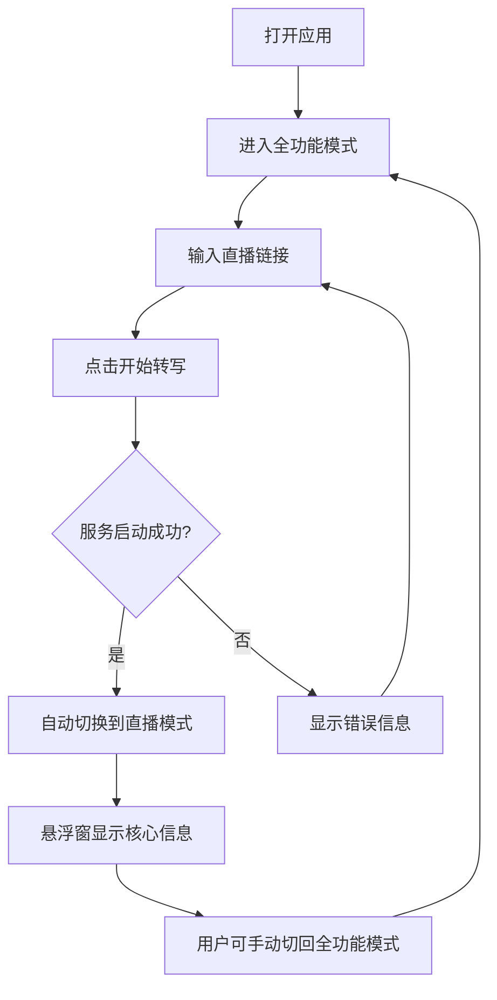

# 直播控制台双模式设计文档

> **文档版本**: v1.0  
> **创建日期**: 2025-01-15  
> **审查人**: 叶维哲  
> **适用产品**: 提猫直播助手（TalkingCat）

---

## 📋 文档概述

本文档详细描述提猫直播助手的直播控制台双模式设计，包括全功能模式与直播模式的界面布局、交互逻辑、API接口规范以及信息优先级管理系统。

---

## 1. 功能概述

### 1.1 双模式介绍

提猫直播助手提供两种操作模式，满足主播在不同场景下的使用需求：

#### 🖥️ 全功能模式（Full Mode）
- **定义**: 完整的桌面应用界面，提供所有功能和详细信息展示
- **使用场景**: 
  - 直播准备阶段：配置参数、预览效果
  - 直播结束后：查看数据分析、生成报告
  - 调试和设置：管理热词、模型设置等
- **界面特点**: 四宫格布局，包含实时转写、AI分析、话术建议、氛围监测等多个功能区

#### 📱 直播模式（Live Mode）
- **定义**: 极简悬浮窗模式，只显示核心信息，最小化遮挡
- **使用场景**:
  - 正式直播中：主播需要全屏直播软件（OBS/抖音直播伴侣）
  - 多屏幕操作：悬浮窗可拖拽到副屏幕
  - 移动设备：通过远程访问查看关键信息
- **界面特点**: 
  - 小窗口可拖拽到任意位置
  - 半透明不遮挡关键区域
  - 智能信息轮播展示

### 1.2 使用场景说明

| 场景 | 推荐模式 | 说明 |
|------|---------|------|
| **直播前准备** | 全功能模式 | 设置直播参数、测试音频、预览界面 |
| **正式直播中** | 直播模式 | 自动切换，最小化干扰 |
| **多任务操作** | 直播模式 | 悬浮窗方便随时查看关键信息 |
| **数据分析** | 全功能模式 | 查看完整的实时数据和历史记录 |
| **复盘总结** | 全功能模式 | 查看报告、导出数据 |

### 1.3 核心价值

✅ **最小化干扰**: 直播模式下悬浮窗体积小、半透明，不影响直播画面  
✅ **智能提醒**: 根据优先级自动推送重要信息（大额礼物、冷场提醒等）  
✅ **快速响应**: 一键复制话术，快速应对直播间突发情况  
✅ **灵活切换**: 随时在两种模式间切换，适应不同工作流程  
✅ **信息聚焦**: 轮播显示关键信息，避免信息过载  

---

## 2. 模式设计

### 2.1 全功能模式

#### 2.1.1 界面布局说明

全功能模式采用经典的四宫格布局，参考现有`LiveConsolePage.tsx`实现：

```
┌────────────────────────────────────────────────────────────────┐
│  顶部控制栏                                                      │
│  [直播地址输入框] [开始转写] [停止] [模式切换按钮]              │
├──────────────────────────┬─────────────────────────────────────┤
│ 1️⃣ 实时语音转写          │ 2️⃣ 智能话术建议                     │
│ - 实时字幕滚动显示        │ - AI生成话术（3种风格）             │
│ - 说话人标注【主播/嘉宾】│ - 针对性回应建议                    │
│ - 置信度显示              │ - 一键复制功能                      │
│ - 音频电平监控            │ - 历史话术记录                      │
├──────────────────────────┼─────────────────────────────────────┤
│ 3️⃣ 直播间互动分析        │ 4️⃣ 主播画像与氛围                   │
│ - 实时弹幕流              │ - 风格画像（StyleProfile）          │
│ - 礼物统计                │ - 直播间氛围（Vibe）                │
│ - 关键问题提取            │ - 情绪分析                          │
│ - AI实时分析              │ - 互动建议                          │
└──────────────────────────┴─────────────────────────────────────┘
│  底部状态栏                                                      │
│  [在线人数] [礼物价值] [互动率] [录制状态] [持久化开关]         │
└────────────────────────────────────────────────────────────────┘
```

#### 2.1.2 功能区域划分

**区域1: 实时语音转写**
- **数据源**: `/api/live_audio/ws` (WebSocket)
- **显示内容**:
  - 实时字幕文本（带时间戳）
  - 说话人标注（【主播】/【嘉宾】）
  - 置信度指示器（颜色编码）
  - 音频输入电平（波形或柱状图）
- **交互功能**:
  - 滚动查看历史字幕
  - 搜索关键词
  - 导出字幕文本

**区域2: 智能话术建议**
- **数据源**: `/api/ai/live/answers` (POST)
- **显示内容**:
  - 3种风格话术（暖心/直接/幽默）
  - 针对选中问题的回应
  - 生成时间和上下文说明
- **交互功能**:
  - 选择弹幕问题自动生成回应
  - 一键复制话术
  - 历史话术查看

**区域3: 直播间互动分析**
- **数据源**: 
  - `/api/douyin/web/stream` (SSE) - 弹幕礼物流
  - `/api/ai/live/stream` (SSE) - AI分析结果
- **显示内容**:
  - 实时弹幕滚动
  - 礼物提醒（高亮大额礼物）
  - 关键问题自动提取
  - AI分析卡片（风险/建议/亮点）
- **交互功能**:
  - 过滤弹幕（关键词/用户）
  - 标记重点用户
  - 导出互动记录

**区域4: 主播画像与氛围**
- **数据源**: `/api/ai/live/stream` 中的 `style_profile` 和 `vibe`
- **显示内容**:
  - 主播风格画像（Persona、Tone、Tempo）
  - 直播间氛围评分
  - 观众情绪分析
  - 互动热度趋势图
- **交互功能**:
  - 查看风格建议
  - 氛围历史对比
  - 导出分析报告

#### 2.1.3 操作流程



### 2.2 直播模式

#### 2.2.1 悬浮窗设计原则

直播模式的核心是**极简悬浮窗**，设计遵循以下原则：

✅ **最小视觉干扰**: 半透明、圆角、柔和阴影  
✅ **关键信息优先**: 只显示最重要的实时信息  
✅ **快速交互**: 一键复制、快速切换  
✅ **灵活定位**: 可拖拽到任意位置，自动吸附边缘  
✅ **状态明确**: 清晰的视觉指示器显示当前信息类型  

#### 2.2.2 悬浮窗布局

```
┌──────────────────────────────────┐
│  [标题] 📊 AI分析        [×] [⇄] │  ← 标题栏（拖拽区域）
├──────────────────────────────────┤
│                                  │
│    [核心信息显示区域]             │  ← 主内容区
│    当前直播间氛围评分: 85/100     │
│    观众情绪: 积极 😊              │
│    建议: 继续保持互动频率          │
│                                  │
├──────────────────────────────────┤
│  [📋] ① ② ③               [更多]  │  ← 操作栏
└──────────────────────────────────┘

[📋] 复制按钮
① ② ③ 信息类型指示器（可点击切换）
  ① AI分析
  ② 话术生成
  ③ 直播间氛围
[更多] 展开完整信息
[×] 关闭悬浮窗
[⇄] 切换回全功能模式
```

#### 2.2.3 收起与展开状态

**收起状态（80px × 80px）**:
```
┌─────────┐
│         │
│   📊    │  ← 只显示图标
│   85    │  ← 关键数值
│         │
└─────────┘
```

**展开状态（320px × 240px）**:
- 显示完整信息
- 显示操作按钮
- 显示指示器

#### 2.2.4 交互方式

| 操作 | 触发方式 | 效果 |
|------|---------|------|
| **拖拽移动** | 按住标题栏拖动 | 悬浮窗跟随鼠标移动 |
| **展开/收起** | 点击悬浮窗主体 | 切换展开/收起状态 |
| **切换信息** | 点击底部指示器① ② ③ | 切换显示不同类型信息 |
| **复制内容** | 点击📋按钮 | 复制当前显示的文本到剪贴板 |
| **关闭悬浮窗** | 点击×按钮 | 隐藏悬浮窗（不停止服务） |
| **切换模式** | 点击⇄按钮 | 切换回全功能模式 |

### 2.3 模式切换逻辑

#### 2.3.1 自动切换（全功能→直播模式）

**触发条件**:
1. 用户点击"开始转写"按钮
2. 后端服务启动成功（音频拉流 + 弹幕抓取均正常）
3. WebSocket连接建立成功

**切换流程**:
```typescript
// 伪代码示例
async function handleStart() {
  setLoading(true);
  
  // 1. 启动后端服务
  const audioResult = await startLiveAudio(liveUrl);
  const douyinResult = await startDouyinWeb(liveUrl);
  
  // 2. 检查服务状态
  if (audioResult.success && douyinResult.success) {
    // 3. 建立WebSocket连接
    connectWebSocket();
    
    // 4. 延迟3秒后自动切换到直播模式
    setTimeout(() => {
      switchToLiveMode();
      showFloatingWindow();
    }, 3000);
  }
  
  setLoading(false);
}
```

**切换动画**:
- 全功能界面淡出（fade-out, 300ms）
- 悬浮窗淡入（fade-in, 300ms）
- 悬浮窗从屏幕中心缩放到默认位置

#### 2.3.2 手动切换（直播模式→全功能）

**触发方式**:
- 点击悬浮窗右上角⇄按钮
- 使用快捷键（Ctrl+Shift+F）

**切换效果**:
- 悬浮窗保留（作为辅助显示）
- 全功能界面显示在悬浮窗后面
- 用户可关闭悬浮窗或继续使用

#### 2.3.3 状态管理

使用Zustand管理模式状态：

```typescript
interface LiveModeStore {
  // 当前模式
  currentMode: 'full' | 'live';
  // 悬浮窗状态
  floatingWindow: {
    visible: boolean;
    expanded: boolean;
    position: { x: number; y: number };
    currentInfo: 'ai_analysis' | 'script' | 'vibe';
  };
  // 切换函数
  switchMode: (mode: 'full' | 'live') => void;
  toggleFloatingWindow: () => void;
  updateFloatingPosition: (x: number, y: number) => void;
}
```

---

## 3. 悬浮窗UI设计规范

### 3.1 悬浮窗尺寸规范

#### 3.1.1 标准尺寸

| 状态 | 宽度 | 高度 | 说明 |
|------|------|------|------|
| **收起** | 80px | 80px | 只显示图标和关键数值 |
| **展开（小）** | 280px | 200px | 移动端或小屏幕 |
| **展开（标准）** | 320px | 240px | 桌面端默认尺寸 |
| **展开（大）** | 400px | 320px | 信息量大时自动扩展 |

#### 3.1.2 最小尺寸限制

- 最小宽度: 280px（确保内容可读）
- 最小高度: 180px（确保按钮可点击）
- 最大宽度: 480px（避免遮挡过多内容）
- 最大高度: 600px（避免占据过多屏幕空间）

#### 3.1.3 响应式适配

根据屏幕尺寸自动调整：

```css
/* 小屏幕（<768px） */
@media (max-width: 768px) {
  .floating-window.expanded {
    width: 280px;
    height: 200px;
  }
}

/* 中等屏幕（768px-1024px） */
@media (min-width: 768px) and (max-width: 1024px) {
  .floating-window.expanded {
    width: 320px;
    height: 240px;
  }
}

/* 大屏幕（>1024px） */
@media (min-width: 1024px) {
  .floating-window.expanded {
    width: 360px;
    height: 280px;
  }
}
```

### 3.2 悬浮窗位置与拖拽

#### 3.2.1 默认初始位置

```typescript
const DEFAULT_POSITION = {
  // 优先显示在右下角
  x: window.innerWidth - 360,  // 距离右边缘20px
  y: window.innerHeight - 300, // 距离底部边缘20px
  
  // 备选位置（如果右下角被遮挡）
  fallback: {
    x: 20,  // 左上角
    y: 100
  }
};
```

#### 3.2.2 拖拽功能实现

使用原生JavaScript实现拖拽（参考mobile-prototype/monitor.html）：

```typescript
function initDrag(windowElement: HTMLElement) {
  let isDragging = false;
  let startX: number, startY: number;
  let initialX: number, initialY: number;
  
  // 鼠标按下
  windowElement.addEventListener('mousedown', (e) => {
    // 只允许在标题栏拖拽
    if (!(e.target as HTMLElement).closest('.title-bar')) return;
    
    isDragging = true;
    startX = e.clientX;
    startY = e.clientY;
    
    const rect = windowElement.getBoundingClientRect();
    initialX = rect.left;
    initialY = rect.top;
  });
  
  // 鼠标移动
  document.addEventListener('mousemove', (e) => {
    if (!isDragging) return;
    
    const deltaX = e.clientX - startX;
    const deltaY = e.clientY - startY;
    
    let newX = initialX + deltaX;
    let newY = initialY + deltaY;
    
    // 限制在屏幕内
    const maxX = window.innerWidth - windowElement.offsetWidth;
    const maxY = window.innerHeight - windowElement.offsetHeight;
    newX = Math.max(0, Math.min(newX, maxX));
    newY = Math.max(0, Math.min(newY, maxY));
    
    windowElement.style.left = newX + 'px';
    windowElement.style.top = newY + 'px';
  });
  
  // 鼠标释放
  document.addEventListener('mouseup', () => {
    if (isDragging) {
      isDragging = false;
      // 保存位置
      savePosition(windowElement);
    }
  });
}
```

#### 3.2.3 屏幕边缘吸附

释放鼠标时，如果悬浮窗距离屏幕边缘<30px，自动吸附：

```typescript
function snapToEdge(element: HTMLElement) {
  const rect = element.getBoundingClientRect();
  const SNAP_THRESHOLD = 30;
  
  let newX = rect.left;
  let newY = rect.top;
  
  // 左边缘吸附
  if (rect.left < SNAP_THRESHOLD) {
    newX = 0;
  }
  
  // 右边缘吸附
  if (window.innerWidth - rect.right < SNAP_THRESHOLD) {
    newX = window.innerWidth - rect.width;
  }
  
  // 上边缘吸附
  if (rect.top < SNAP_THRESHOLD) {
    newY = 0;
  }
  
  // 下边缘吸附
  if (window.innerHeight - rect.bottom < SNAP_THRESHOLD) {
    newY = window.innerHeight - rect.height;
  }
  
  // 平滑过渡到吸附位置
  element.style.transition = 'all 0.2s ease';
  element.style.left = newX + 'px';
  element.style.top = newY + 'px';
  
  setTimeout(() => {
    element.style.transition = '';
  }, 200);
}
```

#### 3.2.4 位置记忆功能

使用LocalStorage保存用户偏好位置：

```typescript
// 保存位置
function savePosition(element: HTMLElement) {
  const position = {
    x: element.offsetLeft,
    y: element.offsetTop
  };
  localStorage.setItem('floatingWindow_position', JSON.stringify(position));
}

// 加载位置
function loadPosition(): { x: number; y: number } | null {
  const saved = localStorage.getItem('floatingWindow_position');
  if (saved) {
    try {
      return JSON.parse(saved);
    } catch {
      return null;
    }
  }
  return null;
}

// 初始化时使用保存的位置
function initPosition(element: HTMLElement) {
  const saved = loadPosition();
  if (saved) {
    // 确保位置仍在屏幕内（屏幕尺寸可能变化）
    const maxX = window.innerWidth - element.offsetWidth;
    const maxY = window.innerHeight - element.offsetHeight;
    const x = Math.max(0, Math.min(saved.x, maxX));
    const y = Math.max(0, Math.min(saved.y, maxY));
    
    element.style.left = x + 'px';
    element.style.top = y + 'px';
  } else {
    // 使用默认位置
    element.style.left = DEFAULT_POSITION.x + 'px';
    element.style.top = DEFAULT_POSITION.y + 'px';
  }
}
```

### 3.3 悬浮窗样式参数

#### 3.3.1 半透明效果

```css
.floating-window {
  /* 半透明背景 */
  background: rgba(255, 255, 255, 0.95);
  backdrop-filter: blur(10px); /* 毛玻璃效果 */
  -webkit-backdrop-filter: blur(10px);
  
  /* 暗色模式 */
  &.dark-mode {
    background: rgba(26, 32, 44, 0.95);
  }
}
```

#### 3.3.2 圆角设计

```css
.floating-window {
  border-radius: 16px;
  overflow: hidden; /* 确保内容不超出圆角 */
  
  /* 收起状态圆角更大 */
  &.collapsed {
    border-radius: 50%; /* 圆形 */
  }
}
```

#### 3.3.3 阴影效果

```css
.floating-window {
  /* 柔和阴影 */
  box-shadow: 
    0 4px 6px rgba(0, 0, 0, 0.1),
    0 2px 4px rgba(0, 0, 0, 0.06),
    0 12px 24px rgba(0, 0, 0, 0.15);
  
  /* 悬停时阴影增强 */
  &:hover {
    box-shadow: 
      0 8px 12px rgba(0, 0, 0, 0.15),
      0 4px 8px rgba(0, 0, 0, 0.1),
      0 16px 32px rgba(0, 0, 0, 0.2);
  }
}
```

#### 3.3.4 动画过渡效果

```css
.floating-window {
  /* 位置和尺寸变化平滑过渡 */
  transition: 
    width 0.3s cubic-bezier(0.4, 0, 0.2, 1),
    height 0.3s cubic-bezier(0.4, 0, 0.2, 1),
    opacity 0.3s ease,
    transform 0.3s cubic-bezier(0.4, 0, 0.2, 1);
  
  /* 展开动画 */
  &.expanding {
    animation: expand 0.3s cubic-bezier(0.4, 0, 0.2, 1);
  }
  
  /* 收起动画 */
  &.collapsing {
    animation: collapse 0.3s cubic-bezier(0.4, 0, 0.2, 1);
  }
}

@keyframes expand {
  from {
    transform: scale(0.8);
    opacity: 0;
  }
  to {
    transform: scale(1);
    opacity: 1;
  }
}

@keyframes collapse {
  from {
    transform: scale(1);
    opacity: 1;
  }
  to {
    transform: scale(0.8);
    opacity: 0;
  }
}
```

### 3.4 信息显示区域

#### 3.4.1 核心信息区布局

```html
<div class="floating-window-content">
  <!-- 标题栏 -->
  <div class="title-bar">
    <span class="title-icon">📊</span>
    <span class="title-text">AI分析</span>
    <div class="title-actions">
      <button class="btn-switch" title="切换模式">⇄</button>
      <button class="btn-close" title="关闭">×</button>
    </div>
  </div>
  
  <!-- 主内容区 -->
  <div class="content-area">
    <div class="content-main">
      <!-- 动态内容 -->
    </div>
  </div>
  
  <!-- 操作按钮区 -->
  <div class="action-bar">
    <button class="btn-copy" title="复制">📋</button>
    <div class="indicators">
      <span class="indicator active" data-type="ai_analysis">①</span>
      <span class="indicator" data-type="script">②</span>
      <span class="indicator" data-type="vibe">③</span>
    </div>
    <button class="btn-more" title="更多">⋯</button>
  </div>
</div>
```

#### 3.4.2 信息类型对应内容

**① AI分析**:
```html
<div class="content-ai-analysis">
  <div class="metric">
    <span class="metric-label">氛围评分</span>
    <span class="metric-value">85/100</span>
  </div>
  <div class="metric">
    <span class="metric-label">观众情绪</span>
    <span class="metric-value">积极 😊</span>
  </div>
  <div class="suggestion">
    <p>💡 继续保持互动频率</p>
  </div>
</div>
```

**② 话术生成**:
```html
<div class="content-script">
  <div class="script-item">
    <span class="script-type">感谢</span>
    <p class="script-text">"感谢老板送的嘉年华，财运滚滚来！"</p>
  </div>
  <div class="script-meta">
    <span class="target-user">@用户A</span>
    <span class="priority high">高优先级</span>
  </div>
</div>
```

**③ 直播间氛围**:
```html
<div class="content-vibe">
  <div class="vibe-metric">
    <span class="label">在线人数</span>
    <span class="value">1,234 <span class="trend up">↑15%</span></span>
  </div>
  <div class="vibe-metric">
    <span class="label">互动率</span>
    <span class="value">8.5%</span>
  </div>
  <div class="vibe-metric">
    <span class="label">礼物价值</span>
    <span class="value">¥8,888</span>
  </div>
</div>
```

---

## 4. 信息优先级系统设计

### 4.1 优先级定义

信息优先级系统确保主播在直播时能第一时间看到最重要的信息，避免信息过载。

#### 4.1.1 高优先级（主动提醒）

**触发条件**:

| 事件类型 | 触发阈值 | 提醒方式 | 示例 |
|---------|---------|---------|------|
| **大额礼物** | ≥100元 | 立即显示+提示音 | "用户A送了嘉年华(¥3000)" |
| **关键问题** | 包含预设关键词 | 立即显示+高亮 | "主播这个多少钱？" |
| **冷场检测** | >30秒无互动 | 立即显示+建议 | "冷场35秒，建议：聊聊新品" |
| **异常情况** | 在线人数骤降>30% | 立即显示+警告 | "人数下降，请检查直播状态" |

**显示效果**:
- 悬浮窗自动展开（如果处于收起状态）
- 内容区背景高亮（红色/黄色）
- 播放提示音（可选）
- 震动提醒（移动设备）

**代码示例**:
```typescript
interface HighPriorityAlert {
  type: 'big_gift' | 'key_question' | 'silence' | 'anomaly';
  priority: 'high';
  content: string;
  timestamp: number;
  actions?: {
    label: string;
    callback: () => void;
  }[];
}

function handleHighPriorityAlert(alert: HighPriorityAlert) {
  // 1. 展开悬浮窗
  if (floatingWindow.collapsed) {
    floatingWindow.expand();
  }
  
  // 2. 显示alert内容
  floatingWindow.showAlert(alert);
  
  // 3. 播放提示音
  if (settings.soundEnabled) {
    playAlertSound(alert.type);
  }
  
  // 4. 震动提醒（移动端）
  if (isMobile && settings.vibrationEnabled) {
    navigator.vibrate([200, 100, 200]);
  }
  
  // 5. 自动消失或需要确认
  if (alert.type === 'key_question') {
    // 关键问题需要确认才消失
    floatingWindow.waitForUserAction();
  } else {
    // 其他类型10秒后自动消失
    setTimeout(() => {
      floatingWindow.clearAlert();
    }, 10000);
  }
}
```

#### 4.1.2 中优先级（悬浮显示）

**触发条件**:

| 事件类型 | 触发阈值 | 显示方式 | 示例 |
|---------|---------|---------|------|
| **高频关键词** | 5分钟内出现≥3次 | 加入轮播队列 | "价格"被提及5次 |
| **人数变化** | 变化幅度>10% | 加入轮播队列 | "在线人数增加15%" |
| **互动高峰** | 弹幕频率>平均2倍 | 加入轮播队列 | "当前互动非常活跃" |
| **话术建议** | AI生成新话术 | 加入轮播队列 | "针对XXX问题的回应" |

**显示效果**:
- 加入信息轮播队列
- 按时间顺序循环显示
- 用户可手动切换查看

#### 4.1.3 低优先级（可隐藏）

**触发条件**:

| 信息类型 | 更新频率 | 显示方式 | 示例 |
|---------|---------|---------|------|
| **详细数据** | 每分钟更新 | 仅在用户点击"更多"时显示 | 完整的数据分析表格 |
| **历史记录** | 实时更新 | 需要切换到全功能模式查看 | 历史弹幕记录 |
| **系统日志** | 实时更新 | 开发者模式可见 | 后端服务日志 |

### 4.2 优先级处理逻辑

#### 4.2.1 优先级队列管理

使用优先级队列数据结构：

```typescript
class PriorityQueue<T> {
  private items: Array<{ priority: number; data: T }> = [];
  
  enqueue(item: T, priority: number) {
    const queueItem = { priority, data: item };
    
    // 按优先级插入
    let added = false;
    for (let i = 0; i < this.items.length; i++) {
      if (queueItem.priority > this.items[i].priority) {
        this.items.splice(i, 0, queueItem);
        added = true;
        break;
      }
    }
    
    if (!added) {
      this.items.push(queueItem);
    }
  }
  
  dequeue(): T | undefined {
    return this.items.shift()?.data;
  }
  
  peek(): T | undefined {
    return this.items[0]?.data;
  }
  
  isEmpty(): boolean {
    return this.items.length === 0;
  }
}

// 使用示例
interface InfoItem {
  type: 'ai_analysis' | 'script' | 'vibe';
  priority: 'high' | 'medium' | 'low';
  content: any;
  timestamp: number;
}

const infoQueue = new PriorityQueue<InfoItem>();

// 添加高优先级信息
infoQueue.enqueue({
  type: 'script',
  priority: 'high',
  content: { line: '感谢老板送的礼物！' },
  timestamp: Date.now()
}, 3); // 优先级数值：高=3, 中=2, 低=1

// 添加中优先级信息
infoQueue.enqueue({
  type: 'vibe',
  priority: 'medium',
  content: { viewerCount: 1234, trend: 'up' },
  timestamp: Date.now()
}, 2);
```

#### 4.2.2 信息调度算法

```typescript
class InfoScheduler {
  private queue: PriorityQueue<InfoItem>;
  private currentInfo: InfoItem | null = null;
  private rotationTimer: number | null = null;
  
  constructor() {
    this.queue = new PriorityQueue<InfoItem>();
  }
  
  // 添加新信息
  addInfo(info: InfoItem) {
    const priorityValue = {
      'high': 3,
      'medium': 2,
      'low': 1
    }[info.priority];
    
    this.queue.enqueue(info, priorityValue);
    
    // 如果是高优先级，立即显示
    if (info.priority === 'high') {
      this.showImmediately(info);
    } else if (!this.currentInfo) {
      // 如果当前没有显示内容，开始轮播
      this.startRotation();
    }
  }
  
  // 立即显示（高优先级）
  private showImmediately(info: InfoItem) {
    // 停止当前轮播
    if (this.rotationTimer) {
      clearTimeout(this.rotationTimer);
    }
    
    // 显示高优先级信息
    this.currentInfo = info;
    this.displayInfo(info);
    
    // 10秒后恢复轮播
    this.rotationTimer = window.setTimeout(() => {
      this.startRotation();
    }, 10000);
  }
  
  // 开始轮播
  private startRotation() {
    if (this.queue.isEmpty()) {
      this.currentInfo = null;
      return;
    }
    
    // 显示队列中下一个信息
    const nextInfo = this.queue.dequeue();
    if (nextInfo) {
      this.currentInfo = nextInfo;
      this.displayInfo(nextInfo);
      
      // 5秒后显示下一个
      this.rotationTimer = window.setTimeout(() => {
        // 将当前信息重新加入队列（循环显示）
        if (this.currentInfo && this.currentInfo.priority !== 'high') {
          this.addInfo(this.currentInfo);
        }
        this.startRotation();
      }, 5000);
    }
  }
  
  // 显示信息
  private displayInfo(info: InfoItem) {
    // 更新UI
    floatingWindow.setContent(info.type, info.content);
    floatingWindow.setActiveIndicator(info.type);
  }
  
  // 停止轮播
  stopRotation() {
    if (this.rotationTimer) {
      clearTimeout(this.rotationTimer);
      this.rotationTimer = null;
    }
  }
}
```

---

## 5. 信息轮播显示机制

### 5.1 轮播规则

#### 5.1.1 轮播间隔

- **默认间隔**: 5秒
- **可调整范围**: 3-10秒
- **自适应**: 根据信息内容长度自动调整

```typescript
interface RotationConfig {
  defaultInterval: number;  // 5000ms
  minInterval: number;      // 3000ms
  maxInterval: number;      // 10000ms
  adaptiveEnabled: boolean; // 自适应开关
}

function calculateInterval(content: string, config: RotationConfig): number {
  if (!config.adaptiveEnabled) {
    return config.defaultInterval;
  }
  
  // 根据内容长度计算阅读时间
  const wordsCount = content.length;
  const readingTime = Math.ceil(wordsCount / 10) * 1000; // 假设每秒读10个字
  
  // 限制在min和max之间
  return Math.max(
    config.minInterval,
    Math.min(readingTime, config.maxInterval)
  );
}
```

#### 5.1.2 信息类型顺序

固定轮播顺序：① AI分析 → ② 话术生成 → ③ 直播间氛围

```typescript
const ROTATION_ORDER: InfoType[] = [
  'ai_analysis',
  'script',
  'vibe'
];

class RotationController {
  private currentIndex: number = 0;
  private paused: boolean = false;
  
  getNextType(): InfoType {
    if (this.paused) {
      return ROTATION_ORDER[this.currentIndex];
    }
    
    this.currentIndex = (this.currentIndex + 1) % ROTATION_ORDER.length;
    return ROTATION_ORDER[this.currentIndex];
  }
  
  pause() {
    this.paused = true;
  }
  
  resume() {
    this.paused = false;
  }
  
  jumpTo(type: InfoType) {
    const index = ROTATION_ORDER.indexOf(type);
    if (index !== -1) {
      this.currentIndex = index;
      this.paused = true; // 手动切换时暂停自动轮播
    }
  }
}
```

#### 5.1.3 循环播放机制

```typescript
class CarouselManager {
  private items: Map<InfoType, any> = new Map();
  private controller: RotationController;
  private timer: number | null = null;
  
  constructor() {
    this.controller = new RotationController();
  }
  
  start() {
    this.rotate();
  }
  
  private rotate() {
    // 获取下一个类型
    const nextType = this.controller.getNextType();
    
    // 获取该类型的最新数据
    const data = this.items.get(nextType);
    
    if (data) {
      // 显示数据
      this.display(nextType, data);
      
      // 计算下一次轮播的间隔
      const interval = calculateInterval(
        JSON.stringify(data),
        rotationConfig
      );
      
      // 设置定时器
      this.timer = window.setTimeout(() => {
        this.rotate();
      }, interval);
    }
  }
  
  updateData(type: InfoType, data: any) {
    this.items.set(type, data);
  }
  
  stop() {
    if (this.timer) {
      clearTimeout(this.timer);
      this.timer = null;
    }
  }
  
  private display(type: InfoType, data: any) {
    floatingWindow.setContent(type, data);
    floatingWindow.setActiveIndicator(type);
  }
}
```

### 5.2 手动切换

#### 5.2.1 指示器交互

```html
<div class="indicators">
  <button 
    class="indicator" 
    data-type="ai_analysis"
    data-label="AI分析"
    @click="switchTo('ai_analysis')"
  >
    <span class="indicator-dot"></span>
    <span class="indicator-label">①</span>
  </button>
  
  <button 
    class="indicator" 
    data-type="script"
    data-label="话术"
    @click="switchTo('script')"
  >
    <span class="indicator-dot"></span>
    <span class="indicator-label">②</span>
  </button>
  
  <button 
    class="indicator" 
    data-type="vibe"
    data-label="氛围"
    @click="switchTo('vibe')"
  >
    <span class="indicator-dot"></span>
    <span class="indicator-label">③</span>
  </button>
</div>
```

```css
.indicator {
  position: relative;
  padding: 8px;
  border: none;
  background: transparent;
  cursor: pointer;
  transition: all 0.3s ease;
}

.indicator-dot {
  display: inline-block;
  width: 8px;
  height: 8px;
  border-radius: 50%;
  background: rgba(148, 163, 184, 0.5);
  transition: all 0.3s ease;
}

.indicator.active .indicator-dot {
  background: #a855f7;
  box-shadow: 0 0 8px rgba(168, 85, 247, 0.6);
}

.indicator:hover .indicator-dot {
  transform: scale(1.2);
}

.indicator-label {
  position: absolute;
  bottom: -20px;
  left: 50%;
  transform: translateX(-50%);
  font-size: 10px;
  color: rgba(148, 163, 184, 0.7);
  opacity: 0;
  transition: opacity 0.3s ease;
}

.indicator:hover .indicator-label {
  opacity: 1;
}
```

#### 5.2.2 切换逻辑

```typescript
function switchTo(type: InfoType) {
  // 1. 暂停自动轮播
  carousel.stop();
  controller.jumpTo(type);
  
  // 2. 更新UI
  floatingWindow.setContent(type, carousel.getData(type));
  floatingWindow.setActiveIndicator(type);
  
  // 3. 10秒后恢复自动轮播
  setTimeout(() => {
    controller.resume();
    carousel.start();
  }, 10000);
}
```

#### 5.2.3 键盘快捷键

```typescript
document.addEventListener('keydown', (e) => {
  // Ctrl + 1/2/3 切换信息类型
  if (e.ctrlKey && !e.shiftKey && !e.altKey) {
    switch(e.key) {
      case '1':
        switchTo('ai_analysis');
        break;
      case '2':
        switchTo('script');
        break;
      case '3':
        switchTo('vibe');
        break;
    }
  }
  
  // 空格键暂停/恢复轮播
  if (e.key === ' ' && floatingWindow.isFocused()) {
    e.preventDefault();
    if (carousel.isPaused()) {
      carousel.start();
    } else {
      carousel.stop();
    }
  }
});
```

### 5.3 信息内容结构

#### 5.3.1 AI分析内容

```typescript
interface AIAnalysisContent {
  // 氛围评分 (0-100)
  vibeScore: number;
  
  // 观众情绪
  audienceEmotion: {
    primary: '积极' | '中性' | '消极';
    emoji: string;
    confidence: number;
  };
  
  // 互动建议
  suggestions: Array<{
    type: '继续' | '调整' | '警告';
    text: string;
    icon: string;
  }>;
  
  // 时间戳
  timestamp: number;
}

// 渲染示例
function renderAIAnalysis(content: AIAnalysisContent): string {
  return `
    <div class="ai-analysis-content">
      <div class="score-display">
        <div class="score-circle" style="--score: ${content.vibeScore}">
          <span class="score-value">${content.vibeScore}</span>
        </div>
        <span class="score-label">氛围评分</span>
      </div>
      
      <div class="emotion-display">
        <span class="emotion-emoji">${content.audienceEmotion.emoji}</span>
        <span class="emotion-text">${content.audienceEmotion.primary}</span>
        <span class="emotion-confidence">${Math.round(content.audienceEmotion.confidence * 100)}%</span>
      </div>
      
      <div class="suggestions-list">
        ${content.suggestions.map(s => `
          <div class="suggestion-item ${s.type}">
            <span class="suggestion-icon">${s.icon}</span>
            <span class="suggestion-text">${s.text}</span>
          </div>
        `).join('')}
      </div>
    </div>
  `;
}
```

#### 5.3.2 话术生成内容

```typescript
interface ScriptContent {
  // 话术类型
  type: 'thank' | 'retain' | 'interact';
  
  // 优先级
  priority: 'high' | 'medium' | 'low';
  
  // 话术文本
  line: string;
  
  // 目标用户（如果有）
  targetUser?: string;
  
  // 生成理由
  rationale: string;
  
  // 时间戳
  timestamp: number;
}

// 渲染示例
function renderScript(content: ScriptContent): string {
  const typeLabels = {
    thank: '感谢',
    retain: '留人',
    interact: '互动'
  };
  
  const typeIcons = {
    thank: '🙏',
    retain: '👋',
    interact: '💬'
  };
  
  const priorityColors = {
    high: 'red',
    medium: 'orange',
    low: 'gray'
  };
  
  return `
    <div class="script-content">
      <div class="script-header">
        <span class="script-icon">${typeIcons[content.type]}</span>
        <span class="script-type">${typeLabels[content.type]}</span>
        <span class="script-priority" style="color: ${priorityColors[content.priority]}">
          ${content.priority === 'high' ? '🔥' : ''}
        </span>
      </div>
      
      <div class="script-text">
        "${content.line}"
      </div>
      
      ${content.targetUser ? `
        <div class="script-target">
          <span class="target-label">对象:</span>
          <span class="target-user">@${content.targetUser}</span>
        </div>
      ` : ''}
      
      <div class="script-rationale">
        <span class="rationale-icon">💡</span>
        <span class="rationale-text">${content.rationale}</span>
      </div>
    </div>
  `;
}
```

#### 5.3.3 直播间氛围内容

```typescript
interface VibeContent {
  // 在线人数
  viewerCount: {
    current: number;
    trend: 'up' | 'down' | 'stable';
    changePercent: number;
  };
  
  // 互动率
  engagementRate: {
    value: number;
    level: '低' | '中' | '高';
  };
  
  // 礼物统计
  giftStats: {
    count: number;
    totalValue: number;
    topGifts: Array<{
      name: string;
      count: number;
      value: number;
    }>;
  };
  
  // 时间戳
  timestamp: number;
}

// 渲染示例
function renderVibe(content: VibeContent): string {
  const trendIcons = {
    up: '📈',
    down: '📉',
    stable: '➡️'
  };
  
  const engagementColors = {
    '低': '#94a3b8',
    '中': '#f59e0b',
    '高': '#10b981'
  };
  
  return `
    <div class="vibe-content">
      <div class="vibe-metric">
        <span class="metric-label">在线人数</span>
        <div class="metric-value-group">
          <span class="metric-value">${content.viewerCount.current.toLocaleString()}</span>
          <span class="metric-trend ${content.viewerCount.trend}">
            ${trendIcons[content.viewerCount.trend]}
            ${content.viewerCount.changePercent > 0 ? '+' : ''}${content.viewerCount.changePercent}%
          </span>
        </div>
      </div>
      
      <div class="vibe-metric">
        <span class="metric-label">互动率</span>
        <div class="metric-value-group">
          <span class="metric-value">${content.engagementRate.value.toFixed(1)}%</span>
          <span 
            class="metric-level" 
            style="color: ${engagementColors[content.engagementRate.level]}"
          >
            ${content.engagementRate.level}
          </span>
        </div>
      </div>
      
      <div class="vibe-metric">
        <span class="metric-label">礼物价值</span>
        <div class="metric-value-group">
          <span class="metric-value">¥${content.giftStats.totalValue.toLocaleString()}</span>
          <span class="metric-count">(${content.giftStats.count}个)</span>
        </div>
      </div>
      
      ${content.giftStats.topGifts.length > 0 ? `
        <div class="top-gifts">
          <span class="section-title">热门礼物:</span>
          ${content.giftStats.topGifts.slice(0, 3).map(gift => `
            <div class="gift-item">
              <span class="gift-name">${gift.name}</span>
              <span class="gift-stat">×${gift.count} (¥${gift.value})</span>
            </div>
          `).join('')}
        </div>
      ` : ''}
    </div>
  `;
}
```

---

**（文档第一部分完成，将继续创建第二部分）**

