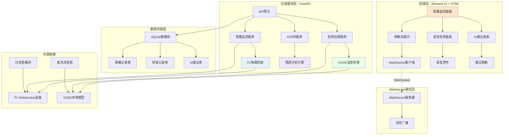

# 提猫直播助手MVP - 系统架构设计

## 整体架构图



## 系统分层设计

### 1. 前端展示层 (Presentation Layer)

#### 1.1 技术选型
- **基础框架**: HTML5 + CSS3 + 原生JavaScript
- **UI组件库**: Element UI 2.15 (CDN引入)
- **样式风格**: 可爱猫咪主题 + 圆角设计
- **通信方式**: WebSocket + Fetch API

#### 1.2 页面结构
```html
<!DOCTYPE html>
<html>
<head>
    <title>🐱 提猫直播助手</title>
    <link rel="stylesheet" href="https://unpkg.com/element-ui/lib/theme-chalk/index.css">
    <script src="https://unpkg.com/vue@2/dist/vue.js"></script>
    <script src="https://unpkg.com/element-ui/lib/index.js"></script>
</head>
<body>
    <div id="app">
        <!-- 主布局组件 -->
    </div>
</body>
</html>
```

#### 1.3 核心组件
```javascript
// 主应用组件
const App = {
    data() {
        return {
            liveRoomId: '',
            isMonitoring: false,
            isRecording: false,
            comments: [],
            transcripts: [],
            suggestions: [],
            stats: {
                commentCount: 0,
                avgSentiment: 0
            }
        }
    },
    
    mounted() {
        this.initWebSocket();
    },
    
    methods: {
        // WebSocket连接管理
        initWebSocket() {
            this.ws = new WebSocket('ws://localhost:8000/ws');
            this.ws.onmessage = this.handleWebSocketMessage;
        },
        
        // 开始监控直播间
        async startMonitoring() {
            const response = await fetch('/api/rooms/start', {
                method: 'POST',
                headers: {'Content-Type': 'application/json'},
                body: JSON.stringify({room_id: this.liveRoomId})
            });
        },
        
        // 开始录音
        async startRecording() {
            const stream = await navigator.mediaDevices.getUserMedia({audio: true});
            this.mediaRecorder = new MediaRecorder(stream);
            // 录音处理逻辑
        }
    }
}
```

### 2. WebSocket通信层

#### 2.1 连接管理
```python
# websocket_manager.py
from fastapi import WebSocket
from typing import Dict, List
import json

class WebSocketManager:
    def __init__(self):
        self.active_connections: Dict[str, List[WebSocket]] = {}
    
    async def connect(self, websocket: WebSocket, room_id: str):
        await websocket.accept()
        if room_id not in self.active_connections:
            self.active_connections[room_id] = []
        self.active_connections[room_id].append(websocket)
    
    async def broadcast_to_room(self, room_id: str, message: dict):
        if room_id in self.active_connections:
            for connection in self.active_connections[room_id]:
                try:
                    await connection.send_text(json.dumps(message))
                except:
                    # 移除失效连接
                    self.active_connections[room_id].remove(connection)
```

#### 2.2 消息类型定义
```python
# 消息类型枚举
class MessageType(str, Enum):
    NEW_COMMENT = "new_comment"
    NEW_TRANSCRIPT = "new_transcript" 
    NEW_SUGGESTION = "new_suggestion"
    STATS_UPDATE = "stats_update"
    SYSTEM_STATUS = "system_status"

# 消息格式
class WebSocketMessage(BaseModel):
    type: MessageType
    data: dict
    timestamp: datetime
    room_id: str
```

### 3. 业务服务层 (Service Layer)

#### 3.1 F2弹幕抓取服务
```python
# douyin_service.py
import asyncio
from f2.apps.douyin.handler import DouyinHandler
from f2.apps.douyin.crawler import DouyinWebSocketCrawler
from f2.apps.douyin.utils import TokenManager

class DouyinLiveService:
    def __init__(self):
        self.kwargs = {
            "headers": {
                "User-Agent": "Mozilla/5.0 (Windows NT 10.0; Win64; x64) AppleWebKit/537.36",
                "Referer": "https://www.douyin.com/",
            },
            "proxies": {"http://": None, "https://": None},
            "timeout": 10,
            "cookie": f"ttwid={TokenManager.gen_ttwid()}; __live_version__=%221.1.2.6631%22;",
        }
        
        self.wss_kwargs = {
            "headers": {
                "User-Agent": "Mozilla/5.0 (Windows NT 10.0; Win64; x64) AppleWebKit/537.36",
                "Upgrade": "websocket",
                "Connection": "Upgrade",
            },
            "show_message": False,  # 不在终端显示
            "cookie": "",
        }
    
    async def start_monitoring(self, live_id: str, callback):
        """开始监控直播间"""
        try:
            # 获取用户信息
            user = await DouyinHandler(self.kwargs).fetch_query_user()
            
            # 获取直播间信息
            room = await DouyinHandler(self.kwargs).fetch_user_live_videos(live_id)
            
            if room.live_status != 2:
                raise Exception("直播间未开播")
            
            # 获取WebSocket连接信息
            live_im = await DouyinHandler(self.kwargs).fetch_live_im(
                room_id=room.room_id, 
                unique_id=user.user_unique_id
            )
            
            # 定义消息回调
            wss_callbacks = {
                "WebcastChatMessage": self.handle_chat_message,
                "WebcastGiftMessage": self.handle_gift_message,
                "WebcastLikeMessage": self.handle_like_message,
                # ... 其他消息类型
            }
            
            # 开始接收弹幕
            await DouyinHandler(self.wss_kwargs).fetch_live_danmaku(
                room_id=room.room_id,
                user_unique_id=user.user_unique_id,
                internal_ext=live_im.internal_ext,
                cursor=live_im.cursor,
                wss_callbacks=wss_callbacks,
            )
            
        except Exception as e:
            logger.error(f"直播监控启动失败: {e}")
            raise
    
    async def handle_chat_message(self, message):
        """处理聊天消息"""
        comment_data = {
            "id": message.msgId,
            "username": message.user.nickName,
            "content": message.content,
            "timestamp": datetime.now().isoformat(),
            "user_level": getattr(message.user, 'level', 0)
        }
        
        # 存储到数据库
        await self.save_comment(comment_data)
        
        # 通过WebSocket推送
        await self.websocket_manager.broadcast_to_room(
            room_id=self.current_room_id,
            message={
                "type": "new_comment",
                "data": comment_data
            }
        )
```

#### 3.2 VOSK语音转录服务
```python
# vosk_service.py
import vosk
import json
import asyncio
from io import BytesIO

class VoskTranscriptionService:
    def __init__(self, model_path: str = "vosk-model-cn-0.22"):
        self.model = vosk.Model(model_path)
        self.is_recording = False
    
    async def transcribe_audio_stream(self, audio_data: bytes) -> dict:
        """转录音频流"""
        try:
            recognizer = vosk.KaldiRecognizer(self.model, 16000)
            
            # 处理音频数据
            if recognizer.AcceptWaveform(audio_data):
                result = json.loads(recognizer.Result())
            else:
                result = json.loads(recognizer.PartialResult())
            
            if result.get('text'):
                transcript_data = {
                    "id": str(uuid.uuid4()),
                    "text": result['text'],
                    "confidence": result.get('confidence', 0.8),
                    "timestamp": datetime.now().isoformat()
                }
                
                # 存储到数据库
                await self.save_transcript(transcript_data)
                
                # WebSocket推送
                await self.websocket_manager.broadcast_to_room(
                    room_id=self.current_room_id,
                    message={
                        "type": "new_transcript", 
                        "data": transcript_data
                    }
                )
                
                return transcript_data
                
        except Exception as e:
            logger.error(f"语音转录失败: {e}")
            return None
    
    async def start_realtime_transcription(self, room_id: str):
        """开始实时转录"""
        self.current_room_id = room_id
        self.is_recording = True
        
        # 启动音频流处理循环
        while self.is_recording:
            # 这里需要实现音频流的实时获取
            await asyncio.sleep(0.1)
```

#### 3.3 AI分析服务
```python
# ai_service.py
import jieba
from snownlp import SnowNLP
from collections import Counter
from typing import List, Dict

class AIAnalysisService:
    def __init__(self):
        # 加载停用词
        self.stopwords = self.load_stopwords()
        # 初始化情感分析
        self.sentiment_analyzer = SnowNLP
    
    async def analyze_comments(self, comments: List[str]) -> Dict:
        """分析评论数据"""
        if not comments:
            return {"hot_words": [], "sentiment": 0.5, "suggestions": []}
        
        # 提取热词
        hot_words = self.extract_hot_words(comments)
        
        # 情感分析
        sentiment_score = self.analyze_sentiment(comments)
        
        # 生成建议
        suggestions = self.generate_suggestions(hot_words, sentiment_score)
        
        return {
            "hot_words": hot_words[:10],  # 前10个热词
            "sentiment": sentiment_score,
            "suggestions": suggestions
        }
    
    def extract_hot_words(self, comments: List[str]) -> List[Dict]:
        """提取热词"""
        all_words = []
        
        for comment in comments:
            words = jieba.cut(comment)
            filtered_words = [
                word for word in words 
                if len(word) > 1 and word not in self.stopwords
            ]
            all_words.extend(filtered_words)
        
        word_count = Counter(all_words)
        
        return [
            {"word": word, "count": count, "score": count/len(comments)}
            for word, count in word_count.most_common(20)
        ]
    
    def analyze_sentiment(self, comments: List[str]) -> float:
        """分析情感倾向"""
        if not comments:
            return 0.5
            
        sentiments = []
        for comment in comments:
            s = SnowNLP(comment)
            sentiments.append(s.sentiments)
        
        return sum(sentiments) / len(sentiments)
    
    def generate_suggestions(self, hot_words: List[Dict], sentiment: float) -> List[str]:
        """生成AI建议"""
        suggestions = []
        
        # 基于热词生成建议
        top_words = [w['word'] for w in hot_words[:3]]
        if top_words:
            suggestions.append(f"观众关注：{', '.join(top_words)}，建议重点介绍")
        
        # 基于情感生成建议
        if sentiment > 0.7:
            suggestions.append("观众情绪很积极！保持当前互动风格")
        elif sentiment < 0.3:
            suggestions.append("观众情绪偏低，建议增加互动或调整内容")
        else:
            suggestions.append("观众情绪平稳，可以适当增加一些互动环节")
        
        # 通用建议
        suggestions.append("记得提醒观众点赞关注哦~")
        
        return suggestions[:3]  # 返回最多3条建议
```

### 4. 数据存储层 (Data Layer)

#### 4.1 数据库设计
```sql
-- 弹幕记录表
CREATE TABLE comments (
    id TEXT PRIMARY KEY,
    room_id TEXT NOT NULL,
    username TEXT NOT NULL,
    content TEXT NOT NULL,
    user_level INTEGER DEFAULT 0,
    timestamp DATETIME DEFAULT CURRENT_TIMESTAMP,
    sentiment_score REAL,
    created_at DATETIME DEFAULT CURRENT_TIMESTAMP
);

-- 语音转录表  
CREATE TABLE transcripts (
    id TEXT PRIMARY KEY,
    room_id TEXT NOT NULL,
    text TEXT NOT NULL,
    confidence REAL DEFAULT 0.8,
    timestamp DATETIME DEFAULT CURRENT_TIMESTAMP,
    created_at DATETIME DEFAULT CURRENT_TIMESTAMP
);

-- AI建议表
CREATE TABLE suggestions (
    id INTEGER PRIMARY KEY AUTOINCREMENT,
    room_id TEXT NOT NULL,
    type TEXT DEFAULT 'general',
    content TEXT NOT NULL,
    confidence REAL DEFAULT 0.8,
    is_used BOOLEAN DEFAULT FALSE,
    created_at DATETIME DEFAULT CURRENT_TIMESTAMP
);

-- 直播间配置表
CREATE TABLE room_configs (
    room_id TEXT PRIMARY KEY,
    live_id TEXT NOT NULL,
    room_name TEXT,
    status TEXT DEFAULT 'inactive',
    config JSON,
    created_at DATETIME DEFAULT CURRENT_TIMESTAMP,
    updated_at DATETIME DEFAULT CURRENT_TIMESTAMP
);
```

#### 4.2 数据访问层
```python
# database.py
import aiosqlite
from typing import List, Dict, Optional

class DatabaseManager:
    def __init__(self, db_path: str = "timao_mvp.db"):
        self.db_path = db_path
    
    async def init_database(self):
        """初始化数据库"""
        async with aiosqlite.connect(self.db_path) as db:
            # 执行建表SQL
            await db.executescript(CREATE_TABLES_SQL)
            await db.commit()
    
    async def save_comment(self, comment_data: Dict):
        """保存评论"""
        async with aiosqlite.connect(self.db_path) as db:
            await db.execute(
                "INSERT INTO comments (id, room_id, username, content, user_level, sentiment_score) VALUES (?, ?, ?, ?, ?, ?)",
                (comment_data['id'], comment_data['room_id'], comment_data['username'], 
                 comment_data['content'], comment_data.get('user_level', 0), 
                 comment_data.get('sentiment_score'))
            )
            await db.commit()
    
    async def get_recent_comments(self, room_id: str, limit: int = 50) -> List[Dict]:
        """获取最近评论"""
        async with aiosqlite.connect(self.db_path) as db:
            db.row_factory = aiosqlite.Row
            cursor = await db.execute(
                "SELECT * FROM comments WHERE room_id = ? ORDER BY timestamp DESC LIMIT ?",
                (room_id, limit)
            )
            rows = await cursor.fetchall()
            return [dict(row) for row in rows]
```

## 接口契约设计

### REST API接口
```python
# API路由定义
from fastapi import FastAPI, WebSocket

app = FastAPI(title="提猫直播助手MVP")

# 健康检查
@app.get("/api/health")
async def health_check():
    return {"status": "healthy", "timestamp": datetime.now()}

# 开始监控直播间
@app.post("/api/rooms/{room_id}/start")
async def start_monitoring(room_id: str, live_id: str):
    await douyin_service.start_monitoring(live_id)
    return {"status": "started", "room_id": room_id}

# 停止监控
@app.post("/api/rooms/{room_id}/stop")
async def stop_monitoring(room_id: str):
    await douyin_service.stop_monitoring()
    return {"status": "stopped", "room_id": room_id}

# 获取最近评论
@app.get("/api/comments/{room_id}")
async def get_comments(room_id: str, limit: int = 20):
    comments = await db_manager.get_recent_comments(room_id, limit)
    return {"comments": comments}

# 获取AI建议
@app.get("/api/suggestions/{room_id}")
async def get_suggestions(room_id: str):
    suggestions = await db_manager.get_recent_suggestions(room_id)
    return {"suggestions": suggestions}

# 上传音频文件
@app.post("/api/audio/upload")
async def upload_audio(file: UploadFile, room_id: str):
    result = await vosk_service.transcribe_audio_stream(await file.read())
    return {"transcript": result}

# WebSocket连接
@app.websocket("/ws/{room_id}")
async def websocket_endpoint(websocket: WebSocket, room_id: str):
    await websocket_manager.connect(websocket, room_id)
    try:
        while True:
            await websocket.receive_text()
    except:
        websocket_manager.disconnect(websocket, room_id)
```

## 部署架构

### 开发环境
```yaml
# docker-compose.dev.yml
version: '3.8'
services:
  app:
    build: .
    ports:
      - "8000:8000"
    volumes:
      - .:/app
      - ./vosk-model:/app/vosk-model
    environment:
      - DEBUG=True
      - DATABASE_URL=sqlite:///./timao_mvp.db
    depends_on:
      - redis
  
  redis:
    image: redis:7-alpine
    ports:
      - "6379:6379"
      
  frontend:
    image: nginx:alpine
    ports:
      - "3000:80"
    volumes:
      - ./frontend:/usr/share/nginx/html
      - ./nginx.conf:/etc/nginx/nginx.conf
```

### 错误处理策略

#### 1. F2连接错误
- 直播间不存在或未开播
- 网络连接中断
- Cookie失效

#### 2. VOSK转录错误  
- 音频格式不支持
- 模型文件损坏
- 内存不足

#### 3. WebSocket连接错误
- 客户端断开重连
- 服务端重启恢复
- 消息队列溢出处理

---

**架构设计完成**
- ✅ 分层清晰，职责明确
- ✅ 接口定义完整，支持扩展
- ✅ 数据流设计合理，性能可控
- ✅ 错误处理完善，稳定性高
- ✅ 符合MVP快速开发要求

**下一步**：进入任务原子化阶段 (Atomize)