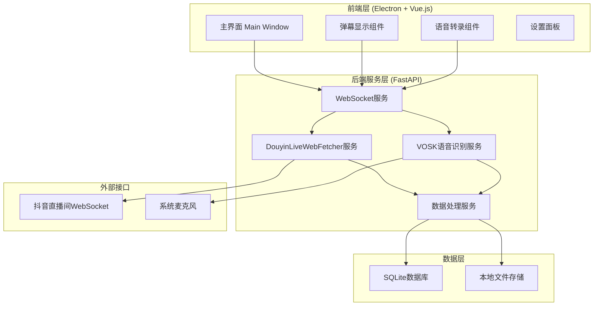
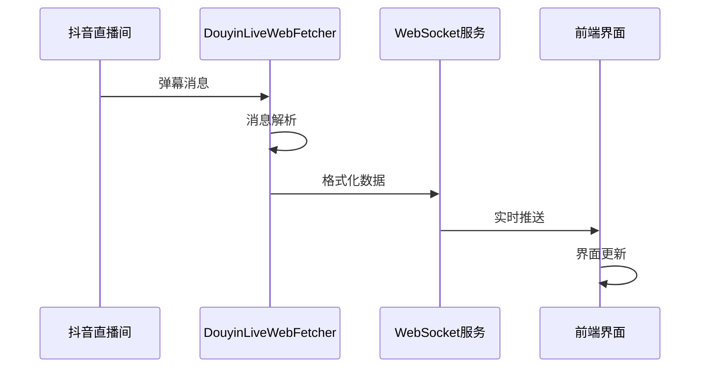
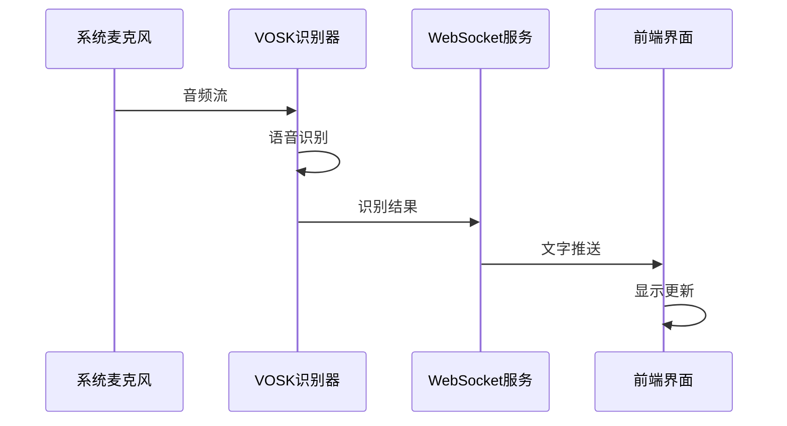

# 提猫直播助手MVP - 系统架构设计

## 整体架构图



## 核心组件设计

### 1. DouyinLiveWebFetcher集成模块

```python
# douyin_live_fecter_module/service.py
class DouyinLiveFetcher:
    """抖音直播数据抓取服务"""
    
    def __init__(self):
        self.web_fetcher = None
        self.status = FetcherStatus.STOPPED
        self.message_callback = None
    
    async def start_fetching(self, room_url: str):
        """启动抓取"""
        # 使用DouyinLiveWebFetcher连接直播间
        
    async def stop_fetching(self):
        """停止抓取"""
        
    def set_message_callback(self, callback):
        """设置消息回调"""
```

**核心功能**：
- 使用项目内置的DouyinLiveWebFetcher
- WebSocket连接管理
- 消息解析和分发
- 错误处理和重连机制

### 2. VOSK语音识别模块

```python
# vosk_module/service.py
class VoskRecognizer:
    """VOSK语音识别服务"""
    
    def __init__(self, model_path: str):
        self.model = vosk.Model(model_path)
        self.recognizer = vosk.KaldiRecognizer(self.model, 16000)
        
    async def start_recognition(self):
        """开始语音识别"""
        
    async def process_audio_stream(self, audio_data):
        """处理音频流"""
        
    def get_recognition_result(self):
        """获取识别结果"""
```

### 3. WebSocket通信层

```python
# server/websocket_manager.py
class WebSocketManager:
    """WebSocket连接管理"""
    
    def __init__(self):
        self.connections = []
        
    async def connect(self, websocket):
        """新连接"""
        
    async def disconnect(self, websocket):
        """断开连接"""
        
    async def broadcast(self, message):
        """广播消息"""
```

## 数据流设计

### 弹幕数据流



### 语音识别数据流



## 接口设计

### REST API接口

```python
# 配置管理
GET /api/config          # 获取配置
POST /api/config         # 更新配置

# 服务控制
POST /api/douyin/start   # 启动抖音抓取
POST /api/douyin/stop    # 停止抖音抓取
POST /api/vosk/start     # 启动语音识别
POST /api/vosk/stop      # 停止语音识别

# 状态查询
GET /api/status          # 获取服务状态
```

### WebSocket消息格式

```json
{
  "type": "danmu",
  "data": {
    "user": "用户名",
    "message": "弹幕内容",
    "timestamp": 1640995200
  }
}

{
  "type": "voice",
  "data": {
    "text": "识别的文字",
    "confidence": 0.95,
    "timestamp": 1640995200
  }
}
```

## 前端组件架构

### Vue.js组件结构

```
src/
├── components/
│   ├── DanmuDisplay.vue      # 弹幕显示组件
│   ├── VoiceRecognition.vue  # 语音识别组件
│   ├── StatusBar.vue         # 状态栏组件
│   └── SettingsPanel.vue     # 设置面板
├── stores/
│   ├── danmu.js             # 弹幕状态管理
│   ├── voice.js             # 语音状态管理
│   └── config.js            # 配置状态管理
└── services/
    ├── websocket.js         # WebSocket客户端
    └── api.js               # API调用封装
```

### 状态管理设计

```javascript
// stores/danmu.js
export const useDanmuStore = defineStore('danmu', {
  state: () => ({
    messages: [],
    isConnected: false,
    roomUrl: ''
  }),
  
  actions: {
    addMessage(message) {
      this.messages.push(message)
      // 限制消息数量，避免内存溢出
      if (this.messages.length > 1000) {
        this.messages.shift()
      }
    }
  }
})
```

## 数据存储设计

### SQLite数据库结构

```sql
-- 弹幕消息表
CREATE TABLE danmu_messages (
    id INTEGER PRIMARY KEY AUTOINCREMENT,
    user_name TEXT NOT NULL,
    message TEXT NOT NULL,
    room_url TEXT NOT NULL,
    timestamp INTEGER NOT NULL,
    created_at DATETIME DEFAULT CURRENT_TIMESTAMP
);

-- 语音识别记录表
CREATE TABLE voice_records (
    id INTEGER PRIMARY KEY AUTOINCREMENT,
    text TEXT NOT NULL,
    confidence REAL,
    timestamp INTEGER NOT NULL,
    created_at DATETIME DEFAULT CURRENT_TIMESTAMP
);

-- 配置表
CREATE TABLE config (
    key TEXT PRIMARY KEY,
    value TEXT NOT NULL,
    updated_at DATETIME DEFAULT CURRENT_TIMESTAMP
);
```

## 错误处理策略

### DouyinLiveWebFetcher错误处理

```python
class DouyinLiveFetcher:
    async def _handle_connection_error(self, error):
        """处理连接错误"""
        logger.error(f"DouyinLiveWebFetcher连接错误: {error}")
        
        # 重连策略
        if self.retry_count < self.max_retries:
            await asyncio.sleep(self.retry_delay)
            await self.start_fetching(self.room_url)
        else:
            self.status = FetcherStatus.ERROR
            await self._notify_error("连接失败，请检查网络或直播间地址")
```

### VOSK错误处理

```python
class VoskRecognizer:
    def _handle_audio_error(self, error):
        """处理音频错误"""
        logger.error(f"音频处理错误: {error}")
        
        # 尝试重新初始化音频设备
        try:
            self._reinit_audio_device()
        except Exception as e:
            self._notify_error(f"音频设备初始化失败: {e}")
```

## 性能优化设计

### 内存管理

1. **消息队列限制**：前端最多保存1000条弹幕消息
2. **数据库清理**：定期清理7天前的历史数据
3. **音频缓冲**：使用环形缓冲区处理音频流

### 并发处理

1. **异步处理**：所有I/O操作使用async/await
2. **消息队列**：使用asyncio.Queue缓冲消息
3. **连接池**：WebSocket连接复用

## 安全考虑

### 数据安全

1. **本地存储**：所有数据存储在本地，不上传云端
2. **敏感信息**：配置文件加密存储
3. **权限控制**：最小权限原则，只请求必要的系统权限

### 网络安全

1. **HTTPS/WSS**：使用安全连接协议
2. **输入验证**：严格验证用户输入
3. **错误信息**：不暴露敏感的系统信息

## 部署架构

### 开发环境

```bash
# 后端服务
cd server
python -m uvicorn main:app --reload --port 8000

# 前端开发
npm run dev

# Electron开发
npm run electron:dev
```

### 生产打包

```bash
# 构建前端
npm run build

# 打包Electron应用
npm run electron:build
```

## 监控和日志

### 日志设计

```python
# 日志配置
LOGGING_CONFIG = {
    'version': 1,
    'handlers': {
        'file': {
            'class': 'logging.FileHandler',
            'filename': 'logs/app.log',
            'formatter': 'detailed'
        }
    },
    'loggers': {
        'douyin_fetcher': {'level': 'INFO'},
        'vosk_recognizer': {'level': 'INFO'},
        'websocket': {'level': 'DEBUG'}
    }
}
```

### 性能监控

1. **内存使用**：监控内存占用，防止内存泄漏
2. **CPU使用**：监控CPU占用率
3. **网络延迟**：监控WebSocket连接延迟
4. **识别准确率**：统计语音识别准确率

---

## 架构优势

✅ **模块化设计**：各组件职责清晰，便于维护和扩展
✅ **异步处理**：高并发处理能力，响应速度快
✅ **错误恢复**：完善的错误处理和重连机制
✅ **性能优化**：内存管理和并发优化
✅ **安全可靠**：本地化处理，数据安全有保障

**架构设计完成，可以进入任务分解阶段** 🚀