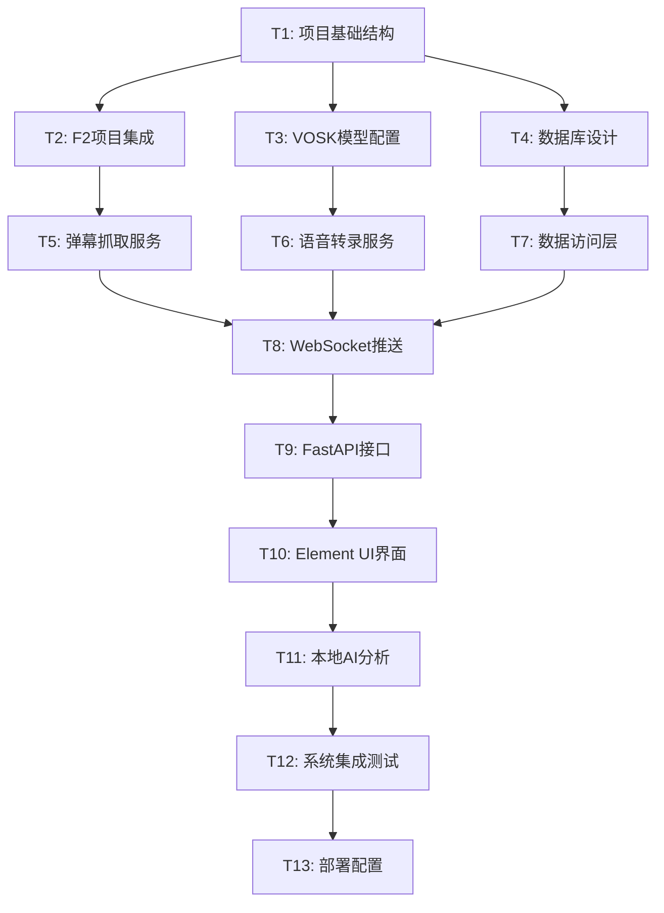

# 提猫直播助手MVP - 原子任务拆分

## 任务依赖关系图

## 详细任务定义

### T1: 项目基础结构搭建
**输入约束:**
- 技术架构设计文档
- 开发环境要求 (Python 3.11, Node.js)

**输出约束:**
- 完整的项目目录结构
- 基础配置文件 (requirements.txt, package.json)
- 开发环境 Docker 配置

**实现约束:**
- 严格按照架构设计的目录结构
- 所有Python包正确初始化 (__init__.py)
- 环境变量配置模板

**验收标准:**
- [ ] 项目结构与设计文档一致
- [ ] pip install -r requirements.txt 成功
- [ ] Docker 环境可正常启动
- [ ] 基础配置文件完整

**预估时间:** 1小时

---

### T2: F2项目集成配置
**输入约束:**
- T1完成的项目结构
- F2项目文档和API接口
- 抖音直播间测试数据

**输出约束:**
- F2库集成到项目中
- 抖音直播间连接测试通过
- 基础的弹幕消息解析

**实现约束:**
- 使用F2的DouyinHandler和WebSocketCrawler
- 配置游客cookie生成 (TokenManager.gen_ttwid)
- 支持WebcastChatMessage等核心消息类型

**验收标准:**
- [ ] F2库安装并可正常导入
- [ ] 能够获取直播间基础信息
- [ ] WebSocket连接建立成功
- [ ] 可接收到聊天消息

**预估时间:** 1.5小时

---

### T3: VOSK模型配置
**输入约束:**
- T1完成的项目结构
- VOSK中文模型 (vosk-model-cn-0.22)
- 音频处理需求

**输出约束:**
- VOSK模型下载并配置
- 基础音频识别功能
- 音频流处理管道

**实现约束:**
- 使用vosk-model-cn-0.22中文模型
- 支持实时音频流处理 (16kHz采样率)
- 输出JSON格式识别结果

**验收标准:**
- [ ] VOSK模型文件正确加载
- [ ] 可识别中文语音内容
- [ ] 识别延迟 < 3秒
- [ ] 置信度信息可获取

**预估时间:** 1小时

---

### T4: 数据库设计实现
**输入约束:**
- T1完成的项目结构
- 架构设计中的数据模型
- SQLite数据库需求

**输出约束:**
- 完整的数据表结构
- 数据访问层基础类
- 数据库初始化脚本

**实现约束:**
- 使用SQLite轻量级数据库
- aiosqlite异步数据库操作
- 数据模型与业务需求对齐

**验收标准:**
- [ ] 所有数据表创建成功
- [ ] 基础CRUD操作正常
- [ ] 数据库连接池工作正常
- [ ] 事务处理正确实现

**预估时间:** 1小时

---

### T5: F2弹幕抓取服务
**输入约束:**
- T2完成的F2集成
- T4完成的数据库
- WebSocket消息回调需求

**输出约束:**
- 完整的弹幕抓取服务类
- 多种消息类型处理
- 数据存储和推送功能

**实现约束:**
- 处理WebcastChatMessage、WebcastGiftMessage等
- 实时存储到数据库
- 通过WebSocket推送到前端
- 错误处理和重连机制

**验收标准:**
- [ ] 可稳定抓取直播弹幕
- [ ] 消息解析正确完整
- [ ] 数据存储无丢失
- [ ] 网络异常自动重连

**预估时间:** 2小时

---

### T6: VOSK语音转录服务  
**输入约束:**
- T3完成的VOSK配置
- T4完成的数据库
- 音频流处理需求

**输出约束:**
- 语音转录服务类
- 实时音频流处理
- 转录结果存储和推送

**实现约束:**
- 支持实时麦克风音频流
- 批量音频文件处理
- 识别结果格式标准化
- 置信度评估和过滤

**验收标准:**
- [ ] 实时语音转录正常工作
- [ ] 中文识别准确率 > 80%
- [ ] 转录延迟 < 3秒
- [ ] 音频格式兼容性好

**预估时间:** 2小时

---

### T7: 数据访问层实现
**输入约束:**
- T4完成的数据库设计
- 业务数据模型定义
- 异步操作需求

**输出约束:**
- 完整的数据访问类
- 异步CRUD操作方法
- 数据查询和统计功能

**实现约束:**
- 使用aiosqlite异步操作
- 实现连接池管理
- 提供事务支持
- 数据验证和错误处理

**验收标准:**
- [ ] 所有数据操作方法正常
- [ ] 异步性能表现良好
- [ ] 数据一致性保证
- [ ] 错误处理完善

**预估时间:** 1.5小时

---

### T8: WebSocket推送服务
**输入约束:**
- T5完成的弹幕抓取
- T6完成的语音转录
- 实时通信需求

**输出约束:**
- WebSocket服务器实现
- 消息广播管理器
- 客户端连接管理

**实现约束:**
- 支持多客户端连接
- 消息类型分发机制
- 连接状态监控
- 自动断线重连

**验收标准:**
- [ ] WebSocket连接稳定
- [ ] 消息推送实时准确
- [ ] 支持多客户端并发
- [ ] 连接异常恢复正常

**预估时间:** 1.5小时

---

### T9: FastAPI接口开发
**输入约束:**
- T7完成的数据访问层
- T8完成的WebSocket服务
- API接口设计文档

**输出约束:**
- 完整的REST API接口
- 请求验证和响应格式
- API文档和测试用例

**实现约束:**
- 使用FastAPI框架
- 标准的HTTP状态码
- 统一的错误处理
- API版本管理

**验收标准:**
- [ ] 所有API接口正常工作
- [ ] 请求响应格式正确
- [ ] 错误处理完善
- [ ] API文档完整

**预估时间:** 2小时

---

### T10: Element UI界面开发
**输入约束:**
- T9完成的API接口
- 可爱猫咪设计风格
- 三区域布局需求

**输出约束:**
- 完整的HTML页面
- Element UI组件集成
- 可爱风格CSS样式
- JavaScript交互逻辑

**实现约束:**
- 使用Element UI 2.15组件库
- 响应式布局设计
- 可爱猫咪主题元素
- 原生JavaScript实现

**验收标准:**
- [ ] 界面美观符合设计要求
- [ ] 三区域布局正确显示
- [ ] Element UI组件工作正常
- [ ] 响应式适配良好

**预估时间:** 3小时

---

### T11: 本地AI分析引擎
**输入约束:**
- T7完成的数据访问
- jieba和SnowNLP库
- AI分析需求

**输出约束:**
- AI分析服务类
- 热词提取算法
- 情感分析功能
- 建议生成逻辑

**实现约束:**
- 使用jieba进行中文分词
- SnowNLP情感分析
- 热词统计和排序
- 智能建议生成规则

**验收标准:**
- [ ] 热词提取准确有效
- [ ] 情感分析结果合理
- [ ] AI建议实用性强
- [ ] 分析性能满足要求

**预估时间:** 2小时

---

### T12: 系统集成测试
**输入约束:**
- T10完成的前端界面
- T11完成的AI分析
- 完整功能流程

**输出约束:**
- 端到端测试用例
- 性能测试报告
- 功能验证结果
- 问题修复方案

**实现约束:**
- 测试所有核心功能
- 验证性能指标
- 模拟异常场景
- 用户体验测试

**验收标准:**
- [ ] 所有功能测试通过
- [ ] 性能指标达到要求
- [ ] 异常处理验证通过
- [ ] 用户体验流程完整

**预估时间:** 2小时

---

### T13: 部署配置优化
**输入约束:**
- T12完成的系统测试
- Docker部署需求
- 生产环境配置

**输出约束:**
- Docker容器配置
- 环境变量管理
- 启动脚本
- 部署文档

**实现约束:**
- 支持一键部署
- 环境隔离
- 日志管理
- 监控配置

**验收标准:**
- [ ] Docker部署成功
- [ ] 环境配置正确
- [ ] 服务启动正常
- [ ] 部署文档清晰

**预估时间:** 1小时

## 并行执行策略

### 第一天 (8小时)
**上午 (4小时)**
- T1: 项目基础结构 (1h) 
- T2: F2项目集成 (1.5h)
- T3: VOSK模型配置 (1h)
- T4: 数据库设计 (0.5h)

**下午 (4小时)**  
- T5: F2弹幕抓取服务 (2h)
- T6: VOSK语音转录服务 (2h)

### 第二天 (8小时)
**上午 (4小时)**
- T7: 数据访问层 (1.5h)
- T8: WebSocket推送服务 (1.5h)
- T9: FastAPI接口开发 (1h)

**下午 (4小时)**
- T10: Element UI界面开发 (3h)
- T11: 本地AI分析引擎 (1h)

### 第三天 (8小时)
**上午 (2小时)**
- T11: AI分析引擎完善 (1h)
- T12: 系统集成测试 (1h)

**下午 (6小时)**
- T12: 集成测试完善 (1h)
- T13: 部署配置 (1h)
- 整体优化和文档 (2h)
- 演示准备和验收 (2h)

## 风险缓解策略

### 高风险任务
- **T2 F2集成**: 可能遇到API变更，准备模拟数据备选
- **T3 VOSK配置**: 模型下载或配置问题，准备备用模型
- **T6 语音转录**: 识别准确率不达标，降低验收标准

### 关键路径任务
- T1 → T2 → T5 → T8 → T10 (弹幕功能核心路径)
- T1 → T3 → T6 → T8 → T10 (语音功能核心路径)

### 应急预案
- F2集成失败：使用模拟弹幕数据
- VOSK效果差：集成在线语音API备选
- 时间不够：优先完成核心功能，界面可简化

---

**任务拆分完成**
- ✅ 13个原子任务，依赖关系清晰
- ✅ 每个任务独立可验证
- ✅ 工时估算合理，3天可完成
- ✅ 风险识别完整，有应急预案

**下一步**: 进入审批阶段 (Approve)