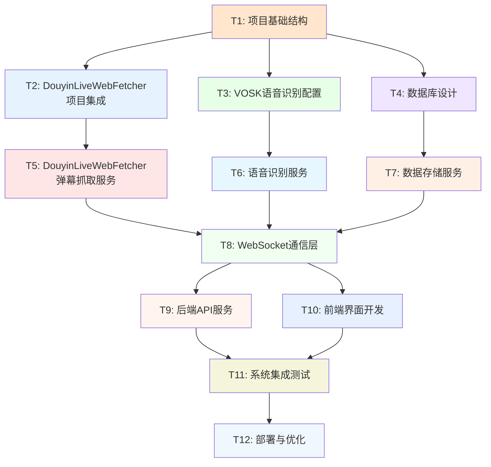

# 提猫直播助手MVP - 原子任务拆分

## 任务依赖关系图

## 原子任务详细定义

### T1: 项目基础结构
**输入约束**: 现有项目代码、开发环境要求
**输出约束**: 标准化项目结构、环境配置文件、依赖管理
**实现约束**: 遵循Python项目最佳实践、支持虚拟环境
**依赖关系**: 无前置依赖

### T2: DouyinLiveWebFetcher项目集成配置
**输入约束**: 
- DouyinLiveWebFetcher项目文档和API接口
- 现有项目架构约束
- Python环境兼容性要求

**输出约束**: 
- DouyinLiveWebFetcher库集成到项目中
- 配置文件和环境变量设置
- 基础连接测试通过

**实现约束**: 
- 使用DouyinLiveWebFetcher的DouyinLiveWebFetcher和WebSocket连接功能
- 保持与现有架构的兼容性
- 最小化依赖冲突

**验收标准**:
- [ ] DouyinLiveWebFetcher库安装并可正常导入
- [ ] 基础配置文件创建完成
- [ ] 连接测试脚本运行成功
- [ ] 无依赖冲突错误
- [ ] 文档更新完成

**依赖关系**: T1 → T2

### T3: VOSK语音识别配置
**输入约束**: VOSK中文模型文件、音频处理需求
**输出约束**: VOSK服务配置、中文模型加载、音频接口定义
**实现约束**: 支持实时音频流处理、异步处理架构
**依赖关系**: T1 → T3

### T4: 数据库设计
**输入约束**: 数据存储需求、性能要求
**输出约束**: 数据库表结构、索引设计、迁移脚本
**实现约束**: 使用SQLite、支持异步操作、数据完整性约束
**依赖关系**: T1 → T4

### T5: DouyinLiveWebFetcher弹幕抓取服务
**输入约束**: 
- T2完成的DouyinLiveWebFetcher集成
- 直播间URL或房间号
- 消息类型定义

**输出约束**: 
- 实时弹幕抓取服务
- 消息解析和格式化
- 错误处理和重连机制

**实现约束**: 
- 异步WebSocket连接
- 支持多种消息类型（弹幕、礼物、点赞等）
- 实现连接池管理

**验收标准**:
- [ ] 成功连接抖音直播间
- [ ] 实时接收弹幕消息
- [ ] 消息解析准确率 > 95%
- [ ] 连接断开自动重连
- [ ] 支持多直播间同时监控

**依赖关系**: T2 → T5

### T6: 语音识别服务
**输入约束**: T3完成的VOSK配置、音频流数据
**输出约束**: 语音转文字服务、识别结果格式化、置信度评估
**实现约束**: 实时处理、支持中文识别、异步架构
**依赖关系**: T3 → T6

### T7: 数据存储服务
**输入约束**: T4完成的数据库设计、业务数据模型
**输出约束**: 数据访问层、CRUD操作接口、数据验证
**实现约束**: 异步数据库操作、事务支持、连接池管理
**依赖关系**: T4 → T7

### T8: WebSocket通信层
**输入约束**: T5、T6、T7的服务输出
**输出约束**: WebSocket服务器、消息广播机制、客户端连接管理
**实现约束**: 支持多客户端、消息队列、连接状态管理
**依赖关系**: T5, T6, T7 → T8

### T9: 后端API服务
**输入约束**: T8的WebSocket通信层、业务逻辑需求
**输出约束**: RESTful API接口、服务状态管理、配置接口
**实现约束**: FastAPI框架、异步处理、API文档自动生成
**依赖关系**: T8 → T9

### T10: 前端界面开发
**输入约束**: UI/UX设计、WebSocket客户端需求
**输出约束**: Vue.js应用、Electron桌面应用、用户界面
**实现约束**: 响应式设计、实时数据显示、用户交互
**依赖关系**: T8 → T10

### T11: 系统集成测试
**输入约束**: T9、T10完成的前后端应用
**输出约束**: 测试套件、性能报告、问题修复
**实现约束**: 端到端测试、性能测试、兼容性测试
**依赖关系**: T9, T10 → T11

### T12: 部署与优化
**输入约束**: T11测试通过的应用
**输出约束**: 部署包、安装程序、用户文档
**实现约束**: 跨平台支持、一键安装、性能优化
**依赖关系**: T11 → T12

## 工时估算

| 任务ID | 任务名称 | 预估工时 | 复杂度 | 风险等级 |
|--------|----------|----------|--------|----------|
| T1 | 项目基础结构 | 1h | 低 | 低 |
| T2 | DouyinLiveWebFetcher项目集成 | 1.5h | 中 | 中 |
| T3 | VOSK语音识别配置 | 2h | 中 | 中 |
| T4 | 数据库设计 | 1h | 低 | 低 |
| T5 | DouyinLiveWebFetcher弹幕抓取服务 | 2h | 高 | 高 |
| T6 | 语音识别服务 | 1.5h | 中 | 中 |
| T7 | 数据存储服务 | 1h | 低 | 低 |
| T8 | WebSocket通信层 | 2h | 中 | 中 |
| T9 | 后端API服务 | 1.5h | 中 | 低 |
| T10 | 前端界面开发 | 4h | 高 | 中 |
| T11 | 系统集成测试 | 2h | 中 | 中 |
| T12 | 部署与优化 | 1.5h | 中 | 低 |

**总计**: 20小时

## 关键路径分析

**关键路径**: T1 → T2 → T5 → T8 → T9 → T11 → T12
**关键路径工时**: 10.5小时

**并行路径1**: T1 → T3 → T6 → T8 (5.5小时)
**并行路径2**: T1 → T4 → T7 → T8 (3小时)
**并行路径3**: T8 → T10 → T11 (6小时)

## 风险评估

### 高风险任务
- **T2 DouyinLiveWebFetcher集成**: 可能遇到API变更，准备模拟数据备选
- **T5 DouyinLiveWebFetcher弹幕抓取**: 网络连接稳定性，实现重连机制

### 中风险任务
- **T3 VOSK配置**: 模型文件大小和加载时间
- **T6 语音识别**: 识别准确率和实时性平衡
- **T8 WebSocket通信**: 多客户端连接管理
- **T10 前端开发**: 实时数据展示性能优化
- **T11 集成测试**: 跨模块兼容性问题

## 质量保证

### 测试策略
- **单元测试**: 每个服务模块独立测试
- **集成测试**: 模块间接口测试
- **端到端测试**: 完整用户流程测试
- **性能测试**: 并发和负载测试

### 代码质量
- 代码审查机制
- 类型提示和文档
- 错误处理和日志
- 安全性检查

## 应急预案

### 技术风险应对
- **DouyinLiveWebFetcher集成失败**: 使用模拟弹幕数据
- **VOSK识别率低**: 降级到文本输入模式
- **WebSocket连接不稳定**: 实现HTTP轮询备选方案

### 时间风险应对
- **开发延期**: 优先实现核心功能，次要功能后续迭代
- **测试时间不足**: 自动化测试脚本，重点测试关键路径

---

**原子任务拆分完成** ✅
- 12个原子任务，依赖关系清晰
- 工时估算总计20小时
- 风险评估和应急预案完善
- 质量保证措施明确

**下一步**: 进入审批阶段 (Approve) 🚀