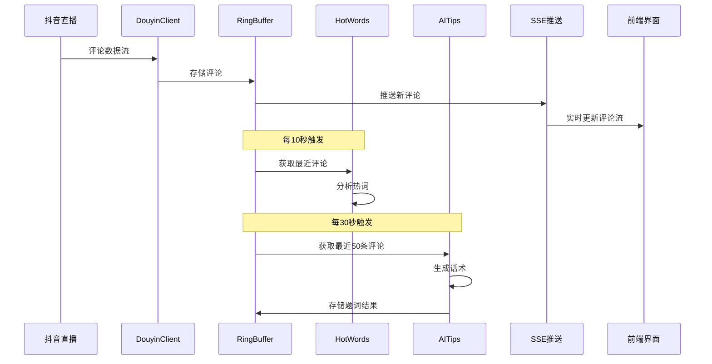

# 提猫直播助手 · 系统架构设计

## 整体架构图

```mermaid
graph TB
    subgraph "Electron 桌面端"
        A[main.js 主进程] --> B[BrowserWindow 渲染窗口]
        B --> C[renderer/index.html]
        C --> D[renderer/app.js]
        C --> E[renderer/styles.css]
        A --> F[preload.js 预加载脚本]
    end
    
    subgraph "Flask 后端服务"
        G[app.py 主应用] --> H[路由层]
        H --> I[/api/health]
        H --> J[/api/stream/comments SSE]
        H --> K[/api/hotwords]
        H --> L[/api/tips/latest]
        H --> M[/api/config]
        
        G --> N[业务逻辑层]
        N --> O[ingest/dy_client.py 评论抓取]
        N --> P[nlp/hotwords.py 热词分析]
        N --> Q[ai/tips.py AI话术生成]
        N --> R[utils/ring_buffer.py 环形缓冲]
    end
    
    subgraph "外部服务"
        S[抖音直播API]
        T[AI服务 DeepSeek/OpenAI/豆包]
    end
    
    D -->|HTTP/SSE| H
    O -->|抓取评论| S
    Q -->|调用AI| T
    O --> R
    R --> P
    R --> Q
```

## 系统分层设计

### 1. 表现层 (Presentation Layer)
- **Electron 主进程**: 窗口管理、进程通信、Flask子进程启动
- **渲染进程**: HTML/CSS界面、JavaScript交互逻辑
- **通信机制**: IPC通信 + HTTP API调用

### 2. 服务层 (Service Layer)  
- **Flask Web服务**: RESTful API + Server-Sent Events
- **路由管理**: 统一的API端点管理
- **中间件**: 跨域处理、错误处理、日志记录

### 3. 业务逻辑层 (Business Logic Layer)
- **评论抓取服务**: 抖音直播评论实时采集
- **热词分析服务**: 词频统计、停用词过滤、同义词合并
- **AI话术服务**: LLM调用、prompt工程、结果后处理
- **数据管理服务**: 环形缓冲区管理、数据清理

### 4. 数据层 (Data Layer)
- **内存存储**: 环形缓冲区（评论队列、题词历史）
- **配置管理**: 环境变量、运行时配置

## 核心组件设计

### Electron 主进程 (main.js)
```javascript
// 职责：窗口管理 + Flask子进程管理
class MainProcess {
    createWindow()      // 创建主窗口
    startFlaskServer()  // 启动Flask子进程
    setupIPC()          // 设置进程间通信
    handleAppEvents()   // 处理应用生命周期
}
```

### Flask 应用核心 (app.py)
```python
# 职责：API路由 + SSE推送 + 业务协调
class FlaskApp:
    def setup_routes()          # 设置API路由
    def setup_sse()             # 配置Server-Sent Events
    def start_background_tasks() # 启动后台任务
    def handle_cors()           # 处理跨域请求
```

### 评论抓取模块 (dy_client.py)
```python
# 职责：抖音评论实时抓取
class DouyinClient:
    def connect_live_room(room_id)  # 连接直播间
    def fetch_comments()            # 抓取评论流
    def parse_comment_data()        # 解析评论数据
    def handle_connection_error()   # 处理连接异常
```

### 环形缓冲区 (ring_buffer.py)
```python
# 职责：高效的内存数据管理
class RingBuffer:
    def __init__(capacity)      # 初始化缓冲区
    def push(item)              # 添加新数据
    def get_recent(count)       # 获取最近N条
    def get_all()               # 获取所有数据
    def clear()                 # 清空缓冲区
```

## 接口契约设计

### 1. 健康检查接口
```http
GET /api/health
Response: 200 OK
{
    "status": "healthy",
    "timestamp": 1726800000,
    "services": {
        "flask": "running",
        "comment_fetcher": "active",
        "ai_service": "connected"
    }
}
```

### 2. 评论流接口 (SSE)
```http
GET /api/stream/comments
Headers: Accept: text/event-stream
Response: 200 OK
Content-Type: text/event-stream

data: {"id":"c123","user":"阿强","text":"有蓝色吗","ts":1726800000}

data: {"id":"c124","user":"小美","text":"价格多少","ts":1726800001}
```

### 3. 热词接口
```http
GET /api/hotwords?limit=10&window=120
Response: 200 OK
{
    "hotwords": [
        {"word": "价格", "score": 0.83, "count": 15},
        {"word": "链接", "score": 0.61, "count": 11},
        {"word": "颜色", "score": 0.45, "count": 8}
    ],
    "window_seconds": 120,
    "total_comments": 45
}
```

### 4. AI题词接口
```http
GET /api/tips/latest?limit=3
Response: 200 OK
{
    "tips": [
        {
            "text": "问价的多，蓝色款券在小黄车，拍前我教你领～",
            "ts": 1726800030,
            "confidence": 0.92
        },
        {
            "text": "大家关心的链接已经放在小黄车里了，记得领券哦！",
            "ts": 1726800000,
            "confidence": 0.88
        }
    ],
    "generated_at": 1726800030
}
```

### 5. 配置管理接口
```http
POST /api/config
Content-Type: application/json
{
    "room_id": "123456789",
    "tip_interval": 30,
    "ai_provider": "deepseek",
    "hotword_window": 120
}

Response: 200 OK
{
    "status": "updated",
    "config": { /* 更新后的配置 */ }
}
```

## 数据流设计

### 评论处理流程


## 异常处理策略

### 1. 网络异常
- **抖音API断连**: 自动重连机制，最大重试3次
- **AI服务超时**: 降级到缓存话术，记录错误日志
- **SSE连接中断**: 客户端自动重连，服务端保持连接池

### 2. 数据异常
- **评论格式错误**: 跳过异常数据，记录警告日志
- **内存溢出**: 自动清理过期数据，调整缓冲区大小
- **AI响应异常**: 使用默认话术模板，标记服务状态

### 3. 进程异常
- **Flask进程崩溃**: Electron主进程自动重启Flask
- **Electron崩溃**: 保存运行状态，支持快速恢复
- **资源耗尽**: 监控内存使用，及时释放资源

## 性能优化设计

### 1. 内存管理
- 环形缓冲区限制数据量（评论200条，题词10条）
- 定时清理过期数据（超过5分钟的评论）
- 对象池复用，减少GC压力

### 2. 网络优化
- SSE连接复用，减少连接开销
- AI API调用批量处理，降低请求频率
- 本地缓存热词结果，避免重复计算

### 3. 并发处理
- 异步处理评论抓取和AI调用
- 多线程处理热词分析
- 非阻塞的SSE推送机制

---
*架构设计完成时间: 2024-01-20*  
*版本: v1.0*  
*状态: 设计完成*