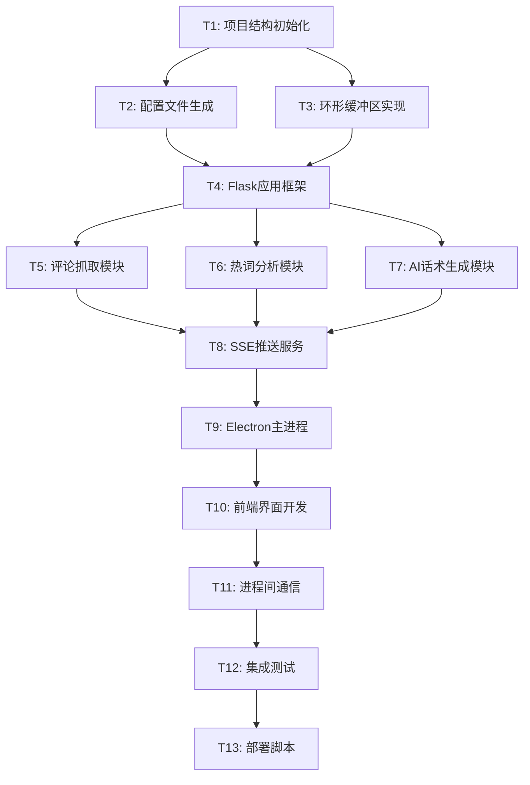

# 提猫直播助手 · 原子任务拆分

## 任务依赖关系图

## 原子任务详细定义

### T1: 项目结构初始化
**输入约束:**
- PRD文档和架构设计文档
- 现有项目根目录

**输出约束:**
- 完整的目录结构
- 所有必要的空文件和文件夹
- 基础的README.md

**实现约束:**
- 严格按照PRD中定义的目录结构
- 创建所有必要的Python包（__init__.py文件）
- 遵循Python和Node.js项目规范

**依赖关系:**
- 前置依赖: 无
- 后置任务: T2, T3

**验收标准:**
- [ ] 目录结构与PRD完全一致
- [ ] 所有Python包正确初始化
- [ ] README.md包含基本项目信息

---

### T2: 配置文件生成
**输入约束:**
- 项目结构已创建
- 技术栈需求（Python Flask + Electron）

**输出约束:**
- package.json（Electron配置）
- requirements.txt（Python依赖）
- .env.example（环境变量模板）
- 启动脚本配置

**实现约束:**
- Node.js版本 ≥16.x
- Python版本 ≥3.8
- 包含所有必要的依赖包和版本号

**依赖关系:**
- 前置依赖: T1
- 后置任务: T4

**验收标准:**
- [ ] npm install 成功执行
- [ ] pip install -r requirements.txt 成功执行
- [ ] .env.example 包含所有必要的环境变量

---

### T3: 环形缓冲区实现
**输入约束:**
- 项目结构已创建
- 数据结构设计（评论200条，题词10条）

**输出约束:**
- utils/ring_buffer.py 完整实现
- 单元测试文件
- 性能基准测试

**实现约束:**
- 线程安全的实现
- O(1)时间复杂度的插入和获取
- 内存使用可控

**依赖关系:**
- 前置依赖: T1
- 后置任务: T4, T5, T6, T7

**验收标准:**
- [ ] 支持200条评论缓存
- [ ] 支持10条题词历史
- [ ] 单元测试覆盖率 ≥90%
- [ ] 内存使用稳定（无泄漏）

---

### T4: Flask应用框架
**输入约束:**
- 配置文件已生成
- 环形缓冲区已实现
- API接口设计文档

**输出约束:**
- server/app.py 主应用文件
- 路由配置和中间件
- 错误处理机制
- 基础的健康检查接口

**实现约束:**
- 支持CORS跨域请求
- 统一的错误处理和日志记录
- 端口5001监听

**依赖关系:**
- 前置依赖: T2, T3
- 后置任务: T5, T6, T7, T8

**验收标准:**
- [ ] Flask应用可正常启动
- [ ] /api/health 接口返回正确状态
- [ ] 支持跨域请求
- [ ] 错误日志正确记录

---

### T5: 评论抓取模块
**输入约束:**
- Flask框架已搭建
- 环形缓冲区可用
- 抖音直播API文档（或模拟数据方案）

**输出约束:**
- ingest/dy_client.py 评论抓取实现
- 模拟数据生成器（开发阶段）
- 连接管理和异常处理

**实现约束:**
- 支持实时评论流抓取
- 自动重连机制
- 数据格式标准化

**依赖关系:**
- 前置依赖: T4
- 后置任务: T8

**验收标准:**
- [ ] 能够连接抖音直播间
- [ ] 实时抓取评论数据
- [ ] 异常情况自动重连
- [ ] 模拟数据生成器可用

---

### T6: 热词分析模块
**输入约束:**
- Flask框架已搭建
- 环形缓冲区可用
- 中文分词和停用词库

**输出约束:**
- nlp/hotwords.py 热词分析实现
- 停用词过滤功能
- 词频统计和排序

**实现约束:**
- 支持中文分词
- 可配置的时间窗口（默认2分钟）
- 高效的词频统计算法

**依赖关系:**
- 前置依赖: T4
- 后置任务: T8

**验收标准:**
- [ ] 正确提取热词Top N
- [ ] 停用词过滤有效
- [ ] 响应时间 ≤100ms
- [ ] 支持同义词合并

---

### T7: AI话术生成模块
**输入约束:**
- Flask框架已搭建
- 环形缓冲区可用
- AI API密钥和配置

**输出约束:**
- ai/tips.py AI话术生成实现
- 多AI提供商支持
- Prompt模板和优化

**实现约束:**
- 支持DeepSeek/OpenAI/豆包切换
- 30秒生成间隔
- 异常处理和降级策略

**依赖关系:**
- 前置依赖: T4
- 后置任务: T8

**验收标准:**
- [ ] 生成1-2句可用话术
- [ ] 支持多AI提供商切换
- [ ] API调用异常处理完善
- [ ] 生成延迟 ≤2s

---

### T8: SSE推送服务
**输入约束:**
- Flask框架已搭建
- 评论抓取、热词分析、AI话术模块已完成

**输出约束:**
- Server-Sent Events推送实现
- 实时数据流管理
- 连接池管理

**实现约束:**
- 支持多客户端连接
- 自动断线重连
- 数据格式标准化

**依赖关系:**
- 前置依赖: T5, T6, T7
- 后置任务: T9

**验收标准:**
- [ ] SSE连接稳定
- [ ] 实时推送评论数据
- [ ] 支持多客户端并发
- [ ] 连接异常自动恢复

---

### T9: Electron主进程
**输入约束:**
- package.json已配置
- Flask后端服务可用

**输出约束:**
- electron/main.js 主进程实现
- 窗口管理和生命周期
- Flask子进程管理

**实现约束:**
- 自动启动Flask服务
- 窗口大小和位置管理
- 进程间通信设置

**依赖关系:**
- 前置依赖: T8
- 后置任务: T10

**验收标准:**
- [ ] Electron应用正常启动
- [ ] 自动启动Flask子进程
- [ ] 窗口管理功能正常
- [ ] 应用退出时清理资源

---

### T10: 前端界面开发
**输入约束:**
- Electron主进程已完成
- 后端API接口可用
- UI设计要求（三区布局）

**输出约束:**
- renderer/index.html 主界面
- renderer/styles.css 样式文件
- renderer/app.js 交互逻辑

**实现约束:**
- 纯HTML/CSS实现，少量原生JS
- 响应式布局
- 实时数据更新

**依赖关系:**
- 前置依赖: T9
- 后置任务: T11

**验收标准:**
- [ ] 三区域布局正确显示
- [ ] 评论流实时滚动
- [ ] 热词榜正确排序
- [ ] 题词区30s自动刷新

---

### T11: 进程间通信
**输入约束:**
- Electron主进程和渲染进程已完成
- Flask后端API可用

**输出约束:**
- IPC通信机制
- HTTP API调用封装
- 错误处理和重试机制

**实现约束:**
- 支持IPC和HTTP两种通信方式
- 自动重连和错误恢复
- 数据同步机制

**依赖关系:**
- 前置依赖: T10
- 后置任务: T12

**验收标准:**
- [ ] IPC通信正常
- [ ] HTTP API调用稳定
- [ ] 网络异常自动重试
- [ ] 数据同步及时准确

---

### T12: 集成测试
**输入约束:**
- 所有核心功能模块已完成
- 测试用例和测试数据

**输出约束:**
- 端到端测试套件
- 性能测试报告
- 兼容性测试结果

**实现约束:**
- 覆盖所有主要功能
- 性能指标验证
- 异常场景测试

**依赖关系:**
- 前置依赖: T11
- 后置任务: T13

**验收标准:**
- [ ] 所有功能测试通过
- [ ] 性能指标达标
- [ ] 异常处理验证通过
- [ ] 用户体验流程完整

---

### T13: 部署脚本
**输入约束:**
- 完整的应用程序
- 部署环境要求

**输出约束:**
- 一键启动脚本
- 环境检查脚本
- 用户使用文档

**实现约束:**
- 支持Windows/macOS/Linux
- 自动环境检查
- 错误提示和解决方案

**依赖关系:**
- 前置依赖: T12
- 后置任务: 无

**验收标准:**
- [ ] npm run dev 一键启动
- [ ] 环境检查功能完善
- [ ] 用户文档清晰易懂
- [ ] 错误提示准确有用

## 并行执行策略

### 第一阶段（并行）
- T1: 项目结构初始化

### 第二阶段（并行）
- T2: 配置文件生成
- T3: 环形缓冲区实现

### 第三阶段（并行）
- T4: Flask应用框架

### 第四阶段（并行）
- T5: 评论抓取模块
- T6: 热词分析模块  
- T7: AI话术生成模块

### 第五阶段（串行）
- T8: SSE推送服务
- T9: Electron主进程
- T10: 前端界面开发
- T11: 进程间通信

### 第六阶段（串行）
- T12: 集成测试
- T13: 部署脚本

## 风险评估

### 高风险任务
- **T5 评论抓取模块**: 依赖外部API，可能变更
- **T7 AI话术生成模块**: AI服务稳定性和费用控制

### 中风险任务
- **T8 SSE推送服务**: 实时通信复杂性
- **T11 进程间通信**: Electron与Flask集成

### 低风险任务
- **T1-T4**: 基础设施搭建，技术成熟
- **T10**: 前端界面，需求明确

---
*任务拆分完成时间: 2024-01-20*  
*预计总工期: 3天*  
*并行度: 最高4个任务同时进行*