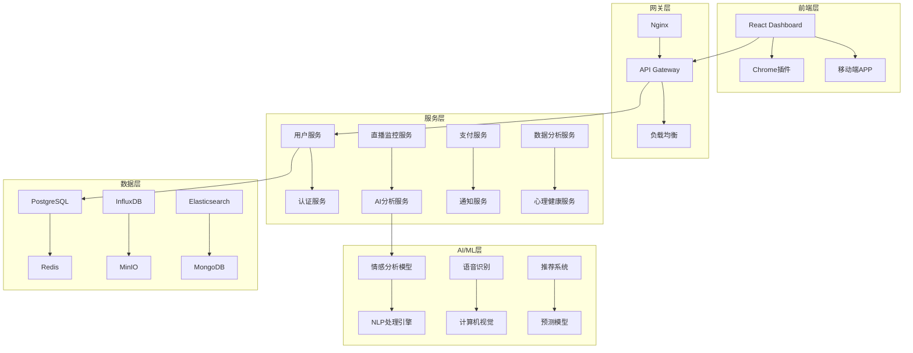

# 提猫直播管理平台 - 产品需求文档 (PRD v2.0)

## 1. 产品概述

### 1.1 产品愿景
打造国内领先的AI驱动直播管理平台，为主播和MCN机构提供全方位的直播运营解决方案，通过AI技术提升直播效果和主播心理健康。

### 1.2 产品定位
- **目标用户**: 职业主播、MCN机构、直播运营团队
- **核心价值**: AI智能分析 + 情绪管理 + 运营优化
- **商业模式**: SaaS订阅 + 增值服务

### 1.3 产品目标
- **短期目标** (3个月): 完成MVP开发，获得100个付费用户
- **中期目标** (1年): 服务1000+主播，月收入100万+
- **长期目标** (3年): 成为直播行业标准工具，IPO准备

## 2. 核心功能模块

### 2.1 用户管理系统 👤

#### 2.1.1 多角色用户体系
```
├── 超级管理员 (Super Admin)
│   ├── 系统配置权限
│   ├── 全局数据查看
│   └── 用户管理权限
├── MCN机构管理员 (Agency Admin)  
│   ├── 机构主播管理
│   ├── 数据统计查看
│   └── 套餐购买管理
├── 主播 (Streamer)
│   ├── 个人直播间管理
│   ├── 数据分析查看
│   └── AI助手使用
└── 运营助理 (Assistant)
    ├── 协助主播管理
    ├── 部分数据查看
    └── 基础功能使用
```

#### 2.1.2 身份认证与安全
- **多因素认证**: 手机号 + 微信 + 实名认证
- **JWT Token**: 安全的会话管理
- **权限控制**: RBAC角色权限管理
- **数据加密**: 敏感信息AES256加密
- **操作日志**: 完整的用户行为追踪

#### 2.1.3 个人中心
- **个人资料**: 头像、昵称、认证信息
- **直播间绑定**: 支持多平台直播间管理
- **偏好设置**: AI提示风格、通知设置
- **使用统计**: 功能使用时长、效果数据

### 2.2 支付订阅系统 💳

#### 2.2.1 套餐体系设计
```
📦 基础版 (¥199/月)
├── 单直播间监控
├── 基础数据分析
├── 标准AI提示词
└── 7天客服支持

📦 专业版 (¥599/月) ⭐推荐
├── 3个直播间监控
├── 高级数据分析
├── 情绪管理功能
├── 自定义AI训练
└── 24小时客服支持

📦 企业版 (¥1999/月)
├── 无限直播间监控
├── 深度数据洞察
├── 团队协作功能
├── API接口调用
└── 专属客服经理

📦 定制版 (面议)
├── 私有化部署
├── 定制功能开发
├── 数据迁移服务
└── 技术支持服务
```

#### 2.2.2 支付集成
- **支付方式**: 微信支付、支付宝、银行卡
- **订阅管理**: 自动续费、暂停、取消
- **发票系统**: 电子发票、增值税发票
- **财务管理**: 收入统计、退款处理

#### 2.2.3 会员权益
- **功能权限**: 不同套餐功能限制
- **数据存储**: 历史数据保留时长
- **API调用**: 每日调用次数限制
- **客服支持**: 响应时间SLA保障

### 2.3 智能弹幕系统 💬

#### 2.3.1 多平台弹幕采集
- **支持平台**: 抖音、快手、B站、小红书、淘宝直播
- **实时采集**: WebSocket连接，毫秒级延迟
- **数据清洗**: 过滤广告、敏感词、重复内容
- **弹幕分类**: 提问类、互动类、购买意向类

#### 2.3.2 弹幕可视化展示
```
🎯 弹幕流展示区
├── 实时滚动显示
├── 用户等级标识
├── VIP用户高亮
├── 关键词高亮
└── 表情符号解析

📊 弹幕统计面板
├── 每分钟弹幕量
├── 活跃用户数量
├── 互动率趋势
└── 热门话题词云
```

#### 2.3.3 智能弹幕分析
- **情感分析**: 正面、负面、中性情绪占比
- **意图识别**: 购买意向、咨询问题、闲聊互动
- **用户画像**: 年龄段、消费能力、兴趣标签
- **异常检测**: 恶意刷屏、机器人识别

### 2.4 数据分析系统 📈

#### 2.4.1 实时数据监控
```
🔥 核心指标大屏
├── 在线观众数
├── 弹幕互动率
├── 礼物收入统计
├── 新增关注数
└── 观众停留时长

📱 直播质量指标
├── 视频清晰度
├── 音频质量
├── 网络延迟
├── 卡顿率
└── 观众流失率
```

#### 2.4.2 历史数据分析
- **趋势分析**: 日、周、月数据对比
- **同比环比**: 历史同期数据对比
- **峰值分析**: 流量高峰时段识别
- **效果评估**: 营销活动效果追踪

#### 2.4.3 竞品对比分析
- **同类主播**: 数据对比排名
- **行业基准**: 行业平均水平对比
- **优劣势分析**: 强项弱项识别
- **改进建议**: AI生成优化建议

### 2.5 情绪统计系统 😊

#### 2.5.1 主播情绪识别
```
🎭 情绪识别技术栈
├── 语音情感分析
│   ├── 语调变化监测
│   ├── 语速节奏分析
│   └── 情绪词汇识别
├── 面部表情分析
│   ├── 实时表情捕捉
│   ├── 微表情识别
│   └── 疲劳度检测
└── 行为模式分析
    ├── 肢体动作频率
    ├── 互动积极度
    └── 状态稳定性
```

#### 2.5.2 观众情绪分析
- **弹幕情感**: NLP情感分析模型
- **互动热度**: 点赞、礼物、评论频率
- **留存意愿**: 观看时长、回访率
- **满意度评估**: 综合评分算法

#### 2.5.3 情绪数据可视化
```
😊 情绪仪表盘
├── 实时情绪指数 (0-100分)
├── 情绪变化趋势图
├── 异常情绪预警
└── 情绪分布饼图

📊 历史情绪报告
├── 每日情绪统计
├── 情绪波动分析
├── 压力水平评估
└── 心理健康建议
```

### 2.6 AI心态调节系统 🧠

#### 2.6.1 智能情绪干预
```
🤖 AI心理助手
├── 情绪状态评估
│   ├── 实时情绪监测
│   ├── 压力水平分析
│   └── 疲劳度检测
├── 个性化干预策略
│   ├── 放松音乐推荐
│   ├── 呼吸调节指导
│   └── 积极话术提示
└── 紧急干预机制
    ├── 严重负面情绪预警
    ├── 自动暂停建议
    └── 专业心理师连线
```

#### 2.6.2 心理健康管理
- **心理测评**: 定期心理健康评估问卷
- **情绪日记**: AI辅助情绪记录分析
- **压力管理**: 个性化压力缓解方案
- **作息建议**: 基于数据的作息优化

#### 2.6.3 专业心理支持
- **心理师团队**: 认证心理咨询师在线
- **危机干预**: 24小时心理危机热线
- **心理课程**: 情绪管理技能培训
- **同伴支持**: 主播互助社群

### 2.7 AI智能提示词系统 🎯

#### 2.7.1 智能话术生成
```
🎪 AI话术引擎
├── 实时场景分析
│   ├── 弹幕内容理解
│   ├── 观众情绪识别
│   ├── 商品推广时机
│   └── 互动冷场检测
├── 多维度话术生成
│   ├── 商品介绍话术
│   ├── 互动活跃话术
│   ├── 情绪调节话术
│   └── 紧急应对话术
└── 个性化定制
    ├── 主播风格学习
    ├── 观众偏好适配
    └── 品牌调性匹配
```

#### 2.7.2 智能提示系统
- **实时提示**: 基于场景的即时话术推荐
- **预设话术库**: 常用场景话术模板
- **自定义训练**: 基于主播风格的AI微调
- **效果反馈**: 话术使用效果跟踪优化

#### 2.7.3 高级AI功能
- **多模态分析**: 文本+语音+视觉综合分析
- **预测性建议**: 基于趋势的前瞻性建议
- **A/B测试**: 不同话术效果对比测试
- **持续学习**: 系统自动优化算法模型

## 3. 技术架构设计

### 3.1 整体架构图


### 3.2 技术栈选择
```
🖥 前端技术栈
├── React 18 + TypeScript
├── Ant Design Pro (UI组件库)
├── ECharts (数据可视化)
├── Socket.io (实时通信)
└── PWA (渐进式Web应用)

⚙️ 后端技术栈
├── Python FastAPI (高性能API框架)
├── Celery + Redis (异步任务队列)
├── PostgreSQL (主数据库)
├── InfluxDB (时序数据)
├── Elasticsearch (搜索引擎)
└── Docker + K8s (容器化部署)

🤖 AI/ML技术栈
├── PyTorch (深度学习框架)
├── Transformers (预训练模型)
├── OpenCV (计算机视觉)
├── SpeechRecognition (语音识别)
└── scikit-learn (机器学习)

☁️ 云服务技术栈
├── 阿里云/腾讯云 (基础设施)
├── CDN (内容分发网络)
├── OSS (对象存储服务)
└── SLB (负载均衡)
```

### 3.3 数据库设计
```sql
-- 用户表
CREATE TABLE users (
    id UUID PRIMARY KEY,
    username VARCHAR(50) UNIQUE NOT NULL,
    email VARCHAR(100) UNIQUE,
    phone VARCHAR(20),
    role ENUM('admin', 'agency', 'streamer', 'assistant'),
    subscription_plan VARCHAR(20),
    created_at TIMESTAMP DEFAULT NOW(),
    updated_at TIMESTAMP DEFAULT NOW()
);

-- 直播间表
CREATE TABLE live_rooms (
    id UUID PRIMARY KEY,
    user_id UUID REFERENCES users(id),
    platform VARCHAR(20),
    room_id VARCHAR(100),
    room_name VARCHAR(200),
    status ENUM('active', 'inactive', 'monitoring'),
    created_at TIMESTAMP DEFAULT NOW()
);

-- 弹幕记录表
CREATE TABLE danmaku_messages (
    id UUID PRIMARY KEY,
    room_id UUID REFERENCES live_rooms(id),
    user_name VARCHAR(100),
    content TEXT,
    emotion_score FLOAT,
    intent_type VARCHAR(50),
    timestamp TIMESTAMP DEFAULT NOW()
);

-- 情绪分析记录表
CREATE TABLE emotion_records (
    id UUID PRIMARY KEY,
    user_id UUID REFERENCES users(id),
    emotion_type VARCHAR(20),
    intensity FLOAT,
    confidence FLOAT,
    source VARCHAR(20), -- 'voice', 'face', 'text'
    timestamp TIMESTAMP DEFAULT NOW()
);
```

## 4. AI服务设计

### 4.1 情感分析引擎
```python
class EmotionAnalysisEngine:
    """多模态情感分析引擎"""
    
    def __init__(self):
        self.text_analyzer = TextEmotionAnalyzer()
        self.voice_analyzer = VoiceEmotionAnalyzer()
        self.face_analyzer = FaceEmotionAnalyzer()
        
    def analyze_multimodal(self, text, audio, video):
        """综合分析文本、语音、视频情感"""
        text_emotion = self.text_analyzer.analyze(text)
        voice_emotion = self.voice_analyzer.analyze(audio)
        face_emotion = self.face_analyzer.analyze(video)
        
        # 多模态融合算法
        weighted_emotion = self.fusion_algorithm(
            text_emotion, voice_emotion, face_emotion
        )
        
        return weighted_emotion
```

### 4.2 智能话术生成
```python
class SmartCopyGenerator:
    """智能话术生成器"""
    
    def __init__(self, model_name="gpt-3.5-turbo"):
        self.llm = OpenAIChat(model_name)
        self.context_analyzer = ContextAnalyzer()
        
    def generate_suggestion(self, context):
        """基于上下文生成话术建议"""
        # 分析当前场景
        scene_analysis = self.context_analyzer.analyze(context)
        
        # 构建提示词
        prompt = self.build_prompt(scene_analysis)
        
        # 生成话术
        suggestion = self.llm.generate(prompt)
        
        return {
            'text': suggestion,
            'confidence': self.calculate_confidence(suggestion),
            'category': scene_analysis['category'],
            'urgency': scene_analysis['urgency']
        }
```

## 5. 商业模式设计

### 5.1 收入模式
```
💰 订阅收入 (70%)
├── 基础版: ¥199/月 × 1000用户 = ¥19.9万/月
├── 专业版: ¥599/月 × 500用户 = ¥29.95万/月
├── 企业版: ¥1999/月 × 100用户 = ¥19.99万/月
└── 总计: ¥69.84万/月

🛒 增值服务 (20%)
├── 定制AI训练: ¥5000/次
├── 专属客服: ¥1000/月
├── 数据报告: ¥500/份
└── 培训课程: ¥299/人

🤝 合作分成 (10%)
├── MCN机构分成: 营收5%
├── 平台推广分成: 营收3%
└── 第三方集成: 营收2%
```

### 5.2 成本结构
```
💻 技术成本 (40%)
├── 服务器费用: ¥8万/月
├── AI API调用: ¥5万/月
├── 第三方服务: ¥3万/月
└── 研发人员: ¥20万/月

👥 人力成本 (35%)
├── 产品团队: ¥15万/月
├── 运营团队: ¥10万/月
├── 客服团队: ¥5万/月
└── 管理团队: ¥8万/月

📈 市场成本 (25%)
├── 广告投放: ¥10万/月
├── 渠道推广: ¥5万/月
├── 内容营销: ¥3万/月
└── 活动费用: ¥2万/月
```

## 6. 项目计划

### 6.1 开发里程碑
```
📅 Phase 1: 基础平台 (1-3个月)
├── 用户管理系统
├── 支付订阅系统
├── 基础弹幕采集
└── 简单数据展示

📅 Phase 2: AI功能 (4-6个月)
├── 情感分析引擎
├── 智能话术生成
├── 数据分析系统
└── 基础心理健康功能

📅 Phase 3: 高级功能 (7-9个月)
├── 多模态情感识别
├── 智能心态调节
├── 高级数据洞察
└── 企业级功能

📅 Phase 4: 优化扩展 (10-12个月)
├── 性能优化
├── 移动端APP
├── 开放API
└── 生态合作
```

### 6.2 团队配置
```
👨‍💼 核心团队 (12人)
├── 产品经理 × 2
├── 前端工程师 × 3
├── 后端工程师 × 3
├── AI算法工程师 × 2
├── UI/UX设计师 × 1
└── 测试工程师 × 1

🎯 专业顾问
├── 心理学专家
├── 直播行业专家
├── 技术架构师
└── 商业顾问
```

## 7. 风险评估

### 7.1 技术风险
- **AI模型准确性**: 情感识别准确率需达到85%+
- **实时性能**: 大并发下的系统稳定性
- **数据隐私**: 用户敏感数据保护
- **第三方依赖**: 直播平台API变更风险

### 7.2 商业风险
- **市场竞争**: 大厂进入市场竞争
- **用户付费意愿**: 主播对付费工具接受度
- **监管政策**: 直播行业政策变化
- **资金链**: 研发周期较长的资金压力

### 7.3 应对策略
- **技术**: 模块化架构，降低单点故障风险
- **商业**: 多元化收入模式，降低单一依赖
- **合规**: 严格遵守数据保护法规
- **资金**: 分阶段融资，控制研发节奏

---

**文档版本**: PRD v2.0  
**创建时间**: 2025年9月20日  
**更新时间**: 2025年9月20日  
**负责人**: 产品团队  
**审核人**: 技术负责人 & CEO