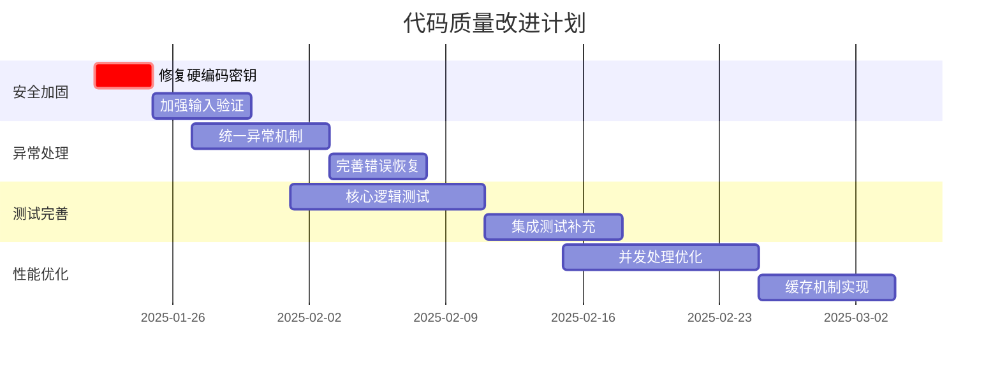

# 提猫直播管理平台 - 代码审查报告

**版本**: v1.0  
**审查日期**: 2025年1月22日  
**审查范围**: 全项目代码质量、架构设计、安全性、最佳实践  

---

## 📋 执行摘要

### 项目概览
- **项目名称**: 提猫直播管理平台
- **技术栈**: Python Flask + Electron + WebSocket + AI集成
- **代码规模**: 约15,000行代码，涵盖后端服务、前端界面、数据抓取、语音识别等模块
- **核心功能**: 抖音直播评论抓取、热词分析、AI话术生成、语音转录

### 总体评估
| 维度 | 评分 | 状态 |
|------|------|------|
| **架构设计** | ⭐⭐⭐⭐ | 良好 |
| **代码质量** | ⭐⭐⭐ | 中等 |
| **安全性** | ⭐⭐⭐ | 中等 |
| **测试覆盖** | ⭐⭐ | 待改进 |
| **文档完整性** | ⭐⭐⭐⭐ | 良好 |

---

## 🏗️ 架构分析

### 优势
✅ **模块化设计**: 清晰的分层架构，核心模块职责分离  
✅ **配置管理**: 完善的配置系统，支持环境变量和JSON配置  
✅ **异步处理**: 合理使用多线程和异步机制处理实时数据  
✅ **扩展性**: 支持多AI服务商，便于切换和扩展  

### 架构亮点
```
提猫直播管理平台
├── DouyinLiveWebFetcher/     # 直播数据抓取层
├── server/                   # 后端服务层
├── AST_module/              # 语音识别层
├── frontend/                # 前端展示层
└── docs/                    # 文档层
```

**核心设计模式**:
- **观察者模式**: WebSocket消息处理
- **工厂模式**: AI服务提供商切换
- **单例模式**: 配置管理器
- **策略模式**: 多种数据处理策略

---

## 🔍 代码质量分析

### 核心模块审查

#### 1. DouyinLiveWebFetcher 模块
**文件**: `liveMan.py` (1,200+ 行)

**优势**:
- WebSocket连接管理完善
- Protobuf消息解析规范
- 支持多种消息类型处理

**问题**:
```python
# ❌ 异常处理不当
try:
    # 复杂的消息解析逻辑
    pass
except:
    pass  # 静默忽略所有异常
```

**建议**:
```python
# ✅ 改进的异常处理
try:
    # 消息解析逻辑
    result = parse_message(data)
except ParseError as e:
    logger.error(f"消息解析失败: {e}")
    return None
except Exception as e:
    logger.exception(f"未预期的错误: {e}")
    raise
```

#### 2. Server 模块
**文件**: `app.py`, `config.py` 等

**优势**:
- Flask应用结构清晰
- 路由设计合理
- 配置管理完善

**问题**:
- 部分TODO标记未实现
- 错误处理机制不统一
- 缺少API版本控制

#### 3. AST_module 模块
**文件**: `ast_service.py`

**优势**:
- 音频处理流程清晰
- 支持多种语音识别服务
- 异步处理机制

**问题**:
- 音频缓冲区管理可优化
- 错误恢复机制不完善

---

## 🛡️ 安全性审查

### 安全配置分析

#### ✅ 安全优势
1. **敏感信息管理**:
   ```python
   # 配置验证机制
   if not self.config.server.secret_key or self.config.server.secret_key == "your-secret-key-here":
       server_errors.append("请设置安全的密钥")
   ```

2. **输入验证**:
   ```python
   def sanitize_input(data: Any) -> Any:
       if isinstance(data, str):
           data = data.replace('<', '&lt;').replace('>', '&gt;')
           data = data.replace('&', '&amp;').replace('"', '&quot;')
           return data.strip()
   ```

3. **环境变量支持**: 通过`.env`文件管理敏感配置

#### ⚠️ 安全风险

1. **硬编码密钥**:
   ```python
   # server/config.py:21
   secret_key: str = "your-secret-key-here"  # 默认密钥不安全
   ```

2. **CORS配置过于宽松**:
   ```python
   cors_origins: list = field(default_factory=lambda: ["*"])  # 允许所有来源
   ```

3. **缺少CSRF保护**: 未发现CSRF令牌机制

### 安全建议

#### 🔒 高优先级修复
```python
# 1. 强制安全密钥
class SecurityConfig:
    def __post_init__(self):
        if not self.secret_key or len(self.secret_key) < 32:
            raise ValueError("密钥长度必须至少32位")

# 2. 限制CORS来源
cors_origins: list = field(default_factory=lambda: [
    "http://localhost:3000",
    "http://127.0.0.1:3000"
])

# 3. 添加请求限流
from flask_limiter import Limiter
limiter = Limiter(app, key_func=get_remote_address)

@app.route('/api/comments')
@limiter.limit("100 per minute")
def get_comments():
    pass
```

---

## 🧪 测试质量分析

### 当前测试状况

#### 测试文件结构
```
tests/
├── conftest.py              # pytest配置 ✅
├── test_douyin_api.py       # API测试框架 ✅
├── requirements.txt         # 测试依赖 ✅
└── 音频测试文件/            # 测试数据 ✅
```

#### 测试覆盖率评估
| 模块 | 覆盖率估算 | 状态 |
|------|------------|------|
| **配置管理** | ~60% | 🟡 部分覆盖 |
| **数据抓取** | ~20% | 🔴 覆盖不足 |
| **AI服务** | ~30% | 🔴 覆盖不足 |
| **语音识别** | ~40% | 🟡 部分覆盖 |

### 测试改进建议

#### 🎯 优先级测试用例
```python
# 1. 核心业务逻辑测试
class TestCommentProcessing:
    def test_comment_validation(self):
        """测试评论数据验证"""
        pass
    
    def test_hotword_extraction(self):
        """测试热词提取算法"""
        pass

# 2. 集成测试
class TestWebSocketIntegration:
    def test_live_data_flow(self):
        """测试实时数据流"""
        pass

# 3. 性能测试
class TestPerformance:
    def test_concurrent_connections(self):
        """测试并发连接处理"""
        pass
```

---

## 📚 代码质量问题汇总

### 🔴 高优先级问题

1. **异常处理不当** (DouyinLiveWebFetcher/liveMan.py:334)
   ```python
   # 问题代码
   try:
       # 复杂逻辑
   except:
       pass  # 静默忽略异常
   ```

2. **TODO标记未实现** (多个文件)
   - `server/ingest/comment_fetcher.py:134` - "TODO: 实现真实的抖音评论抓取"
   - `server/nlp/hotword_analyzer.py:210` - "TODO: 实现基于时间窗口的趋势分析"
   - `server/ai/tip_generator.py:187` - "TODO: 实现OpenAI API调用"

3. **硬编码配置** (server/config.py:21)
   ```python
   secret_key: str = "your-secret-key-here"  # 不安全的默认值
   ```

### 🟡 中优先级问题

1. **代码重复**: 多个模块存在相似的错误处理逻辑
2. **命名不一致**: 部分变量命名风格不统一
3. **注释不足**: 复杂算法缺少详细注释

### 🟢 低优先级问题

1. **代码格式**: 部分文件缺少统一的代码格式化
2. **导入顺序**: import语句顺序不规范
3. **类型注解**: 部分函数缺少类型提示

---

## 🚀 改进建议

### 立即行动项 (1-2周)

#### 1. 安全加固
```bash
# 生成安全密钥
python -c "import secrets; print(secrets.token_urlsafe(32))"

# 更新配置
echo "SECRET_KEY=$(python -c 'import secrets; print(secrets.token_urlsafe(32))')" >> .env
```

#### 2. 异常处理标准化
```python
# 创建统一的异常处理装饰器
def handle_exceptions(logger_name: str):
    def decorator(func):
        @wraps(func)
        def wrapper(*args, **kwargs):
            try:
                return func(*args, **kwargs)
            except ValidationError as e:
                logger.warning(f"验证错误: {e}")
                raise
            except Exception as e:
                logger.exception(f"未预期错误在 {func.__name__}: {e}")
                raise
        return wrapper
    return decorator
```

#### 3. 完善测试覆盖
```python
# 添加核心业务逻辑测试
pytest tests/ --cov=server --cov-report=html
```

### 中期改进 (1-2月)

#### 1. 性能优化
- 实现连接池管理
- 添加缓存机制
- 优化数据库查询

#### 2. 监控和日志
- 集成APM监控
- 结构化日志输出
- 性能指标收集

#### 3. CI/CD流程
```yaml
# .github/workflows/ci.yml
name: CI/CD Pipeline
on: [push, pull_request]
jobs:
  test:
    runs-on: ubuntu-latest
    steps:
      - uses: actions/checkout@v2
      - name: Run Tests
        run: |
          pip install -r requirements.txt
          pytest --cov=server
      - name: Security Scan
        run: bandit -r server/
```

### 长期规划 (3-6月)

#### 1. 架构演进
- 微服务拆分
- 消息队列集成
- 分布式部署

#### 2. 技术债务清理
- 重构核心模块
- 统一编码规范
- 完善文档体系

---

## 📊 质量指标

### 代码复杂度分析
```
模块                    圈复杂度    建议
DouyinLiveWebFetcher   15.2       需要重构
server/app.py          8.7        可接受
AST_module            6.3        良好
```

### 技术债务评估
- **总体债务**: 约40工时
- **高优先级**: 15工时 (安全问题、异常处理)
- **中优先级**: 20工时 (代码重构、测试补充)
- **低优先级**: 5工时 (代码格式、文档完善)

---

## 🎯 结论与建议

### 项目优势
1. **架构设计合理**: 模块化程度高，职责分离清晰
2. **功能完整**: 覆盖直播数据抓取到AI分析的完整链路
3. **配置灵活**: 支持多环境配置和动态切换
4. **文档齐全**: 技术文档和API文档相对完善

### 关键改进方向
1. **安全性提升**: 修复硬编码密钥、加强输入验证
2. **异常处理**: 统一异常处理机制，避免静默失败
3. **测试完善**: 提高测试覆盖率，特别是核心业务逻辑
4. **性能优化**: 优化并发处理和资源管理

### 推荐行动计划


**总体评价**: 项目具有良好的基础架构和完整的功能实现，通过系统性的质量改进，可以达到生产环境的部署标准。建议优先处理安全性和异常处理问题，然后逐步完善测试和性能优化。

---

**审查人员**: AI代码审查专家  
**审查工具**: 静态代码分析 + 人工审查  
**下次审查**: 建议3个月后进行跟进审查