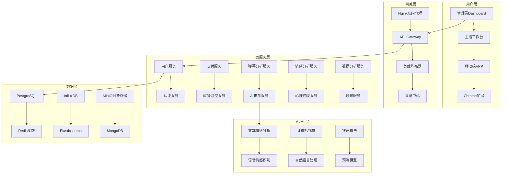

# 提猫直播管理平台 · 企业级架构设计 v2.0

## 整体架构图



## 技术栈详细规划

### 前端技术栈
```typescript
// React 18 + TypeScript + Ant Design Pro
interface TechStack {
  framework: "React 18.2+";
  language: "TypeScript 4.9+";
  ui: "Ant Design Pro 6.0+";
  stateManagement: "Redux Toolkit + RTK Query";
  charts: "ECharts + D3.js";
  realtime: "Socket.io-client";
  build: "Vite 4.0+";
  testing: "Jest + React Testing Library";
}
```

### 后端技术栈
```python
# FastAPI + 微服务架构
class BackendStack:
    web_framework = "FastAPI 0.100+"
    language = "Python 3.11+"
    database = {
        "primary": "PostgreSQL 15+",
        "cache": "Redis 7.0+",
        "timeseries": "InfluxDB 2.0+",
        "search": "Elasticsearch 8.0+",
        "document": "MongoDB 6.0+"
    }
    message_queue = "RabbitMQ / Apache Kafka"
    container = "Docker + Kubernetes"
    monitoring = "Prometheus + Grafana"
```

### AI/ML技术栈
```python
# PyTorch + Transformers生态
class AIStack:
    framework = "PyTorch 2.0+"
    nlp = "Transformers 4.30+"
    computer_vision = "OpenCV 4.8+"
    speech = "Whisper + SpeechRecognition"
    serving = "TorchServe + ONNX Runtime"
    training = "Ray + Weights & Biases"
    models = [
        "BERT-base-chinese",  # 中文情感分析
        "ChatGLM2-6B",       # 对话生成
        "Wav2Vec2",          # 语音情感识别
        "MTCNN",             # 人脸表情识别
    ]
```

## 数据库设计

### 核心数据表设计
```sql
-- 用户表 (支持多角色)
CREATE TABLE users (
    id UUID PRIMARY KEY DEFAULT gen_random_uuid(),
    username VARCHAR(50) UNIQUE NOT NULL,
    email VARCHAR(100) UNIQUE,
    phone VARCHAR(20),
    password_hash TEXT NOT NULL,
    role user_role_enum NOT NULL,
    organization_id UUID,
    subscription_plan subscription_plan_enum,
    subscription_expires_at TIMESTAMP,
    profile JSONB,
    created_at TIMESTAMP DEFAULT NOW(),
    updated_at TIMESTAMP DEFAULT NOW(),
    deleted_at TIMESTAMP NULL
);

-- 直播间表
CREATE TABLE live_rooms (
    id UUID PRIMARY KEY DEFAULT gen_random_uuid(),
    user_id UUID REFERENCES users(id),
    platform platform_enum NOT NULL,
    platform_room_id VARCHAR(100) NOT NULL,
    room_name VARCHAR(200),
    room_url TEXT,
    status room_status_enum DEFAULT 'inactive',
    config JSONB,
    created_at TIMESTAMP DEFAULT NOW(),
    updated_at TIMESTAMP DEFAULT NOW(),
    UNIQUE(platform, platform_room_id)
);

-- 弹幕消息表 (时序数据)
CREATE TABLE danmaku_messages (
    id UUID PRIMARY KEY DEFAULT gen_random_uuid(),
    room_id UUID REFERENCES live_rooms(id),
    platform_user_id VARCHAR(100),
    username VARCHAR(100),
    content TEXT NOT NULL,
    message_type message_type_enum DEFAULT 'comment',
    metadata JSONB,
    sentiment_score FLOAT,
    emotion_labels TEXT[],
    intent_category VARCHAR(50),
    timestamp TIMESTAMP DEFAULT NOW(),
    processed_at TIMESTAMP
);

-- 情绪分析记录表
CREATE TABLE emotion_records (
    id UUID PRIMARY KEY DEFAULT gen_random_uuid(),
    user_id UUID REFERENCES users(id),
    room_id UUID REFERENCES live_rooms(id),
    source emotion_source_enum NOT NULL,
    emotion_type VARCHAR(20) NOT NULL,
    intensity FLOAT CHECK (intensity >= 0 AND intensity <= 1),
    confidence FLOAT CHECK (confidence >= 0 AND confidence <= 1),
    raw_data JSONB,
    context JSONB,
    timestamp TIMESTAMP DEFAULT NOW()
);

-- AI建议记录表
CREATE TABLE ai_suggestions (
    id UUID PRIMARY KEY DEFAULT gen_random_uuid(),
    room_id UUID REFERENCES live_rooms(id),
    suggestion_type suggestion_type_enum NOT NULL,
    content TEXT NOT NULL,
    context JSONB,
    confidence FLOAT,
    urgency urgency_enum DEFAULT 'medium',
    is_used BOOLEAN DEFAULT FALSE,
    user_feedback INTEGER CHECK (user_feedback >= 1 AND user_feedback <= 5),
    created_at TIMESTAMP DEFAULT NOW(),
    used_at TIMESTAMP,
    expires_at TIMESTAMP
);

-- 订阅订单表
CREATE TABLE subscription_orders (
    id UUID PRIMARY KEY DEFAULT gen_random_uuid(),
    user_id UUID REFERENCES users(id),
    plan_type subscription_plan_enum NOT NULL,
    amount DECIMAL(10,2) NOT NULL,
    currency VARCHAR(3) DEFAULT 'CNY',
    payment_method VARCHAR(20),
    payment_status payment_status_enum DEFAULT 'pending',
    payment_id VARCHAR(100),
    starts_at TIMESTAMP NOT NULL,
    expires_at TIMESTAMP NOT NULL,
    created_at TIMESTAMP DEFAULT NOW(),
    paid_at TIMESTAMP
);
```

### 枚举类型定义
```sql
-- 用户角色枚举
CREATE TYPE user_role_enum AS ENUM (
    'super_admin',
    'agency_admin', 
    'streamer',
    'assistant'
);

-- 订阅计划枚举
CREATE TYPE subscription_plan_enum AS ENUM (
    'basic',
    'professional', 
    'enterprise',
    'custom'
);

-- 直播平台枚举
CREATE TYPE platform_enum AS ENUM (
    'douyin',
    'kuaishou',
    'bilibili',
    'xiaohongshu',
    'taobao'
);

-- 房间状态枚举
CREATE TYPE room_status_enum AS ENUM (
    'active',
    'inactive', 
    'monitoring',
    'error'
);

-- 消息类型枚举
CREATE TYPE message_type_enum AS ENUM (
    'comment',
    'gift',
    'follow',
    'share',
    'like'
);

-- 情绪来源枚举  
CREATE TYPE emotion_source_enum AS ENUM (
    'text',
    'voice',
    'face',
    'behavior'
);

-- 建议类型枚举
CREATE TYPE suggestion_type_enum AS ENUM (
    'content',
    'interaction',
    'product',
    'emotion',
    'emergency'
);

-- 紧急程度枚举
CREATE TYPE urgency_enum AS ENUM (
    'low',
    'medium',
    'high',
    'critical'
);

-- 支付状态枚举
CREATE TYPE payment_status_enum AS ENUM (
    'pending',
    'paid',
    'failed',
    'refunded'
);
```

## 微服务架构设计

### 1. 用户管理服务 (User Service)
```python
class UserService:
    """用户管理微服务"""
    
    async def register(self, user_data: UserRegistration) -> User:
        """用户注册"""
        # 1. 验证用户数据
        # 2. 密码加密存储
        # 3. 发送验证邮件/短信
        # 4. 创建用户记录
        pass
    
    async def authenticate(self, credentials: LoginCredentials) -> AuthToken:
        """用户认证"""
        # 1. 验证用户凭据
        # 2. 生成JWT Token
        # 3. 记录登录日志
        pass
    
    async def get_user_profile(self, user_id: UUID) -> UserProfile:
        """获取用户资料"""
        pass
    
    async def update_subscription(self, user_id: UUID, plan: SubscriptionPlan):
        """更新订阅计划"""
        pass
```

### 2. 直播监控服务 (Live Monitor Service)
```python
class LiveMonitorService:
    """直播监控微服务"""
    
    async def connect_room(self, room_config: RoomConfig) -> Connection:
        """连接直播间"""
        # 1. 建立WebSocket连接
        # 2. 开始监控弹幕流
        # 3. 启动数据采集
        pass
    
    async def process_danmaku(self, message: DanmakuMessage):
        """处理弹幕消息"""
        # 1. 数据清洗和过滤
        # 2. 发送到消息队列
        # 3. 实时推送到客户端
        pass
    
    async def analyze_live_quality(self, room_id: UUID) -> QualityMetrics:
        """分析直播质量"""
        # 1. 检测视频质量
        # 2. 分析音频质量  
        # 3. 监控网络状况
        pass
```

### 3. AI分析服务 (AI Analysis Service)
```python
class AIAnalysisService:
    """AI分析微服务"""
    
    async def analyze_sentiment(self, text: str) -> SentimentResult:
        """情感分析"""
        # 1. 文本预处理
        # 2. 调用情感分析模型
        # 3. 返回情感分数和标签
        pass
    
    async def detect_intent(self, message: str) -> IntentResult:
        """意图识别"""
        # 1. NLP处理
        # 2. 意图分类
        # 3. 实体提取
        pass
    
    async def generate_suggestion(self, context: AnalysisContext) -> Suggestion:
        """生成AI建议"""
        # 1. 上下文分析
        # 2. 调用生成模型
        # 3. 后处理和验证
        pass
```

### 4. 情绪管理服务 (Emotion Service)
```python
class EmotionService:
    """情绪管理微服务"""
    
    async def analyze_streamer_emotion(
        self, 
        audio: bytes, 
        video: bytes, 
        text: str
    ) -> EmotionResult:
        """多模态情绪分析"""
        # 1. 语音情感分析
        # 2. 面部表情识别
        # 3. 文本情感分析
        # 4. 多模态融合
        pass
    
    async def monitor_mental_health(self, user_id: UUID) -> HealthStatus:
        """心理健康监控"""
        # 1. 获取历史情绪数据
        # 2. 分析情绪趋势
        # 3. 评估心理健康状态
        pass
    
    async def provide_intervention(self, user_id: UUID, emotion_state: EmotionState):
        """情绪干预"""
        # 1. 评估干预需求
        # 2. 生成干预策略
        # 3. 推送干预内容
        pass
```

## API接口设计

### RESTful API 规范
```yaml
# OpenAPI 3.0 规范
openapi: 3.0.0
info:
  title: 提猫直播管理平台 API
  version: 2.0.0
  description: 企业级直播管理平台API文档

servers:
  - url: https://api.timao.live/v2
    description: 生产环境
  - url: https://api-staging.timao.live/v2
    description: 测试环境

paths:
  /auth/login:
    post:
      summary: 用户登录
      tags: [认证]
      requestBody:
        required: true
        content:
          application/json:
            schema:
              type: object
              properties:
                username:
                  type: string
                  example: "streamer001"
                password:
                  type: string
                  example: "password123"
      responses:
        200:
          description: 登录成功
          content:
            application/json:
              schema:
                type: object
                properties:
                  access_token:
                    type: string
                  refresh_token:
                    type: string
                  expires_in:
                    type: integer
                  user:
                    $ref: '#/components/schemas/User'

  /rooms/{roomId}/danmaku/stream:
    get:
      summary: 弹幕流推送 (SSE)
      tags: [直播监控]
      parameters:
        - name: roomId
          in: path
          required: true
          schema:
            type: string
            format: uuid
      responses:
        200:
          description: 弹幕数据流
          content:
            text/event-stream:
              schema:
                type: string
                example: |
                  data: {"id":"msg_123","user":"张三","content":"主播好棒","timestamp":"2024-01-20T10:30:00Z"}

  /ai/suggestions:
    post:
      summary: 获取AI建议
      tags: [AI功能]
      requestBody:
        required: true
        content:
          application/json:
            schema:
              type: object
              properties:
                room_id:
                  type: string
                  format: uuid
                context:
                  type: object
                  properties:
                    recent_messages:
                      type: array
                      items:
                        $ref: '#/components/schemas/DanmakuMessage'
                    current_emotion:
                      $ref: '#/components/schemas/EmotionState'
      responses:
        200:
          description: AI建议
          content:
            application/json:
              schema:
                type: array
                items:
                  $ref: '#/components/schemas/AISuggestion'

components:
  schemas:
    User:
      type: object
      properties:
        id:
          type: string
          format: uuid
        username:
          type: string
        email:
          type: string
        role:
          type: string
          enum: [super_admin, agency_admin, streamer, assistant]
        subscription_plan:
          type: string
          enum: [basic, professional, enterprise, custom]

    DanmakuMessage:
      type: object
      properties:
        id:
          type: string
          format: uuid
        username:
          type: string
        content:
          type: string
        sentiment_score:
          type: number
          minimum: -1
          maximum: 1
        timestamp:
          type: string
          format: date-time

    EmotionState:
      type: object
      properties:
        primary_emotion:
          type: string
          enum: [happy, sad, angry, fear, surprise, disgust, neutral]
        intensity:
          type: number
          minimum: 0
          maximum: 1
        confidence:
          type: number
          minimum: 0
          maximum: 1

    AISuggestion:
      type: object
      properties:
        id:
          type: string
          format: uuid
        type:
          type: string
          enum: [content, interaction, product, emotion, emergency]
        content:
          type: string
        confidence:
          type: number
          minimum: 0
          maximum: 1
        urgency:
          type: string
          enum: [low, medium, high, critical]
        expires_at:
          type: string
          format: date-time
```

## 部署架构

### Kubernetes部署配置
```yaml
# kubernetes/deployment.yaml
apiVersion: apps/v1
kind: Deployment
metadata:
  name: timao-platform
  namespace: production
spec:
  replicas: 3
  selector:
    matchLabels:
      app: timao-platform
  template:
    metadata:
      labels:
        app: timao-platform
    spec:
      containers:
      - name: api-server
        image: timao/platform-api:v2.0.0
        ports:
        - containerPort: 10090
        env:
        - name: DATABASE_URL
          valueFrom:
            secretKeyRef:
              name: db-secret
              key: url
        - name: REDIS_URL
          valueFrom:
            secretKeyRef:
              name: redis-secret
              key: url
        resources:
          requests:
            memory: "512Mi"
            cpu: "500m"
          limits:
            memory: "1Gi"
            cpu: "1000m"
        livenessProbe:
          httpGet:
            path: /health
            port: 10090
          initialDelaySeconds: 30
          periodSeconds: 10
        readinessProbe:
          httpGet:
            path: /ready
            port: 10090
          initialDelaySeconds: 5
          periodSeconds: 5

---
apiVersion: v1
kind: Service
metadata:
  name: timao-platform-service
  namespace: production
spec:
  selector:
    app: timao-platform
  ports:
  - port: 80
    targetPort: 10090
  type: LoadBalancer
```

## 监控和运维

### 监控指标设计
```python
# Prometheus监控指标
class MetricsCollector:
    """监控指标收集器"""
    
    # 业务指标
    user_registrations = Counter('user_registrations_total', '用户注册数')
    active_live_rooms = Gauge('active_live_rooms', '活跃直播间数')
    danmaku_messages = Counter('danmaku_messages_total', '弹幕消息数', ['platform'])
    ai_suggestions = Counter('ai_suggestions_total', 'AI建议数', ['type'])
    
    # 技术指标
    api_requests = Counter('api_requests_total', 'API请求数', ['method', 'endpoint'])
    api_duration = Histogram('api_request_duration_seconds', 'API响应时间')
    database_connections = Gauge('database_connections', '数据库连接数')
    redis_memory_usage = Gauge('redis_memory_usage_bytes', 'Redis内存使用')
    
    # AI模型指标
    model_inference_time = Histogram('model_inference_seconds', '模型推理时间', ['model'])
    model_accuracy = Gauge('model_accuracy', '模型准确率', ['model'])
```

### 日志管理
```python
# 结构化日志配置
import structlog

logger = structlog.get_logger()

class LoggingMiddleware:
    """日志中间件"""
    
    async def __call__(self, request, call_next):
        start_time = time.time()
        
        # 记录请求日志
        logger.info(
            "api_request_start",
            method=request.method,
            url=str(request.url),
            user_id=getattr(request.state, 'user_id', None),
            request_id=request.headers.get('X-Request-ID')
        )
        
        try:
            response = await call_next(request)
            
            # 记录响应日志
            logger.info(
                "api_request_end",
                status_code=response.status_code,
                duration=time.time() - start_time,
                request_id=request.headers.get('X-Request-ID')
            )
            
            return response
            
        except Exception as e:
            # 记录错误日志
            logger.error(
                "api_request_error",
                error=str(e),
                error_type=type(e).__name__,
                duration=time.time() - start_time,
                request_id=request.headers.get('X-Request-ID')
            )
            raise
```

---

**文档版本**: 架构设计 v2.0  
**创建时间**: 2025年9月20日  
**更新时间**: 2025年9月20日  
**架构师**: 技术团队  
**审核人**: CTO
