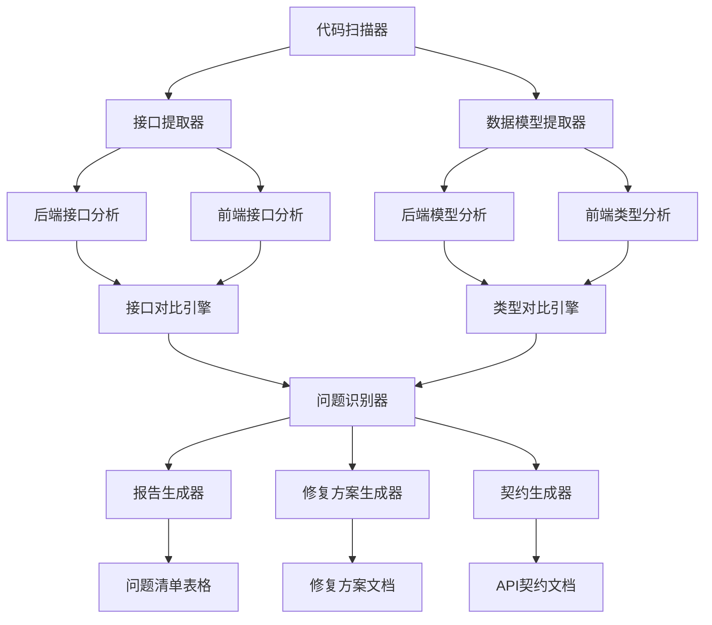
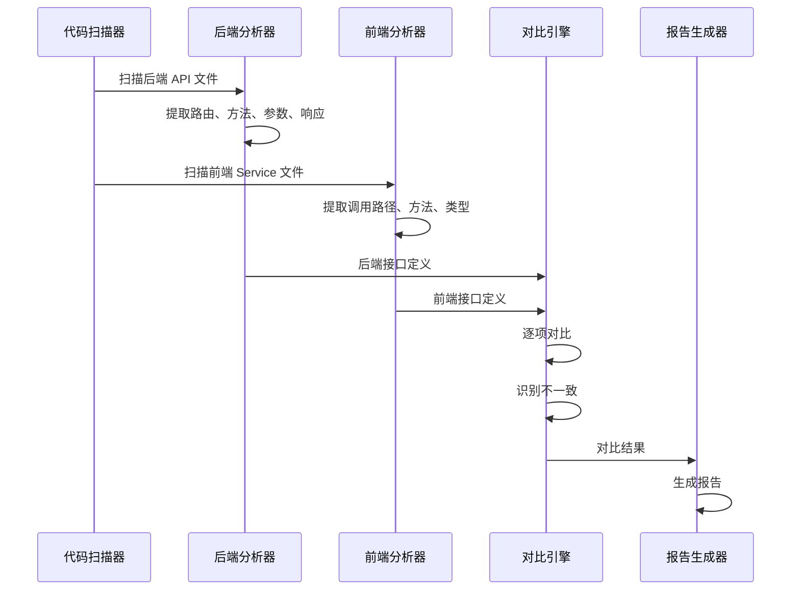
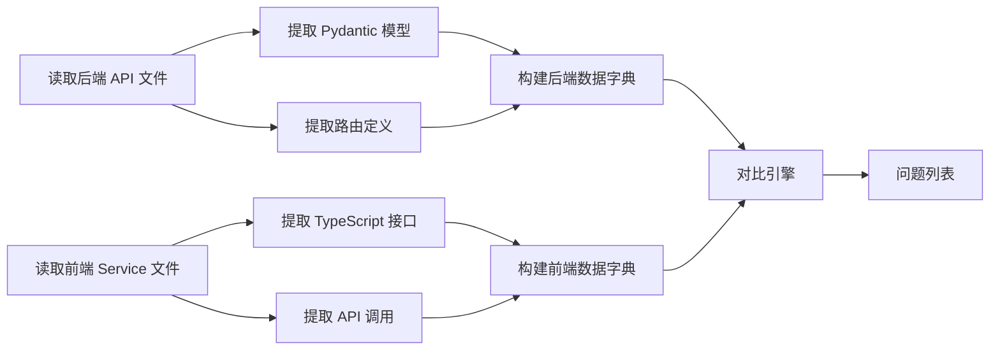

# 技术方案设计 - API 接口和数据类型一致性检查

## 1. 技术架构

### 1.1 整体架构



### 1.2 技术选型

| 组件 | 技术 | 用途 |
|------|------|------|
| 代码扫描 | Python AST, TypeScript Compiler API | 解析源代码 |
| 接口提取 | FastAPI 路由分析, grep/codebase_search | 提取 API 定义 |
| 类型分析 | Pydantic Model Inspector, TS Type Parser | 提取类型信息 |
| 对比引擎 | 自定义对比算法 | 深度比较结构 |
| 报告生成 | Markdown, YAML, JSON | 输出文档 |

## 2. 检查方法论

### 2.1 接口检查流程



### 2.2 深度检查项

#### 2.2.1 接口级别检查

| 检查项 | 后端来源 | 前端来源 | 对比规则 |
|--------|----------|----------|----------|
| 路径 | `@router.get("/path")` | `fetch("http://...path")` | 完全匹配（忽略 base URL） |
| HTTP 方法 | `router.get/post/put/delete` | `method: 'GET/POST/PUT/DELETE'` | 完全匹配 |
| 路径参数 | `{param}` | URL 拼接逻辑 | 名称匹配 |
| 查询参数 | `Query(...)` | `?key=value` | 名称、类型匹配 |

#### 2.2.2 数据类型检查

| Python 类型 | TypeScript 类型 | 检查规则 |
|-------------|----------------|----------|
| `str` | `string` | 完全匹配 |
| `int` | `number` | 完全匹配 |
| `float` | `number` | 完全匹配 |
| `bool` | `boolean` | 完全匹配 |
| `datetime` | `string` 或 `Date` | 接受两种形式 |
| `Optional[T]` | `T \| null \| undefined` | 检查可选性 |
| `List[T]` | `T[]` 或 `Array<T>` | 检查数组类型 |
| `Dict[K, V]` | `Record<K, V>` 或 `{ [key: K]: V }` | 检查字典类型 |
| `BaseModel` | `interface` | 递归检查嵌套字段 |

#### 2.2.3 字段级别检查

```python
# 后端 Pydantic 模型
class UserResponse(BaseModel):
    id: int                          # 必填
    username: str                    # 必填
    email: EmailStr                  # 必填，带验证
    nickname: Optional[str]          # 可选
    created_at: datetime             # 必填
    
    class Config:
        from_attributes = True
```

```typescript
// 前端 TypeScript 接口
interface UserInfo {
  id: number;                        // 必填 ✅
  username: string;                  // 必填 ✅
  email: string;                     // 必填 ✅（EmailStr → string）
  nickname?: string;                 // 可选 ✅
  created_at: string;                // 必填 ✅（datetime → string）
}
```

**检查项：**
1. ✅ 字段名称完全一致
2. ✅ 类型映射正确
3. ✅ 可选性一致（`Optional[T]` ↔ `T?`）
4. ⚠️ 验证规则记录（EmailStr 在前端需要验证）

### 2.3 问题分类标准

#### 严重程度分类

| 级别 | 描述 | 示例 | 影响 |
|------|------|------|------|
| 🔴 **高** | 接口无法调用或数据无法解析 | 路径错误、必填字段缺失、类型完全不匹配 | 功能失效 |
| 🟡 **中** | 可能导致运行时错误或数据丢失 | 可选性不匹配、验证规则缺失、默认值不一致 | 潜在 bug |
| 🟢 **低** | 不影响功能但影响代码质量 | 命名风格不一致、注释缺失、额外字段 | 代码质量 |

#### 问题类型分类

1. **路径不一致** (PATH_MISMATCH)
   - 前端调用路径与后端路由不匹配
   
2. **方法不一致** (METHOD_MISMATCH)
   - HTTP 方法不匹配（如前端 GET，后端 POST）
   
3. **参数缺失** (PARAM_MISSING)
   - 后端要求的参数前端未提供
   
4. **参数多余** (PARAM_EXTRA)
   - 前端发送的参数后端不接受
   
5. **类型不匹配** (TYPE_MISMATCH)
   - 字段类型映射错误
   
6. **可选性不匹配** (OPTIONAL_MISMATCH)
   - 必填/可选标记不一致
   
7. **字段缺失** (FIELD_MISSING)
   - 响应中缺少前端期望的字段
   
8. **字段多余** (FIELD_EXTRA)
   - 响应中包含前端未定义的字段
   
9. **验证规则缺失** (VALIDATION_MISSING)
   - 后端有验证但前端未处理

## 3. 实施策略

### 3.1 分阶段实施

#### 阶段 1：自动化扫描（预计 30 分钟）



**扫描范围：**
- 后端：`server/app/api/*.py`（23 个文件）
- 前端：`electron/renderer/src/services/*.ts`（8 个文件）

#### 阶段 2：深度对比（预计 45 分钟）

1. **接口级对比**
   - 逐个 API 路由对比路径、方法
   - 记录不匹配项
   
2. **请求参数对比**
   - 对比查询参数、路径参数、请求体
   - 检查类型、必填性、默认值
   
3. **响应数据对比**
   - 对比响应模型结构
   - 递归检查嵌套对象
   - 验证类型映射

4. **特殊情况处理**
   - WebSocket 接口
   - 文件上传/下载
   - SSE（Server-Sent Events）

#### 阶段 3：报告生成（预计 30 分钟）

1. **问题清单表格**（Markdown 表格）
2. **详细审计报告**（包含代码位置、问题描述、影响分析）
3. **修复方案文档**（包含修复建议、代码示例）
4. **API 契约文档**（OpenAPI + TypeScript）

### 3.2 关键技术点

#### 3.2.1 后端接口提取

```python
# 伪代码：提取 FastAPI 路由信息
def extract_backend_api(file_path):
    # 1. 解析 Python AST
    ast_tree = ast.parse(file_content)
    
    # 2. 查找 APIRouter 定义
    router_prefix = find_router_prefix(ast_tree)
    
    # 3. 查找路由装饰器 (@router.get, @router.post, etc.)
    for decorator in find_route_decorators(ast_tree):
        method = decorator.method  # get, post, put, delete
        path = decorator.path
        func = decorator.function
        
        # 4. 提取参数信息
        params = extract_function_params(func)
        
        # 5. 提取响应模型
        response_model = extract_response_model(decorator)
        
        yield APIEndpoint(
            path=router_prefix + path,
            method=method,
            params=params,
            response=response_model
        )
```

#### 3.2.2 前端接口提取

```typescript
// 伪代码：提取 TypeScript API 调用
function extractFrontendAPI(filePath: string) {
  // 1. 解析 TypeScript AST
  const sourceFile = ts.createSourceFile(...)
  
  // 2. 查找 fetch 调用
  const fetchCalls = findFetchCalls(sourceFile)
  
  for (const call of fetchCalls) {
    // 3. 提取 URL 和方法
    const url = extractURL(call)
    const method = extractMethod(call)
    
    // 4. 提取请求参数类型
    const requestType = extractRequestType(call)
    
    // 5. 提取响应类型
    const responseType = extractResponseType(call)
    
    yield {
      url,
      method,
      requestType,
      responseType
    }
  }
}
```

#### 3.2.3 类型映射引擎

```python
TYPE_MAPPING = {
    # Python → TypeScript
    'str': 'string',
    'int': 'number',
    'float': 'number',
    'bool': 'boolean',
    'datetime': 'string',  # ISO 8601 格式
    'date': 'string',
    'None': 'null',
    'Any': 'any',
}

def map_python_to_typescript(python_type):
    """将 Python 类型映射为 TypeScript 类型"""
    # 处理 Optional[T]
    if is_optional(python_type):
        inner = get_inner_type(python_type)
        return f"{map_python_to_typescript(inner)} | null"
    
    # 处理 List[T]
    if is_list(python_type):
        inner = get_inner_type(python_type)
        return f"{map_python_to_typescript(inner)}[]"
    
    # 处理 Dict[K, V]
    if is_dict(python_type):
        key, value = get_dict_types(python_type)
        return f"Record<{map_python_to_typescript(key)}, {map_python_to_typescript(value)}>"
    
    # 基本类型映射
    return TYPE_MAPPING.get(python_type, 'unknown')
```

## 4. 数据结构设计

### 4.1 接口定义结构

```python
@dataclass
class APIEndpoint:
    """API 接口定义"""
    module: str                    # 模块名（如 auth, payment）
    path: str                      # 完整路径（如 /api/auth/login）
    method: str                    # HTTP 方法（GET, POST, etc.）
    request_params: Dict[str, ParamInfo]   # 请求参数
    response_model: ModelInfo      # 响应模型
    source_file: str               # 源文件路径
    line_number: int               # 行号

@dataclass
class ParamInfo:
    """参数信息"""
    name: str                      # 参数名
    type: str                      # 类型
    required: bool                 # 是否必填
    default: Any                   # 默认值
    location: str                  # 位置（path/query/body）
    validators: List[str]          # 验证器列表

@dataclass
class ModelInfo:
    """数据模型信息"""
    name: str                      # 模型名
    fields: Dict[str, FieldInfo]   # 字段信息
    nested_models: Dict[str, ModelInfo]  # 嵌套模型

@dataclass
class FieldInfo:
    """字段信息"""
    name: str                      # 字段名
    type: str                      # 类型
    optional: bool                 # 是否可选
    default: Any                   # 默认值
    validators: List[str]          # 验证器
```

### 4.2 问题记录结构

```python
@dataclass
class Issue:
    """问题记录"""
    id: str                        # 问题 ID
    module: str                    # 所属模块
    endpoint: str                  # 接口路径
    issue_type: IssueType          # 问题类型
    severity: Severity             # 严重程度
    description: str               # 问题描述
    backend_value: Any             # 后端定义
    frontend_value: Any            # 前端定义
    location: Location             # 代码位置
    fix_suggestion: str            # 修复建议

@dataclass
class Location:
    """代码位置"""
    file: str                      # 文件路径
    line: int                      # 行号
    side: str                      # backend 或 frontend
```

## 5. 输出文档规范

### 5.1 问题清单表格格式

```markdown
# API 接口一致性问题清单

## 统计摘要

- 总问题数：**X**
- 高严重性：**Y** 🔴
- 中严重性：**Z** 🟡
- 低严重性：**W** 🟢

## 问题详情

| ID | 模块 | 接口 | 问题类型 | 严重性 | 描述 | 后端定义 | 前端定义 |
|----|------|------|----------|--------|------|----------|----------|
| 001 | auth | /api/auth/login | TYPE_MISMATCH | 🔴 高 | created_at 类型不匹配 | `datetime` | `Date` |
| 002 | payment | /api/payment/create | PARAM_MISSING | 🟡 中 | 缺少 callback_url 参数 | 必填 | 未发送 |
```

### 5.2 修复方案文档格式

```markdown
# 修复方案

## 问题 001: created_at 类型不匹配

### 问题描述
- **模块**: auth
- **接口**: /api/auth/login
- **严重性**: 🔴 高

后端返回 `datetime` 对象，前端期望 `Date` 对象，但实际传输时已序列化为 ISO 8601 字符串。

### 建议修复方式
前端类型定义应改为 `string`，然后在使用时转换为 `Date`。

### 修复代码示例

**前端修改（推荐）：**
```typescript
// 修改前
interface UserInfo {
  created_at: Date;
}

// 修改后
interface UserInfo {
  created_at: string;  // ISO 8601 格式
}

// 使用时转换
const createdDate = new Date(user.created_at);
```

**或后端修改（不推荐）：**
```python
# 添加自定义序列化器（不推荐，增加复杂度）
```

### 优先级
🔴 高优先级 - 建议立即修复
```

### 5.3 API 契约文档格式

**OpenAPI 规范：**
```yaml
openapi: 3.0.0
info:
  title: 提猫直播助手 API
  version: 1.0.0
paths:
  /api/auth/login:
    post:
      summary: 用户登录
      requestBody:
        required: true
        content:
          application/json:
            schema:
              $ref: '#/components/schemas/LoginRequest'
      responses:
        '200':
          description: 登录成功
          content:
            application/json:
              schema:
                $ref: '#/components/schemas/LoginResponse'
components:
  schemas:
    LoginRequest:
      type: object
      required:
        - username_or_email
        - password
      properties:
        username_or_email:
          type: string
        password:
          type: string
```

**TypeScript 类型定义：**
```typescript
// API 契约类型定义
// 自动生成，请勿手动修改

export interface LoginRequest {
  username_or_email: string;
  password: string;
}

export interface LoginResponse {
  success: boolean;
  token: string;
  access_token: string;
  refresh_token: string;
  expires_in: number;
  user: UserInfo;
  isPaid: boolean;
}

export interface UserInfo {
  id: number;
  username: string;
  email: string;
  nickname?: string;
  avatar_url?: string;
  role: string;
  status: string;
  email_verified: boolean;
  phone_verified: boolean;
  created_at: string;
}
```

## 6. 风险和缓解措施

### 6.1 技术风险

| 风险 | 可能性 | 影响 | 缓解措施 |
|------|--------|------|----------|
| 代码解析失败 | 中 | 高 | 使用多种解析方法（AST + 正则 + grep），提供降级方案 |
| 动态路由识别困难 | 高 | 中 | 手动标注动态部分，生成配置文件 |
| 泛型类型复杂 | 中 | 中 | 简化为基本类型对比，记录复杂泛型供人工审查 |
| 第三方类型无法识别 | 低 | 低 | 建立类型映射库，逐步完善 |

### 6.2 时间风险

预计总时间：**2-3 小时**

- 自动化扫描：30 分钟
- 深度对比：45 分钟
- 报告生成：30 分钟
- 修复方案编写：30-60 分钟
- 文档整理：15 分钟

如超时，采用分批交付策略：
1. 先交付层级 1（核心模块）
2. 再交付层级 2（功能模块）
3. 最后交付层级 3（辅助模块）

## 7. 成功标准

### 7.1 量化指标

- ✅ **覆盖率**: 至少检查 90% 的 API 接口
- ✅ **准确率**: 误报率 < 5%
- ✅ **完整性**: 所有层级 1-3 模块全覆盖
- ✅ **可执行性**: 100% 问题提供修复建议

### 7.2 质量标准

- ✅ 问题分类清晰，优先级合理
- ✅ 修复方案具体，代码示例完整
- ✅ API 契约符合 OpenAPI 3.0 规范
- ✅ 文档结构清晰，易于理解和使用

## 8. 后续优化建议

1. **自动化工具开发**
   - 开发 CLI 工具，支持增量检查
   - 集成到 CI/CD 流程
   
2. **持续监控**
   - 设置 Git pre-commit hook
   - API 变更自动触发检查
   
3. **类型共享**
   - 考虑使用 JSON Schema 作为中间格式
   - 后端生成 JSON Schema，前端自动生成类型
   
4. **文档同步**
   - API 契约作为单一数据源
   - 前后端从契约生成代码

