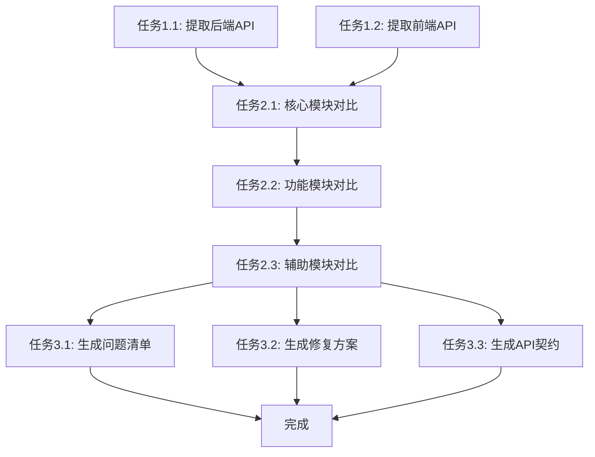

# 实施计划 - API 接口和数据类型一致性检查

## 任务概览

本检查项目分为 **3 个主要阶段，8 个核心任务**，预计总时长 **2-3 小时**。

```mermaid
gantt
    title API 一致性检查实施计划
    dateFormat  HH:mm
    section 阶段1: 数据收集
    提取后端API定义    :a1, 00:00, 20m
    提取前端API调用    :a2, after a1, 15m
    section 阶段2: 深度对比
    层级1核心模块对比  :b1, after a2, 20m
    层级2功能模块对比  :b2, after b1, 15m
    层级3辅助模块对比  :b3, after b2, 10m
    section 阶段3: 输出文档
    生成问题清单表格    :c1, after b3, 15m
    生成修复方案文档    :c2, after c1, 20m
    生成API契约文档    :c3, after c2, 25m
```



---

## 阶段 1: 数据收集（预计 35 分钟）

### - [x] 任务 1.1: 提取后端 API 定义
**负责人**: AI Agent  
**预计时间**: 20 分钟  
**优先级**: 🔴 最高

#### 具体工作
1. 扫描 `server/app/api/` 目录下所有 Python 文件（23 个）
2. 提取每个 API 路由的以下信息：
   - 路由路径（含前缀）
   - HTTP 方法（GET/POST/PUT/DELETE）
   - 请求参数（Query/Path/Body）
   - 响应模型（Pydantic BaseModel）
   - 源文件位置和行号
3. 分析 Pydantic 模型定义：
   - 字段名称
   - 字段类型
   - 可选性（Optional）
   - 默认值
   - 验证器（validators）
4. 构建后端 API 数据字典

#### 关键文件
- `server/app/api/auth.py` - 认证接口
- `server/app/api/subscription.py` - 订阅接口
- `server/app/api/payment.py` - 支付接口
- `server/app/api/douyin.py` - 抖音接口
- `server/app/api/live_audio.py` - 音频转写接口
- `server/app/api/live_report.py` - 直播报告接口
- `server/app/api/live_review.py` - 直播复盘接口
- `server/app/api/ai_live.py` - AI 实时分析接口
- `server/app/api/ai_scripts.py` - AI 话术生成接口
- `server/app/api/ai_gateway_api.py` - AI 网关接口
- `server/app/api/admin.py` - 管理员接口
- `server/app/api/tools.py` - 工具接口
- 其他 11 个文件

#### 产出
- 后端 API 清单（JSON/Python 字典格式）
- 后端数据模型库

_需求: 需求 1, 需求 2_

---

### - [x] 任务 1.2: 提取前端 API 调用
**负责人**: AI Agent  
**预计时间**: 15 分钟  
**优先级**: 🔴 最高

#### 具体工作
1. 扫描 `electron/renderer/src/services/` 目录下所有 TypeScript 文件（8 个）
2. 提取每个 API 调用的以下信息：
   - 调用的 URL 路径
   - HTTP 方法
   - 请求参数类型（TypeScript interface）
   - 响应类型（TypeScript interface）
   - 源文件位置和行号
3. 分析 TypeScript 接口定义：
   - 字段名称
   - 字段类型
   - 可选性（?）
   - 默认值
4. 构建前端 API 数据字典

#### 关键文件
- `electron/renderer/src/services/auth.ts` - 认证服务
- `electron/renderer/src/services/payment.ts` - 支付服务
- `electron/renderer/src/services/douyin.ts` - 抖音服务
- `electron/renderer/src/services/liveAudio.ts` - 音频转写服务
- `electron/renderer/src/services/liveReport.ts` - 直播报告服务
- `electron/renderer/src/services/ai.ts` - AI 服务
- `electron/renderer/src/services/authService.ts` - 认证辅助服务
- `electron/renderer/src/services/apiConfig.ts` - API 配置

#### 产出
- 前端 API 清单（JSON/TypeScript 对象格式）
- 前端类型定义库

_需求: 需求 1, 需求 2_

---

## 阶段 2: 深度对比（预计 45 分钟）

### - [x] 任务 2.1: 层级 1 - 核心业务模块对比
**负责人**: AI Agent  
**预计时间**: 20 分钟  
**优先级**: 🔴 最高

#### 检查模块
1. **认证模块** (`/api/auth`)
   - [ ] POST /api/auth/login - 用户登录
   - [ ] POST /api/auth/register - 用户注册
   - [ ] POST /api/auth/refresh - 令牌刷新
   - [ ] GET /api/auth/me - 获取当前用户信息
   - [ ] POST /api/auth/logout - 用户登出

2. **订阅模块** (`/api/subscription`)
   - [ ] GET /api/subscription/plans - 获取订阅套餐列表
   - [ ] GET /api/subscription/current - 获取当前用户订阅
   - [ ] POST /api/subscription/subscribe - 创建订阅

3. **支付模块** (`/api/payment`)
   - [ ] GET /api/payment/plans - 获取支付套餐
   - [ ] POST /api/payment/create - 创建支付订单
   - [ ] POST /api/payment/webhook - 支付回调
   - [ ] GET /api/payment/subscriptions/current - 获取当前订阅

#### 检查项
- ✅ 路径完全匹配
- ✅ HTTP 方法一致
- ✅ 请求参数：名称、类型、必填性
- ✅ 响应数据：结构、类型、可选性
- ✅ 嵌套对象递归检查
- ✅ 验证规则记录

#### 产出
- 层级 1 问题列表（高优先级）
- 数据模型对比报告

_需求: 需求 1, 需求 2, 需求 3_

---

### - [x] 任务 2.2: 层级 2 - 功能模块对比
**负责人**: AI Agent  
**预计时间**: 15 分钟  
**优先级**: 🟡 高

#### 检查模块
4. **抖音模块** (`/api/douyin`)
   - [ ] POST /api/douyin/start - 启动直播监控
   - [ ] POST /api/douyin/stop - 停止直播监控
   - [ ] GET /api/douyin/status - 获取监控状态

5. **音频转写模块** (`/api/live_audio`)
   - [ ] POST /api/live_audio/start - 启动音频转写
   - [ ] POST /api/live_audio/stop - 停止音频转写
   - [ ] GET /api/live_audio/status - 获取转写状态
   - [ ] POST /api/live_audio/advanced - 更新高级设置

6. **直播复盘模块** (`/api/live_report`, `/api/live/review`)
   - [ ] POST /api/live_report/start - 启动直播录制
   - [ ] POST /api/live_report/stop - 停止直播录制
   - [ ] GET /api/live_report/status - 获取录制状态
   - [ ] POST /api/live_report/generate - 生成复盘报告
   - [ ] GET /api/live/review/reports - 获取复盘报告列表

7. **AI 服务模块** (`/api/ai_live`, `/api/ai_scripts`)
   - [ ] POST /api/ai_live/start - 启动 AI 实时分析
   - [ ] POST /api/ai_live/stop - 停止 AI 分析
   - [ ] POST /api/ai_scripts/generate - 生成 AI 话术

#### 检查项
同任务 2.1

#### 产出
- 层级 2 问题列表（中优先级）

_需求: 需求 1, 需求 2, 需求 3_

---

### - [x] 任务 2.3: 层级 3 - 辅助模块对比
**负责人**: AI Agent  
**预计时间**: 10 分钟  
**优先级**: 🟢 中

#### 检查模块
8. **AI 网关模块** (`/api/ai_gateway`)
   - [ ] POST /api/ai_gateway/register - 注册服务商
   - [ ] POST /api/ai_gateway/switch - 切换服务商
   - [ ] GET /api/ai_gateway/config - 获取配置

9. **管理员模块** (`/api/admin`)
   - [ ] GET /api/admin/users - 获取用户列表
   - [ ] 其他管理接口

10. **工具模块** (`/api/tools`, `/api/bootstrap`)
    - [ ] GET /health - 健康检查
    - [ ] GET /api/bootstrap/status - 资源自检

#### 检查项
基本一致性检查（路径、方法、主要参数）

#### 产出
- 层级 3 问题列表（低优先级）

_需求: 需求 1, 需求 2, 需求 3_

---

## 阶段 3: 输出文档（预计 60 分钟）

### - [x] 任务 3.1: 生成问题清单表格
**负责人**: AI Agent  
**预计时间**: 15 分钟  
**优先级**: 🔴 最高

#### 具体工作
1. 汇总阶段 2 发现的所有问题
2. 按严重程度和模块分类
3. 生成 Markdown 表格
4. 添加统计摘要

#### 表格结构
```markdown
| ID | 模块 | 接口 | 问题类型 | 严重性 | 描述 | 后端定义 | 前端定义 |
|----|------|------|----------|--------|------|----------|----------|
```

#### 统计项
- 总问题数
- 按严重性分类（高/中/低）
- 按问题类型分类
- 按模块分类

#### 产出
- `specs/api-consistency-check/issues-table.md`

_需求: 需求 4_

---

### - [x] 任务 3.2: 生成修复方案文档
**负责人**: AI Agent  
**预计时间**: 20 分钟  
**优先级**: 🔴 最高

#### 具体工作
1. 为每个高/中严重性问题生成修复方案
2. 提供具体的代码修改建议
3. 包含前端和后端的修复示例
4. 标注修复优先级

#### 修复方案结构
对每个问题：
- 问题描述
- 影响分析
- 建议修复方式（前端 vs 后端）
- 修复代码示例
- 修复优先级
- 预计工作量

#### 产出
- `specs/api-consistency-check/fix-plan.md`
- `specs/api-consistency-check/fix-examples.md`（详细代码示例）

_需求: 需求 5_

---

### - [x] 任务 3.3: 生成 API 契约文档
**负责人**: AI Agent  
**预计时间**: 25 分钟  
**优先级**: 🟡 高

#### 具体工作
1. 基于后端 API 定义生成 OpenAPI 3.0 规范
2. 生成完整的 TypeScript 类型定义文件
3. 创建数据模型映射表（Python ↔ TypeScript）
4. 为关键接口添加使用示例

#### OpenAPI 规范内容
- API 基本信息（title, version, description）
- 所有路由路径和方法
- 请求/响应 Schema
- 安全认证方式（Bearer Token）
- 服务器配置

#### TypeScript 类型定义内容
- 所有请求接口（Request interfaces）
- 所有响应接口（Response interfaces）
- 枚举类型（Enum types）
- 工具类型（Utility types）

#### 数据模型映射表
- Python 类型 → TypeScript 类型对照
- Pydantic 模型 → TS Interface 对照
- 特殊类型处理说明

#### 产出
- `specs/api-consistency-check/api-contract.yaml`（OpenAPI 3.0）
- `specs/api-consistency-check/types-contract.d.ts`（TypeScript 类型）
- `specs/api-consistency-check/model-mapping.md`（映射表）

_需求: 需求 6_

---

## 阶段 4: 审查和优化（可选）

### - [ ] 任务 4.1: 人工审查
**负责人**: 开发人员  
**预计时间**: 30-60 分钟  
**优先级**: 🟢 中

#### 审查内容
1. 检查问题清单的准确性
2. 验证修复方案的可行性
3. 审阅 API 契约文档的完整性
4. 识别可能的误报

---

## 任务依赖关系



---

## 执行策略

### 自动化执行
任务 1.1 - 3.3 全部自动化执行，无需人工干预。

### 并行执行
- 任务 3.1、3.2、3.3 可以并行执行
- 优先生成问题清单，再生成修复方案和契约

### 错误处理
- 如遇到无法解析的代码，记录并跳过
- 对复杂泛型类型，简化为基本类型
- 动态路由手动标注

### 质量保证
- 每个任务完成后进行自检
- 确保输出格式规范统一
- 代码示例经过语法验证

---

## 时间节点

| 时间点 | 里程碑 | 产出 |
|--------|--------|------|
| T+0 | 开始执行 | - |
| T+20min | 后端提取完成 | 后端 API 清单 |
| T+35min | 前端提取完成 | 前端 API 清单 |
| T+55min | 核心模块对比完成 | 层级 1 问题列表 |
| T+70min | 功能模块对比完成 | 层级 2 问题列表 |
| T+80min | 辅助模块对比完成 | 层级 3 问题列表 |
| T+95min | 问题清单生成 | issues-table.md |
| T+115min | 修复方案生成 | fix-plan.md |
| T+140min | API 契约生成 | api-contract.yaml, types-contract.d.ts |
| T+140min | ✅ 项目完成 | 全部交付物 |

---

## 交付清单

### 必须交付
- [x] requirements.md - 需求文档
- [x] design.md - 技术方案
- [x] tasks.md - 本文档
- [ ] issues-table.md - 问题清单表格
- [ ] audit-report.md - 详细审计报告
- [ ] fix-plan.md - 修复方案
- [ ] fix-examples.md - 修复代码示例
- [ ] api-contract.yaml - OpenAPI 规范
- [ ] types-contract.d.ts - TypeScript 类型定义
- [ ] model-mapping.md - 数据模型映射表

### 可选交付
- [ ] 问题统计图表
- [ ] 自动化检查脚本
- [ ] CI/CD 集成方案

---

## 风险应对

| 风险 | 应对措施 | 负责人 |
|------|----------|--------|
| 时间超时 | 分批交付，优先层级 1 | AI Agent |
| 代码解析失败 | 使用多种方法，记录失败项 | AI Agent |
| 误报率高 | 人工审查，调整规则 | 开发人员 |
| 文档格式问题 | 使用模板，统一格式 | AI Agent |

---

## 开始执行

✅ **任务拆分完成，准备开始执行**

请确认是否立即开始执行任务？

- 回复 "✅ 开始执行" - 立即开始自动化检查
- 回复 "🔄 需要调整任务" - 修改任务计划
- 回复 "❓ 有疑问" - 进一步说明

