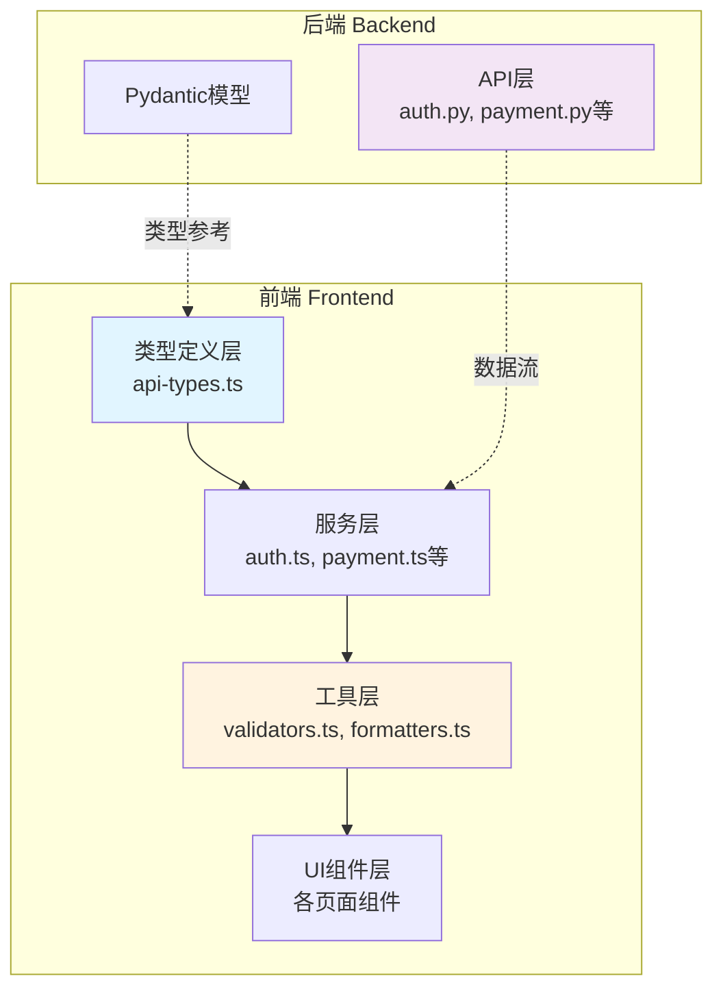
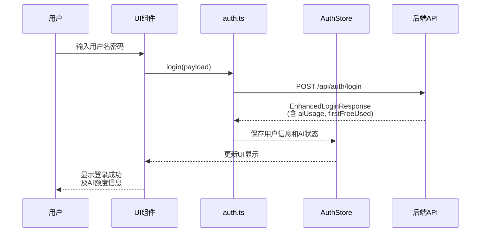

# 技术方案设计 - API 一致性问题修复（中优先级）

## 1. 架构概览

### 1.1 修复范围



### 1.2 修复策略

**分层修复策略**：
1. **类型定义层** - 统一类型定义，作为单一数据源
2. **工具函数层** - 提供可复用的验证和格式化工具
3. **服务层** - 更新 API 调用，使用新类型
4. **UI层** - 最小化修改，仅必要时更新

**向后兼容策略**：
- 新增字段使用可选类型（`?:`）
- 类型修改使用类型别名（type alias）
- 渐进式迁移，不破坏现有功能

---

## 2. 技术选型

### 2.1 类型系统

**TypeScript 类型增强**：
```typescript
// 使用品牌类型确保类型安全
type MoneyString = string & { readonly __brand: 'Money' };
type DateTimeString = string & { readonly __brand: 'DateTime' };
type EmailString = string & { readonly __brand: 'Email' };
```

**优势**：
- ✅ 编译时类型检查
- ✅ 防止字符串类型混用
- ✅ 自文档化

### 2.2 验证库选择

**方案对比**：

| 方案 | 优势 | 劣势 | 决策 |
|------|------|------|------|
| **Zod** | 类型推导、链式API | 额外依赖（~15KB） | ❌ 避免新依赖 |
| **Yup** | 成熟稳定 | 体积大（~30KB） | ❌ 过重 |
| **自定义验证器** | 轻量、可控 | 需要手动维护 | ✅ **采用** |

**决策理由**：
- 已有 `validators.ts` 基础
- 验证规则相对简单
- 避免引入额外依赖

### 2.3 日期时间处理

**方案**：使用原生 `Date` + ISO 8601 标准

```typescript
// 统一的日期时间处理
class DateTimeUtils {
  static parse(iso: DateTimeString): Date
  static format(date: Date, format?: string): string
  static isValid(iso: string): boolean
}
```

**不使用 day.js/moment.js 的原因**：
- 仅需基础功能
- 原生 API 已足够
- 避免增加依赖

### 2.4 金额处理

**方案**：使用 `MoneyFormatter` 工具类（已实现）

```typescript
class MoneyFormatter {
  static toNumber(money: MoneyString): number
  static toString(num: number, decimals?: number): MoneyString
  static add(a: MoneyString, b: MoneyString): MoneyString
  static subtract(a: MoneyString, b: MoneyString): MoneyString
}
```

---

## 3. 详细设计

### 3.1 类型定义增强

#### 3.1.1 中心化类型定义文件

**文件**: `electron/renderer/src/types/api-types.ts`

```typescript
// ============================================
// 基础类型定义
// ============================================

/** ISO 8601 格式的日期时间字符串，例如: "2025-11-02T19:38:10.123Z" */
export type DateTimeString = string;

/** 金额字符串，例如: "99.99" */
export type MoneyString = string;

/** 邮箱地址字符串 */
export type EmailString = string;

// ============================================
// 认证模块类型（需求 1）
// ============================================

/** AI 使用统计信息 */
export interface AIUsage {
  /** 已使用的 token 数量 */
  tokens_used: number;
  /** token 配额（null 表示无限制） */
  token_quota: number | null;
  /** token 限制（null 表示无限制） */
  token_limit: number | null;
  /** 已使用的请求次数 */
  requests_used: number;
  /** 请求限制（null 表示无限制） */
  request_limit: number | null;
  /** 是否已使用首次免费额度 */
  first_free_used: boolean;
}

/** 增强的登录响应 */
export interface EnhancedLoginResponse extends LoginResponse {
  /** 是否已使用首次免费额度 */
  firstFreeUsed?: boolean;
  /** AI 使用统计信息 */
  aiUsage?: AIUsage;
}

// ============================================
// 订阅模块类型（需求 2）
// ============================================

/** 订阅计划详情 */
export interface SubscriptionPlan {
  id: number;
  name: string;
  /** 价格（字符串格式避免精度丢失） */
  price: MoneyString;
  /** 原价（如有折扣） */
  original_price?: MoneyString;
  /** 订阅时长（天数） */
  duration_days: number;
  /** 格式化的时长（如 "30天", "365天"） */
  duration_display?: string;
  features: string[];
  is_active: boolean;
  created_at: DateTimeString;
  updated_at: DateTimeString;
}

/** 完整的订阅信息 */
export interface FullSubscription {
  id: number;
  user_id: number;
  plan_id: number;
  /** 完整的计划对象 */
  plan: SubscriptionPlan;
  status: string;
  start_date: DateTimeString;
  end_date: DateTimeString;
  trial_end_date?: DateTimeString;
  auto_renew: boolean;
  created_at: DateTimeString;
  updated_at: DateTimeString;
}

// ============================================
// 支付模块类型（需求 3）
// ============================================

/** 创建订阅请求（含试用期） */
export interface CreateSubscriptionRequest {
  plan_id: number;
  payment_method: string;
  /** 试用期天数（可选） */
  trial_days?: number;
  auto_renew?: boolean;
  coupon_code?: string;
}

// ============================================
// 抖音模块类型（需求 4）
// ============================================

/** 启动抖音监控请求（含 Cookie） */
export interface StartDouyinRequest {
  live_id?: string;
  live_url?: string;
  /** 可选的 Cookie 用于访问受限直播间 */
  cookie?: string;
}

// ============================================
// 音频转写模块类型（需求 5）
// ============================================

/** VAD（语音活动检测）配置 */
export interface VADConfig {
  /** 最小静音时长（秒），默认 0.3 */
  vad_min_silence_sec?: number;
  /** 最小语音时长（秒），默认 0.1 */
  vad_min_speech_sec?: number;
  /** 语音结束后的延迟（秒），默认 0.2 */
  vad_hangover_sec?: number;
  /** 音量阈值（0-1），默认 0.01 */
  vad_rms?: number;
}

/** 音频转写状态（增强） */
export interface EnhancedAudioStatus {
  running: boolean;
  live_url?: string;
  session_id?: string;
  /** 当前使用的模型（如 "SenseVoice-Small"） */
  model?: string;
  start_time?: DateTimeString;
  // ... 其他现有字段
}

/** WebSocket 消息类型 */
export type AudioWSMessageType = 'transcription' | 'level' | 'status' | 'error';

/** WebSocket 消息基类 */
export interface AudioWSMessage {
  type: AudioWSMessageType;
  timestamp: DateTimeString;
}

/** 转写结果消息 */
export interface TranscriptionMessage extends AudioWSMessage {
  type: 'transcription';
  text: string;
  language?: string;
  confidence?: number;
}

/** 音量级别消息 */
export interface LevelMessage extends AudioWSMessage {
  type: 'level';
  level: number;
}

/** 状态变更消息 */
export interface StatusMessage extends AudioWSMessage {
  type: 'status';
  status: string;
  details?: Record<string, any>;
}

/** 错误消息 */
export interface ErrorMessage extends AudioWSMessage {
  type: 'error';
  error: string;
  code?: string;
}

/** 所有 WebSocket 消息的联合类型 */
export type AudioWSMessageUnion = 
  | TranscriptionMessage 
  | LevelMessage 
  | StatusMessage 
  | ErrorMessage;

// ============================================
// 错误响应类型（需求 8）
// ============================================

/** 标准错误响应 */
export interface ErrorResponse {
  detail: string | ErrorDetail | ValidationError[];
}

/** 详细错误对象 */
export interface ErrorDetail {
  message: string;
  code?: string;
  field?: string;
}

/** Pydantic 验证错误 */
export interface ValidationError {
  loc: (string | number)[];
  msg: string;
  type: string;
}
```

#### 3.1.2 类型守卫（Type Guards）

```typescript
// 类型守卫函数
export function isValidationErrorArray(
  detail: any
): detail is ValidationError[] {
  return Array.isArray(detail) && detail.every(
    (item) => 'loc' in item && 'msg' in item && 'type' in item
  );
}

export function isErrorDetail(detail: any): detail is ErrorDetail {
  return typeof detail === 'object' && 'message' in detail;
}

export function isTranscriptionMessage(
  msg: AudioWSMessageUnion
): msg is TranscriptionMessage {
  return msg.type === 'transcription';
}
```

---

### 3.2 验证工具增强

#### 3.2.1 扩展 validators.ts

**文件**: `electron/renderer/src/utils/validators.ts`

```typescript
// ============================================
// 邮箱验证（需求 6）
// ============================================

export class EmailValidator {
  /**
   * 验证邮箱格式
   * 规则：符合 RFC 5322 标准
   */
  static validate(email: string): ValidationResult {
    const emailRegex = /^[^\s@]+@[^\s@]+\.[^\s@]+$/;
    
    if (!email) {
      return { valid: false, message: '邮箱地址不能为空' };
    }
    
    if (!emailRegex.test(email)) {
      return { valid: false, message: '邮箱地址格式不正确' };
    }
    
    if (email.length > 255) {
      return { valid: false, message: '邮箱地址过长' };
    }
    
    return { valid: true };
  }
}

// ============================================
// 手机号验证（需求 6）
// ============================================

export class PhoneValidator {
  /**
   * 验证手机号格式
   * 规则：中国大陆手机号 11 位
   */
  static validate(phone: string): ValidationResult {
    const phoneRegex = /^1[3-9]\d{9}$/;
    
    if (!phone) {
      return { valid: false, message: '手机号不能为空' };
    }
    
    if (!phoneRegex.test(phone)) {
      return { 
        valid: false, 
        message: '手机号格式不正确，请输入11位有效手机号' 
      };
    }
    
    return { valid: true };
  }
}

// ============================================
// 数值范围验证（需求 6）
// ============================================

export class NumberValidator {
  static validateRange(
    value: number,
    min?: number,
    max?: number,
    fieldName: string = '数值'
  ): ValidationResult {
    if (min !== undefined && value < min) {
      return { 
        valid: false, 
        message: `${fieldName}不能小于 ${min}` 
      };
    }
    
    if (max !== undefined && value > max) {
      return { 
        valid: false, 
        message: `${fieldName}不能大于 ${max}` 
      };
    }
    
    return { valid: true };
  }
  
  static validateInteger(value: number, fieldName: string = '数值'): ValidationResult {
    if (!Number.isInteger(value)) {
      return { 
        valid: false, 
        message: `${fieldName}必须是整数` 
      };
    }
    
    return { valid: true };
  }
}

// ============================================
// 字符串长度验证（需求 6）
// ============================================

export class StringValidator {
  static validateLength(
    value: string,
    minLength?: number,
    maxLength?: number,
    fieldName: string = '字段'
  ): ValidationResult {
    if (minLength !== undefined && value.length < minLength) {
      return { 
        valid: false, 
        message: `${fieldName}长度不能少于 ${minLength} 个字符` 
      };
    }
    
    if (maxLength !== undefined && value.length > maxLength) {
      return { 
        valid: false, 
        message: `${fieldName}长度不能超过 ${maxLength} 个字符` 
      };
    }
    
    return { valid: true };
  }
}
```

---

### 3.3 日期时间工具

#### 3.3.1 DateTimeUtils 实现

**新文件**: `electron/renderer/src/utils/datetime.ts`

```typescript
/**
 * 日期时间工具类
 * 统一处理 ISO 8601 格式的日期时间字符串
 */
export class DateTimeUtils {
  /**
   * 解析 ISO 8601 字符串为 Date 对象
   */
  static parse(iso: string): Date {
    const date = new Date(iso);
    if (isNaN(date.getTime())) {
      throw new Error(`Invalid ISO 8601 date string: ${iso}`);
    }
    return date;
  }
  
  /**
   * 格式化 Date 对象为显示字符串
   * @param date Date 对象
   * @param format 格式选项
   */
  static format(
    date: Date, 
    format: 'date' | 'time' | 'datetime' | 'relative' = 'datetime'
  ): string {
    switch (format) {
      case 'date':
        return date.toLocaleDateString('zh-CN');
      case 'time':
        return date.toLocaleTimeString('zh-CN');
      case 'datetime':
        return date.toLocaleString('zh-CN');
      case 'relative':
        return this.formatRelative(date);
      default:
        return date.toISOString();
    }
  }
  
  /**
   * 格式化为相对时间（如"5分钟前"）
   */
  static formatRelative(date: Date): string {
    const now = new Date();
    const diff = now.getTime() - date.getTime();
    const seconds = Math.floor(diff / 1000);
    
    if (seconds < 60) return '刚刚';
    if (seconds < 3600) return `${Math.floor(seconds / 60)}分钟前`;
    if (seconds < 86400) return `${Math.floor(seconds / 3600)}小时前`;
    if (seconds < 604800) return `${Math.floor(seconds / 86400)}天前`;
    
    return this.format(date, 'date');
  }
  
  /**
   * 验证 ISO 8601 字符串格式
   */
  static isValid(iso: string): boolean {
    try {
      const date = new Date(iso);
      return !isNaN(date.getTime());
    } catch {
      return false;
    }
  }
  
  /**
   * 比较两个日期
   */
  static compare(a: string | Date, b: string | Date): number {
    const dateA = typeof a === 'string' ? this.parse(a) : a;
    const dateB = typeof b === 'string' ? this.parse(b) : b;
    return dateA.getTime() - dateB.getTime();
  }
}
```

---

### 3.4 错误处理统一

#### 3.4.1 ErrorHandler 实现

**新文件**: `electron/renderer/src/utils/error-handler.ts`

```typescript
import { ErrorResponse, ErrorDetail, ValidationError } from '../types/api-types';

/**
 * 统一的错误处理工具
 */
export class ErrorHandler {
  /**
   * 从错误响应中提取用户友好的错误消息
   */
  static extractMessage(error: ErrorResponse | any): string {
    if (!error) return '未知错误';
    
    // 标准 ErrorResponse 格式
    if ('detail' in error) {
      const { detail } = error;
      
      // 字符串格式
      if (typeof detail === 'string') {
        return detail;
      }
      
      // ErrorDetail 对象格式
      if (this.isErrorDetail(detail)) {
        return detail.message;
      }
      
      // ValidationError 数组格式
      if (this.isValidationErrorArray(detail)) {
        return this.formatValidationErrors(detail);
      }
    }
    
    // 网络错误
    if (error.message) {
      return error.message;
    }
    
    return '操作失败，请稍后重试';
  }
  
  /**
   * 格式化验证错误为可读字符串
   */
  private static formatValidationErrors(errors: ValidationError[]): string {
    if (errors.length === 0) return '验证失败';
    if (errors.length === 1) {
      const error = errors[0];
      const field = error.loc.join('.');
      return `${field}: ${error.msg}`;
    }
    
    // 多个错误，返回第一个或总结
    return errors.map(e => e.msg).join('; ');
  }
  
  /**
   * 提取错误代码（如果有）
   */
  static extractCode(error: ErrorResponse | any): string | undefined {
    if ('detail' in error && this.isErrorDetail(error.detail)) {
      return error.detail.code;
    }
    return undefined;
  }
  
  /**
   * 判断是否是特定类型的错误
   */
  static isErrorType(error: any, errorCode: string): boolean {
    const code = this.extractCode(error);
    return code === errorCode;
  }
  
  // 类型守卫
  private static isErrorDetail(detail: any): detail is ErrorDetail {
    return typeof detail === 'object' && 'message' in detail;
  }
  
  private static isValidationErrorArray(detail: any): detail is ValidationError[] {
    return Array.isArray(detail) && detail.every(
      (item) => 'loc' in item && 'msg' in item && 'type' in item
    );
  }
}

/**
 * API 调用包装器，统一错误处理
 */
export async function apiCall<T>(
  fetchFn: () => Promise<Response>,
  errorPrefix: string = '操作'
): Promise<T> {
  try {
    const response = await fetchFn();
    
    if (!response.ok) {
      const error = await response.json().catch(() => ({
        detail: `${errorPrefix}失败: HTTP ${response.status}`
      }));
      
      throw new Error(ErrorHandler.extractMessage(error));
    }
    
    return await response.json();
  } catch (error: any) {
    // 网络错误
    if (error.name === 'TypeError' && error.message === 'Failed to fetch') {
      throw new Error('网络连接失败，请检查网络设置');
    }
    
    // 已处理的错误
    if (error.message) {
      throw error;
    }
    
    // 未知错误
    throw new Error(`${errorPrefix}失败，请稍后重试`);
  }
}
```

---

### 3.5 服务层修改

#### 3.5.1 auth.ts 更新（需求 1）

```typescript
import { EnhancedLoginResponse } from '../types/api-types';
import { apiCall } from '../utils/error-handler';

export const login = async (payload: LoginPayload): Promise<EnhancedLoginResponse> => {
  return apiCall<EnhancedLoginResponse>(
    () => fetch(joinUrl('/api/auth/login'), {
      method: 'POST',
      headers: { 'Content-Type': 'application/json' },
      body: JSON.stringify(payload),
    }),
    '登录'
  );
};
```

#### 3.5.2 payment.ts 更新（需求 2, 3）

```typescript
import { SubscriptionPlan, FullSubscription, CreateSubscriptionRequest } from '../types/api-types';
import { apiCall } from '../utils/error-handler';

// 获取订阅计划（price 已改为字符串）
export const getPlans = async (): Promise<SubscriptionPlan[]> => {
  return apiCall<SubscriptionPlan[]>(
    () => fetch(joinUrl('/api/payment/plans')),
    '获取订阅计划'
  );
};

// 创建订阅（支持 trial_days）
export const createSubscription = async (
  data: CreateSubscriptionRequest
): Promise<FullSubscription> => {
  return apiCall<FullSubscription>(
    () => fetch(joinUrl('/api/payment/subscriptions'), {
      method: 'POST',
      headers: { 'Content-Type': 'application/json' },
      body: JSON.stringify(data),
    }),
    '创建订阅'
  );
};
```

---

## 4. 数据流设计

### 4.1 认证流程（需求 1）



### 4.2 金额处理流程（需求 2）

```mermaid
flowchart LR
    A[后端 Decimal] -->|JSON序列化| B[字符串 "99.99"]
    B -->|前端接收| C[MoneyString类型]
    C -->|显示| D[格式化: ¥99.99]
    C -->|计算| E[MoneyFormatter.add/subtract]
    E -->|结果| C
```

### 4.3 错误处理流程（需求 8）

```mermaid
flowchart TD
    A[API调用] --> B{请求成功?}
    B -->|是| C[解析响应]
    B -->|否| D[解析错误]
    D --> E{错误类型?}
    E -->|字符串| F[直接显示]
    E -->|ErrorDetail| G[提取 message]
    E -->|ValidationError[]| H[格式化为列表]
    E -->|网络错误| I[显示网络提示]
    F --> J[显示给用户]
    G --> J
    H --> J
    I --> J
```

---

## 5. 测试策略

### 5.1 单元测试

**测试框架**: Jest + @testing-library/react

**测试覆盖**:

1. **类型验证工具**:
   ```typescript
   describe('EmailValidator', () => {
     it('should validate correct email', () => {
       expect(EmailValidator.validate('test@example.com').valid).toBe(true);
     });
     
     it('should reject invalid email', () => {
       expect(EmailValidator.validate('invalid').valid).toBe(false);
     });
   });
   ```

2. **日期时间工具**:
   ```typescript
   describe('DateTimeUtils', () => {
     it('should parse ISO 8601 string', () => {
       const date = DateTimeUtils.parse('2025-11-02T19:38:10.123Z');
       expect(date).toBeInstanceOf(Date);
     });
     
     it('should format relative time', () => {
       const fiveMinutesAgo = new Date(Date.now() - 5 * 60 * 1000);
       expect(DateTimeUtils.formatRelative(fiveMinutesAgo)).toBe('5分钟前');
     });
   });
   ```

3. **错误处理**:
   ```typescript
   describe('ErrorHandler', () => {
     it('should extract string detail', () => {
       const error = { detail: 'Test error' };
       expect(ErrorHandler.extractMessage(error)).toBe('Test error');
     });
     
     it('should extract from ErrorDetail', () => {
       const error = { detail: { message: 'Detailed error', code: 'ERR_001' } };
       expect(ErrorHandler.extractMessage(error)).toBe('Detailed error');
     });
   });
   ```

### 5.2 集成测试

**测试场景**:
1. 用户登录后正确接收和显示 AI 额度信息
2. 订阅创建时正确传递 trial_days 参数
3. 金额字段在显示和计算时精度正确
4. 错误响应正确解析并友好显示

### 5.3 类型检查测试

**TypeScript 编译测试**:
```bash
npm run type-check
```

**确保**:
- 所有新增类型定义通过编译
- 服务层调用使用正确的类型
- 没有 `any` 类型逃逸

---

## 6. 安全性考虑

### 6.1 输入验证

**前端验证** + **后端验证** 双重保护:
- 前端：快速反馈，提升用户体验
- 后端：最终防线，确保数据安全

**敏感数据处理**:
- 邮箱：验证格式，不存储明文（后端加密）
- 手机号：验证格式，脱敏显示
- Cookie：仅在需要时传递，不持久化

### 6.2 类型安全

**品牌类型**防止误用:
```typescript
// 编译时错误：不能将 string 赋值给 MoneyString
const price: MoneyString = "99.99"; // ❌ 错误
const price: MoneyString = MoneyFormatter.toString(99.99); // ✅ 正确
```

### 6.3 错误信息

**不泄露敏感信息**:
- ✅ "用户名或密码错误"（不指明哪个错误）
- ❌ "用户名不存在"（泄露用户信息）
- ✅ "操作失败"（通用错误）
- ❌ "数据库连接失败"（泄露系统信息）

---

## 7. 性能考虑

### 7.1 类型定义

**零运行时开销**:
- TypeScript 类型在编译后擦除
- 不影响打包体积
- 不影响运行性能

### 7.2 验证工具

**轻量实现**:
- 使用原生 JavaScript
- 避免复杂正则表达式
- 验证耗时 < 1ms

### 7.3 错误处理

**快速失败**:
- 网络错误立即返回
- 不重复解析错误对象
- 使用缓存避免重复计算

---

## 8. 迁移策略

### 8.1 渐进式迁移

**阶段 1: 添加新类型**（不破坏现有代码）
- 新增 `EnhancedLoginResponse`, `FullSubscription` 等
- 保持现有类型不变

**阶段 2: 更新服务层**（可选使用新类型）
- 服务函数返回新类型
- 现有调用方兼容（通过类型断言或适配器）

**阶段 3: 更新UI层**（按需迁移）
- 优先迁移新开发的组件
- 现有组件逐步更新

**阶段 4: 移除旧类型**（可选）
- 确认所有代码已迁移
- 移除过时的类型定义

### 8.2 向后兼容

**类型别名策略**:
```typescript
// 旧类型别名为新类型（保持兼容）
export type LoginResponse = EnhancedLoginResponse;

// 或提供适配器
export function adaptOldLoginResponse(old: OldLoginResponse): EnhancedLoginResponse {
  return { ...old, firstFreeUsed: false, aiUsage: undefined };
}
```

---

## 9. 文档和注释

### 9.1 JSDoc 注释

**所有公共 API 必须有 JSDoc**:
```typescript
/**
 * 验证邮箱地址格式
 * 
 * @param email - 待验证的邮箱地址
 * @returns 验证结果，包含 valid 标志和错误消息
 * 
 * @example
 * ```typescript
 * const result = EmailValidator.validate('test@example.com');
 * if (result.valid) {
 *   console.log('邮箱有效');
 * } else {
 *   console.log(result.message);
 * }
 * ```
 */
static validate(email: string): ValidationResult
```

### 9.2 类型注释

**关键类型需要详细说明**:
```typescript
/**
 * AI 使用统计信息
 * 
 * @remarks
 * - `null` 值表示无限制
 * - `first_free_used` 标识是否已使用首次免费额度
 * - token 和请求数都有独立的配额和限制
 */
export interface AIUsage {
  // ...
}
```

---

## 10. 实施计划

### 10.1 时间估算

| 任务 | 工时 | 依赖 |
|------|------|------|
| 类型定义更新 | 2h | - |
| 验证工具增强 | 3h | - |
| 日期时间工具 | 2h | - |
| 错误处理工具 | 2h | - |
| auth.ts 更新 | 1h | 类型定义 |
| payment.ts 更新 | 2h | 类型定义 |
| douyin.ts 更新 | 1h | 类型定义 |
| liveAudio.ts 更新 | 2h | 类型定义 |
| 单元测试编写 | 4h | 所有实现 |
| 集成测试 | 2h | 所有实现 |
| 文档更新 | 1h | - |
| **总计** | **22h** | **~3 工作日** |

### 10.2 风险评估

| 风险 | 概率 | 影响 | 缓解措施 |
|------|------|------|----------|
| 类型不兼容 | 中 | 高 | 充分测试，使用类型断言过渡 |
| 性能下降 | 低 | 中 | 性能基准测试 |
| UI 破坏 | 低 | 高 | 视觉回归测试 |
| 测试覆盖不足 | 中 | 中 | 设定覆盖率目标（80%） |

---

## 11. 交付物

### 11.1 代码

- ✅ 更新的类型定义文件
- ✅ 新增的工具函数
- ✅ 修改的服务层文件
- ✅ 完整的单元测试

### 11.2 文档

- ✅ API 契约更新（OpenAPI）
- ✅ 类型映射表更新
- ✅ 迁移指南
- ✅ 修复报告

### 11.3 测试

- ✅ 单元测试（覆盖率 ≥ 80%）
- ✅ 集成测试用例
- ✅ 类型检查通过

---

*技术方案版本: 1.0*  
*创建日期: 2025-11-02*  
*状态: 待确认*

