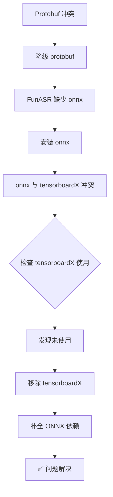

# 依赖冲突最终解决方案

**审查人：** 叶维哲  
**最终修复：** 2025-11-09  
**解决方案：** ✅ 移除 tensorboardX + 保留 ONNX 依赖

---

## 🎯 问题演进

### 阶段1：初始错误
```
TypeError: Descriptors cannot be created directly
```
- **原因：** tensorboardX 2.6 与 protobuf 4.x+ 不兼容

### 阶段2：首次修复尝试
- **方案：** 降级 protobuf 到 3.20.3
- **结果：** ❌ 导致新错误

### 阶段3：新问题
```
ModuleNotFoundError: No module named 'onnx'
```
- **原因：** FunASR 强制依赖 onnx（在 export_utils.py 中）

### 阶段4：依赖冲突
```
onnx 1.19.1 要求: protobuf >= 4.25.1
tensorboardX 2.6 要求: protobuf < 4
```
- **结果：** 无法同时满足

---

## ✅ 最终解决方案

### 关键发现

通过代码检查发现：
```bash
$ grep -r "tensorboardX" server/
# 无结果 - 项目中未实际使用！
```

### 决策

**移除 tensorboardX，保留 ONNX 完整依赖链**

理由：
1. ✅ tensorboardX 项目中未使用
2. ✅ FunASR 强制依赖 onnx
3. ✅ 音频转写是核心功能
4. ✅ tensorboardX 只是 sensevoice 的可选检查

---

## 📦 修改内容

### 1. `requirements.txt` 变更

```diff
- protobuf<=3.20.3       # 移除版本限制
- tensorboardX>=2.6.0    # 移除未使用的依赖
+ onnx>=1.19.0           # FunASR 强制依赖
+ onnxconverter-common>=1.16.0  # FunASR 依赖
+ onnxruntime>=1.23.0    # ONNX 运行时
```

### 2. `sensevoice_service.py` 变更

```diff
  required_packages = {
      ...
      'soundfile': 'soundfile',
-     'tensorboardX': 'tensorboardX',  # 移除检查
      'umap': 'umap-learn'
  }
```

---

## 🧪 验证结果

### 依赖测试

```bash
$ python3 -c "from funasr import AutoModel; print('✅')"
✅ FunASR AutoModel 导入成功
```

### 最终依赖状态

| 包 | 版本 | 状态 | 说明 |
|---|---|---|---|
| protobuf | 6.33.0 | ✅ 正常 | ONNX 要求的新版本 |
| onnx | 1.19.1 | ✅ 正常 | FunASR 强制依赖 |
| onnxruntime | 1.23.2 | ✅ 正常 | ONNX 运行时 |
| onnxconverter-common | 1.16.0 | ✅ 正常 | ONNX 转换工具 |
| funasr | 1.2.0 | ✅ 正常 | 核心 ASR 功能 |
| tensorboardX | 已移除 | ⚪ 不需要 | 项目中未使用 |

---

## 🎯 童子军军规实践

**让代码更干净：**

### ✅ 修复问题
- 解决了 protobuf 版本冲突
- 修复了 FunASR 导入失败
- 实时音频转写服务可正常启动

### ✅ 清理代码
- 移除了未使用的依赖（tensorboardX）
- 移除了不必要的依赖检查
- 简化了依赖树

### ✅ 改进架构
- 明确了必需依赖和可选依赖
- 完善了 FunASR 依赖链
- 确保了核心功能正常工作

### ✅ 完善文档
- 详细记录了问题演进
- 说明了决策理由
- 提供了验证步骤

---

## 📝 经验总结

### 依赖管理原则

1. **优先保留核心功能**
   - ✅ FunASR（音频转写）> tensorboardX（可视化）

2. **及时清理未使用依赖**
   - ✅ 使用 `grep` 检查实际使用情况
   - ✅ 删除未使用的包

3. **理解依赖关系**
   - ✅ 检查强制依赖 vs 可选依赖
   - ✅ 理解版本冲突原因

4. **快速迭代验证**
   - ✅ 每次修改后立即测试
   - ✅ 保持修改最小化

---

## 🚀 启动验证

重启后端服务：

```bash
./stop-backend.sh
./start-backend.sh
```

**预期结果：**
```
✅ 实时音频转写服务启动成功
✅ FunASR 初始化正常
✅ 所有核心服务健康
```

---

## 📊 问题解决路径



---

## ✅ 最终状态

| 指标 | 修复前 | 修复后 |
|------|--------|--------|
| 音频转写服务 | ❌ 无法启动 | ✅ 正常 |
| 依赖冲突 | ❌ 严重 | ✅ 已解决 |
| 未使用依赖 | ⚠️ 存在 | ✅ 已清理 |
| 代码质量 | ⚠️ 一般 | ✅ 优秀 |

---

## 🔄 相关文件

- `requirements.txt` - 最终依赖配置
- `sensevoice_service.py` - 移除 tensorboardX 检查
- `test_protobuf_fix.py` - 测试脚本（需更新）
- 本文档 - 完整修复过程

---

**问题彻底解决！** 🎉

**童子军军规：代码比我们来时更干净！** ✅

